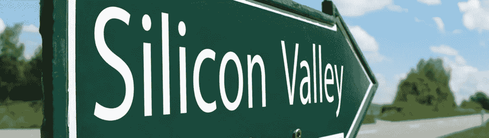

# 硅谷如何支持难民，或不…

> 原文：<https://medium.com/hackernoon/how-silicon-valley-supports-refugees-or-not-ab2df2353f32>

## 来自脸书、Twitter、Airbnb 等网站的声明。但并不是所有的都在同一页上。

随着特朗普政府的移民禁令在美国和世界各地引发冲击波，硅谷开始表达不满。

从为难民和那些不被允许留在美国的人提供免费住房的 AirbnbEng 联合创始人兼首席执行官 T2，到谷歌联合创始人兼母公司 Alphabet 总裁，加入旧金山国际机场的抗议者，作为 Twitter 上的记者 T4 迪特尔·博恩和瑞安·麦克。

据彭博报道，谷歌首席执行官桑德尔·皮帅也分发了一份内部备忘录，概述了他对政府决定所带来的影响的不满。

> *我们担心这一命令的影响，以及任何可能对谷歌员工及其家人施加限制，或为优秀人才进入美国制造障碍的提议。我们将继续让华盛顿和其他地方的领导人了解我们对这些问题的看法。*

脸书的马克·扎克伯格(Mark Zuckerberg)也提出了他对“特朗普总统最近签署的行政命令的影响”的担忧，尽管他补充说，他“很高兴听到特朗普总统说他将为梦想家——在年轻时被父母带到这个国家的移民——制定一些措施”,他“很高兴总统认为我们的国家应该继续受益于‘优秀人才进入这个国家’。”

前脸书首席技术官 [Bret Taylor](https://medium.com/u/862dd96a9d72?source=post_page-----ab2df2353f32--------------------------------) ，Salesforce 的首席执行官[在推特上写道:](https://medium.com/u/98dc6895fb5e?source=post_page-----ab2df2353f32--------------------------------)

Twitter 和 Square 的联合创始人兼首席执行官杰克·多西批评了这项行政命令，并与代表许多主要科技公司的倡导组织[互联网协会](https://medium.com/u/5e65823a0085?source=post_page-----ab2df2353f32--------------------------------)的声明联系起来。

上周，多尔西还以 Square 的身份在公司网站上发布了一篇关于叙利亚难民亚辛·特鲁(Yassin Terou)和他在田纳西州诺克斯维尔作为企业家的新生活的报道。

Square 还在推特上发布:

[Periscope](https://medium.com/u/c6360ffa6e88?source=post_page-----ab2df2353f32--------------------------------) 联合创始人 [Kayvon Beykpour](https://medium.com/u/195152643bc3?source=post_page-----ab2df2353f32--------------------------------) 和 Joe Bernstein 在公司 [Medium](https://medium.com/u/504c7870fdb6?source=post_page-----ab2df2353f32--------------------------------) 出版物上签名:

> 最近停止来自中东和非洲七个国家的移民的行政命令迫使我们考虑一个令人不安的替代现实，即潜望镜团队发生了不可挽回的变化。Periscope 由来自许多信仰和国家的人建造、维护和操作。**没有移民和难民，潜望镜就不会存在。**

 [## 由移民自豪地制造

### 在 Periscope，Kayvon 和我最引以为豪的是我们每天都有机会与之共事的团队。它…

medium.com](/@periscope/proudly-made-by-immigrants-aa45bf0dbe0d) 

在 TechCrunch 提问时，微软评论道:“我们同样担心该行政命令对我们来自所列国家的员工的影响，他们都是合法在美国的，我们正积极与他们合作，提供法律建议和援助。”

该公司首席执行官[塞特亚·纳德拉](https://medium.com/u/d989edf5a0ea?source=post_page-----ab2df2353f32--------------------------------)在 Linkedin 上写了一封公开信，强调“移民对我们公司、对国家、对世界的积极影响。”

 [## 昨天美国关于移民的行政命令

### 布拉德·史密斯向微软员工发送电子邮件。我想特别强调这件作品:“作为一个…

www.linkedin.com](https://www.linkedin.com/pulse/yesterdays-us-executive-order-immigration-satya-nadella) 

Linkedin 首席执行官杰夫·韦纳在推特上发布:

Etsy 首席执行官 Chat Dickerson 在回应 Re/Code 的 Kara Swisher 时表示，他反对“基于国籍或宗教将人们排除在我们之外。”

在 TechCruch 报道的一份电子邮件声明中， [Mozilla](https://medium.com/u/95f4ec6ae6f6?source=post_page-----ab2df2353f32--------------------------------) 的 [Chris Beard](https://medium.com/u/681be290eb6a?source=post_page-----ab2df2353f32--------------------------------) 表示，他认为“周五行政命令实施的移民禁令过于宽泛，其实施对培养创新文化和经济增长具有高度破坏性。”

> 行政命令忽略了我们已经知道的唯一真理；才华横溢的移民为美国和世界各国的发展和繁荣做出了巨大贡献。各种形式的多样性对于增长、创新和健康、包容的社会至关重要。

网飞的里德·哈斯丁对脸书说:

文件共享服务 [Dropbox](https://medium.com/u/2d2c8f4cb281?source=post_page-----ab2df2353f32--------------------------------) 的德鲁·休斯顿也在推特上说:

Y Combinator 的山姆·奥尔特曼在他的博客上呼吁硅谷“开始对特朗普政府采取的一些行动发表意见”

 [## 是时候表明立场了

### 科技公司是时候开始大声说出特朗普政府采取的一些行动了…

blog.samaltman.com](http://blog.samaltman.com/time-to-take-a-stand) 

特斯拉汽车公司(Tesla Motors)和 SpaceX 的创始人埃隆·马斯克(Elon Musk)在周六下午晚些时候通过 Twitter 补充了他的评论，尽管正如一些人指出的那样，他们的措辞不是很强硬。

优步也因措辞不太强硬的回应而受到广泛谴责。

虽然其联合创始人兼首席执行官[特拉维斯·卡兰尼克](https://medium.com/u/d1c584040a63?source=post_page-----ab2df2353f32--------------------------------)在脸书写了一封长长的公开信反对特朗普的立场，但该公司的纽约办事处在推特上反对出租车司机罢工的决定，以支持所有示威者和那些被禁止进入美国的难民。这条推文在网上疯传，许多人呼吁优步用户删除他们的账户。

作为回应， [Lyft](https://medium.com/u/54708edc644b?source=post_page-----ab2df2353f32--------------------------------) 表示将向 [ACLU National](https://medium.com/u/de4bac3c41f4?source=post_page-----ab2df2353f32--------------------------------) 捐赠 100 万美元，“以捍卫我们的宪法”，据 [MSNBC](https://medium.com/u/f84ed88f3637?source=post_page-----ab2df2353f32--------------------------------) 的 [Kyle Griffin](https://medium.com/u/48bc14bb6809?source=post_page-----ab2df2353f32--------------------------------) 报道。

Twilio 联合创始人兼首席执行官杰夫·劳森(又名[杰弗伊尔](https://medium.com/u/15d7052b4c28?source=post_page-----ab2df2353f32--------------------------------))在[媒体](https://medium.com/u/504c7870fdb6?source=post_page-----ab2df2353f32--------------------------------)上发布了以下内容:

> 我们的敌人不是恐怖，而是在打击恐怖的同时失去了我们的灵魂。美国比这更强大。

 [## 移民禁令从根本上说不符合美国精神

### 昨天是美国庄严的一天，因为我们背叛了我们最珍视的价值观之一。

medium.com](/@jeffiel/the-immigration-ban-is-fundamentally-un-american-2ca10bf12836) 

[Aaron Levie](https://medium.com/u/c72d99a62d0d?source=post_page-----ab2df2353f32--------------------------------) ，Box[的首席执行官](https://medium.com/u/2163b5ff0cd5?source=post_page-----ab2df2353f32--------------------------------)也接手了 Medium:

> 基本上在任何层面上——道德、经济或逻辑——这都是错误的做法，与美国的原则背道而驰。对来自正在处理重大人道主义危机的国家的人置之不理违背了我们的价值观，而将主要基于宗教的群体作为目标是危险和灾难性的政策。虽然这一秩序最终会失效，但它向美国的盟友和敌人发出的信号是错误的:这是一个恐惧、不信任和排斥的信号。

 [## 捍卫美国的原则

### 像我们许多人一样，我对特朗普总统周五颁布的移民和旅行禁令感到震惊，该禁令禁止公民进入…

medium.com](/@levie/standing-up-for-americas-principles-431ce2750f3) 

> [黑客中午](http://bit.ly/Hackernoon)是黑客如何开始他们的下午。我们是 [@AMI](http://bit.ly/atAMIatAMI) 家庭的一员。我们现在[接受投稿](http://bit.ly/hackernoonsubmission)并乐意[讨论广告&赞助](mailto:partners@amipublications.com)机会。
> 
> 如果你喜欢这个故事，我们推荐你阅读我们的[最新科技故事](http://bit.ly/hackernoonlatestt)和[趋势科技故事](https://hackernoon.com/trending)。直到下一次，不要把世界的现实想当然！

