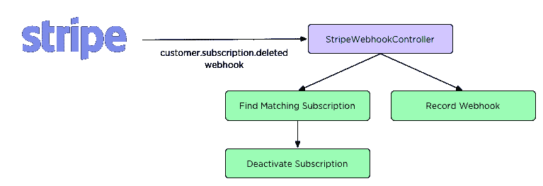
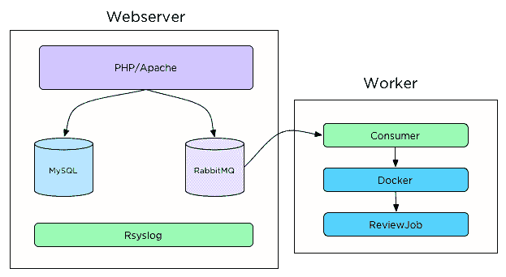

# Stickler CI 如何从原型发展成为产品

> 原文：<https://medium.com/hackernoon/how-stickler-ci-grew-from-a-prototype-to-a-product-6d2a58987ac1>

# 关于本系列文章

在这个由三部分组成的系列中，我将讲述过去两年中 Stickler CI 从最初的原型到今天的演变。这篇具体的文章将介绍我如何将 Stickler CI 从一个无利可图的项目变成一个创收产品，以及围绕这一过程的成长烦恼。

[Stickler CI](https://stickler-ci.com/) 是一款软件即服务应用，自动化了代码评审的繁琐部分；强制样式和检查 lint 错误。它与 GitHub 集成，并检查每个 pull 请求的代码风格错误。当你的团队中有人犯了风格错误时，坚持不懈的 CI 会留下评论。这可以节省您的时间，因为对样式错误的反馈是自动处理的，您的团队不必通读构建报告来查找空白错误。我们的商业模式是免费访问公共存储库，而私人存储库需要付费。

## 真正的客户，真正的问题

2017 年 1 月，Stickler CI 吸引了第一个付费客户。随着时间的推移，技术挑战不断增加，我们开始获得更多的客户。我们的一些不幸包括取消、[安全](https://hackernoon.com/tagged/security)，扩大审查工作和处理增加的需求。

## 不完全取消

在第一个实现中，我们没有构建处理取消的工作流。我们认为，由于付费用户如此之少，客户流失在一段时间内不会发生。令我们惊讶的是，一位客户升级并需要取消的速度比我们预期的要快得多。这导致了通过电子邮件的手动取消，以及随后适当的取消工作流的实施。除了自愿取消，一个完善的计费集成需要处理由于未付款而导致的取消。在我们急于获得付费计划的过程中，我们也忽略了构建这一功能。这导致一些以前的客户在他们的订阅被取消后可以访问私有存储库。为了纠正这个疏忽，我们实现了**customer . subscription . deleted**和**invoice . payment _ failed**webhooks，当订阅错过付款或因错过付款而被取消时，Stripe 会发送这些 web hooks。今天，当这些网页挂钩到达时，订阅在我们的本地数据库中被取消，防止[未来](https://hackernoon.com/tagged/future)对私人储存库的评论。

Stripe Webhook workflow

## 安全第二

最初提供的另一个问题是我们支持 linters，允许用户使用他们用自己的代码创建的林挺规则。创建自定义规则的能力允许用户在 Stickler CI 服务器上运行他们想要的任何代码。这带来了一个很大的安全问题，因为恶意用户可以手工定制代码来获取 API 凭证或其他私人信息。为了弥补这一缺陷，审查作业和 linter 执行被移到 docker 容器中，该容器不能访问包含机密的主机文件系统。启动后，worker 作业在运行 linters 之前放弃特权，成为无特权用户。删除特权可以防止自定义 linter 代码访问创建容器时使用的环境变量。

## 保持工人可用

我们在审核工作的运作方式上走了很多弯路，以便快速向市场发布更具粘性的 CI。一些 linters，比如 phpcs 和 eslint，支持在用户的应用程序代码中定义 lint 规则。这些 linter 让我们面临这样的风险:恶意用户可能会在他们的自定义 linter 规则中放入一个无限循环。一个无限循环将导致一个锁定的审查工作线程，停止所有其他用户的审查。通过终止运行时间超过 10 分钟的审查作业，降低了这一风险。我们再也不用担心令人不快的用户占用我们的服务器，出现无限循环，要求我们提供更多的工作人员并影响 Stickler CI 的盈利能力。

## 记忆是变化无常的东西

您可能还记得上一篇文章，Stickler CI 最初部署在一台服务器上。我们没有预料到那个时期会有多短暂。

最初，网络服务器有 1GB 的内存，但随着审查工作流量的增加，很快就超载了。作为回应，那台机器被升级到 2GB，但在将审查作业转移到 docker 后不久，我们开始看到各种进程被我的克星 OOMKiller(内存不足黑仔)终止。系统日志包含许多“终止进程”日志消息。这告诉我们，是时候增加更多容量了，因为我们的生产环境已经超负荷了。

通过拼凑一个可行的剧本和一些手动配置，我们很快就组装了一台“工人”机器。这个配置让我们可以将 docker 和检查作业处理转移到新的机器上，释放主服务器上宝贵的 RAM。我们还向工作主机和 web 服务器主机添加了小型交换驱动器。这让我们可以处理一些流量高峰，并阻止 OOMKiller。这种变化产生的架构看起来像:

v2 of the Stickler CI architecture

这个配置允许 worker 节点连接到 web 服务器上的 RabbitMQ，但是在自己的 docker 守护进程上运行检查作业。来自工人的日志被转发到网络服务器，使我们能够进行集中记录，这使得故障排除更加容易。通过在 worker 上运行 docker 和审查作业，我们可以更好地管理和隔离审查作业使用的资源(时间和内存),并保护我们的 web 服务器和数据库免受昂贵的审查作业工作量的影响。docker 容器处理向 GitHub 发布评论，并允许我们轻松地对失败的作业重新排队。

# 结论

纠正这些捷径的最终结果是一个更有利可图、高性能、安全的产品。Stickler CI 体验到了能够接纳更多用户、更多评论和更多收入所带来的业务影响。下一篇文章将调查我们匆忙构建的 worker node 解决方案的后果以及自托管电子邮件的噩梦。