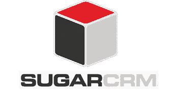

# SugarCRM 如何成为百万用户的选择？

> 原文：<https://medium.com/hackernoon/how-sugarcrm-is-a-choice-of-millions-of-users-32ffe2cd7fac>

SugarCRM

**SugarCRM** 是全球领先的商业开源客户关系管理(CRM) [软件供应商](https://hackernoon.com/tagged/sofware)，为各种规模的公司提供服务。它是一个开源的 CRM 解决方案，快速、灵活、功能丰富，而且是一个价格合理的产品。该解决方案被吹捧为传统 CRM 系统的下一个替代解决方案，为实施它们的公司节省了数百万美元。 [SugarCRM](https://hackernoon.com/tagged/sugarcrm) 拥有其他传统开源软件系统的所有功能。此外，它使用户能够控制自己的预算，同时照顾他的客户。无论经济衰退与否，最好的选择是找到一个既经济又能解答疑问的解决方案。

**此外，CRM 软件包关注以下内容:**

1.  面向跟踪潜在客户、确定主要客户资格、预约等的销售流程
2.  包括向客户发送有针对性的电子邮件、信件和电话的沟通过程
3.  有了 SugarCRM，人们可以轻松地执行所有这些功能

**从技术上来说，所有的应用都是建立在纯开源 LAMPS 平台上的:**

*   Linux 或 Windows
*   Apache 或 IIS
*   关系型数据库
*   服务器端编程语言（Professional Hypertext Preprocessor 的缩写）
*   SugarCRM

全球已有超过 50 万用户选择使用 SugarCRM。他们对自己的决定非常满意和高兴。如果你目前还没有 CRM 系统，那么 Sugar 是最适合你的。你现在的系统太贵了；或者没有提供您期望的价值。此外，该软件擅长协调联系人、机会、账户、管理电子邮件列表、开展营销活动、处理服务请求和客户问题。

为您的开源软件实现选择 [**SugarCRM 服务专家**](http://www.osscube.com/sugarcrm) 。SugarCRM 开发人员了解您的目标，并将帮助您实现业务目标。最重要的是，他们将确保您获得适合您业务的最佳开源解决方案，这不仅有助于您改进已确定的流程，还能建立和支持丰富的客户关系。

**底线**

SugarCRM 致力于通过避免供应商强加的人为限制来控制用户和客户。没有诱饵和开关，销售模式，受专有供应商的欢迎。商业开源模式要求把你的产品放在你的销售队伍前面，这意味着拥有一个快速、直观、易于学习、使用和扩展的应用程序。该应用程序是中小型企业和公共组织的理想之选，被成千上万成功的公司用来管理销售、营销和做出明智的执行和管理决策。

> [黑客中午](http://bit.ly/Hackernoon)是黑客如何开始他们的下午。我们是 [@AMI](http://bit.ly/atAMIatAMI) 家庭的一员。我们现在[接受投稿](http://bit.ly/hackernoonsubmission)，并乐意[讨论广告&赞助](mailto:partners@amipublications.com)机会。
> 
> 如果你喜欢这个故事，我们推荐你阅读我们的[最新科技故事](http://bit.ly/hackernoonlatestt)和[趋势科技故事](https://hackernoon.com/trending)。直到下一次，不要把世界的现实想当然！

