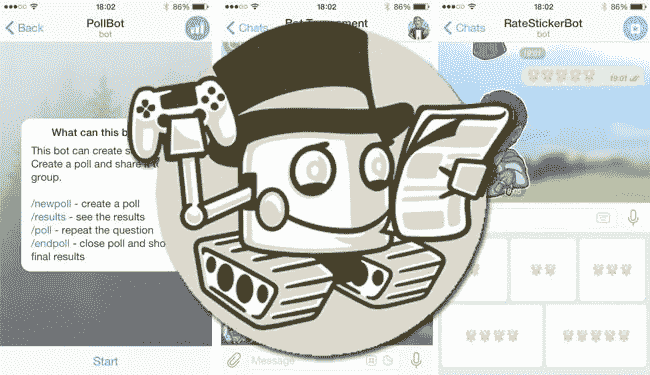

# Telegram 和几个机器人如何大大改善移动体验

> 原文：<https://medium.com/hackernoon/how-telegram-and-a-few-bots-greatly-improve-the-mobile-experience-3ed8ee6392af>

我承认，目前我用的是带 Ubuntu Touch 的[手机。我从安卓发布的第一天就开始用了。我的手机总是与](http://www.ubuntu.com/phone)[最好的安卓 rom](http://www.resurrectionremix.com)完美调谐。没有抱怨。

我喜欢我目前使用 Ubuntu Touch 的普通手机。它运行良好，Ubuntu Touch 是一个非常有用的操作系统，我很自豪地看到它的进步。确实它没有 Android 那么多应用。但是制作或使用 webapp 非常容易，无数的 web 服务在 web app 上看起来非常完美。Android 应用的过剩让我损失了很多时间。现在我还算幸福:-)

同样真实的是，对各种应用程序的需求并没有那么迫切。也不一定要有下一代手机才能享受深刻的技术体验。另外，最近事情变化很大。有一个明显的趋势是使用机器人来做以前需要特定应用程序的事情。

**机器人？**

Telegram have bots

是的，更小或更大的作品，代码只需要一个消息应用程序运行。基本上我指的是在 Telegram 中运行的机器人，它们变得越来越有趣。

机器人的美妙之处在于，有了电报，就不需要安装其他任何东西。没有必要拥有一个功能强大(且昂贵)的设备来与机器人交互。事实上，除了电报本身所需的资源之外，机器人不会消耗更多的电池、内存、CPU，也不会占用更多的可用空间。

> 因此，我所说的不仅限于 Ubuntu Touch，而是任何设备，无论其操作系统如何。

这些是我最喜欢的一些机器人。

[Qwasapbot](https://qwasap.com/) 。显然，我想首先列出我最亲爱的动物。我真的想有一种方法来与世界上特定地方的人进行互动。Qwasapbot 解决了这个问题。你不需要与任何人分享个人信息，你可以在任何你想去的地方找到自己，并开始与同样在那个区域的人互动。这对我来说非常有用，因为如果我需要询问、询问或评论某件事，去一个地方并与那里的人直接接触的经历简直太棒了。所以当我不旅行的时候，我把自己(在机器人里面)定位在某个已知的地方或者我真正居住的地方。因此，任何需要了解那里情况的人都可以找我。

[推特](https://telegram.me/TweetItBot)。它允许我从 Telegram 管理我的 Twitter 账户。我可以看到时间线、通知、推文、转发、回复。几乎所有你需要的东西。

> **云空间存储文件还是共享？**没问题。虽然有机器人做这种事情，但由于 Telegram 允许你给自己发送消息，你有无限的虚拟空间来存储你想要的任何东西。如果你说你不能把你的文件组织成文件夹，我告诉你，在你上传的每个文件后加一个#hashtag 几乎是一样的。由于 Telegram 的内部搜索引擎极其有效和强大，搜索那个#hashtag 就足够了。这与打开一个文件夹是一样的。一样，但在其他方面。

[Tlgur](https://telegram.me/tlgurbot) 。您可以创建已上传到 Telegram 的文件的 URL，这样您就可以与任何人共享它，即使那个人没有 Telegram。这看起来很简单，但是非常有用。

[Etlgr_bot](https://telegram.me/etlgr_bot) 。您可以获得任意多个电子邮件地址(都以@ etlgr.com 结尾)。所以现在我在那里阅读和回复邮件。它是如此的多才多艺，你可以创建地址作为一次性使用，当我不再需要它们时删除它们，并创建其他的。你可以留下一些地址作为你的个人邮箱。太棒了。

> 有许多[机器人来应用效果或修饰你的照片](https://www.qwasap.com/en/bots.php)。它们工作得非常好，对于日常使用，你不需要任何其他更复杂的应用。

[DoToBot](https://telegram.me/dotobot) 。它也可以用来做待办事项列表和分享它们。

[Delorean_Bot](https://telegram.me/delorean_bot) 。你可以向未来发送信息。即在特定日期激活的消息。如果你仔细想想，你会发现这个有意思的应用。

[Bnotebot](https://telegram.me/bnotebot) 。这是一个记事本，用于记录简短的笔记和注释。

[塔达姆](https://telegram.me/Tadam_bot)。有非常复杂的应用程序来识别音乐，但这个机器人和它们一样好，没有滥用你的设备资源，没有广告，没有任何奇怪的事情。

[自述](https://telegram.me/ReadmeBot)。如你所知，有一个非常好的 iOS 和 Android 应用程序，可以轻松地阅读任何网站的文本，消除各种额外的东西。这个机器人做的完全一样。如果你发送一个网站的地址，机器人会返回干净的文本。

[气象员](https://telegram.me/weatherman_bot)。我们一致认为天气预报在各个方面都有很好的应用，包括美学和视觉效果。但是如果你只是想要天气预报，这个机器人会满足你所有的愿望。

[Utube](https://telegram.me/utubebot) 。要从 Youtube 上下载视频或 MP3 格式的声音，你只需要这么多。

> 也有机器人做多种事情，像一种瑞士军刀，像 imandabot。甚至好玩的东西: [Alexfase1_bot](https://telegram.me/alexfase1_bot)

这些只是非常有用的电报机器人的例子，它们能够取代任何或多或少做同样事情的应用程序。总的来说，我收集了引起我注意的机器人:[最佳电报机器人](https://www.qwasap.com/es/bots.php)。

超越安装应用程序的强迫性需求是很有趣的。有时我半开玩笑地评论说，Telegram 将最终成为手机唯一必需的“操作系统”。

享受机器人！

> [黑客中午](http://bit.ly/Hackernoon)是黑客如何开始他们的下午。我们是 AMI 家庭的一员。我们现在[接受投稿](http://bit.ly/hackernoonsubmission)并乐意[讨论广告&赞助](mailto:partners@amipublications.com)机会。
> 
> 如果你喜欢这个故事，我们推荐你阅读我们的[最新科技故事](http://bit.ly/hackernoonlatestt)和[趋势科技故事](https://hackernoon.com/trending)。直到下一次，不要把世界的现实想当然！

