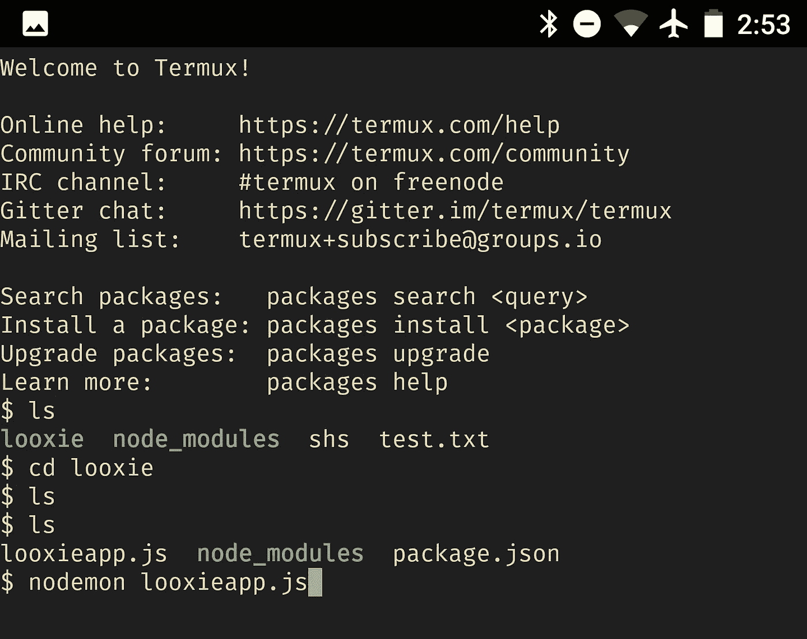

# Termux 是怎么救了我的

> 原文：<https://medium.com/hackernoon/how-termux-saved-my-ass-73db53b2dea1>



## 安卓摇滚的原因之一

我有一个肮脏的秘密。

我的基于位置的照片请求应用 Looxie 发送推送通知。这不是秘密:许多应用程序都是这样做的。

仍然不是秘密:Looxie 使用[谷歌云消息](https://developers.google.com/cloud-messaging/)(现在更名为 Firebase 云消息)来发送通知。直到最近，在引入 [Firebase 云功能](https://firebase.google.com/docs/functions/)之前，你必须有自己的服务器运行&跟随 Firebase 实时数据库的变化。

我仍然在使用这个架构，因为出于某种原因，我似乎无法让我创建的 node.js 服务器作为 Firebase Cloud 函数运行。

秘密来了:node.js 服务器运行在我花 300 美元买的一台旧华硕笔记本电脑上。在一次完全不知从何而来的灾难性硬盘故障之后(好吧，我在 [Limbo](http://www.playdead.com/games/limbo/) 中一个特别具有挑战性的部分打了一拳)，我用 SSD 替换了硬盘，并安装了 Ubuntu，因为我太便宜了，无法购买 Windows 许可证。

听起来*不算太*差吧？好了，这里是它变好的地方:笔记本电脑通过 Wi-Fi 连接到网络。当路由器开始发送垃圾信息时(这种情况以惊人的频率发生)，连接就会中断，Ubuntu 在连接到网络之前会再次要求输入密码。如果我没有输入密码并按下“回车”，Looxie 将停止发送推送通知。

谢天谢地，我住的地方离我的办公室只有几分钟的路程，所以当连接中断时，我就去那里把电脑重新连接到互联网上。这仍然是一件愚蠢的事情，但至少它的工作。

所以想象一下，我离开塞浦路斯旅行 20 天是多么有压力，同时一直在想“如果(或者更现实地说，*当*我不在的时候连接中断了，我该怎么把服务器带回来？”

[](https://www.buymeacoffee.com/XozUExS) [## 给安东尼斯·查加利斯买杯咖啡——BuyMeACoffee.com

### 我是一名 Android 开发人员和设计师，热爱漂亮的用户界面！

www.buymeacoffee.com](https://www.buymeacoffee.com/XozUExS) 

## 我不在时，连接中断

旅行进行到第五天时，Looxie 停止发送推送通知。

妈的。

我打电话给我哥哥，让他把笔记本电脑重新连接到互联网上。我哥哥很乐意帮忙，但是，随着事情的发展，一天后，笔记本电脑又断开了。

当时我的感觉是这样的:


沮丧之余，我带着一个计划走进了旧金山的 T-Mobile 商店。我买了一张载有 2gb 数据的 SIM 卡，并开始实施我的计划。

## Termux 出现了

我以前在/r/androiddev subreddit 中听说过 [Termux](https://play.google.com/store/apps/details?id=com.termux) 。我实际上把它安装在我的 Nexus 6P 上，但从未真正使用过它。在你的手机上安装一个 Linux 终端模拟器是那些一开始听起来很酷，但最终几乎没有实际用途的事情之一。

这次不会。这次我去了

```
apt install git
```

还有…什么？Git 已安装。在 Termux 中初始化一个 repo 之后，我从 Github 中取出了整个 Looxie 存储库。

到目前为止，一切顺利。但是……我怎么才能让 node.js 在这里运行呢？嗯，怎么样

```
apt install nodejs
```

这是瞎猜的，但令我惊讶的是，一些事情开始发生了。

几分钟后，我在 Termux 中运行了 node.js 安装。这是我的运气所能达到的极限，对吗？

当我开始打字时，我想，“嗯，我不会有什么损失的。”

```
npm install nodemon
```

还有…天哪，成功了！

我有点沉迷于这种令人惊叹的感觉，于是我输入了

```
apt install nano
```

因为我想到了可以在 JavaScript 源代码中做些改变来解决服务器中的一个小错误。

你明白了:它起作用了。

不可能这么简单，对吧？当我打字的时候，有些事情会变得很糟糕

```
nodemon looxieapp.js
```

启动服务器。

没有什么可怕的错误。

没什么。

服务器启动了，并且运行得很好*。Looxie 再次发送推送通知。*

*我唯一担心的是？当手机进入 Android 臭名昭著的“瞌睡”模式时，服务器就会停止工作——这种模式在你想让它工作时不起作用，在你不想让它工作时起作用。*

> *瞌睡模式:当你想让它工作的时候不工作，当你不想让它工作的时候工作*

*Termux 又一次覆盖了我:在通知下拉列表的通知中，它有“获取 wakelock”的选项。*

*我得到了唤醒锁。*

*睡着了。*

*[](http://bit.ly/HackernoonFB)**[](https://goo.gl/k7XYbx)**[](https://goo.gl/4ofytp)*

> *[黑客中午](http://bit.ly/Hackernoon)是黑客如何开始他们的下午。我们是 [@AMI](http://bit.ly/atAMIatAMI) 家庭的一员。我们现在[接受投稿](http://bit.ly/hackernoonsubmission)并乐意[讨论广告&赞助](mailto:partners@amipublications.com)机会。*
> 
> *如果你喜欢这个故事，我们推荐你阅读我们的[最新科技故事](http://bit.ly/hackernoonlatestt)和[趋势科技故事](https://hackernoon.com/trending)。直到下一次，不要把世界的现实想当然！*

**