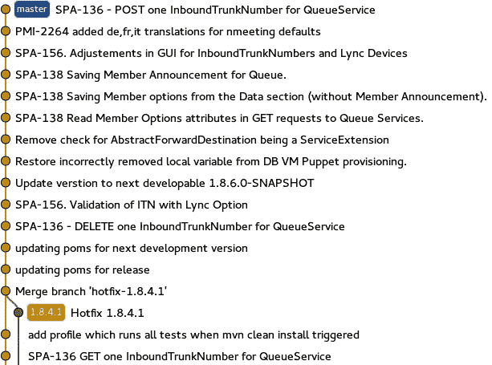
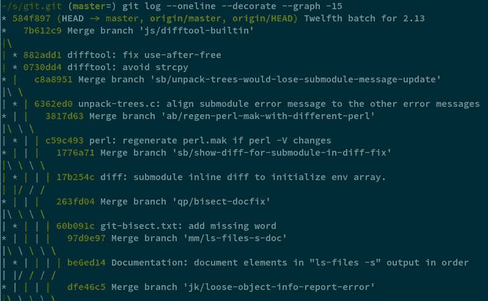
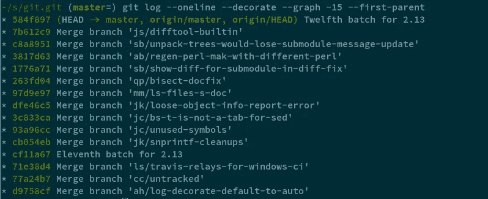
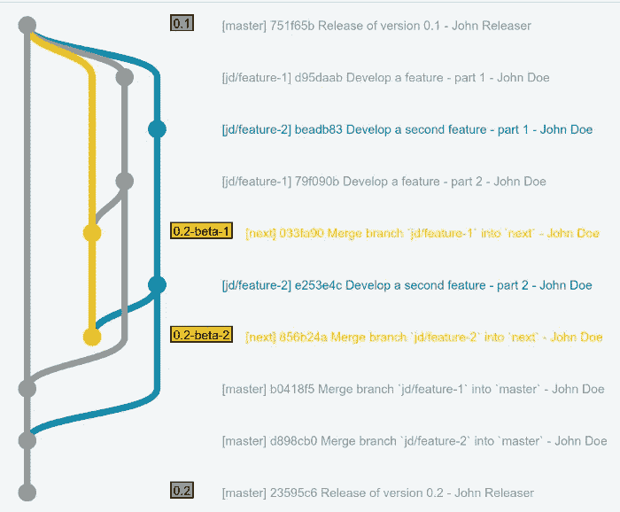

# Git 的创建者是如何分支的

> 原文：<https://medium.com/hackernoon/how-the-creators-of-git-do-branches-e6fcc57270fb>

在大型团队和项目中，使用 Git 进行分布式开发有一些常见的分支和过程模型。

Vincent Drieesen 创建的 GitFlow 就是这样一个常见的分支模型。GitFlow 相对容易理解，由 Vincent 出色地呈现并由作了[图示，并且似乎恰当地利用了 Git 出色的分支和合并能力。亚当·岸本瑠可写了一篇名为](http://nvie.com/posts/a-successful-git-branching-model/) [GitFlow 被认为是有害的](http://endoflineblog.com/gitflow-considered-harmful)的流行辩论，并提出了他自己常用的模型。

我提交了另一种用于大型团队和定期发布的复杂项目的方法供您考虑:由 [git.git](mailto:git@vger.kernel.org) 项目使用的 [dogfood 工作流](https://git-scm.com/docs/gitworkflows#_managing_branches)——开发和维护 git 本身的开源项目。这个工作流并不新鲜——我在 2009 年为上面的 *gitworkflows(7)* 手册页贡献了,它是由 Thomas Rast 在 2008 年首次创建的。但是在 git.git 项目本身之外，它还没有得到很多采用。我认为主要原因是:a)它没有一个像“GitFlow”这样易于搜索和记忆的名字，b)它创建了一个看起来非常疯狂的历史图表，c)它更难搜索，尤其是当你来自一个更喜欢 subversion 这样的线性历史工具的背景时。让我们依次解决每一个问题。

为了给它一个名字，让我们称它为“ **gitworkflow** ”，以尊重它的创建者和描述它的手册页。*快速声明:我不是一个定期的 git.git 贡献者——git.git 项目不以任何方式认可这一点(尽管 git . git 邮件列表中的一些好人确实审阅了一份草稿),本文中的任何错误、不准确或误解都是我个人的。*

关于第二点:在 Adam 的文章中，他展示了两个截图，一个展示了一个以 GitFlow 为例的非线性历史(关键点与使用`--no-ff` merges 创建空合并提交相关):

A non-linear GitFlow history

另一个展示了同一个项目的线性历史，它使用了 Adam 推荐的快进合并:

并问道:

> 在调查这个问题的时候，你更愿意面对哪一段历史？

后一个历史图表很容易被发现，但是……在合并提交的历史下提供了更多的价值。它将相关的工作放在一起，而线性历史将相关的工作分散在几个不连续的提交中，识别这些关系的唯一方法是提交日志中的问题 id。线性历史**易于查看**，但**难以使用**——用里奇·希基的话说，它“容易”但不“简单”，因为它[引入了意外的复杂性](https://www.infoq.com/presentations/Simple-Made-Easy)。

然而，事实上，第一个历史图表亚当说明 ***是*** ***实际上很难理解*** 是真实的，需要加以解决。在这里，Git 的功能可以提供帮助。想要查看一个分支的所有合并，而不查看单个提交的细节吗？使用`--first-parent`(正如亚当帖子上最流行的评论所指出的)。下面是 git.git 关于没有旗帜的*主*分支的历史(yikes):

git.git log master

但是有了`--first-parent`:

git.git log master with `--first-parent`

不错！现在将第二个截图与亚当的线性历史进行比较，并再次询问他的问题。使用这种方法，所处理的每个单独的主题被一致地列出，每个主题的细节被省略，并且历史被线性地呈现。但同时，每个主题分支的详细历史仍在幕后。例如，让我们看看被合并的分支`jk/snprintf-cleanups`的历史，使用的别名叫做`[mergedtopiclg](https://gist.github.com/rocketraman/1fdc93feb30aa00f6f3a9d7d732102a9#file-gitconfig-L41)`:

现在我们看到所有与特定合并的**相关的提交，再次是线性的，没有无关的提交穿插。**

现在，最后也是最重要的，gitworkflow 没有被广泛采用的原因:很难理解它，或者至少对我来说是这样。亚当指出:

> GitFlow 提倡有两个永恒的分支——掌握和开发。为什么是两个，当一个是传统的标准？

相比之下，Gitworkflows 实际上有*四个*这样的“重要”分支，尽管这四个分支中当然只有一个是“永恒的”: *maint* 、 *master* 、 *next* 和 *pu。E* 确切地说*为什么*我需要所有这些分支，f*k 是什么 *pu* ？ [gitworkflows(7)](https://git-scm.com/docs/gitworkflows) 手册页的“管理分支”部分，以及 [MaintNotes](https://github.com/git/git/blob/efc912b23335434674bcfda8199077f8dfa5d6f0/MaintNotes#L144) 和 [maintain-git.txt](https://github.com/git/git/blob/v2.13.0/Documentation/howto/maintain-git.txt#L35) 的这些部分，都值得再读一遍。再说一遍(在完成这篇文章后，他们可能会更有意义)。

考虑到这一点，如果我们维护一个项目的发布，我们可能会有不同稳定级别的不同“版本”。一个稳定的“发布”(或“生产”)版本，一个为雄心勃勃的用户和测试人员准备的测试(或“测试”)版本，这个版本有些稳定，还有一个包含所有最新好东西的 alpha(或“开发”)版本，但其中可能也有一些不完整的东西。

并非巧合的是，我们的 gitworkflow 分支 *master* 、 *next* 、以及 *pu* (建议更新)分别对应这些版本/beta/alpha 的稳定性级别。剩下的分支 *maint* 是在发布点从 *master* 分出来的，仅仅包含已经发布的代码的热修复。

既然我们理解了每个“集成分支”在稳定性方面的目的，我们就将它与“主题分支”的概念结合起来。主题分支本身是没有争议的 GitFlow 和 Adam 都推荐使用它们。主题分支是所有当前工作正在进行的地方——每个问题、bug 或特性一个分支，并且可以同时进行许多主题分支的开发。然而，在 gitworkflow 中，主题分支实际上是流程的基础，而不仅仅是独立开发代码的临时场所。

主题分支总是从*维护*或*主控开始。如果主题最终需要合并到由 *maint* 表示的当前版本，则从 *maint* 分支*，或者如果主题打算用于未来版本(不一定是下一个版本)，则从 *master* 分支。注意一个警告:如果一个新的主题 *topic-b* 依赖于在更早的主题 *topic-a* 上编写的代码，那么 *topic-b* 仍然应该从 *maint* 或 *master* 分支，但是 *topic-a* 应该合并到 *topic-b* 中。这使得*主题-b* 在逻辑上与*主题-a* 分离，但是使依赖关系显式化。

由于主题从*维护*或*主*分支，它们也可以毫无争议地合并到*下一个*和*pu*——因为这两个分支以在*主*上提交(或*维护*，其中*主*总是包含)的形式与主题共享一个共同的祖先。大多数分支策略错误地认为只能合并到同一个分支，但是 Git 比这更聪明、更灵活。

主题分支从不稳定的状态开始，可能包含错误和未完成的工作。然而，这不应该阻止我们将我们的工作与其他正在进行的工作集成，看看在合并时和运行时会发生什么——这个过程由我们在 *pu* 或建议更新分支中的 alpha 状态代码表示。周期性地 *pu* 被重置为当前的*主*，然后所有的主题分支被合并到其中，以识别合并问题，运行测试，并产生 alpha 状态构建工件。注意合并的顺序并不重要，但是可以根据项目或具体情况来定义。以一致的顺序执行合并将最好地允许像`[git rerere](https://git-scm.com/docs/git-rerere)`这样有用的工具正确工作，并且可以通过脚本实现半自动。

合并到 *pu* 对于产品所有者、功能测试人员和热心用户对开发工作的最初反馈非常有用。GitFlow 没有提供任何内在的方法来做到这一点——CI 已经成为自动运行单个主题分支上的测试的简写，但在其核心，**它是合并和测试*所有*当前正在进行的工作的能力，这是真正的 CI，gitworkflow 启用了**。

最后，请注意 gitworkflow 的另一个有用的属性: *pu* 被认为是一个可丢弃的分支，可以在任何时候被重置，因此任何提交通常都不应该基于它。因此，尽管过去合并到了 *pu* 中，主题仍然可以根据需要进行交互式的重定基础，以产生一系列伟大的、容易审查的、可理解的提交，而不用担心其他人不得不"[从上游重定基础](https://git-scm.com/docs/git-rebase#_recovering_from_upstream_rebase)中恢复"(这是一个简单的过程，但不是经常需要的)。

在一个主题分支经历了几个周期的细化、代码审查和测试之后，它可能会达到(根据某人的判断)足以发布到 beta(或用户验收测试)环境的程度。至此，在 gitworkflow 中，话题“毕业生”到了下一个分支*。毕业只是将主题合并到下一个*的*和`--no-ff`。*

既然这个主题已经升级到下一个的*了，那么它可以成为测试版或者验收版的一部分。因此，下一个*的*中的每个主题现在都可以进行第二轮稳定化，这正是 beta 发布/验收测试环境的目的。但是，请注意，对于 gitworkflow，我们仍然没有提交(没有双关语！)将这个主题作为我们下一个生产版本的一部分——它仍然没有被合并到 *master* 中。这在概念上类似于 GitFlow 的*发布*分支，但是更加灵活和强大，因为*主*无论如何都不依赖于*下一个*，也不会*下一个*被大规模合并到*主*(不像相应的 GitFlow 分支*开发*和*发布*)。*

如果主题分支在接下来的*上进行合并和测试后，继续随着新的提交而发展，会怎么样？*如有必要，该分支被简单地合并到下一个*和*。可选地，这些进一步的变化也可以通过首先将它们合并到 *pu* 而经历额外的稳定期。由于*下一个*是一个具有有限生命周期的集成分支，主题的重复合并确实会使它的历史复杂化，但只会持续到下一个*下一个*的下一次重建(这可能发生在下一个版本中，但 gitworkflow 在这里是灵活的)。在这里无关紧要和令人分心的历史，在*溥*身上，最终被丢弃和遗忘。

最后，一旦一个主题被判断为足够稳定可以发布，该主题再次毕业并被合并到*主*(或者*维护*)，再次与`--no-ff`一起保存该主题分支的完整历史。

几个主题分支合并到下一个的*，在那里作为 beta 版进行测试，然后最终升级到 *master* 进行发布，看起来可能是这样的:*

Source: [http://jsfiddle.net/jtooun5q/5/](http://jsfiddle.net/jtooun5q/5/)

注意，在 gitworkflow 中，不稳定和稳定的开发工作**永远不会**混合在同一个分支上。相比之下，使用 GitFlow 我有两个选择:1)我可以在自己的分支上单独测试我的主题，或者 2)我可以将它合并到 *develop* 中进行测试。两种选择都没有吸引力。前者在与其他正在进行的工作一起部署时不提供对主题稳定性的真正测试，而后者将主题提交给*开发*可能在它稳定之前。

出于同样的原因，GitFlow 没有过程辅助的方法来提前识别哪些主题可能会导致与其他正在进行的工作的冲突，以便有问题的开发人员可以在他们的主题最终合并到*开发*之前协调工作。简而言之，在 GitFlow **中，在保持开发工作在一个主题分支上的干净和隔离的愿望与通过将主题分支合并到*开发*以使它们可见和可测试并检查冲突来将主题分支与其他工作**集成起来的愿望之间，总是存在无法解决的矛盾。Gitworkflow 允许在不牺牲一个目标的情况下实现两个目标。

关于 gitworkflow，除了我在这里介绍的之外，还有更多功能需要学习。也许我或其他人的一些后续帖子可以涵盖这一领域。此外，围绕 gitworkflow 的开源工具集将有助于重建 *pu* 和 *next* ，并跟踪主题的毕业状态——git.git 有用于此目的的“烹饪”工具，但不太特定于 git . git 的工具会更好。作为开始，我创造了[几个有用的别名](https://gist.github.com/rocketraman/1fdc93feb30aa00f6f3a9d7d732102a9)【1】。*2018 年 4 月 8 日更新*:我还在 GitHub 上创建了一个[知识库](https://github.com/rocketraman/gitworkflows)，里面有额外的文档，包括一个[面向任务的入门](https://github.com/rocketraman/gitworkflows/blob/master/docs/task-oriented-primer.adoc)。

但简而言之，gitworkflow 对于许多用例来说是一个优秀的 Git 分支模型/工作流，值得比现在更受欢迎。这确实需要对高级 Git 特性和概念有深刻的理解，但是这种努力是值得的。

[1]特别参见别名`lgp`、`topics`、`topiclg`、`mergedtopiclg`、`branchnote`和`where`

Raman Gupta 是 reDock Inc. 的工程副总裁，喜欢教授 Git 的奇妙之处。顺便说一句， [reDock](https://www.redock.com) 正在招人！在 Twitter 上关注我们 [@reDockAI](https://twitter.com/reDockAI) 。

> [黑客中午](http://bit.ly/Hackernoon)是黑客如何开始他们的下午。我们是 AMI 家庭的一员。我们现在[接受投稿](http://bit.ly/hackernoonsubmission)并乐意[讨论广告&赞助](mailto:partners@amipublications.com)机会。
> 
> 如果你喜欢这个故事，我们推荐你阅读我们的[最新科技故事](http://bit.ly/hackernoonlatestt)和[趋势科技故事](https://hackernoon.com/trending)。直到下一次，不要把世界的现实想当然！

