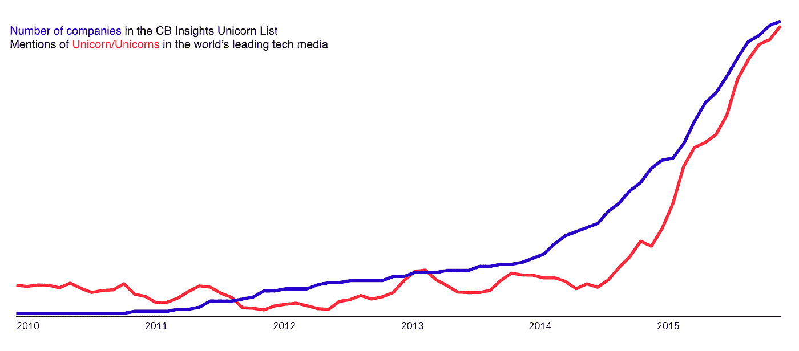
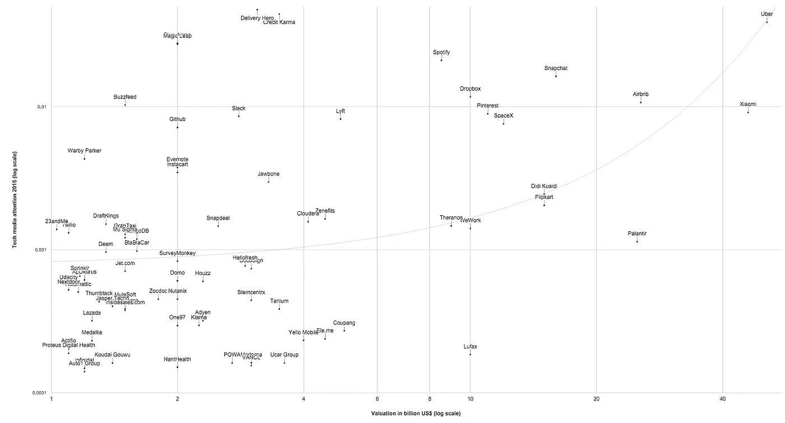
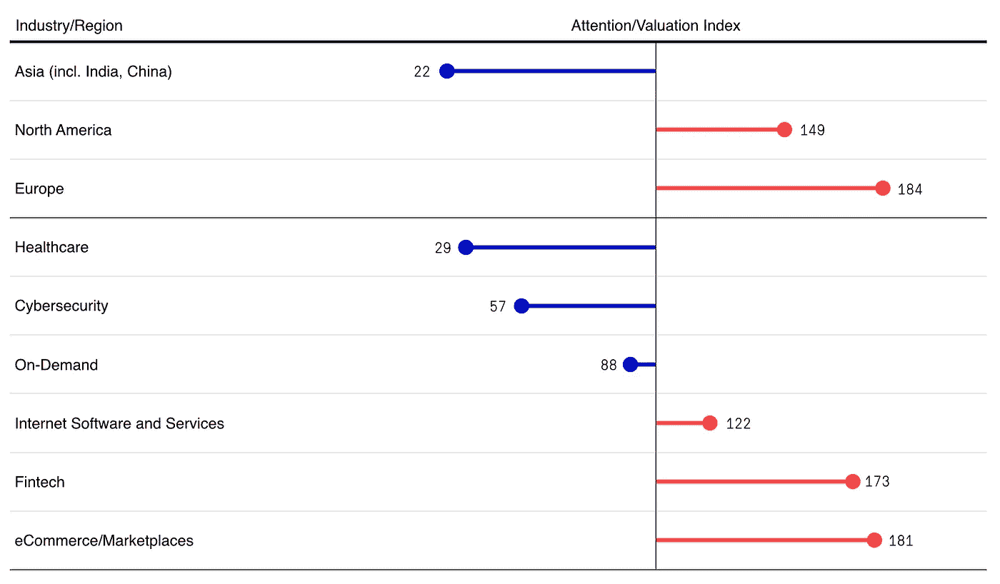
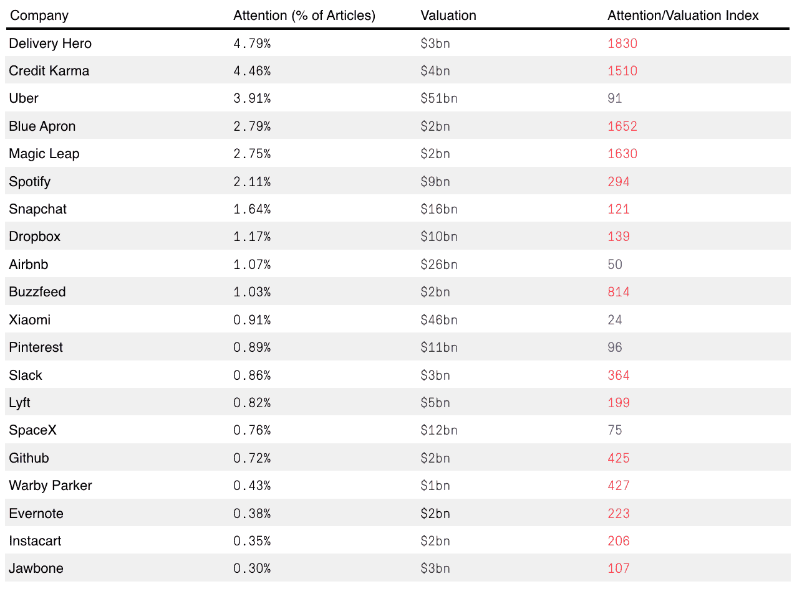

# 媒体对一家初创公司的关注与它的估值有什么关系

> 原文：<https://medium.com/hackernoon/how-the-media-attention-for-a-startup-relates-to-its-valuation-d6736f1634b6>

正如我们在之前的[博客文章](/@12KResearch/the-trend-attention-cycle-and-how-it-can-help-evaluate-emerging-technologies-e7b0ee7e9b80#.vyyu7tquy)中指出的，媒体报道可以被视为一个市场经济潜力的有效指标。在本帖中，我们想分享一些关于初创公司估值和科技媒体报道之间关系的见解。

*Sources:* [*https://index.12k.co/topics/unicorn,unicorns*](https://index.12k.co/topics/unicorn,unicorns) */* [*https://www.cbinsights.com/research-unicorn-companies*](https://www.cbinsights.com/research-unicorn-companies)

在这项研究中，我们重点关注 CB Insights [独角兽名单](https://www.cbinsights.com/research-unicorn-companies)上的公司。CB Insights 将独角兽定义为价值 10 亿美元及以上的私人公司。2013 年,[牛仔风投](http://cowboy.vc/)的艾琳·李在 Techcrunch [的一篇文章](http://techcrunch.com/2013/11/02/welcome-to-the-unicorn-club/)中首次使用“独角兽”这个词来定义价值十亿美元的初创公司，在过去两年里，这个词变得非常流行。2015 年是独角兽的[年](http://www.inc.com/jeremy-quittner/best-of-inc-2015-unicorns-then-and-now.html)，CB Insights 独角兽榜单上超过 50%的公司(144 家中的 73 家)加入了该榜单。

为了量化这些评级最高的私营公司的公众关注度，我们分析了它们在全球领先科技媒体上的报道。我们只观察了独角兽名单中文本独特的 119 家公司(例如，没有[吸收](http://uptake.com/))并分析了总共超过 100 万篇文章。

Source: bit.ly/1O6vehw

对比最新的估值和 2015 年的媒体关注度，这两个因素之间存在明显的相关性。这意味着科技媒体对一家公司的报道越多，它的价值就越高。但散点图也显示，许多公司获得的关注比其估值所显示的更多(如 Credit Karma、Buzzfeed)，或更少(如 Palantir、Lufax)。为了更好地了解哪种创业公司获得了特别多的关注，我们计算了一个媒体关注和估值的指数。如果这个关注度/估值指数高于 100，那么与估值相比，这家初创公司在 2015 年获得的关注度高于平均水平。

2015 年加入独角兽俱乐部的创业公司在同年获得了高于平均水平的关注。这种相互依赖是意料之中的，因为融资事件本身就是相关新闻。分析不同地区初创公司的关注/估值指数显示，欧洲独角兽在顶级科技媒体来源中获得了最高的关注度。这让我们非常惊讶，因为大多数领先的技术媒体来源都位于美国。另一方面，亚洲创业公司受到的关注明显少于西方创业公司。10 家最有价值的公司中有 3 家(小米、Flipkart 和滴滴快的)位于亚洲，但它们都没有进入媒体关注度的前 10 名。从行业来看，电子商务/市场和金融科技初创公司在 2015 年受到了媒体的特别关注。另一方面，像 Palantir 或 Intarcia 这样的大数据和医疗保健初创公司几乎没有受到关注。

两家食品配送初创公司 Delivery Hero 和 Blue 围裙是关注/估值指数方面的顶级异常值。这是因为媒体喜欢不断增长的市场和竞争激烈的市场。Credit Karma (Fintech)和唯一的 AR-Unicorn Magic Leap 也站在了聚光灯下。

这个快速分析向我们展示了两件事。首先，在评估公司时，媒体关注是一个有趣的指标，因为它与初创公司的价值相关。第二，数据还揭示了公司的经济价值只是媒体报道它的一个标准。在评估公司和市场时，分析师应始终监控广泛的信息来源，并专注于确凿的事实，以尽量减少媒体偏见的影响。

通过 12K 过滤器，我们正在构建一个工具，将您的研究领域中来自各种来源的所有确凿事实发送到您的收件箱，以帮助您跳出过滤器泡沫。

**加入** [**封闭测试版**](https://12k.co/) **让我们知道你的想法。**

> [黑客中午](http://bit.ly/Hackernoon)是黑客如何开始他们的下午。我们是 AMI 家庭的一员。我们现在[接受投稿](http://bit.ly/hackernoonsubmission)并乐意[讨论广告&赞助](mailto:partners@amipublications.com)机会。
> 
> 如果你喜欢这个故事，我们推荐你阅读我们的[最新科技故事](http://bit.ly/hackernoonlatestt)和[趋势科技故事](https://hackernoon.com/trending)。直到下一次，不要把世界的现实想当然！

