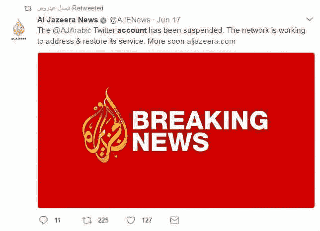
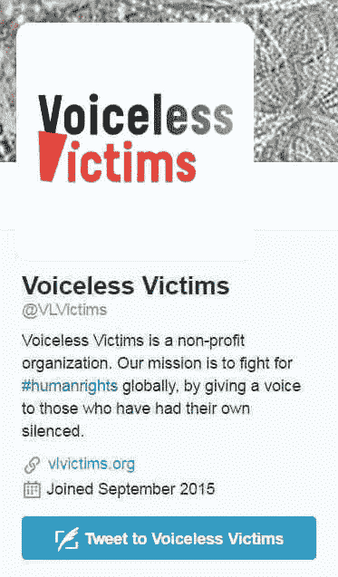
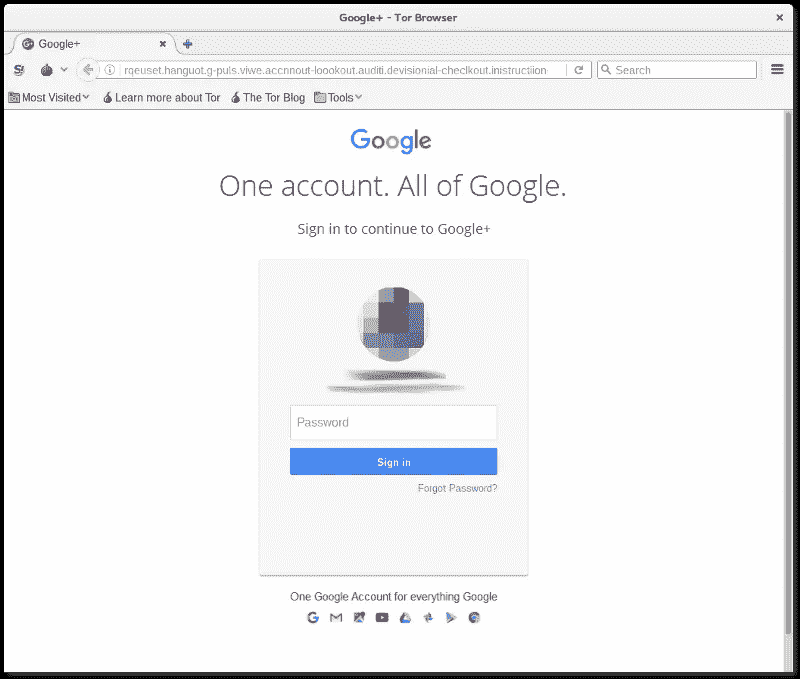
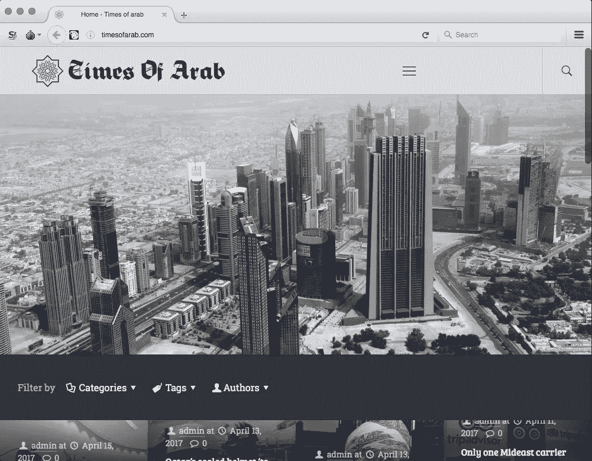

# 中东如何成为电子战场

> 原文：<https://medium.com/hackernoon/how-the-middle-east-became-an-electronic-battleground-dac5b5435eb>

Al Jazeera announces the suspension of its Arabic Twitter account

孤立地看，上周六半岛电视台阿拉伯语推特账户的暂时消失似乎无关紧要。然而，鉴于其他事件，这是中东政治斗争越来越多地通过互联网进行的又一个迹象。

已经有大量的武器在使用，从黑客和其他形式的[电子](https://hackernoon.com/tagged/electronic)骚扰到有政治目标的网络钓鱼攻击，虚假的社交媒体账户，以及被编程为向 Twitter 大量传播宣传或宗派仇恨言论的机器人。

周六推特和半岛电视台之间到底发生了什么还不完全清楚。出于各种原因，Twitter 暂停了许多账户，但它并不经常暂停像卡塔尔广播公司的 [@AJArabic](https://twitter.com/AJArabic) 账户这样拥有超过 1100 万粉丝的账户。不过，暂停并没有持续很久，当天晚些时候就恢复了正常服务。

没有人正式说明为什么会这样，但是 BBC [暗示](http://www.bbc.co.uk/news/world-middle-east-40311882)有一场大规模的有组织的“滥用”报道运动——在这种情况下，账户可能会被暂停以使其停止。对“虐待”的无理报道是社交媒体战争中的常见策略。例如，在中东，伊斯兰主义者经常用它来关闭由脸书的阿拉伯人管理的世俗主义者和无神论者团体(这里[这里](http://al-bab.com/blog/2016/02/cyber-jihad-against-atheists)和这里[这里](http://al-bab.com/blog/2016/02/facebook-restores-arab-atheist-groups))。

但是推特事件并不是最近几周发生在半岛电视台的第一件怪事。6 月 8 日，它[报道](http://www.aljazeera.com/news/2017/06/al-jazeera-media-platforms-cyberattack-170608170600837.html)其所有的网站和数字平台“正在遭受系统和持续的黑客攻击”。该公司表示，这些尝试“强度越来越大，形式也越来越多样”，但其平台迄今“没有受到损害”。

再一次，当单独看时，这可能看起来不太重要，但当从更大的角度来看时，这种现象开始发生变化——这是海湾地区多年来最激烈的公开争吵。这场争斗的一方是卡塔尔——半岛电视台的所在地——与它的三个阿拉伯邻国——沙特阿拉伯、阿联酋和巴林——为敌。

这些愤怒的邻国向卡塔尔提出的更重要的要求之一是，它应该限制半岛电视台和其他卡塔尔资助的媒体的活动。预计到这一点，他们已经阻止自己的公民在互联网上访问半岛电视台。

与卡塔尔的宿怨由来已久，但引发当前争论的导火索是一篇虚构的报道，据称是卡塔尔埃米尔在 5 月 23 日的一次军事仪式上发表的讲话。该报道曾短暂出现在卡塔尔政府新闻机构的网站上，随后该网站被关闭，卡塔尔声称该网站遭到黑客攻击。黑客行为似乎已经被派往卡塔尔的联邦调查局调查员证实[。](http://al-bab.com/blog/2017/06/robots-and-russians-qatar-hacking-mystery-deepens)

作为对虚假报道的回应，沙特和阿联酋媒体——其中一些媒体坚持认为埃米尔的讲话是真实的，卡塔尔声称的黑客攻击只是一个借口——开始了对卡塔尔及其埃米尔前所未有的长篇大论。这为沙特、阿联酋、巴林和埃及政府采取的一系列措施铺平了道路，事实上，这些措施将卡塔尔置于[的经济包围之下。](http://al-bab.com/blog/2017/06/qatar-crosshairs-where-will-it-end)

但是这些攻击并不都是单向的。六月初，一组来自阿联酋驻华盛顿大使账户的电子邮件出现在互联网上。泄露的电子邮件主要集中在与卡塔尔有关的问题上，它们似乎是为了让阿联酋尴尬而流传的。

邮件泄露的来源不得而知，但多疑的人可能会怀疑这是否是卡塔尔对其网站被黑的报复。

大约在同一时间，有人黑了巴林外交部长的推特账户，并发布了威胁巴林王室的推文。目前还不清楚这是海湾统治者之间争吵的一部分，还是巴林镇压政权的当地反对者的独立行动。

# 俄罗斯人和机器人

上述所有的电子恶作剧都符合现在被称为“卡塔尔危机”的时间表，而且它们显然助长了这场危机。就国际政治和外交而言，这将是海湾国家极其幼稚的行为方式。但是如果海湾国家不这样做，谁会这样做呢？

一个明显的——也许太明显的——嫌疑人是俄罗斯，正如我们从最近的美国和法国选举中所知，俄罗斯有电子恶作剧的倾向。俄国也可能有一个看似合理的动机:让[海湾合作委员会国家](https://en.wikipedia.org/wiki/Gulf_Cooperation_Council)争执不下，从而挫败[阿拉伯北约](https://www.washingtonpost.com/news/josh-rogin/wp/2017/05/17/trump-to-unveil-plans-for-an-arab-nato-in-saudi-arabia/)的计划，并间接刺激伊朗。

有一些证据表明与俄罗斯有联系，尽管很少。例如，阿联酋大使的电子邮件是通过一个俄罗斯电子邮件地址泄露的(很容易从任何地方获得)，但这可能只是一个烟幕。总的来说，俄罗斯的互联网服务对那些不想被审查的非俄罗斯人来说也是一个有吸引力的提议。

另一种可能性是，有人希望在互联网上恶作剧，但缺乏必要的专业知识，可能会外包给俄罗斯专家。在这种情况下，与俄罗斯有关联的确凿证据可能不会直接牵连到俄罗斯政府。

# 推特机器人进行曲

但与此同时，社交媒体上有大量可疑活动，这些活动似乎源于中东，不太可能引起俄罗斯的兴趣。

基本上，这涉及到创建虚假的 Twitter 账户，通常是大批量的，这些账户被编程为以预定的间隔用阿拉伯语发布推文。推文的一个目的是创造一种印象，海湾政权享有其忠诚公民的巨大支持；另一个是鼓励逊尼派穆斯林之间的宗派主义，矛头直指什叶派穆斯林和伊朗。

这种活动的大部分，尽管绝不是全部，与沙特阿拉伯有关。尽管这显然是由政府支持者组织的，但它可能是也可能不是政府运营的项目。

马克·欧文·琼斯(Marc Owen Jones)目前是埃克塞特大学(Exeter University)阿拉伯和伊斯兰研究所(Institute of Arab and Islamic Studies)的研究员，他在过去的一年里一直在监测墨西哥湾使用 Twitter 机器人的情况，我在之前的几篇博客文章中报道了他的发现:

[宗派机器人](http://al-bab.com/blog/2016/06/sectarian-robots)
2016 年 6 月 22 日

[机器人如何在推特上超越#巴林标签【2016 年 6 月 23 日 T5](http://al-bab.com/blog/2016/06/how-robots-have-over-run-bahrain-hashtag-twitter)

[仇恨言论的自动化](http://al-bab.com/blog/2016/06/automation-hate-speech)
2016 年 6 月 29 日

2016 年 7 月 28 日，推特机器人如何向沙特阿拉伯的批评者发送垃圾邮件

有趣的是，Twitter 机器人最近也加入了对卡塔尔的争夺。马克·欧文·琼斯(Marc Owen Jones)为《华盛顿邮报》(Washington Post)的猴子笼专栏撰文[报道称，就在黑客事件发生的四天前，一个阿拉伯标签“卡塔尔是恐怖主义的金库”在 Twitter 上成为热门话题。进一步的研究表明，许多使用这个标签的账户都是非人类的。](https://www.washingtonpost.com/news/monkey-cage/wp/2017/06/07/hacking-bots-and-information-wars-in-the-qatar-spat)

阿联酋大使的电子邮件泄露后，机器人的活动进一步复苏。琼斯补充道:

> “我的分析显示，宣传机器人出现在许多标签上。其中一个 Twitter 趋势是#AlJazeeraInsultsKingSalman，我的分析显示 20%的 Twitter 账户是反卡塔尔机器人的。其中许多人张贴精心制作的图像，谴责卡塔尔与哈马斯、伊朗和穆斯林兄弟会的关系。
> 
> 在推特上分享的其他图片指出卡塔尔的媒体渠道是错误信息的来源。几乎所有的机器人账户都在推特上支持国王萨勒曼和沙特与特朗普的新关系。在(5 月)利雅得峰会期间，这些机器人发布了数千条欢迎特朗普访问沙特阿拉伯的推文。”

琼斯的结论所依据的技术数据可以在[巴林观察网站](https://www.bahrainwatch.org/amanatech/en/investigations/qatar-say-their-official-news-agency-website-was-hacked-twitter-bots-suggest-they-may-have-a-point)上找到。

琼斯在《华盛顿邮报》的文章中评论道:

> 这些机器人军队代表的不是公众对卡塔尔或萨尼的真正愤怒的有机流露，而是一场精心策划和组织的运动，旨在提升某个特定思想的重要性。就这些机器人而言，其意图似乎是通过制造民意高涨的误导印象，使卡塔尔支持恐怖主义的言论合法化。
> 
> *“事实上，这些机器人军队在卡塔尔声称他们遭到黑客攻击之前就已经存在，并且在所谓的黑客攻击后迅速到位，这表明拥有大量资源的机构或组织在普及他们对卡塔尔的批评方面有既得利益。这种网络宣传的目的也可能是塑造有利于向卡塔尔施压的在线话语，迫使其放弃与某些组织或国家和解的任何想法。*
> 
> *“谁是这些黑客的幕后黑手还不清楚，但考虑到许多机器人宣传似乎是阿拉伯国家和伊朗之间的敌意，如果不加制止，将会危及地区稳定。Twitter——曾经被视为在 GCC 传播新闻的重要资源——可能会成为一片荒地，无法从未经核实的来源找到有用的信息，削弱了它作为引发合法讨论的工具的效用。*
> 
> 所有海湾国家都有严格的言论自由法，严格控制互联网和媒体，并监视他们自己公民的行为。然而，最近的公开展示有意思的是，它突显出网络工具被用作海合会内部外交战争的一种形式，这种战术以前是针对伊朗等国家的，通常不会针对海湾邻国。”

# 恶意的目的

阿拉伯政府似乎更强烈地卷入了另一种非法活动——即使没有确凿的证据，也是环境使然。它被称为“[网络钓鱼](http://searchsecurity.techtarget.com/definition/phishing)”，目的是欺骗人们透露敏感的个人信息，如互联网密码，以便用于恶意目的。

网络钓鱼攻击并不少见，它们通常是一种骗取钱财的欺诈行为。然而，过去几个月在中东发现的几起网络钓鱼操作却不太寻常，因为它们明显是出于政治动机而非金钱。同样难以想象的是，除了政府之外，为什么任何政治行为者会想要所寻求的信息。然而，如果阿拉伯国家政府策划了这一切，他们有可能甚至有可能使用承包商来完成这项工作。

# 尼罗河费西合唱团行动

也许这些行动中最明显的——被调查者命名为尼罗河费西合唱团——发生在埃及政府镇压非政府组织的背景下。那次镇压的一个重要部分是第 173 号案件，在该案件中，政府起诉了该国一些最著名和最受尊敬的非政府组织。

尼罗河费西合唱团组织诡计的一个例子是去年 11 月发送给非政府组织的一封电子邮件，并伪装成好像来自他们的非政府组织伙伴之一，Nadeem 暴力受害者康复中心(已被埃及当局关闭)。该邮件是一封虚构的邀请参加小组讨论的邮件，它敦促收件人点击链接获取更多信息。

据多伦多公民实验室的调查人员后来[报道](https://citizenlab.org/2017/02/nilephish-report/)，这个链接“导致一个网站设计欺骗目标相信他们需要输入密码才能查看文件”。

公民实验室总共记录了超过 90 条消息，并将其归因于尼罗河费西合唱团，因为它们使用了相同的服务器和网络钓鱼工具。据称，这些信息针对至少七个组织，以及一些个人活动家、律师和记者。值得注意的是，几乎所有的目标都是与 173 号案件的被告有关的人。

公民实验室没有直接指责塞西政权，尽管它将袭击描述为“埃及公民社会面临的越来越大的压力的另一个组成部分”——这种压力显然是由政权驱动的。

# 无声受害者事件

去年的另一次行动针对的是在卡塔尔开展支持移民工人运动的个人和组织，显然是为了收集关于他们的情报。

Voiceless Victims’ Twitter account

在设计上，这比尼罗河费西合唱团要复杂得多，因为它涉及建立一个虚假的人权组织——“无声的受害者”——并为其所谓的工作人员创建[虚假的在线角色](http://al-bab.com/blog/2017/01/qatar-and-voiceless-victims-mystery)。无声的受害者在自己的网站和社交媒体上发布帖子，试图营造一个活跃的组织的印象——一个特别关注卡塔尔移民困境的组织。

无声的受害者在虚拟现实中建立了自己的地位，然后联系真正的权利团体，以期合作开展关于卡塔尔的运动。然而，它似乎没有走得太远——部分原因是大赦国际在收到无声受害者的电子邮件后产生了怀疑，并展开了调查，该电子邮件包含一个先前与网络攻击有关的网站的链接。

去年 12 月和今年 1 月，我在一系列博客文章中报道了无声受害者事件，对细节感兴趣的读者可以在这里查阅:

[自称支持卡塔尔移民工人的假非政府组织之谜](http://al-bab.com/blog/2016/12/mystery-fake-ngo-claimed-support-qatars-migrant-workers)
2016 年 12 月 23 日

[假冒人权组织投诉威胁](http://al-bab.com/blog/2016/12/fake-human-rights-group-complains-threats)
2016 年 12 月 24 日

[卡塔尔与“无声的受害者”之谜](http://al-bab.com/blog/2017/01/qatar-and-voiceless-victims-mystery)
2017 年 1 月 4 日

[无声无息的受害者之谜深化](http://al-bab.com/blog/2017/01/voiceless-victims-mystery-deepens)
2017 年 1 月 11 日

[神秘的卡塔尔“权利集团”掩盖其行踪](http://al-bab.com/blog/2017/01/mysterious-qatar-rights-group-covers-its-tracks)
2017 年 1 月 22 日

尽管无声受害者公开批评卡塔尔(可能是为了证明)，最合理的假设是这是卡塔尔的情报行动。卡塔尔人当然否认这一点。外交部在致大赦国际的信中说:

> *“经与所有相关政府部委和实体反复核实，我们可以明确表示，卡塔尔国政府与‘无声受害者’的创建或运作毫无关系。”*

# Safeena Malik:神秘女人

卡塔尔再次出现在围绕名为 [Safeena Malik](https://www.forbes.com/sites/thomasbrewster/2017/02/14/safeena-malik-qatar-fake-cyberespionage-hacking-campaign/#10f5f2fb435a) 的假角色构建的网络钓鱼行动中——据称是一名年轻的大学毕业生在进行人口贩运研究。

“Safeena”的活动始于 2014 年 12 月，通过社交媒体账户建立了一个信誉的外表。在推特上，她关注了大量中东记者、国际人权组织和工会的工作人员，以及卡塔尔的各种移民权利运动。在领英上，她有 500 多个联系人。

大赦国际的一份[报告](/amnesty-insights/operation-kingphish-uncovering-a-campaign-of-cyber-attacks-against-civil-society-in-qatar-and-aa40c9e08852)中描述了她的一种技巧，即开始与预定目标进行在线通信，请求对她的研究提供帮助，并主动提出与目标分享她自己的研究。

在这封信的过程中，她邀请目标查看 Google Drive 上的文档，点击链接后，目标看到的是一个看似正常的 Google 登录页面——只是它不正常。这是一个获取目标谷歌密码的诡计。

A fake Google login page used by “Safeena Malik”

这种特殊的网络钓鱼操作——被调查者称为“费西合唱团国王”,因为马利克的姓在阿拉伯语中是“国王”的意思——出现了有趣的转折。一些被侵入的谷歌账户后来通过卡塔尔的一家互联网服务提供商被访问，引起了卡塔尔人是幕后黑手的怀疑。然而，卡塔尔政府断然否认有任何参与:“我们认为这种做法是不道德的，并认为它们明显违反了我国政府的原则和价值观。”

大赦国际评论说:

> *“虽然在这场运动中有一个明确的卡塔尔移徙工人主题，但也有可能这些袭击是由一个与不同政府有关联的恶意行为者实施的，其目的是损害卡塔尔国的声誉。*
> 
> *“然而，在没有明确证据的情况下，试图确定这次袭击背后的实体只能是推测。因此，我们无法做出任何结论性的归因。”*

# 网络钓鱼者散布他们的网

在[上周 Bellingcat 的一篇文章](https://www.bellingcat.com/news/mena/2017/06/12/bahamut-pursuing-cyber-espionage-actor-middle-east/)中，Collin Anderson 和 Claudio Guarnieri 描述了另一种被称为[巴哈姆特](https://en.wikipedia.org/wiki/Bahamut)的网络钓鱼操作，这种操作看起来比以前在中东看到的任何操作都更大，技术上也更复杂。它也非常令人费解，因为其目标的多样性。安德森和瓜尔涅利写道:

> “使巴哈姆特新颖的不是他们的技巧，而是他们的兴趣。透过我们对他们活动的短暂观察，我们发现他们有一系列一致的基本利益，这表明他们有政治间谍行为，而不是经济动机。巴哈姆特不是一场普通的网络犯罪运动。通过直接报告的网络钓鱼事件、从他们的基础设施中获得的文物以及其他公共记录，巴哈姆特似乎是一场持续的运动，专注于中东地区不同的政治、经济和社会部门。”

已确定的目标位于埃及、伊朗、巴勒斯坦、土耳其、突尼斯和阿联酋，作者给出了一些具体的例子:

*阿拉伯中东:*

*   一家金融服务公司，专注于希望“保密”的富有客户
*   聚焦埃及的媒体和外国媒体
*   多个中东人权非政府组织和当地活动家
*   阿联酋外交国务部长、阿联酋外交官和阿联酋外交政策智囊团的负责人
*   一位杰出的苏菲派伊斯兰学者
*   阿拉伯银行联盟

*土耳其:*

*   土耳其驻教科文组织代表
*   土耳其外交部长

*伊朗:*

*   伊朗总统的亲戚
*   一名伊朗妇女权利活动家和一名杰出的海外女记者
*   伊朗改革派政治家，前总统哈塔米的顾问

如果这是一个政府的工作，它提出的问题是:哪个政府？该报告的作者评论说:“很少有国家利益能令人信服地解释为什么有人会在伊朗改革派的同时从事针对埃及律师的间谍活动。”他们说，这使得经营者有可能是“一个具有不同动机的非国家行为者”。

他们补充道，不管幕后黑手是谁，“此次行动针对阿拉伯国家外交部长和公民社会以及其他数十人的野心勃勃的企图值得特别关注。这些事件也反映了海湾国家之间目前的紧张局势，强化了网络间谍在中东国家政治中无处不在的核心作用。”

Anderson/Guarnieri 关于巴哈姆特的报告非常详细，有些地方非常专业，但它也包含了一些钓鱼者用来逃避检测的有趣技巧。

# 更多可疑的域名

在探索巴哈姆特的技术基础设施时，调查人员发现了另外四个明显不合法的互联网域，并且似乎以某种方式与它有联系(尽管这种联系尚未得到证实)。

其中一个是一个与基地组织有关的网站的旧版本——法伊尔媒体中心，其中也包括一个名为 Amn Almujahid(“圣战者的安全”)的加密软件。调查人员对此没有提供任何解释。

另外两个域名包含手机应用。一个是“全功能乌尔都语古兰经应用程序”，名为 *16 行*，另一个名为 *Khuai* ，是一个从中文翻译成英文的应用程序。毫不奇怪，这两款手机都是为了从用户手机中提取信息而设计的。

# 一个奇怪的“新闻”网站

第四个域名包含一个奇怪的“新闻”网站，其不合语法的标题为“阿拉伯时报”，承诺“将重大新闻公之于众，否则这些新闻将被全球媒体报道不足”。它继续执行任务:

> 我们的记者确保你得到的消息是公正的，不受任何既得利益的影响。我们希望通过加强与读者的联系来重塑世界媒体，这种联系是由信任和真实形成的……”

The “Times of Arab” home page

然而，它的内容完全是怪异的，有时甚至是荒谬的。文章是从别处抄袭来的，通常标题或图片都不匹配。根据关键字搜索，一些材料似乎被选择为未读。例如，有一篇文章的标题是关于阿拉伯之春，但标题下的文字报道了春天在阿拉巴马州一个叫阿拉伯的小镇举行的篮球比赛。

这本极具娱乐性的出版物于去年 1 月发行，但不幸的是，现在已经停刊了。其网站上的一条说明写着“[账号被暂停](http://timesofarab.com/)”，尽管其[推特信息](https://twitter.com/TimesofArab)仍然可见。

但“阿拉伯时代”的目的究竟是什么？正如温斯顿·丘吉尔曾经说的那样，俄罗斯是一个被包藏在闷葫芦里的神秘物体中的谜。

【al-bab.com】最初发表于**。**