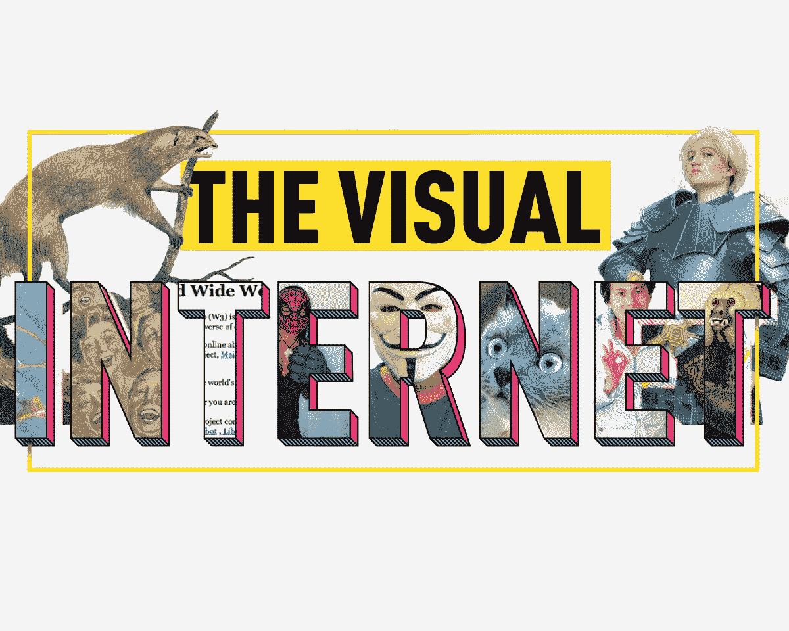
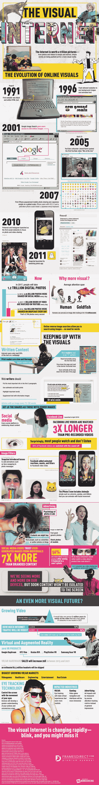

# 视觉互联网是如何发展的

> 原文：<https://medium.com/hackernoon/how-the-visual-internet-has-evolved-cee7e82f1eba>

互联网秒那个动作，“眼睛”有！视觉互联网价值一万亿(！！)图片，从照片、视频，到表情符号、模因。图片是强制性的，“几句话足以说明真相。”[-引自罗伯特·萨拉]

但是谁说网络说的是真话呢？关于互联网的事情是，它告诉一切，对或错，好或坏；并非一切都是精心策划的。有人说互联网已经演变成一个图文并茂的“选择自己的冒险”故事。比较

互联网是用现代象形语言写的，都是挂出来的。有些东西是看不见的，不管你多么希望它是看不见的。也有真正的美，令人心酸，令人难忘。

图片(几乎不能)抓住我们的人性，所以也许这就是为什么我们在对机器人的愤怒中，如此强烈地与完全自动化的公共图灵测试进行斗争，以区分计算机和人类。如果你不知道自己是否真的是人类，或者……你是否在不知情的情况下被一台电脑、外星人或可能的神秘力量秘密取代，互联网可以帮助你。用这个问题在网上搜索，“我有多像人？”祝你好运！

这张信息图预测了一个更加[视觉化的未来](https://www.framesdirect.com/landing/a/the-visual-internet.html)，不断增长的视频、虚拟和增强现实，以及随之而来的新市场和商品化。

