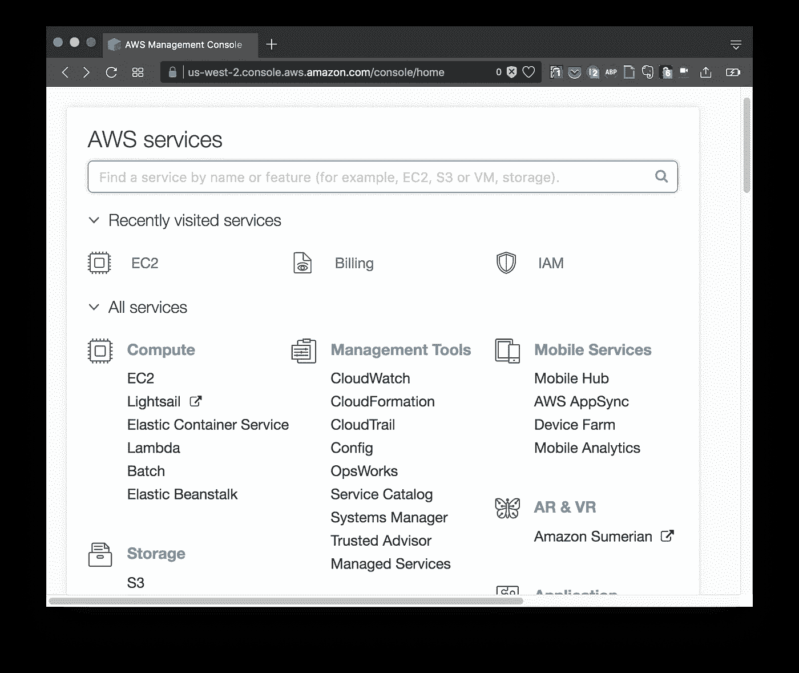
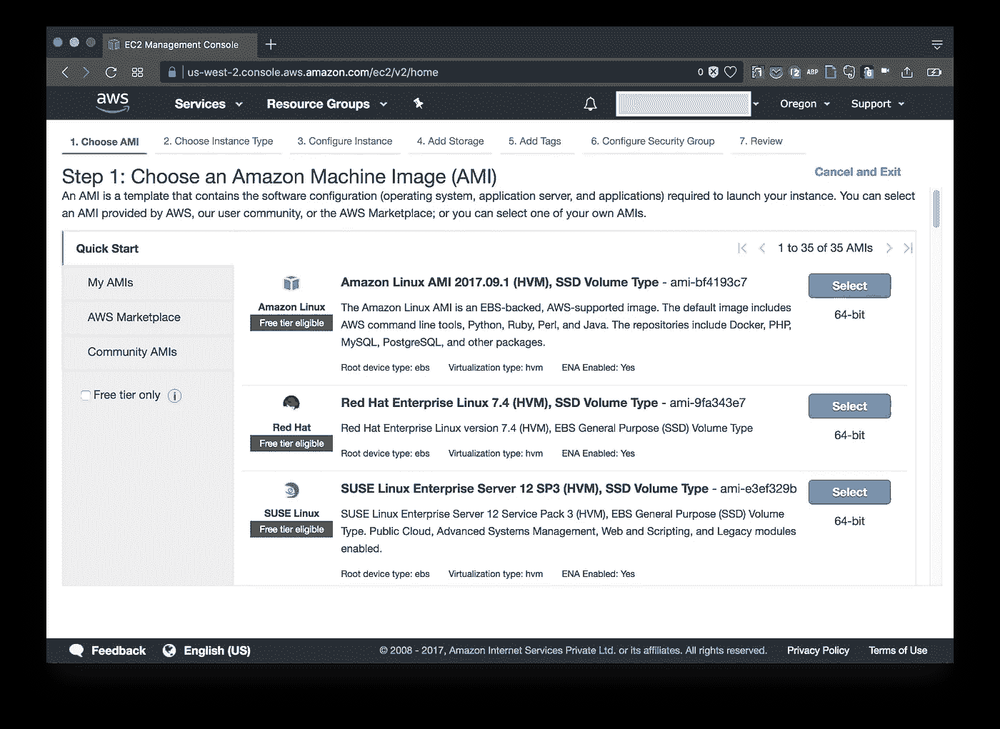
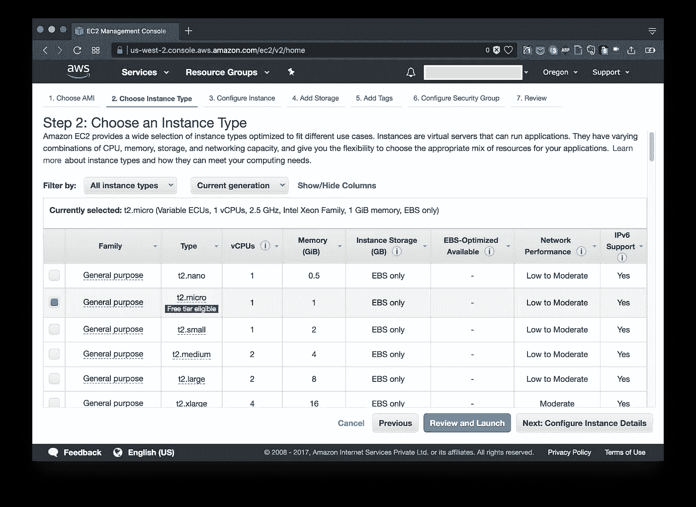
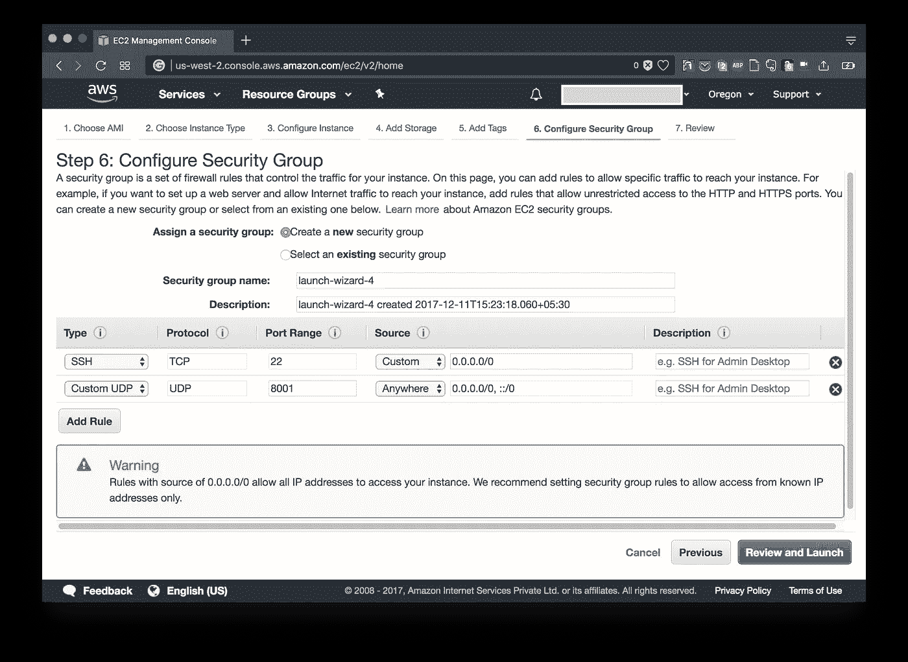
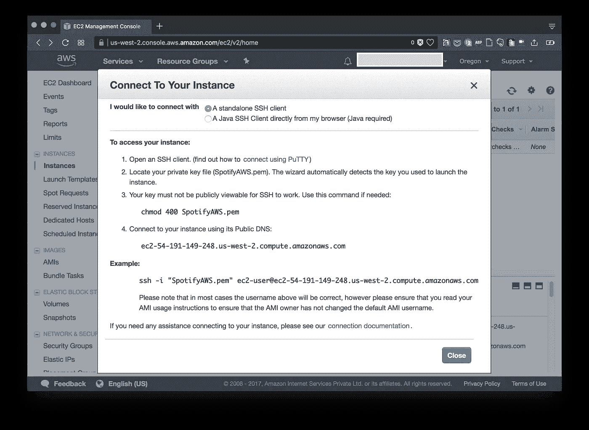
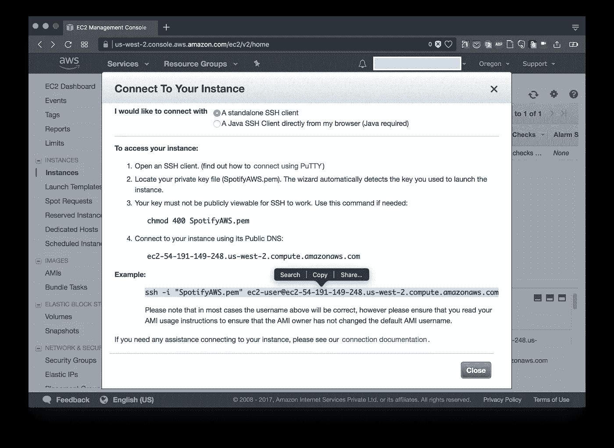
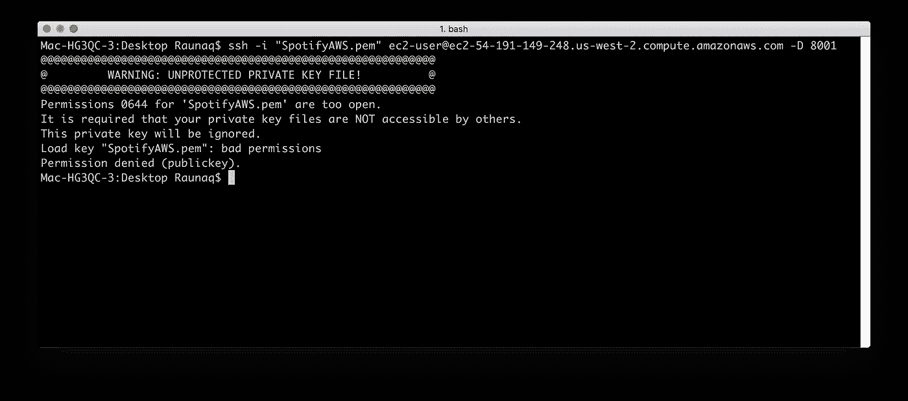
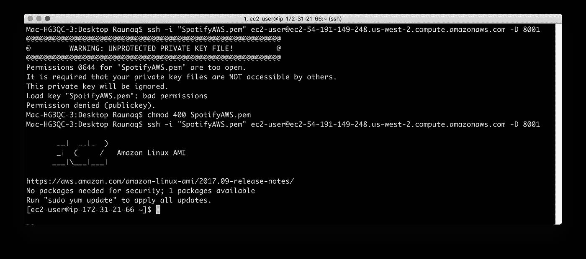
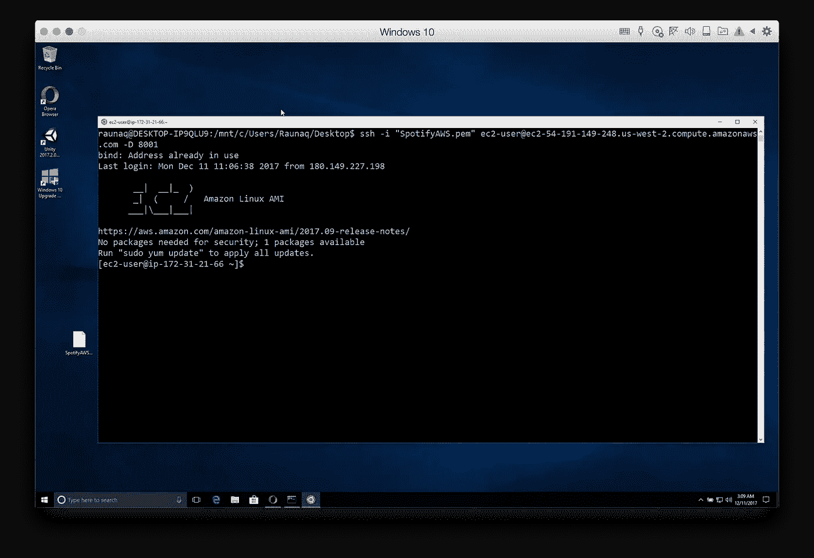
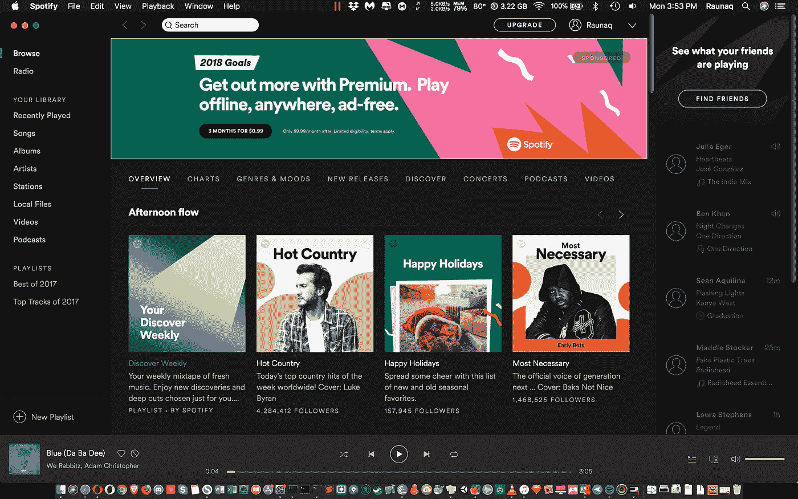

# 如何在没有第三方 VPN 的情况下访问 Spotify

> 原文：<https://medium.com/hackernoon/how-to-access-spotify-without-3rd-party-vpns-db95ce708a30>

如果你偶然发现了这个指南，而不是在谷歌搜索中排名靠前的类似指南，那么，我想你会发现你的时间是值得的。

如果你像我一样，大部分时间会在你的电脑上使用 Spotify，不想每两周左右就登录一次，这个指南可能会帮你做到。

我住在印度，已经有一些很棒的音乐流媒体应用程序可用，如 Saavn、Gaana、Google Play Music、Apple Music 等。但我是 Spotify 的长期用户(也就是说，在两周之后他们开始禁止我的账户之前)，音乐收藏、播放列表管理以及平台上可用的惊人内容的绝对数量让我一次又一次地回来。所以，在网上跌跌撞撞地寻找我的问题的一站式解决方案后，我决定做一些研究，写一份我自己的。

首先，我想说的是，在受限制的国家，你确实需要**一个 [VPN](https://hackernoon.com/tagged/vpn) 来使用 Spotify，不管它是一直开着的，还是在登录期间(15-20 天后你会被注销，有时会永久封禁你的账户)。**

我并不是说其他 VPN 不好或什么的，我的许多朋友要么一直使用一个固定的 VPN，要么只是每次注销后重新登录。然而，这些方法我都没有得到无缝的体验。我尝试过的所有 VPN(比如在单独的浏览器标签中运行，甚至是系统范围的 VPN)都给我带来了这样或那样的问题，破坏了我的体验。

您需要什么:

1.  AWS 帐户(免费层也可以)
2.  ssh 客户端(你可以使用 Ubuntu Bash for Windows)

让我们开始吧。

**设置 AWS EC2**

1.  登录到 AWS 控制台，选择 **EC2** 并启动一个新实例

2.选择**亚马逊 Linux AMI**

3.选择 **t2.micro** 并点击“下一步:配置实例详细信息”

4.单击“下一步:添加存储”->“下一步:添加标记”->“下一步:配置安全组”

5.点击'**添加规则**，选择'**自定义 UDP 规则**'。然后，在规则源类型中，选择' **Anywhere** '并将' **Port Range** 设置为 8001。您的设置应该如下所示。

6.点击“查看并启动”->“启动”。你会看到这样的菜单。

7.从第一个下拉框中选择“创建新的密钥对”。设置“密钥对名称”:“SpotifyAWS”(您可以随意命名)，然后单击“下载密钥对”。您将下载一个“ **SpotifyAWS.pem** ”文件。

8.点击**启动**。当您返回 EC2 仪表板时，您将拥有一个正在运行的实例。

9.选择该实例，点击“**连接**”。您将看到一个弹出窗口，指示如何连接到您的实例。

**通过 Bash** 连接到你的实例

1.打开 bash，并转到包含。我们刚刚下载的 pem 文件。在我的情况下，我把它放在我的桌面上。

2.从我们打开的 AWS 窗口中复制'**示例'**命令。

3.将命令粘贴到 bash 中，并添加到“ **-D 8001** ”中，这样您就有了一个类似这样的最终命令。当你按回车键时，输入' **yes** ，你可能会得到这样一个错误。

4.只需运行命令" **chmod 400 < path/to/your/。pem/file >** ”，在我的例子中是“chmod 400 SpotifyAWS.pem”

5.再次运行“connect”命令，您应该能够登录到您的 EC2 实例。

在 Windows 10 上的 Ubuntu Bash 上工作类似

**更改 Spotify 设置**

1.  打开 Spotify 应用程序，点击设置。
2.  设置代理主机:“127.0.0.1”，端口:“8001”和代理类型:“Socks4”
3.  单击“更新代理”

最后一步是简单地使用任何浏览器 VPN，如 HolaVPN 或 Zenmate，并创建一个新的 Spotify 帐户(或者你也可以尝试使用旧帐户登录)，你就完成了！

享受 Spotify 的无障碍访问！

*感谢阅读。如果你在安装过程中遇到任何问题，或者你希望我写更多这样的指南，请告诉我。此外，本文仅用于教育目的。我无意对 Spotify 或 AWS 造成任何伤害。再见:)*