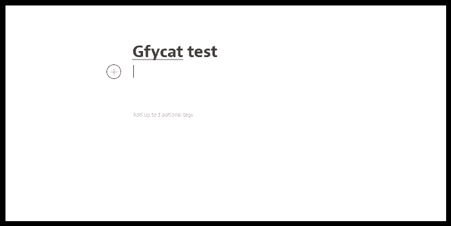
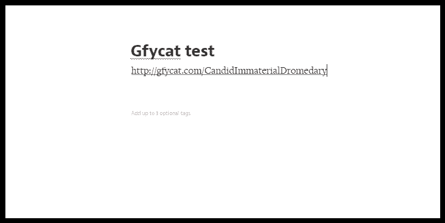
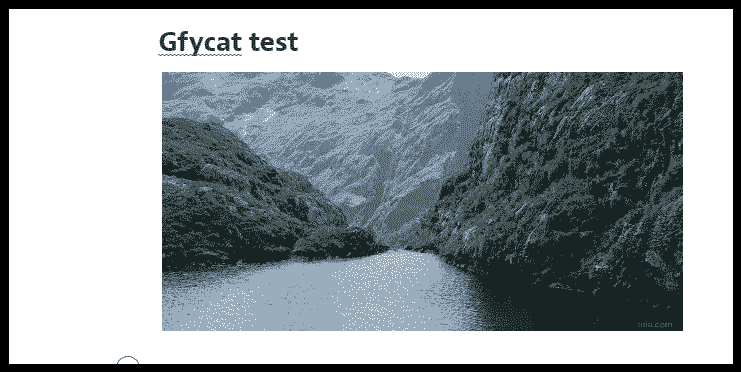

# 如何将 Gfycat 添加到 Medium

> 原文：<https://medium.com/hackernoon/how-to-add-a-gfycat-to-medium-4789aee2613d>

我发现将 gfycat 添加到 Medium(我们正在研究的东西)并不是非常容易或直观的，但同时我确实发现了一种方法，你可以完成我相信大多数人正在寻找的东西。

以下是如何将 gfycat 添加到 Medium，使它看起来像是嵌入在您的帖子中。

第一步:创建你的草稿，放上你想要的任何文本。

**第二步:**添加你要添加的 gfycat 的网址。请注意，它应该完全如下所示，替换掉 gfycat 名称。意思是确保网址是 http://gfycat.com/<ThisIsYourGfycatName>

第三步:魔法。

我希望这有所帮助，并且是人们正在寻找的！

> [黑客中午](http://bit.ly/Hackernoon)是黑客如何开始他们的下午。我们是 [@AMI](http://bit.ly/atAMIatAMI) 家庭的一员。我们现在[接受投稿](http://bit.ly/hackernoonsubmission)并乐意[讨论广告&赞助](mailto:partners@amipublications.com)机会。
> 
> 如果你喜欢这个故事，我们推荐你阅读我们的[最新科技故事](http://bit.ly/hackernoonlatestt)和[趋势科技故事](https://hackernoon.com/trending)。直到下一次，不要把世界的现实想当然！

