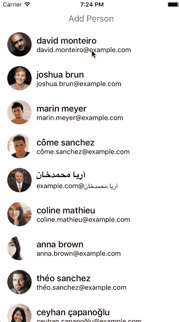

# 如何激活 React 本机平面列表的项目

> 原文：<https://medium.com/hackernoon/how-to-animate-the-items-of-a-react-native-flatlist-32c8cbf7ea3d>

最近有人问我关于 React 原生列表中的动画项目——特别是添加和删除项目时的动画。这就是我们今天要讲的内容！为此，我们将使用`FlatList`组件和`Animated`库。

GitHub 上有完整的源代码[。列表行的起点在`ListRow-start.js`中，完成的代码可以在`ListRow-finished.js`中看到。](https://github.com/spencercarli/animated-react-native-flatlist-demo)

## 出发点

现在，当按下“Add Person”按钮时，我们向[随机用户 API](https://randomuser.me/) 请求获取一个用户。然后我们将它添加到组件状态的`people`数组中。看看下面的视频，看看我们从哪里开始。

Want more React Native videos? Be sure to subscribe!

## 动画条目

为了方便演示我们的动画，我们将为列表项的插入制作动画。当一个新的项目被添加到`people`数组时，我们将改变行的不透明度，并通过变换改变缩放和旋转。

值得注意的是，在`TouchableOpacity`中我们使用了一个`Animated.View`，它允许我们使用动画值来修改组件。

首先，我们将创建一个新的动画值，当组件挂载时，我们将使用`Animated.timing`将该值从 0 更改为 1。

然后我们需要从这些值驱动我们的 UI。在`render`函数中，我们使用动画值来调整不透明度和比例(直接调整，因为 0 到 1 是我们想要的)和旋转。我们插入了`rotate`属性，这样我们就可以将 0 到 1 转换成对该属性有用的数据。

这留给我们这样的东西(改变`ANIMATION_DURATION`变量来减慢或加快动画)。

## 动画移除

如果你看一下启动代码，你可以看到我们的组件上有一个函数叫做`onRemove`，它调用`this.props.onRemove()`。没用吧？不会太久的！我们现在要做的是撤销我们在`componentDidMount`中所做的一切。我们不能在`componentWillUnmout`中这样做，因为组件将在任何动画运行之前消失！

如果您测试一下，您会发现它实际上并没有做任何事情——行只是像以前一样消失了。

如果你注释掉`onRemove`函数，你可以看到动画正在发生。

我们能做的就是在动画完成时调用`onRemove`函数。`.start()`函数接受一个回调函数，这个函数将在动画完成时被调用。

更好！不过还是不太好，如果你移除了两个项目之间的一个项目，那么一旦该行被移除，下一行就会跳到新的位置。这没有我们想要的那么顺利。

我们将再次使用插值来调整行高。这样，当元素动画出来(淡入淡出、缩放、旋转)时，它下面的行将开始移动到位。这样，当该元素实际上从阵列中移除时，不会有用户可感知的跳跃。

嘣！我们现在为每一行项目添加或删除时留下一些微妙而巧妙的动画。查看下面的视频，观看最终产品的演示。玩一下`ANIMATION_DURATION`，这样你就能完全看清发生了什么。

> 你喜欢这个教程吗？我有一门[免费课程，向你展示如何用 React Native](http://learn.handlebarlabs.com/p/react-native-basics-build-a-currency-converter) 构建一个应用。涵盖了组件设计，Redux，Redux Saga，还有更多动画！

Want more React Native videos? Be sure to subscribe!

*疑问？让我知道！*

> [黑客中午](http://bit.ly/Hackernoon)是黑客如何开始他们的下午。我们是 [@AMI](http://bit.ly/atAMIatAMI) 家庭的一员。我们现在[接受投稿](http://bit.ly/hackernoonsubmission)并乐意[讨论广告&赞助](mailto:partners@amipublications.com)机会。
> 
> 如果你喜欢这个故事，我们推荐你阅读我们的[最新科技故事](http://bit.ly/hackernoonlatestt)和[趋势科技故事](https://hackernoon.com/trending)。直到下一次，不要把世界的现实想当然！

