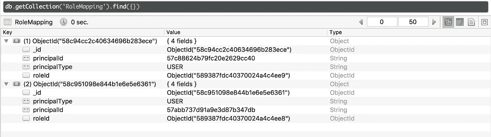

# 如何将 ACL 应用于环回应用程序

> 原文：<https://medium.com/hackernoon/how-to-apply-acls-to-loopback-application-1871fb51cc21>

无需提及每个人在应用程序开发中采用 Node.js 的速度有多快，而且这种情况仍在继续。

根据 stack overflow . com 2016 年的调查， [Javascript](https://hackernoon.com/tagged/javascript) 是与 Node 并列的最具趋势的技术。JS 也越来越受欢迎。


此外，我们可以在以下网站 https://siftery.com/[nodejs](https://hackernoon.com/tagged/nodejs)的统计数据中看到有多少客户在生产中使用 Node.js。有很多巨头在他们的应用程序中使用 Node.js，其中一些是:


好奇他们用 Node.js 覆盖了哪些部分？这里有一个关于 LinkedIn 如何在他们的应用程序中使用 Node.js 的例子:

[](http://venturebeat.com/2011/08/16/linkedin-node/) [## 独家报道:LinkedIn 如何使用 Node.js 和 HTML5 构建更好、更快的应用

### 今天早上，LinkedIn 发布了其华丽的移动应用程序。我们已经向您介绍了所有新功能…

venturebeat.com](http://venturebeat.com/2011/08/16/linkedin-node/) 

虽然你会用 Node.js 开发很多包/工具，比如哈比神/Koa/Koa2/Express，但还有 [Loopback](https://github.com/strongloop/loopback) ，它因其多样性和惊人的特性而越来越受欢迎。

关于 Loopback 的一点信息是它是由 IBM 公司 [Strongloop](https://github.com/strongloop) 的人创建的。它允许您立即创建强大灵活的 API 和模型。更不用说它有很棒的东西可以使用，即可用的[连接器](https://github.com/strongloop/loopback#connectors)和[组件](https://github.com/strongloop/loopback#components)。

也就是说，现在让我们跳到 ACL。

# 美国学术团体委员会

> LoopBack 使用访问控制列表(ACL)来控制谁可以访问哪些数据。

使用 ACL，您可以限制对模型的数据访问，即您想要的 api 方法。其工作方式是 Loopback 使用两个集合， **Role** 和 **RoleMapping。**您也可以创建自定义角色，但有些角色是 loopback 自己提供的。即$everyone，$authenticated，$unauthenticated 等。

假设您有一个客户支持应用程序，它有以下模型:

1.  AppUser(从用户扩展)
2.  种类

我们将创建一些自定义角色(在 boot/script.js 中):

```
// Assuming...
// employeeUsers[] contains the employees
// adminUsers[] contains the adminsRole.create({
      name: 'admin'
    }, **function**(err, role) {
      **if** (err) cb(err);

      adminUsers.forEach(function(admin){
          *//make bob an admin*
          role.principals.create({
            principalType: RoleMapping.USER,
            principalId: admin.id
          }, **function**(err, principal) {
              cb(err);
          });
      }); 
    });
Role.create({
      name: 'employee'
    }, **function**(err, role) {
      **if** (err) cb(err);

      employeeUsers.forEach(function(employee){
          *//make bob an admin*
          role.principals.create({
            principalType: RoleMapping.USER,
            principalId: employee.id
          }, **function**(err, principal) {
              cb(err);
          });
      });
    });
```

假设我们有以下 API:

1.  获取类别=获取/API/类别
2.  按 id 获取类别= GET /api/categories/:cat_id
3.  创建类别=帖子/API/类别

我们希望只有管理员可以访问“获取类别”调用，经过身份验证的用户(员工)应该访问“通过 id 获取类别”调用，但员工不应被允许**创建**类别。所以这是我们要做的。我们将使用环回的生成器来创建一个 ACL。

首先，拒绝所有人访问类别 api

```
$ lb acl? Select the model to apply the ACL entry to: Category
? Select the ACL scope: All methods and properties
? Select the access type: All (match all types)
? Select the role: All users
? Select the permission to apply: Explicitly deny access
```

接下来，我们将允许管理员访问所有的类别 api。

```
$ lb acl

? Select the model to apply the ACL entry to: Category
? Select the ACL scope: All methods and properties
? Select the role: other
? Enter the role name : admin
? Select the permission to apply: Explicitly grant access
```

接下来，我们将只允许员工通过 id 呼叫访问该类别。

```
$ lb acl? Select the model to apply the ACL entry to: Category
? Select the ACL scope: A single method
? Enter the method name: findById
? Select the role: other
? Enter the role name : employee
? Select the permission to apply: Explicitly grant access
```

执行上述命令后，category.json 中的 ACL 应该如下所示:

```
"acls": [
  {
    "accessType": "*",
    "principalType": "ROLE",
    "principalId": "$everyone",
    "permission": "DENY"
  },
  {
    "accessType": "*",
    "principalType": "ROLE",
    "principalId": "admin",
    "permission": "ALLOW"
  },  {
    "accessType": "EXECUTE",
    "principalType": "ROLE",
    "principalId": "employee",
    "permission": "ALLOW",
    "property": "findById"
  }
],
```

# 结论

关于 ACLs 实施的要点总结如下:

1.  在 RoleMappings 下映射用户和角色(下图)
2.  根据要求在模型中设置 ACL



RoleMappings containing principalId as userId, principleType as `RoleMapping.USER ('User')`

loopback 让您处理 ACL 的方式非常巧妙。当我掌握了它的窍门时，我个人很喜欢它。

[](http://bit.ly/HackernoonFB)[](https://goo.gl/k7XYbx)[](https://goo.gl/4ofytp)

> [黑客中午](http://bit.ly/Hackernoon)是黑客如何开始他们的下午。我们是 [@AMI](http://bit.ly/atAMIatAMI) 家庭的一员。我们现在[接受投稿](http://bit.ly/hackernoonsubmission)并乐意[讨论广告&赞助](mailto:partners@amipublications.com)机会。
> 
> 如果你喜欢这个故事，我们推荐你阅读我们的[最新科技故事](http://bit.ly/hackernoonlatestt)和[趋势科技故事](https://hackernoon.com/trending)。直到下一次，不要把世界的现实想当然！

