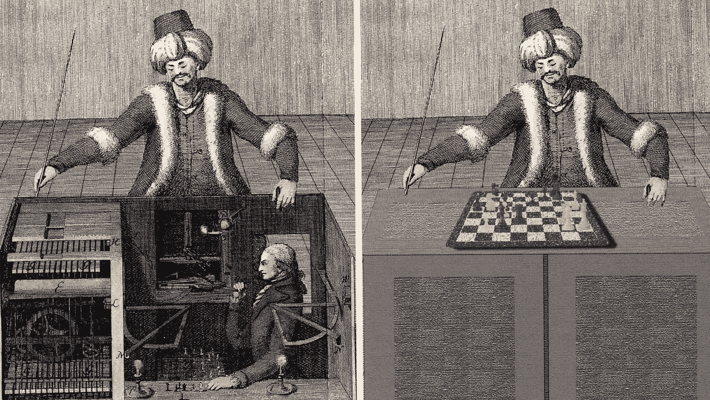
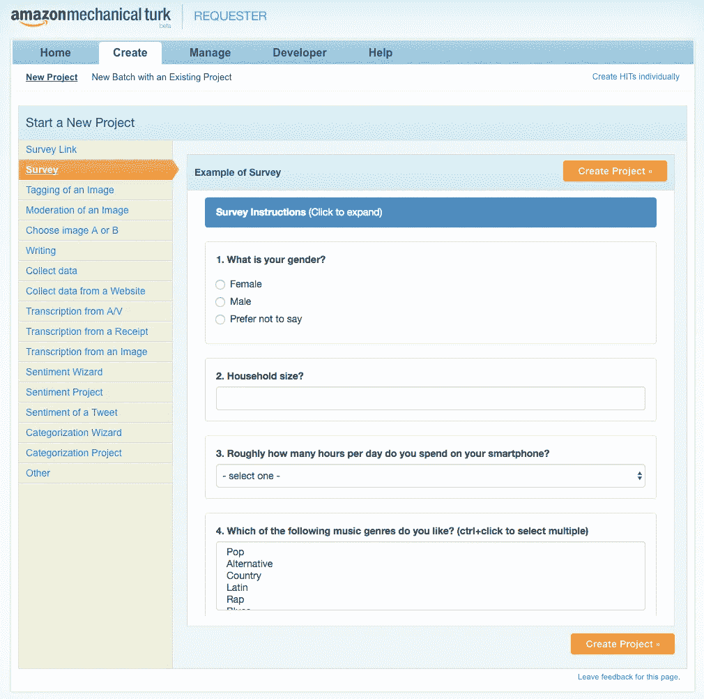
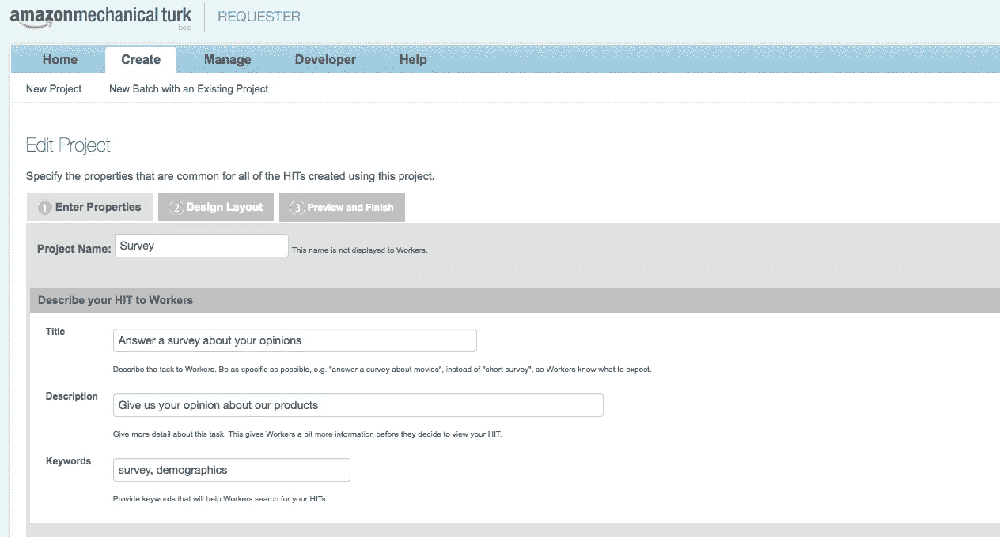
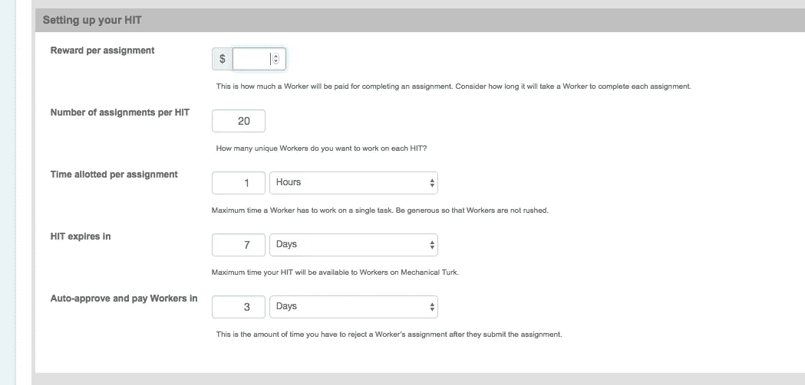
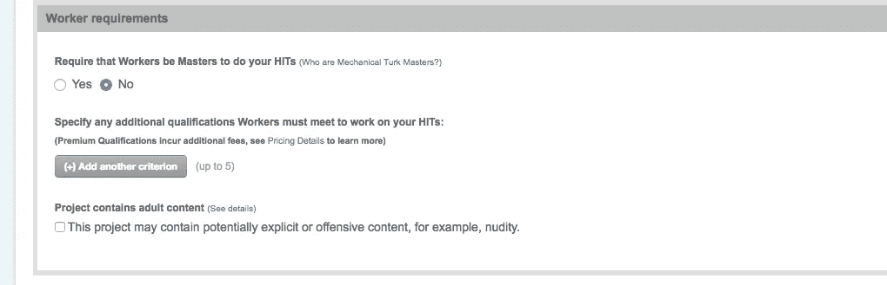
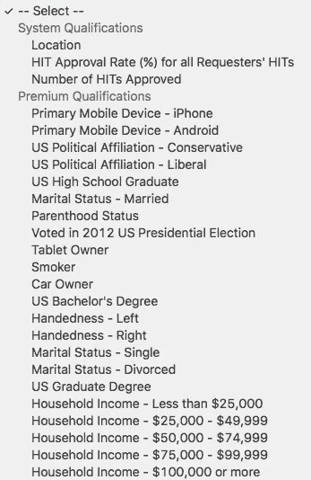
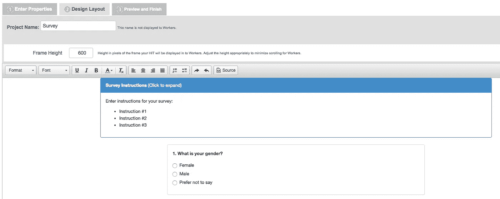
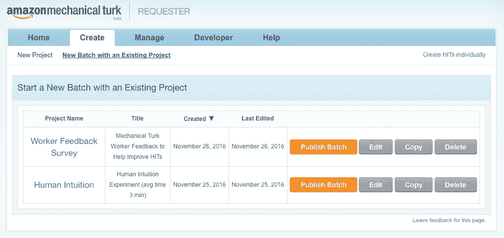
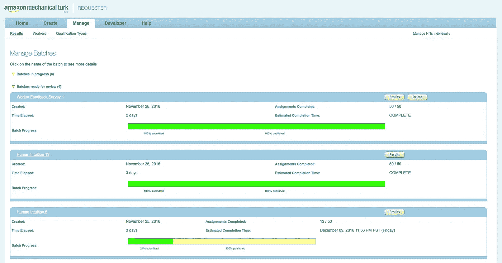
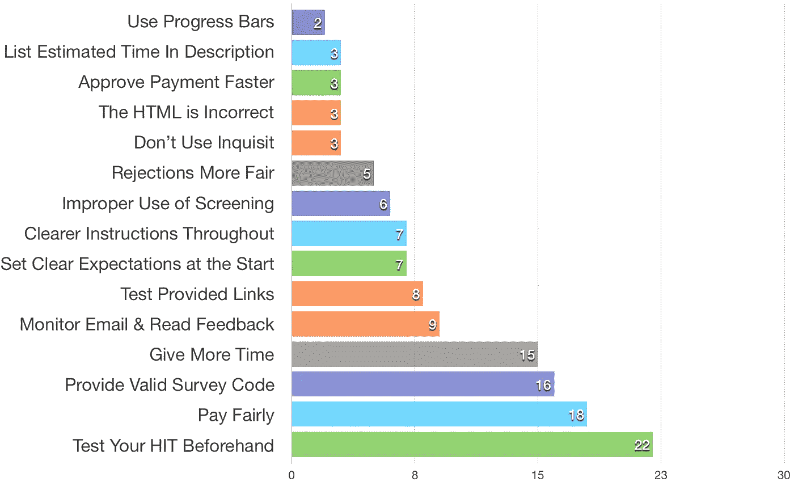

# 如何吸引“Turkers”成为终极机械土耳其人英雄！

> 原文：<https://medium.com/hackernoon/how-to-attract-turkers-and-be-the-ultimate-mechanical-turk-hero-75002da72c3d>

## 机械土耳其人介绍，机器学习的应用和无痛数据收集

## 文章涵盖的内容:

1.  解释“土耳其人”和[机械土耳其人](https://hackernoon.com/tagged/mechanical-turk)
2.  讨论机械土耳其人与[机器学习](https://hackernoon.com/tagged/machine-learning)的关系
3.  在机械土耳其人上设置您的第一个人类智能任务(HIT)进行数据收集！
4.  为您和接受您的人工智能任务(HITs)的员工减少问题

# “土耳其人”的起源与演变

[http://poe.olin.edu/poe2014/knights/subsystems.html](http://poe.olin.edu/poe2014/knights/subsystems.html)

“土耳其人”是一台被用来欺骗拿破仑·波拿巴和本杰明·富兰克林等人的机器，让他们以为自己被自动化的棋手打败了。

事实上，机器内部隐藏着一位人类象棋大师。非常鬼祟！

亚马逊利用这个历史上的“机器”来命名他们的一项服务，名为**机械土耳其人**。该服务允许“请求者”创建和管理将由人工完成的在线人工智能任务(HITs)。

因为它是由 Amazon 管理的，所以使用现有的 Amazon 帐户创建、部署和补偿工作人员非常方便，比组织和部署自己的实验或调查花费的钱要少得多。

# 机械土耳其人和机器学习

我正在撰写一篇即将发表的文章，试图将人类直觉与人工神经网络进行比较。我需要真人来参加我的在线直觉测试，以便将人类的表现与人工神经网络进行比较。

( [**关注我推特**](https://twitter.com/JohnDavidFive) 求结果！)

幸运的是，我刚刚听完“T12 ”,一切都显而易见。*一旦你知道了答案由[邓肯·瓦兹](https://medium.com/u/8222b01bc466?source=post_page-----75002da72c3d--------------------------------)。

在这本书里， [Duncan Watts](https://medium.com/u/8222b01bc466?source=post_page-----75002da72c3d--------------------------------) 谈到在他的一些研究中使用 Mechanical Turk，所以我决定在我的项目中试用它。(他对围绕机械土耳其人的支付和其他好处做出了不少有见地的结论，所以一定要看看他的书)。

在我做了一些研究后，我意识到使用机械土耳其人将是一种收集我需要的人类数据的有效方法(**显然是**)！我还了解到，Mechanical Turk 中的许多功能实际上都是为机器学习收集数据。分类问题、转录和情感分析只是 Mechanical Turk 可以用来收集机器学习数据的几种方式。

我发现 Mechanical Turk 非常有用，但是遇到了一些现有或未来的“请求者”应该知道的问题。

此外，我还对实际员工进行了一次跟踪调查，了解他们对“请求者”应该避免的一些新手错误的反馈。

所以让我们来看看机械土耳其人吧！

# 如何让你的土耳其人…

“Turkin”非常简单，尤其是如果你已经在亚马逊开设了账户的话。

1.  导航到:【https://www.mturk.com/mturk/welcome 
2.  按照指示，要么作为一名“工人”赚钱，要么作为工人的“请求者”创建自己的人工智能任务(HIT)

当然这中间有很多细节，但是当你浏览的时候，网站本身提供了很多有用的信息。本文的剩余部分旨在帮助“请求者”填补空白，帮助他们避免经常被忽视的常见陷阱。

# 创造你的第一击(人工智能任务)

如何组织你的打击有很多选择。下面的截图突出显示了一些您可以开始使用的模板:

Mechanical Turk Survey

如上所示，您可以使用各种输入类型创建简单的调查。还有一些常见任务的设置，具有一些额外的配置和功能，如“从 A/V 转录”和“分类向导”。

请注意，设置过程会影响你点击的结果，所以除了这篇文章，一定要查看[莉迪亚·奇尔顿](https://medium.com/u/29e358e3ce30?source=post_page-----75002da72c3d--------------------------------)的作品，以获得关于有效点击的更多细节。

一旦你选择了一个特定的类型，是时候配置一些细节了，这样工人们就知道会发生什么了:

Give your Mechanical Turk HIT a name and description

一旦你给了它一个名字和一个漂亮的描述，现在是时候决定一些重要的细节，关于分配你的任务给工人和你将支付多少钱:

Setup the numbers for distribution of your Mechanical Turk Task

这一步很重要。他们提供的说明在这里很有帮助，所以请仔细阅读。请务必额外注意您最终将获得的估计总成本！

此外，请注意，一旦您的 HIT 启动并运行，可以单独批准每个“员工”，但也有一个“自动批准”窗口，将在特定天数内批准每个人。

HIT 初始设置的最后一部分是确定应该允许哪种类型的工人执行您的任务。

“土耳其大师”选项允许你指定你只希望工人有“大师资格”做你的打击。亚马逊表示，在各种点击中表现出色的员工将被授予大师资格。

Determine which Mechanical Turk Workers will do your HIT

Additional Qualifications for Turk Workers

您还可以添加多达 5 个附加资格，这些资格也将根据某些标准筛选可用的员工。有不少，这里展示了一些。

在你弄清楚你希望你的员工是谁之后，是时候为你的成功设计布局了。

你的布局当然会因类型而异，但是你将有机会在他们的 WYSIWYG 编辑器中做一些操作来定制指令和表单域。警告:工作人员的一个常见问题和抱怨是，收集数据的标记不正确，因此数据没有正确提交。这就是在编辑器中单击“SOURCE”有助于确保表单元素有唯一的名称来收集数据的地方。

Click “Source” to view the markup underneath

jQuery 和 Twitter Bootstrap 是注入的，可以使用，所以如果你有一些 web 开发经验，你可以去坚果。如果你不太擅长用 HTML 开发表单，那么一定要请人来检查你的工作。

一旦你的布局完成，你有机会在完成前预览你的作品。你可以随时回来编辑这个命中，你将有机会这样做之前，你部署它。

# 发布你的新作品

既然您的 HIT 已经创建并保存，您就可以将它部署给员工并开始管理它。只需在“创建”选项卡中找到您现有的项目，然后单击“发布批处理”

您将经历几个快速步骤，并被要求再次验证您的 Amazon 帐户以进行支付。

现在是时候实时观看工人完成打击了！

Monitor Progress, Results, and Approve Payment in Real Time!

请务必留意与您的帐户关联的电子邮件。遇到问题的员工通常会发送一封简短的电子邮件。

您还可以查看收到的结果，并在此时手工批准员工的付款。

# 土耳其人抓住了

在我最初的几次部署中，一些考虑周到的员工发邮件告诉我**我没有为任务**设置足够长的时间窗口，他们无法完成任务，因此无法获得报酬！

我不得不取消我的部署并调整时间窗口…两次！

因此，第一条建议是，确保所有员工(不仅仅是普通员工)都有足够的时间来完成你的任务，正如一位员工提到的，你还不如挤出一点时间去上个厕所:-)

我想知道还有哪些我没有遇到的问题，以避免工人们将来遇到令人沮丧的情况。

我为 50 名员工准备了一些简单的问题，看看他们遇到了哪些常见的问题。

以下是对 50 名土耳其机械工人的调查结果:

> **问题 1:** 估计你所做的命中中有某种缺陷的百分比

平均来说，工作人员估计 **15.3%** 的点击有某种类型的缺陷

> **问题 2:** 请列出你对未来热门歌曲创作者的建议，帮助他们做出好的热门歌曲，避免常见错误

我收到了来自 50 名员工的 130 多条评论，他们都很有想法，也很诚实。有些评论是专门针对“调查”类任务的，而其他评论则适用于任何类型的 HIT。我将它们按类别分组如下:

Worker Comments Categorized With Frequencies

## 避开障碍物

根据反馈，最大的问题似乎是当东西普遍损坏，工人最终无法完成打击和获得报酬。

**遵循以下指南避开障碍物:**

*   在沙盒中部署之前测试 HIT，然后再测试一次！
*   确保你提供的任何链接工作。这意味着跨不同的浏览器，你提供的链接可以处理大量的工作负载！
*   确保在实际工作结束时提供了调查代码。
*   请验证 HTML 是正确的，并且您可以提交正确的数据。
*   通过让其他人测试或做一个小的试运行，并透露这是一个试运行，并支付良好的指示是明确的。:-)
*   哦，还有测试，测试，测试避开障碍物！

## 避免挫折

一些报告的问题不是障碍，而是导致混乱、沮丧或低效的情况。

**遵循以下指南，避免令人沮丧的情况:**

*   在标题或描述中提供完成所需的估计时间
*   将实际时间限制设置得大一些，以确保每个人都能完成。就像更多的时间！
*   公平支付并快速批准付款。工人们会注意到你付了多少钱，这会影响质量
*   诚实、透明，从一开始就设定明确的期望。
*   确保说明简洁明了，并提供例子。
*   经常检查你的邮件，回复员工的反馈。
*   如果您不希望相同的工作人员在以后重复该点击，请使用“排除”限定条件(这样可以避免工作人员浪费时间寻找有效的点击)。
*   筛选应该是预先和明确的，以避免浪费工人的时间。
*   检查[mturkcrowd.com](http://mturkcrowd.com)查看并请求对 HIT 提案的反馈。
*   您还可以[查看由“工作人员”和“请求者”社区生成的这些指南](http://wiki.wearedynamo.org/index.php/Guidelines_for_Academic_Requesters)。
*   更多信息可以在这个充满活力的 reddit 社区中找到。

我不会评论“公平薪酬”应该是什么，但是，我会提到，就像最初的“土耳其人”一样，有一个真实的人藏在机器后面(可能试图支付研究生院)，所以请记住“黄金法则”。:-)

# 保持冷静，继续前进！

我希望这能帮助你更多地了解土耳其机械人，并启发你考虑使用这个非常有价值的工具！

***喜欢这条*** ？单击💚下面和后续的未来职位。

> [黑客中午](http://bit.ly/Hackernoon)是黑客如何开始他们的下午。我们是 [@AMI](http://bit.ly/atAMIatAMI) 家庭的一员。我们现在[接受投稿](http://bit.ly/hackernoonsubmission)并乐意[讨论广告&赞助](mailto:partners@amipublications.com)机会。
> 
> 如果你喜欢这个故事，我们推荐你阅读我们的[最新科技故事](http://bit.ly/hackernoonlatestt)和[趋势科技故事](https://hackernoon.com/trending)。直到下一次，不要把世界的现实想当然！

