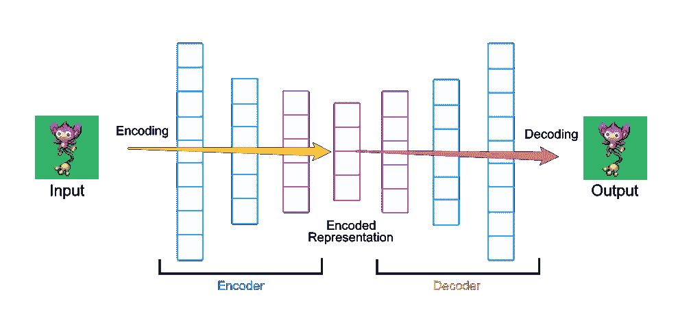
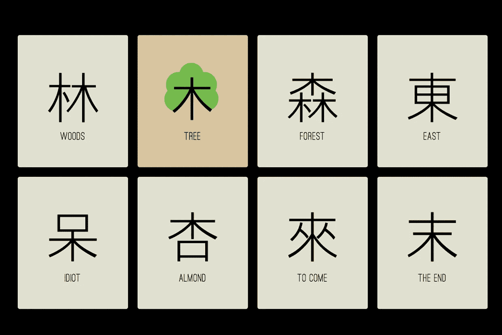
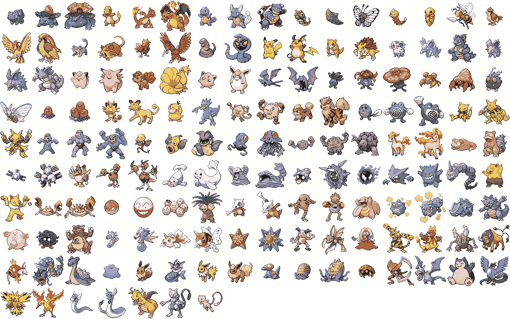
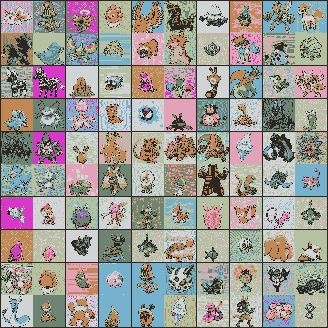
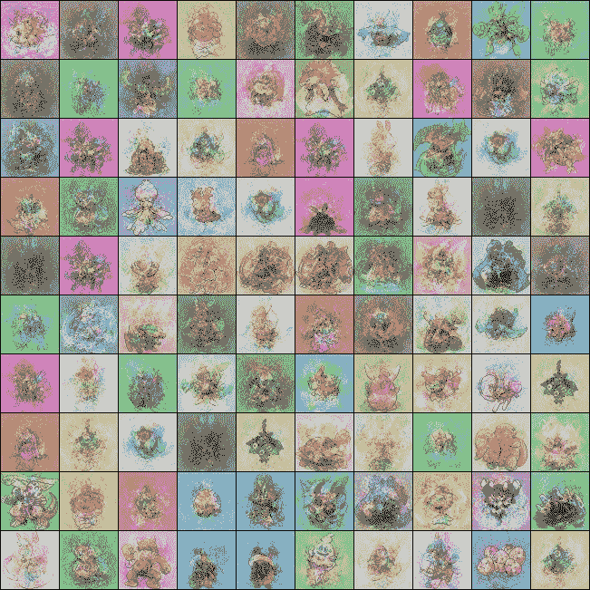
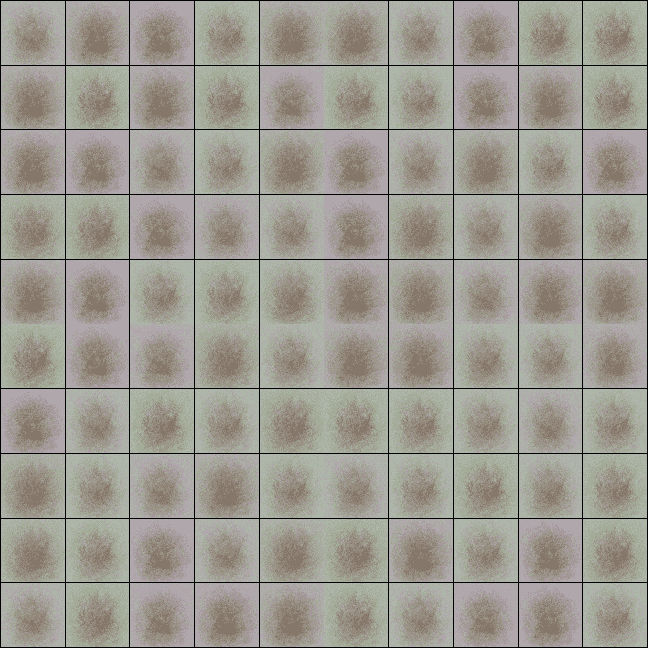

# 如何自动编码你的神奇宝贝

> 原文：<https://medium.com/hackernoon/how-to-autoencode-your-pok%C3%A9mon-6b0f5c7b7d97>

本周，我在深度学习方面的冒险向我介绍了自动编码器的概念。而且在我的[口袋妖怪](https://hackernoon.com/tagged/pokemon)的帮助下，你也可以了解一下！

# 新手用自动编码器

自动编码器是一种特殊类型的神经网络，它接受一些东西，并学习用降低的维度来表示它。

把它想象成[学习](https://hackernoon.com/tagged/learning)画一个圆来代表一个球体。你知道它实际上是一个球体，但是你决定在你的物理笔记本上用一个圆来表示它，而不是把一个球体粘在纸上。当你有一天再次回到这一页时(希望如此)，你会看到这个圆，并把它当作一个球体。你能做到这一点是因为你已经下意识地学会了将一个三维的球体自动编码成一个二维的圆。

恭喜你，你是一个自动编码器！其实你知道你不局限于圈子。你可以做立方体。达芬奇可以画蒙娜丽莎。本质上，当我们写作时，我们会把我们的想法自动编码成二维文字。你明白了。

自动编码器由两部分组成:一个**编码器**，它学习将输入(X)转换为低维表示(Z)，一个**解码器**，它学习将低维表示转换回其原始尺寸(Y) **。**

如果你的编码器真的很好，你的输入和输出会完全一样。这将是一个完美的自动编码器。

然而在现实中，这很少实现。

# 那么我们为什么要自动编码呢？

一个明显的原因是为了压缩，对吗？你在降低维度，所以你可以传递更低维度的数据。但是想想看，你会意识到即使我们已经实现了压缩，我们仍然需要通过解码器让任何人能够理解我们首先编码了什么。

就像在伦敦用普通话传纸条一样。

If you decide to encode the word ‘tree’. Sure, you reduced what would be 4 characters in English to a single character in Mandarin. But in order to understand what you mean, the other person would also need to know Mandarin. Now you begin to see that in order to faithfully pass around 木 (mù) or its cousins, with any hope of Londoners understanding it, you also need to send a copy of a Mandarin handbook for English speakers.

显然，这并不像你想象的那样有效。好吧，如果不是为了压缩，我们还用它做什么？

我们提到过，自动编码器并不完美，它们的解码器通常不会产生精确的编码输出。如果我们用它来产生类似于的*输出作为输入呢？*

这意味着我们可以用它来生成更多类似于输入的东西。比如从一堆花的图像中产生更多的花的图像。

变分自动编码器(VAE)是一种特殊类型的自动编码器，专门设计来解决这个问题。VAE 可以为我们的编码引入变化，并生成像我们的输入一样的各种输出。

好了，是时候开始我们的口袋妖怪之旅了！

# 近距离观察我们的口袋妖怪

我们将要使用的口袋妖怪是任天堂 DS 风格的位图图像。你可以[在这里](https://www.pokecommunity.com/showthread.php?t=267728)抢一份。

每幅图像的分辨率为 64 像素 x 64 像素。我认为这将是从人人都喜欢玩的友好的 MNIST 数据集的一个很好的飞跃——而且，这次它将是彩色的，有所改变。

每个像素由三个 RGB 值描述。所以对于每幅图像都是用 64×64×3 的值来描述的。这给了我们总共 12288 个值。

此外，请注意，每个口袋妖怪都是独一无二的，从根本上不同。有很多变化。就看第一代口袋妖怪吧。

The first 150 Pokemon. And I can name them all!

哇哦。变化很大，对吧？

但是我们的数据集包含了五个这样的世代。不仅仅是他们的前视图，还有后视图。和两个不同的视图。每个口袋妖怪有 4 个镜头。那就是综艺！

Let me introduce you to Pichu, Pichu, Pichu, and Pichu.

好了，数据说够了。让我们自动编码。

# 我们的自动编码器的机制

我们的编码器首先获取所有 64 x 64 x 3 的图像，并展平它们，这样我们就有了 12288 个值的一维向量。然后逐步对向量进行下采样，直到我们获得所需的编码维度。本质上，这是一系列矩阵乘法运算。解码器执行相反的过程，并试图通过一系列类似的矩阵乘法运算从编码值重建原始图像。

编码器如何知道输入要乘以什么矩阵？这正是我们训练自动编码器的原因。一旦我们指定了编码器和解码器矩阵的尺寸，自动编码器就试图计算出矩阵的最佳值，以便它能最好地完成它的工作！

**淋浴想法**:如果一个口袋球*真的是*一个完美的自动编码器，它将口袋妖怪(减少它占用的空间和质量)编码成可以放在球内的东西，直到教练召唤并解码回来？:O

# 编码为 4 个值

我使用了一个编码器，将图像从 12288 下采样到 1024 到 64，最后到 4 个值。因此，我们的每个编码口袋妖怪将只由四个值来表示。全部 150 个甚至更多！是不是很牛逼？

好了，让我们来看看我们的输入:

太棒了。所以你可以在这里看到 100 个口袋妖怪的样本。正如我们所料，背景、拍摄角度和口袋妖怪的特征都有很大的变化。我对我的自动编码器进行了大约 250 个历元的训练，下面是解码器的结果:

Final decoder output for our input images

天哪，很不错，是吧？相当惊人的是，很多口袋妖怪看起来很体面，足以被识别。请记住，我们将所有内容向下采样到四个值。

为了可视化我们的自动编码器是如何训练的，我从每十个时期的输出快照构建了一个 gif。

Output from the decoder over the training epochs.

你可以看到，自动编码器学会了紧密匹配，直到大约第 150 个纪元(gif 的第 15 帧，如果你有好眼力；)，然后稳定下来。

但这太棒了！也许我应该试着用 VAE 创造新的口袋妖怪。

现在，我要去抓更多的！

**注:** *如果你喜欢这篇文章，并希望看到更多这样的内容，你所要做的就是按下底部的小心形按钮，我就会知道:)*

*这个项目使用的代码库建立在 Parag Mital 关于深度学习的创造性应用的优秀课程之上。你可以在这里* [*找到*](https://github.com/niazangels/vae-pokedex/) *的代码库。Siraj Raval 本周早些时候在 autoencoders 上发布了一个非常棒的视频，这是我撰写这篇文章的灵感来源。*

我们可以在地球的另一边互相学习，这不是很好吗？

> [黑客中午](http://bit.ly/Hackernoon)是黑客如何开始他们的下午。我们是阿妹家庭的一员。我们现在[接受投稿](http://bit.ly/hackernoonsubmission)并乐意[讨论广告&赞助](mailto:partners@amipublications.com)的机会。
> 
> 如果你喜欢这个故事，我们推荐你阅读我们的[最新科技故事](http://bit.ly/hackernoonlatestt)和[趋势科技故事](https://hackernoon.com/trending)。直到下一次，不要把世界的现实想当然！

