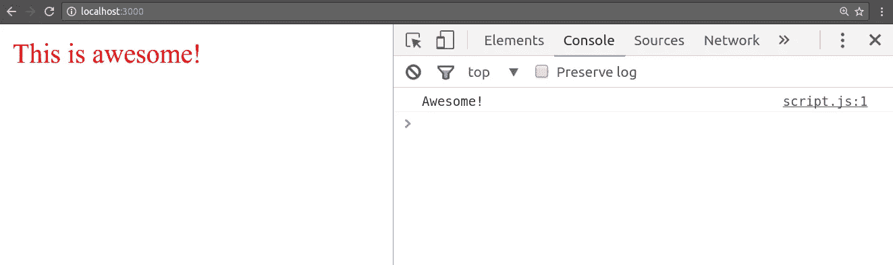

# 如何用 Gulp 实现所有事情的自动化

> 原文：<https://medium.com/hackernoon/how-to-automate-all-the-things-with-gulp-b21a3fc96885>


你曾经厌倦过频繁地按 F5 键吗？是的，我理解这种痛苦。这就是任务自动化的亮点。编写脚本来持续处理开发工作流中实际需要的耗时任务。不要在这里对我临阵退缩。这比听起来可怕多了。相信我。一旦你掌握了它的窍门，你就再也不想不用它来写代码了。

那么为什么要吞咽呢？因为你正在和你最好的伙伴，普通的老 JavaScript 一起写任务。没有比这更好的了。

[](http://gulpjs.com/) [## gulp.js

### 通过优先选择代码而不是配置、节点最佳实践和最小化 API 表面吞咽，事情变得简单起来，比如…

gulpjs.com](http://gulpjs.com/) 

## 炸毁死星。

一饮而尽。你需要的英雄，而且绝对值得拥有。关于 Gulp 的使用，有几个关键特征会让你想要使用它。我认为最重要的一点是它可以模拟服务器环境，你最终将在那里托管你的代码。这包括在您的项目目录中移动文件，更重要的是将它们放在您将运行 web 服务器的**开发目录**中。Gulp 还能让你**编译**、**缩小**和**连接**任何你想要的文件。所有这些都是为了将您的代码库的占用空间降到最低。在此过程中，为**运输到生产**做好准备。如果你不知道上面的任何一个术语，那也没关系，我们会在下面更详细地讨论它们。

## TLDR；

你只看这一本 TLDR 就能严重伤害我的感情；或者干脆牛逼一点，把整篇文章看完。玩得开心！

1.  三个主要的吞咽命令:`gulp.task`、`gulp.src`、`gulp.dest`。
2.  `pipe` ing 太牛逼了！`pipe()`方法内置在 Node.js 中，用于将文件从一个文件夹复制到另一个文件夹。
3.  有一个逻辑文件夹结构，有三个主要文件夹。 ***src*** 文件夹用于预处理文件， ***tmp*** 用于本地开发服务器，而 ***dist*** 用于处理和缩小的文件。
4.  为从 ***src*** 到 ***tmp*** 的 HTML、CSS 和 JavaScript 文件创建单独的任务。
5.  将 HTML、CSS 和 JavaScript 任务合并成一个主任务 ***【复制】*** 。这将让你用一个命令复制所有的文件。
6.  在所有文件被复制后，你想在你的主【index.html】*中自动引用它们。这是通过一个 ***【注入】*** 任务完成的，称为注入依赖项。*
7.  *当文件被复制和注入后，就该在 ***tmp*** 文件夹中运行开发服务器了。*
8.  *当服务器运行时，您可以 ***【观察】*** 变化，并在本地开发服务器上启用实时重新加载。*
9.  *对你的代码满意吗？继续操作***‘构建’***生产文件，并将它们放置在 ***dist*** 目录中。*
10.  *推送到 GitHub 前删除 ***tmp*** 和 ***dist*** 。(或者将它们添加到您的。gitignore)*
11.  *您将在本教程中编写的代码在 GitHub 上，并将在文章底部链接。抱歉，但是你必须滚动到底部。:)*

## *安装工具*

*首先，您需要在您的机器上安装 Node。要检查您是否知道，请打开命令提示符并键入`node -v`。您安装的节点的版本号将在命令行上显示为输出。如果没有，则您的计算机上没有安装节点。不要担心，前往 Node 的官方网站开始。*

*[](https://nodejs.org/en/download/) [## 下载| Node.js

### 下载 Node.js 源代码或适合您平台的预建安装程序，并立即开始开发。

nodejs.org](https://nodejs.org/en/download/) 

完成了吗？现在，您可以安装关于实际任务自动化的必要工具了。返回到您的命令提示符并运行:

```
npm install -g gulp
```

*注意:Linux 和 Mac 用户很可能需要使用****sudo****来运行这个命令，以启用所需的权限。*

现在你已经在你的机器上全局安装了 Gulp。这一步很重要，因为无论您在哪个目录下，Gulp 都必须在命令行中可见。更技术性的解释是，现在已经在**路径**中添加了 Gulp。

现在，您已经准备好开始编写任务了。

## 自我介绍

Gulp 提供了三个主要命令:

*   `gulp.task` —定义一个新任务，给它一个名称、一组依赖项和一个回调函数，当任务运行时将调用该函数。
*   `gulp.src` —设置文件所在的源文件夹。
*   `gulp.dest` —设置放置文件的目标文件夹。

使用 Gulp 的根本在于以`.pipe`方法为桥梁的`gulp.src`和`gulp.dest`之间的互动。

`.pipe`方法是 Node.js 中的默认方法，不要深入研究这个特定的主题，把它看作是一种把文件从一个目录复制到另一个目录的方法。

这是什么意思？

Gulp 本身只提供了任务自动化所需的基础。开发工作流中需要的大部分工作存在于为 Gulp 创建的大量插件中。没有他们，你只有一个空壳。当然，你可以自己写，但是有超过 3000 个可以在 [**npm**](https://www.npmjs.com/) 上下载，我建议不要这么做。不要重新发明轮子。利用你已经掌握的资源。随意看看这里的，或者谷歌一下“guoping*what*”就能见证这一神奇。

## 婴儿学步

让我们编写一个非常基本的主干，只是为了让我们的头脑围绕这个概念。我们将在本文中逐步深入。

首先创建一个新的目录，给它起一个超级鼓舞人心的名字，比如*超级棒-囧-教程*就可以了。一旦你这样做了，在这个目录中打开一个命令提示符。因为 Gulp 是 **npm** 上的一个包，所以你需要初始化 **npm** 来链接到包管理器。

不熟悉 **npm —节点包管理器**？看看这里。

[](https://www.npmjs.com/) [## npm

### npm 是 javascript 的包管理器

www.npmjs.com](https://www.npmjs.com/) 

完成这些之后，您还需要在本地安装 Gulp。为什么？Gulp 将总是在项目文件夹中使用自己的本地版本。

```
npm init
npm install gulp --save-dev
```

用 *- save-dev* 标志安装它，会将它包含在开发依赖项下的 ***package.json*** 中。干得好，准备好写代码了吗？让我们跳进来。新建一个文件，命名为***gulpfile . js****。这个文件是 Gulp 的入口点，在这里你将编写所有的代码来自动执行任务。继续写在你的 ***gulpfile.js*** 中:*

```
var gulp = require('gulp');gulp.task('default', function () {
  console.log('Hello World!');
});
```

恭喜你。你刚刚完成了你的第一个吞咽任务。我打赌这对于您来说似乎很熟悉，一个事件监听器后面跟着一个回调函数。让我们试一试。跳回您的命令提示符，只需键入:

```
gulp
```

按 enter 键，您将看到类似这样的内容被记录回命令行:

```
[19:41:16] Using gulpfile ~/super-awesome-gulp-tutorial/gulpfile.js
[19:41:16] Starting 'default'...
Hello World!
[19:41:16] Finished 'default' after 162 μs
```

通过使用关键字`gulp`，您告诉 Gulp 解释一个特定的任务，由于关键字后面没有写任何内容，因此运行了***‘默认’***任务。假设您有一个名为'***build****'*的任务，并且您希望运行它。写`gulp build`将触发特定的吞咽任务。你甚至可以运行多个任务，这也很好。看起来是这样的。

```
gulp sometask anothertask
```

你一直跟着吗？太好了，你现在已经准备好编写一些重要的东西了。让我们建立并运行一个开发环境。

## 完全黑客模式，开启

我将首先概述一个示例项目的基本文件夹结构。许多最佳实践之一是有三个主文件夹， ***src*** 用于所有的源文件， ***dist*** 用于打包和缩小的文件，最后是一个***tmp****目录，它将被用作我们本地 web 服务器的沙箱。*

*   ***src** —源文件，预处理，未缩小。*
*   ***tmp** —开发文件，预处理，未缩小。运行 web 服务器的目录。*
*   ***dist** —生产文件，已处理，已缩小。*

*创建 ***src*** 文件夹，但是**没有**创建 ***dist* 也没有 *tmp*** 文件夹。您将进一步了解如何动态地创建它，并将其合并到自动化任务中。让我们将一些文件添加到 ***src*** 文件夹中，以便最终有东西可玩。一个***index.html***，一个 ***script.js*** 和一个 ***style.css*** 应该绰绰有余。这些将作为您的源文件，是您将编辑的唯一文件。Gulp 会处理所有其他事情。*

*让我们开始吞咽所有的东西吧！*

## *步骤 1-设置文件夹结构*

*首先你需要一个 ***路径*** 变量来存储你的项目的所有文件和目录路径。把这个放在你需要吞咽的地方。*

```
*// gulpfile.js
var gulp = require('gulp');
var paths = {
  src: 'src/**/*',
  srcHTML: 'src/**/*.html',
  srcCSS: 'src/**/*.css',
  srcJS: 'src/**/*.js', tmp: 'tmp',
  tmpIndex: 'tmp/index.html',
  tmpCSS: 'tmp/**/*.css',
  tmpJS: 'tmp/**/*.js', dist: 'dist',
  distIndex: 'dist/index.html',
  distCSS: 'dist/**/*.css',
  distJS: 'dist/**/*.js'
};gulp.task('default', function () {
  console.log('Hello World!');
});*
```

*指定`/**/*`部分相当于包含文件夹和任何可能的子文件夹中的所有文件。*

## *步骤 2 —设置 HTML 任务*

*现在您需要创建一个任务，将所有 HTML 文件从 ***src*** 目录复制到运行 web 服务器的 ***tmp*** 目录。*

```
*gulp.task('html', function () {
  return gulp.src(paths.srcHTML).pipe(gulp.dest(paths.tmp));
});*
```

## *步骤 3 —设置 CSS 任务*

*CSS 文件也是如此。*

```
*gulp.task('css', function () {
  return gulp.src(paths.srcCSS).pipe(gulp.dest(paths.tmp));
});*
```

## *步骤 4 —设置 JavaScript 任务*

*是的，JavaScript 文件也是如此。*

```
*gulp.task('js', function () {
  return gulp.src(paths.srcJS).pipe(gulp.dest(paths.tmp));
});*
```

## *步骤 5-将所有任务合并成一个任务*

*这部分很好玩。Gulp 允许您组合任务，并将任务作为依赖项添加到其他任务中。这个特性非常有用，因为你可以告诉 Gulp 在开始其他任务之前运行并完成某些任务。*

```
*gulp.task('copy', ['html', 'css', 'js']);*
```

*试试吧！以下是运行`gulp copy`后您将看到的内容。*

```
*[19:39:08] Using gulpfile ~/super-awesome-gulp-tutorial/gulpfile.js
[19:39:08] Starting 'html'...
[19:39:08] Starting 'css'...
[19:39:08] Starting 'js'...
[19:39:08] Finished 'css' after 19 ms
[19:39:08] Finished 'html' after 30 ms
[19:39:08] Finished 'js' after 18 ms
[19:39:08] Starting 'copy'...
[19:39:08] Finished 'copy' after 4.67 μs*
```

*跳回你的项目文件夹，看一看。现在你有了一个 ***tmp*** 目录。它是动态创建的。神奇！(开个玩笑，不尽然。)
***tmp***目录包含与 ***src*** 目录中相同的文件。`.pipe()`命令已经将文件从源复制到给定的目的地。*

## *步骤 6 —将文件注入 index.html*

*这是什么？好了，你已经把文件复制到了 ***tmp*** 文件夹。现在你需要告诉***index.html***你想要引用哪个 CSS 和 JavaScript 文件。这可以通过一个叫做`[gulp-inject](https://www.npmjs.com/package/gulp-inject)`的大口插件很容易地完成。继续跳回命令提示符并运行:*

```
*npm install gulp-inject --save-dev*
```

*现在，你需要在***index.html***中添加一个你希望注入文件的引用。*

```
*<!DOCTYPE html>
<html>
  <head>
    <!-- src/index.html -->

    <!-- inject:css -->
    <!-- endinject -->
  </head>
  <body> <!-- inject:js -->
    <!-- endinject -->
  </body>
</html>*
```

*运行完`gulp-inject`后，这些注释之间会有文件。请记住，他们需要看起来完全像上面写的。*

*跳回 ***gulpfile.js*** 并添加这个:*

```
*var inject = require('gulp-inject');*
```

*请记住，您已经在 tmp 文件夹中添加了对文件的引用。它应该是这样的:*

```
*var paths = {
  src: 'src/**/*',
  srcHTML: 'src/**/*.html',
  srcCSS: 'src/**/*.css',
  srcJS: 'src/**/*.js', tmp: 'tmp', // tmp folder
  tmpIndex: 'tmp/index.html', // index.html in tmp folder
  tmpCSS: 'tmp/**/*.css', // css files in tmp folder
  tmpJS: 'tmp/**/*.js', // js files in tmp folder dist: 'dist',
  distIndex: 'dist/index.html',
  distCSS: 'dist/**/*.css',
  distJS: 'dist/**/*.js'
};*
```

*现在，您已经准备好添加另一个任务来注入文件。*

```
*gulp.task('inject', ['copy'], function () {
  var css = gulp.src(paths.tmpCSS);
  var js = gulp.src(paths.tmpJS);
  return gulp.src(paths.tmpIndex)
    .pipe(inject( css, { relative:true } ))
    .pipe(inject( js, { relative:true } ))
    .pipe(gulp.dest(paths.tmp));
});*
```

*现在看看这个。您已经添加了 ***【复制】*** 任务作为 ***【注入】*** 任务的依赖项。Gulp 会先把所有文件复制到 ***tmp*** 目录下，然后才会做注入。我们来分析一下。你把复制到 ***tmp*** 文件夹的文件的`gulp.src`放入两个各自的变量中。一个用于 CSS，另一个用于 JavaScript 文件。在 return 语句中，您使用*任务和`.pipe()`函数从 ***tmp*** 目录中获取已经通过管道传输到 ***tmp*** 的***index.html***和`.pipe()``inject()`函数中的变量。传递给`inject()`函数的第二个参数是一个选项对象。这里，`relative:true`表示*中引用的文件路径是相对的。你想要这个。相信我。这会让你省去很多头痛。***

***切换回命令提示符并运行`gulp inject`。你的***tmp****目录中的***index.html***现在应该是这样的。****

```
**<!DOCTYPE html>
<html>
  <head>
    <!-- tmp/index.html -->

    <!-- inject:css -->
    <link rel="stylesheet" href="style.css">
    <!-- endinject -->
  </head>
  <body> <!-- inject:js -->
    <script src="script.js"></script>
    <!-- endinject -->
  </body>
</html>**
```

## **步骤 7 —为开发 web 服务器提供服务**

**我打赌你想看看你的劳动成果。我也会的。让我们启动并运行一个服务器来解渴。**

**继续切换回命令行并运行:**

```
**npm install gulp-webserver --save-dev**
```

**这是一个 Gulp 插件，允许您在本地机器上运行 web 服务器。正是你所需要的。在你安装好它之后，继续在你的 ***gulpfile.js*** 顶部要求它。**

```
**var webserver = require('gulp-webserver');**
```

**太好了！让我们把***【serve】***任务编码起来。**

```
**gulp.task('serve', ['inject'], function () {
  return gulp.src(paths.tmp)
    .pipe(webserver({
      port: 3000,
      livereload: true
    }));
});**
```

**同样，您需要包含一个依赖项。这里您希望在运行 web 服务器之前完成 ***【注入】*** 任务。只需引用 ***tmp*** 目录并`.pipe()`到 web 服务器。`gulp-webserver`插件将一个选项对象作为参数。您需要指定它将运行的端口，并告诉服务器如果它感觉到任何变化就重新加载。一旦你习惯了这个。没有回头路了。**

**让我们来测试一下。在 ***src*** 目录下的文件中添加几行代码。这里有一个简单的例子:**

*****index.html*****

```
**<!DOCTYPE html>
<html>
  <head>
    <!-- inject:css -->
    <!-- endinject -->
  </head>
  <body>
    <div class="awesome">This is awesome!</div> <!-- inject:js -->
    <!-- endinject -->
  </body>
</html>**
```

*****style.css*****

```
**.awesome {
  color: red;
}**
```

*****script.js*****

```
**console.log('Awesome!');**
```

**跳回命令行并运行`gulp serve`。你应该会看到这个日志返回给你。**

```
**[23:50:44] Using gulpfile ~/super-awesome-gulp-tutorial/gulpfile.js
[23:50:44] Starting 'html'...
[23:50:44] Starting 'css'...
[23:50:44] Starting 'js'...
[23:50:44] Finished 'html' after 30 ms
[23:50:44] Finished 'js' after 19 ms
[23:50:44] Finished 'css' after 22 ms
[23:50:44] Starting 'copy'...
[23:50:44] Finished 'copy' after 4.77 μs
[23:50:44] Starting 'inject'...
[23:50:44] gulp-inject 1 files into index.html.
[23:50:44] gulp-inject 1 files into index.html.
[23:50:44] Finished 'inject' after 16 ms
[23:50:44] Starting 'serve'...
[23:50:44] Webserver started at [http://localhost:3000](http://localhost:3000)
[23:50:44] Finished 'serve' after 18 ms**
```

**通过运行 serve 任务，所有被指定为依赖项的任务都已首先运行。正是你想要的。前往你选择的浏览器，打开 [http://localhost:3000](http://localhost:3000) 。希望你会看到这样的东西。**

****

## **第八步——观察变化**

**观察变化意味着 Gulp 将不断地检查你的文件中的变化。您只需指定它必须监视的文件。**

```
**gulp.task('watch', ['serve'], function () {
  gulp.watch(paths.src, ['inject']);
});**
```

***任务会先等待***【serve】***任务完成，才会开始观察。你告诉 Gulp 观看 ***src*** 目录下的文件。如果它感觉到任何变化，它将启动 ***【注入】*** 吞咽任务。现在，每当你在任何指定的文件中保存更改时，Gulp 都会触发***‘inject’***任务。太棒了。你甚至可以将 ***【观察】*** 任务链接到默认任务。***

```
**gulp.task('default', ['watch']);**
```

**现在您可以运行`gulp`，它将依次运行您已经构建的所有任务。我猜你刚刚吞下了所有的东西。**

## **步骤 9 —建立 dist**

**随着开发环境的建立和运行，您已经到了想要打包文件以便为生产做准备的时候了。这是 Gulp 真正展示肌肉的地方。继续安装下面的 Gulp 插件。**

```
**npm install gulp-htmlclean --save-dev
npm install gulp-clean-css --save-dev
npm install gulp-concat --save-dev
npm install gulp-uglify --save-dev**
```

**并要求他们在**顶部 *gulpfile.js* 顶部**。**

```
**var htmlclean = require('gulp-htmlclean');
var cleanCSS = require('gulp-clean-css');
var concat = require('gulp-concat');
var uglify = require('gulp-uglify');**
```

**现在，您可以重用大多数已经编写好的任务来创建构建任务。**

```
**gulp.task('html:dist', function () {
  return gulp.src(paths.srcHTML)
    .pipe(htmlclean())
    .pipe(gulp.dest(paths.dist));
});gulp.task('css:dist', function () {
  return gulp.src(paths.srcCSS)
    .pipe(concat('style.min.css'))
    .pipe(cleanCSS())
    .pipe(gulp.dest(paths.dist));
});gulp.task('js:dist', function () {
  return gulp.src(paths.srcJS)
    .pipe(concat('script.min.js'))
    .pipe(uglify())
    .pipe(gulp.dest(paths.dist));
});gulp.task('copy:dist', ['html:dist', 'css:dist', 'js:dist']);gulp.task('inject:dist', ['copy:dist'], function () {
  var css = gulp.src(paths.distCSS);
  var js = gulp.src(paths.distJS);
  return gulp.src(paths.distIndex)
    .pipe(inject( css, { relative:true } ))
    .pipe(inject( js, { relative:true } ))
    .pipe(gulp.dest(paths.dist));
});gulp.task('build', ['inject:dist']);**
```

**添加的插件通过管道连接在`gulp.src`和`gulp.dest`命令之间。其他一切都保持不变。**

**只有一件事要补充给你*:***

```
***<!DOCTYPE html>
<html>
  <head>
    <!--[htmlclean-protect]-->
    <!-- inject:css -->
    <!-- endinject -->
    <!--[/htmlclean-protect]-->
  </head>
  <body>
    <div class="awesome">This is awesome!</div> <!--[htmlclean-protect]-->
    <!-- inject:js -->
    <!-- endinject -->
    <!--[/htmlclean-protect]-->
</body>
</html>***
```

***默认情况下，htmlclean 插件会清除模板中的所有注释。您只需要为注入注释禁用此行为。***

***继续运行 ***【构建】*** 任务。***

```
**gulp build**
```

**看看你的项目文件夹。你现在可以看到一个 ***区*** 的文件夹。其中的文件已经被连接和缩小，准备发送到生产服务器。**

## **步骤 10 —清理**

**将 ***tmp*** 和 ***dist*** 文件夹发送到 GitHub 或您可能正在使用的任何版本控制，这不是一个好的做法。你需要一种没有太多麻烦的方法来删除它们。**

```
**npm install del --save-dev**
```

**安装上面的包。这会让你的生活轻松很多。要求它在**顶部 *gulpfile.js* 顶部**这样:**

```
**var del = require('del');**
```

**并添加以下代码片段:**

```
**gulp.task('clean', function () {
  del([paths.tmp, paths.dist]);
});**
```

**跳回你的命令行并运行`gulp clean`。看魔术。 ***tmp*** 和 ***dist*** 文件夹已被删除！**

**另一个好的做法是将 ***tmp*** 和 ***dist*** 文件夹添加到您的 ***文件夹中。gitignore*** ，确保你绝对不会把它们推到你的 GitHub 库。**

**如果你错过了上面的任何一个步骤，可以跳到 GitHub [**库**](https://github.com/adnanrahic/gulp-all-the-things) 中喘口气。整个代码库都在那边，不用担心。**

**你面对了黑暗面，成为了英雄。干得好！这是一个关于任务自动化的*“把你扔进水池的深水区】*速成班。我很自信地说，如果你已经走了这么远，你会游泳的。但是不要就此打住。关于 Gulp 还有很多东西需要学习，这仅仅是个开始。但是，尽管如此，对于您来说，开始构建严肃的应用程序并开始发布代码已经足够了。学习的最好方法是通过具体的例子。尽可能多地破解和发布代码。**

**希望你们和我写这篇文章的时候一样开心。 *如果你认为它对某人有帮助，或者你喜欢它，请随意分享💚所以其他人会在媒体上看到这个。***

**[](http://bit.ly/HackernoonFB)****[](https://goo.gl/k7XYbx)****[](https://goo.gl/4ofytp)**

> **[黑客中午](http://bit.ly/Hackernoon)是黑客如何开始他们的下午。我们是 [@AMI](http://bit.ly/atAMIatAMI) 家庭的一员。我们现在[接受投稿](http://bit.ly/hackernoonsubmission)，并乐意[讨论广告&赞助](mailto:partners@amipublications.com)机会。**
> 
> **如果你喜欢这个故事，我们推荐你阅读我们的[最新科技故事](http://bit.ly/hackernoonlatestt)和[趋势科技故事](https://hackernoon.com/trending)。直到下一次，不要把世界的现实想当然！**

*****