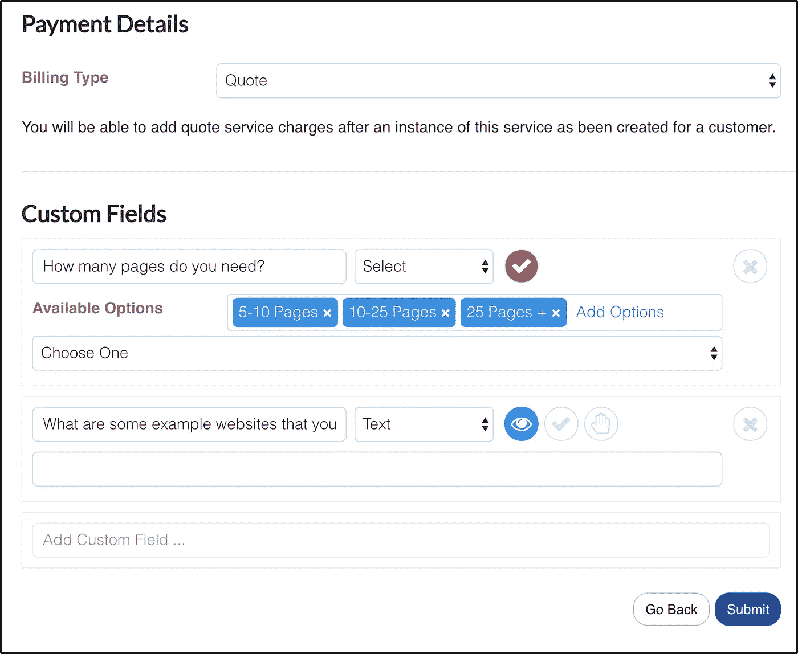
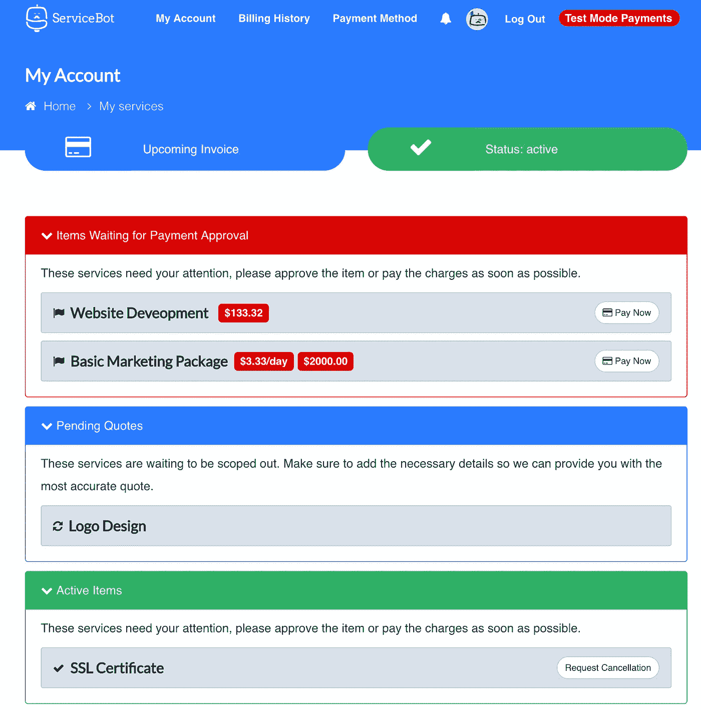

# 如何自动化你的自由职业

> 原文：<https://medium.com/hackernoon/how-to-automate-your-freelance-business-f91e7c1a3b98>

## 如果你是一个自由职业者，一个独立的顾问，或者是一个朝九晚五工作的骗子，并且在网上兼职赚些外快，那么这篇文章就是为你准备的！

建立一个自由职业者的生意并不容易，我在这里不是要告诉你别的。但是你可以通过一些简单的自动化[工具](https://hackernoon.com/tagged/tools)来管理你的客户、服务和发票，让你的生活轻松很多。

# 自由职业者是灵活且有限的

作为一名自由职业者，你有足够的灵活性。您不会受到审批、多层应用系统或企业界面临的管理困难的限制。简而言之，您可以选择想要用来管理业务的系统。然而，你在经济上受到限制。您选择的应用程序必须是负担得起的。

# 自动化可能非常昂贵

在过去的四年里，我一直是财富 500 强企业的自动化架构师。大公司每天都在朝着更加自动化的商业模式发展。自动化的目标是通过自动化重复且耗时的任务来削减企业成本。这听起来很神奇，但在企业层面上非常昂贵，这就是为什么自由职业者，小企业和初创公司通常最终会支付体力劳动。

自动化可以一步一步实现。你不能在一夜之间实现整个业务的自动化，但你可以从基础做起。

# 从自动化简单流程开始

实现业务自动化的第一步是将您的服务产品化，为您的客户提供可视性，并自动开具发票。以下是您的操作方法:

## 将你的服务产品化

[用销售产品的同样方法销售服务被称为产品化](/swlh/5-ways-to-be-a-better-freelancer-f451ca91b828)。服务可以是一次性收费、定期订阅或基于客户需求的定制报价。通过添加您希望客户在请求过程中输入的字段，创建服务并将其视为产品。

Servicebot Service Creation Form

## 允许你的客户订购你的服务

不要通过来回的电子邮件来管理你的销售渠道。允许你的客户通过你的网站，一个谷歌表单，或者更好的，一个自由职业者的自动化工具，比如 [Serivcebot](https://servicebot.io) 。

Servicebot Service Request Form for Clients

## 为您的客户提供自助服务门户

让你的客户可见的最好方法是让他们访问他们购买的服务，允许他们与你交流，并在你不追赶他们的情况下批准支付。有许多平台可供你使用，如[char fify](https://www.chargify.com/)、 [Jobber](https://getjobber.com/) 或 [ServiceBot](https://servicebot.io) 。

Servicebot customer account page

## 为客户端订阅自动计费

转向订阅业务模式。尝试按年、月或周订阅来销售你的服务，并为你的客户订阅自动计费。[带](https://stripe.com/) [Servicebot](https://servicebot.io) 的条带是向客户销售订阅服务的绝佳方式。

# 结论

了解有哪些技术可以帮助你的企业成长。不要浪费时间试图自己做每件事。使用像 [Servicebot](https://servicebot.io) 这样的开源平台来自动化你的自由职业。

如果你需要帮助或建议来开始你的在线自由职业生涯，请随时通过 [shar@servicebot.io](mailto:shar@servicebot.io) 联系我。