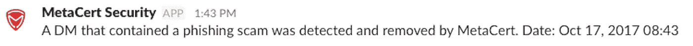

# 如何自动删除包含某些关键字的延期直接邮件

> 原文：<https://medium.com/hackernoon/how-to-automatically-deleted-slack-direct-messages-that-contain-certain-keywords-f335fe9819c4>

无论您是一家担心内部威胁的公司，还是一个担心网络钓鱼攻击的开放社区，lack + MetaCert =共享网页链接的最安全的信息平台。随着网络攻击从电子邮件转移到短信，这两者都是真正的威胁。

MetaCert 今天发布了一个新的**杀手特征**。我甚至可以说,“MetaCert for Slack”应该赢得几乎所有可用的 infosec 奖项。这是一项工程壮举，将真正拯救许多人的世界——通过帮助他们不失去他们一生的积蓄，同时鼓励他们在更多的代币发行和 ICO 上投资更多的钱。

这之所以成为可能，是因为 MetaCert 在后端拥有企业级安全基础设施和世界上最先进的威胁情报系统。无论怎么想象，这都不是一个简单的机器人。它可能看起来是这样，因为它需要大约 7 秒钟安装。相信我，不是的。仅平台的内部就花费了超过 100 万美元，历时两年。可以把 MetaCert 想象成“安全条纹”,因为我们所有的产品都是由一个只有 7 行代码的 API 驱动的。

在检查了 3，000 多个缩短服务，找到目的地网站，然后对照 100 亿 URIs 进行检查后，该 API 将返回 URL 的分类——所有这些都在 190 毫秒内完成。

# 自动删除带有网络钓鱼链接的 DMs

当你在你的 Slack 里安装了 MetaCert 后，它会自动保护你的频道。但是，您必须要求用户“激活”元认证机器人来保护他们的 DMs。这是一个双击工作，所以他们会花不到 5 秒钟来做。我建议你通过在你的主渠道定期发送请求来做到这一点。

一旦用户激活该机器人，MetaCert 将自动删除包含已知钓鱼链接的 DMs 甚至在他们知道自己收到了一封邮件之前。

# 自动删除包含可疑关键字的 DMs

我们今天增加了一个新功能，将减少 Slack 内部的网络钓鱼高达 99%——前提是用户激活该机器人，并且作为我们的应用冠军，您添加了正确的关键词。您可以添加任意数量的关键词或短语。

下面的视频向您展示了如何设置过滤器，以及它如何在松弛时间内工作。

# 完全禁用 DMs

你也可以完全禁用 DMs，除了你的核心团队。这里有一个帖子解释了如何做到这一点。

*☚****请轻点或点击*** 👏“在屏幕左侧的*让 Paul 和其他人知道你很欣赏这篇文章。鼓掌的次数表明你有多喜欢这个帖子，有多支持它的内容，所以尽可能多的把你的手放在一起。*🔒