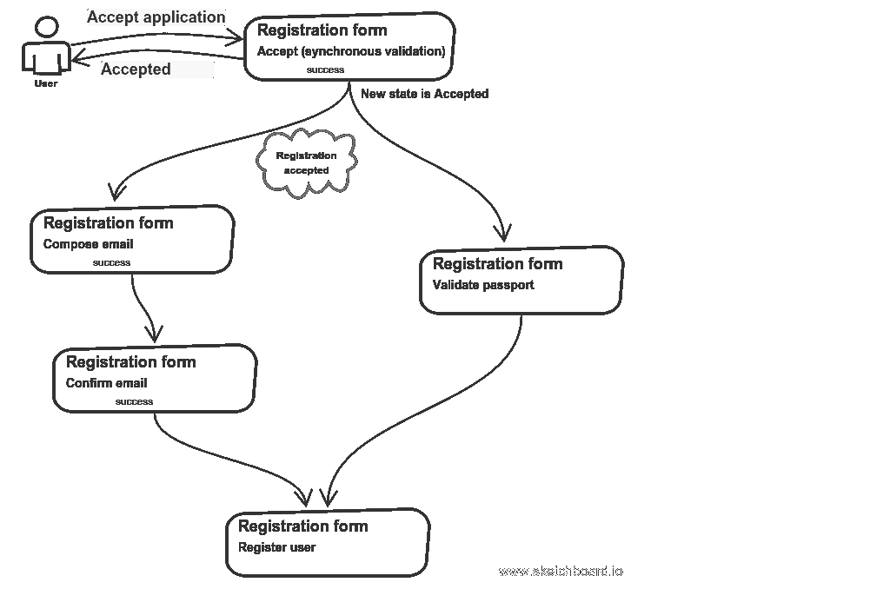
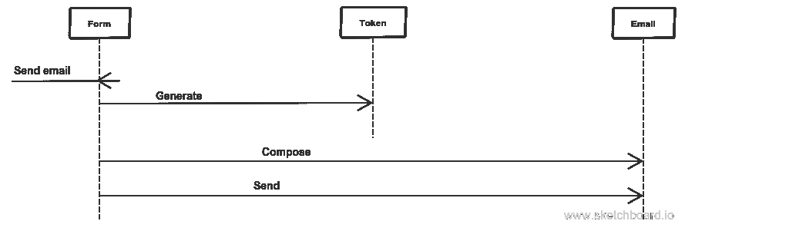
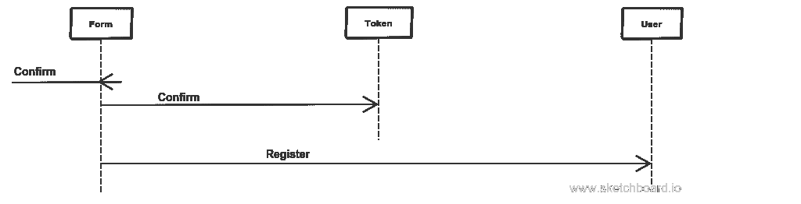

# 如何避免贫血的领域模型

> 原文：<https://medium.com/hackernoon/how-to-avoid-anemic-domain-model-5e1c3e6fe4d0>

## 以用户注册为例

我有意选择了一个广为流传且简单的领域，我猜每个人都很熟悉。我想展示如何用不同的观点看待它，用对象思维来思考。这篇文章可以看作是我在对某个领域建模时采取的一系列步骤。

## 首先，我们来谈谈表格

如今，表单被用作数据验证的工具，目的是让这些数据变得有用。我经常看到验证脱离了业务逻辑。在这种情况下，数据被视为被动的:首先，验证它，然后做这个，然后做那个。嗯，很棒，叫[过程化编程](https://en.wikipedia.org/wiki/Procedural_programming)。下一步是将验证逻辑，域概念固有的*，转移到那些[值对象和实体](http://gorodinski.com/blog/2012/05/19/validation-in-domain-driven-design-ddd/)。这就是 DDD 教我们做的。在这种情况下，表单只是让用户修改一些数据的工具。但是在某些情况下，表单是一个成熟的领域概念，只是在某些方面看起来像 web 表单。*

## *我的领域*

***在这里。***

*我的域名是一个注册用户。他们打开一个页面，看到一个注册表，填写它，然后提交。然后，通过填写表格时显示的电子邮件地址发送确认电子邮件。它包含一个带有秘密令牌的确认链接，因此如果用户遵循这个链接，就意味着他填写了一封真正属于他的电子邮件。所以点击这个链接就完成了注册过程:一个新用户出现在系统中。*

*不过，我并没有试图对这个领域的整体进行建模。只是个素描。*

****语义网***
我用语义网开始分解。它帮助我发现基本物体。此外，它直观地表现了正在发生的事情以及事物之间的联系。在这个例子中，这是相当琐碎的。*

**

*Simple semantic net of user registration domain*

****只有名词，没有“服务”***
在画素描时，我牢记[物体隐喻](/@wrong.about/on-good-domain-decomposition-385ee8ce5a3)。实际上，这主要导致缺少[服务类别](/@wrong.about/you-dont-need-a-domain-service-class-in-ddd-9ecd3140782)。为什么？因为一个[大卫·韦斯特](https://www.amazon.com/Object-Thinking-Developer-Reference-David/dp/0735619654)的人性比喻。或者是[艾伦凯](https://en.wikipedia.org/wiki/Alan_Kay)的[细胞隐喻](https://news.ycombinator.com/item?id=11966570)。因为对象在 OOP 中的意义。对象就像聪明而独立的成年人，他们不需要被告知如何做他们应该做的事情。*

****理解领域规则*** 就像在[识别服务边界](/@wrong.about/service-boundaries-identification-example-in-e-commerce-a2c01a1b8ee9)中一样，我使用相同的技术。我一头扎进过去，看看某个特定领域当时是什么样子。*

*所以我们来考虑一些纸质形式。可能是申请表或登记表，随便什么都行。在某个地方注册是什么感觉？你拿走了表格。它是用打字机打印的。你拿了一支笔。装满了。然后你把它还给一个秘书。他或她看了一下，可能马上就注意到了一些打字错误或其他错误，检查了你的护照，以确保你是你所说的那个人，然后把它留下来做进一步的验证，这可能需要几天的时间。然后你可以几天后回来看看你的状态如何。或者你可以收到一封有结果的信。*

## *如何对一个领域建模*

****几句如何建模领域规则*** 现在有什么不同，没有打字机，没有秘书的时候？表单仍然需要显示和验证。谁应该做那件事？长话短说，对象思维意味着一个形式本身应该。现在，我们正在对注册过程中固有的行为进行建模。它与打印机、任何验证器、[其他“er”或“or”或“s](http://www.yegor256.com/2015/03/09/objects-end-with-er.html) 无关，现在它只是一个注册表、一个令牌和一封电子邮件。好的，还有一个带用户的访问者，只是碰巧以“or”和“er”结尾。但是，没有什么可以阻止这些类利用它们所需要的一切来实现它们的职责。此外，鼓励对象拥有所有必要的资源:数据库连接、外部资源、缓存资源。如果对一个班级来说太多了——没问题，装饰者是一个不错的选择。这个概念的一个例子是一个 [ORM](/@wrong.about/you-dont-need-an-orm-7ef83bd1b37d) :你的对象不再被操纵，它们自己决定做什么。同样的情况到处都是。服务是反向的。他们不再对物体进行操作了。
因此，我们实体的职责可能如下所示。注册表单负责显示自身、验证和保存自身。邮件负责自己发送。为了全面了解情况，我们应该想出并阐述一组[用户故事](https://www.amazon.com/User-Stories-Applied-Software-Development/dp/0321205685)。*

****用户故事*** 哪些用户故事构成了注册的流程？以下情况如何:*

> *一个访问者请求一个表格并填写它。*

*我可以从这个故事中得出结论，一个形式应该有责任展示自己。*

> *表单确保所有字段都有效。*

*验证过程需要更多的细节。还记得五十年前我写的关于注册是如何工作的吗？验证的过程包括一个秘书需要检查你是不是你所说的那个人，所以你向他或她出示了你的护照。如今，电子邮件就像护照一样。我们在电子邮件上发送一封信，访问者填写了该表格，他或她应该确认它，这个过程包括在一个术语“验证”中。因此，任何注册都不可避免地包含异步部分。那么尝试同步验证一切是没有意义的。我在同步验证中留下的是一些轻量级的检查，当违反这些检查时，永远不会让注册成功。这些支票是什么？例如，出生日期比今天或一年前要早。出生日期应该是真实的。或者电子邮件符合 [RFC822](https://tools.ietf.org/html/rfc822) 。因此，如果所有这些检查都成功通过，我说表单可以被*接受*。
有些异步检查可能是并行的，有些应该是顺序的。展望未来，我可以说这样的检查可以作为[传奇](http://vasters.com/archive/Sagas.html)来实现。每一个都需要自己的用户故事。这就是整个过程的图示:*

**

*Form validation ending with registration of a user*

> *如果一个表单有效，它注册一个访问者(记住对象是活动的！)，所以就成了用户。*

*所以这个故事卡揭示了另一个表单的责任:用户注册。*

*下一个详细的验证用户故事可以开始了。我不想在这里深究，只把自己局限在那些关于电子邮件确认的问题上。他们在这里:*

> *如果同步验证可以，编写一封确认电子邮件并发送给访问者。*

**

**A interaction diagram for composing and sending a confirmation email**

*显然，一封电子邮件应该在表格的帮助下撰写，毕竟它是一个信息专家。但是一封电子邮件应该拥有能够自己发送的所有资源。*

> *访问者通过电子邮件中的确认链接成为用户。*

**

*A interaction diagram for confirming an email address*

*在这里，表单将确认委托给令牌，因为它更清楚如何确认输入的令牌字符串。如果没问题，那么表单注册一个新用户。这是一个常见的流程，反映了从面向对象的角度来看的一个领域:一个实体创建另一个实体，等等。[实体(即集合体)不会自己弹出](http://udidahan.com/2009/06/29/dont-create-aggregate-roots/)。*

****CRC 卡***
随着用户故事的发现，我可以制作 [CRC 卡](https://en.wikipedia.org/wiki/Class-responsibility-collaboration_card)。就算说 CRC 正方体(一个源于 CRC 卡的概念，我第一次遇到是在大卫·韦斯特的《客体思维》里)，对我最管用的那一面，也是有责任的那一面。所以我遍历了所有涉及特定对象的用户故事，并收集了它的职责。它们表示我的对象可以提供的服务，并且它们形成了对象的契约。我不会深入研究 CRC 立方体的形式表示，让我们直接看代码。*

## *密码*

*好的，我看了一下我的职责，发现我的表单应该能够:*

*   *展示自己；*
*   *验证自身；*
*   *撰写确认电子邮件，作为验证的一部分；*
*   *确认电子邮件，也是验证的一部分；*
*   *注册用户。*

*所以这些是形成一个对象契约的候选者。*

*请记住，下面的代码只是上面提出的想法和原则的代表。它比伪代码多，但比生产代码少。*

****显示表单*** 我希望我的注册表单只负责显示数据，把装饰留给其他人。我不认为让表单知道每一个表示细节是一个好主意，所以我希望来自特定类的协作。它可能如下所示:*

```
**// an entry point. It might also be a controller action.* **public function** display()
{
    (**new** RegistrationForm(
        **new** UUID(),
        **new** RegistrationFormDataStorage()
    ))
        ->display()
    ;
}*
```

*和表单方法本身。这种精神可以在[中实现](http://www.yegor256.com/2015/03/26/jaxb-vs-xembly.html)。*

```
***class** RegistrationForm
{
    */**
     ** ***@var*** *$id UUID
     */* **private $id**;

    */**
     ** ***@var*** *$storage DataStorage
     */* **private $storage**;

    **public function** __construct(UUID $id, DataStorage $storage)
    {
        $this->**id** = $id;
        $this->**storage** = $storage;
    }

    **public function** display()
    {
        (**new** RegistrationWebForm(
            **new** HiddenElement(
                $this->**id**->value()
            ),
            **new** NameElement(),
            **new** PassportElement(),
            **new** EmailElement()
        ))
            ->display();
    }
}*
```

****受理表单****

```
***public function** accept(**array** $data)
{
    **try** {
        (**new** RegistrationForm(
            **new** FixedUUID($data[**'id'**]),
            **new** RegistrationFormDataStorage()
        ))
            ->accept(
                **new** Name($data[**'name'**]),
                **new** Passport(
                    **new** PassportNumber($data[**'passport_number'**]),
                    **new** PassportIssuedAt($data[**'passport_issued_at'**]),
                    **new** PassportIssuedWhere($data[**'passport_issued_where'**])
                ),
                **new** Email($data[**'email'**])
            )
        ;
    } **catch** (Exception $e) {
        (**new** ErrorPage())->display();
    }

    (**new** RegistrationAcceptedPage())->display();
}*
```

*同样，这也是入口点的样子。下面是*registration form->accept()*方法的实现:*

```
***public function** accept(
    IValidatableElement $name,
    IValidatableElement $passport,
    IValidatableElement $email
)
{
    $this->**storage** ->transactionally(
            **function** () **use** ($name, $passport, $email) {
                $id =
                    $this->**storage** ->save(
                            [
                                **'name'** => $name->value(),
                                **'passport'** => $passport->value(),
                                **'email'** => $email->value(),
                            ]
                        )
                ;
                $this->**storage**->appendFormAcceptedEvent($id);
            }
        );
}*
```

*注意数据库中事务性存储的*表单接受的*事件。我不想在一次运行中执行所有的逻辑，因为我不想滥用 DDD 的“一个集合—一个事务”的经验法则。我有一个单独的处理程序来处理那个事件；它构成了一封确认电子邮件。*

****撰写确认邮件****

```
***public function** composeConfirmationEmail(UUID $formId)
{
    (**new** RegistrationForm(
        $formId,
        **new** RegistrationFormDataStorage()
    ))
        ->composeConfirmationEmail(
            **new** SmtpClient(),
            **new** EmailConfirmationEmailHeader(),
            **new** EmailConfirmationEmailBody(),
            (**new** ConfirmationTokens(
                **new** TokenStorage()
            ))
                ->add(
                    **new** ConfirmationToken(
                        **new** UUID(),
                        **new** TokenStorage(),
                        **new** UUID() // it's a token string
                    )
                )
        )
            ->send();
}*
```

*下面是一个对象持久化的变体。我使用了一个类似集合的类 *ConfirmationTokens* ，它可以用于添加和搜索令牌。这里有一个非常简单的
*registration form->composeConfirmationEmail()*实现:*

```
***public function** composeConfirmationEmail(
    ICanSendEmails $transport,
    EmailHeader $subject,
    EmailBody $body,
    ConfirmationToken $token
)
{
    **return** (**new** ConfirmationEmail(
            $transport,
            $this->**storage**->getById($this->**id**)[**'email_address'**],
            $subject,
            $body,
            $token
        ))
            ->save();
}*
```

*最后，这是用户确认电子邮件的入口点:*

```
***public function** confirmEmail(UUID $formId, UUID $tokenValue)
{
    (**new** RegistrationForm(
        $formId,
        **new** RegistrationFormDataStorage()
    ))
        ->confirmEmail(
            (**new** ConfirmationTokens(
                **new** TokenStorage()
            ))
                ->byValue($tokenValue)
        );
}*
```

*成功的确认导致新的正式用户的注册:*

```
***public function** confirmEmail(ConfirmationToken $token)
{
    **if** ($this->generatedToken()->confirm($token)) {
        $data = $this->**storage**->getById($this->**id**);

        (**new** User(
            **new** UUID(),
            **new** UserDataStorage()
        ))
            ->register(
                **new** Name($data[**'name'**]),
                **new** Passport(
                    **new** PassportNumber($data[**'passport_number'**]),
                    **new** PassportIssuedAt($data[**'passport_issued_at'**]),
                    **new** PassportIssuedWhere($data[**'passport_issued_where'**])
                ),
                **new** Email($data[**'email'**])
            );
    }
}*
```

## *包装它*

*因此，通过完全抛弃数据模型和对象应该持久化的方式，并专注于行为，我可以提出一个下降模型。*