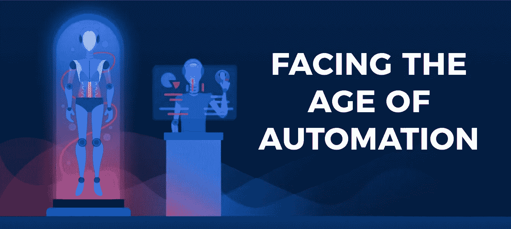
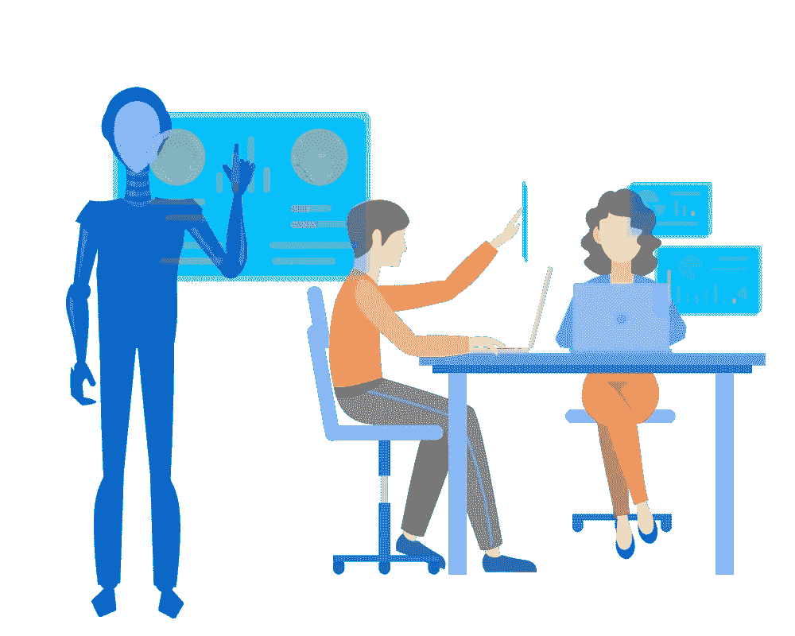
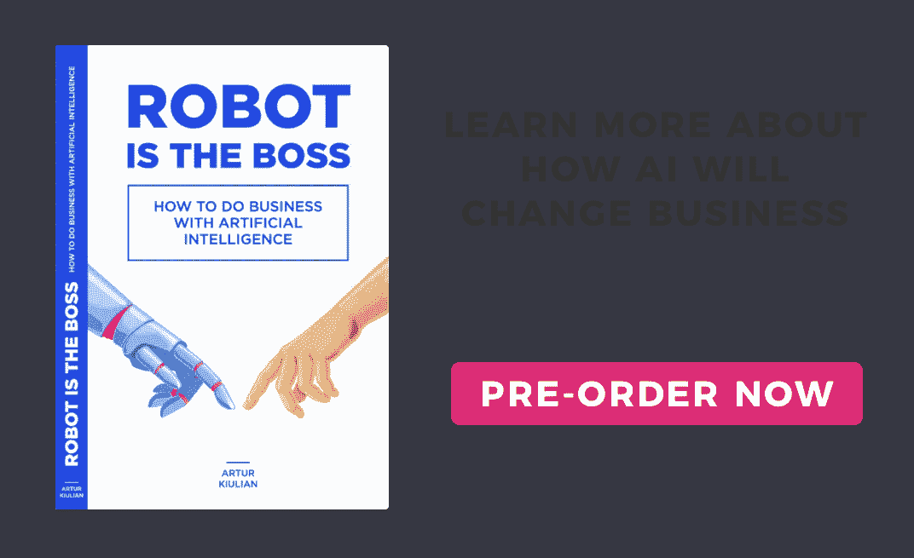

# 如何避免被机器人取代

> 原文：<https://medium.com/hackernoon/how-to-avoid-being-replaced-by-a-robot-ee1ecd5c9c87>

## 面对自动化和机器智能的下一波浪潮

各地都越来越担心自动化对就业市场的影响。专家、记者、技术专家对这种转变的速度和深度意见不一。

乐观主义者表示，尽管从长远来看自动化是不可避免的，但到 2055 年，美国只有 5%的工作是完全自动化的。其他人描述了一个暗淡的场景，未来 20 年，47%的美国工作岗位面临自动化的风险。

无论自动化改变就业市场的速度有多快，你都应该为人工智能驱动的经济做好准备，在这种经济中，机器人、人工智能软件和自动化工具将取代人类执行几十年的任务。

为了在机器时代保持竞争力，这里列出了一系列利用人工智能潜力的策略。

# **了解如何与机器交谈**

聊天机器人、虚拟助手(如苹果的 Siri、亚马逊的 Alexa)和分析平台(如 IBM Watson analytics)等交互式人工智能软件改变了消费者和公司获取信息和做出决策的方式。

为了利用智能机器的力量，人们应该掌握能够实现高效人机交互的界面和策略。正如谷歌搜索引擎奖励那些输入相关搜索查询的用户一样，人工智能将对那些擅长与他们交流的人最为慷慨。

与商业分析人工智能互动的员工应该非常清楚他或她希望从机器中获得什么样的见解和预测。在这种背景下，有效的人工智能[管理](https://hackernoon.com/tagged/management)技能开始崭露头角。

那些设法从强大的人工智能能力中获得最大价值的员工，将成为他们公司在新机器时代的宝贵资产。

# **理解高级概念**

在个人电脑时代，电脑知识已经成为员工技能中不可或缺的一部分。今天，随着我们进入人工智能时代，人工智能素养将成为在劳动力市场保持竞争力的最重要资产之一。

人工智能素养是指使人工智能工作的基本概念、技术和解决方案的知识。就像我们大多数人知道数字信息是以字节存储的一样，研究 ML(机器学习)算法如何工作，有监督和无监督学习的区别是什么，或者如何安装和配置一个 AI 软件套件，都不会浪费你的时间。

有许多在线课程和指南提供人工智能(AI)的基本介绍，即使是没有相关技术和数学背景的人也能理解。你现在可以做的最简单的事情就是开始使用开源的 AI 软件来体验这项技术的力量。

# **提高创造力**

毫不夸张地说，在需要大量计算的重复性任务和操作中，AI 优于人类。凭借这些技能，人工智能迟早会取代出租车和卡车司机、消费者助理和体力工人。

然而，机器接管的技能并不是人类拥有的唯一技能。创造力仍然是人类智能中最独特和最重要的部分，这使得人工智能等创新成为可能。人类创造力的领域极其广泛和多样。它不仅涵盖了科学发现，还涵盖了人们在日常生活和工作中发现的各种各样的生活小窍门、优化解决方案和见解。

为了在即将到来的人工智能时代保持竞争力，人们应该发展那些让他们脱颖而出的技能。这将需要改变福特主义装配线的心理，这种装配线将员工视为执行重复和轻率操作的“机器人”。

一旦真正的机器人进入就业市场，更多的人，而不仅仅是一小部分创意阶层，将有潜力扩展他们的创意技能。

# **拓展智力视野**

多元智能理论认为人类智能不是一套抽象的逻辑规则，而是一个复杂的系统，包括情感、社交、语言、身体运动知觉和内省技能。

这意味着，在人工智能时代到来之后，人类将继续在人际交流领域发挥重要作用。司法、医疗保健、心理治疗、护理、艺术只是机器人可能发挥有限支持作用的活动的几个例子。

为了在自动化时代保持竞争力，人们应该专注于使他们不同于机器的技能和能力。这就是情绪和社交智能的前景。发展同理心，成为一名优秀的团队成员、经理和领导者，将是寻求在基于人工智能的经济中找到自己位置的员工的主要优先事项。

当机器成为我们经济中不可或缺的一部分时，技术能力将不足以与之竞争。

# **助力增力机**

在不久的将来，人工智能不会取代大部分工作。在大多数情况下，它只会增加员工，将他们变成人工智能操作员和助理。在这种情况下，他们必须学会如何有效地配置机器并与之协作。

例如，聊天机器人初创公司正在雇用人工智能培训师，他们评估人工智能软件的性能，并在出现问题时进行干预。许多聊天机器人初创公司使用垂直人工智能来执行一项特定任务，例如安排消费者与人类员工的电话或会议。

这种形式将保持人类员工在人工智能和消费者之间的沟通中的关键作用。类似地，许多员工将进行数据标记、清理和重复数据删除，以创建训练 ML 算法所需的数据集。

所有这些活动都将催生一个混合的人工智能经济，员工与机器合作，为他们的公司创造价值。

# 下一步是什么？

把 AI 革命当成对人类的威胁是适得其反的。在我们经济史的每一个阶段，技术颠覆都导致了劳动力市场的变化。制造厂、工厂、装配线、计算机只是自动化带来生活水平巨大提高的历史阶段。

机器智能也是如此。它将重新格式化劳动力市场，使一些工作过时，但它对我们社会的最终影响将取决于我们如何利用我们的竞争优势和无限的创造力来驾驭人工智能的力量。

喜欢这篇文章？请推荐它，这样它能接触到更多的❤人