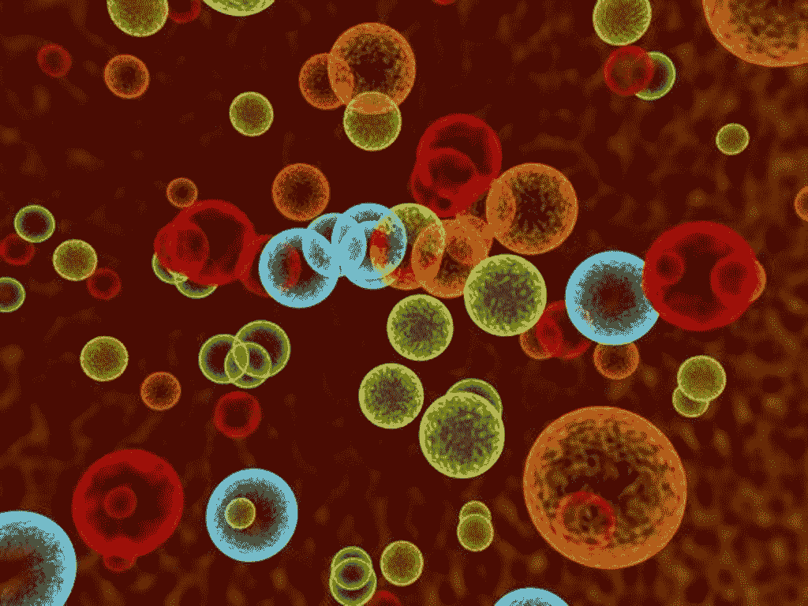

# 如何将增长融入你的产品

> 原文：<https://medium.com/hackernoon/how-to-bake-growth-right-into-your-product-c27642a38108>

让一切变得更好的秘密小酱

[Photo credit](https://kinarino.jp/cat4-%E3%82%B0%E3%83%AB%E3%83%A1/15049-%E3%81%B5%E3%82%93%E3%82%8F%E3%82%8A%E3%81%97%E3%81%A3%E3%81%A8%E3%82%8A%E2%99%AA%E8%BA%AB%E4%BD%93%E3%81%AB%E5%84%AA%E3%81%97%E3%81%84%EF%BC%86%E3%83%98%E3%83%AB%E3%82%B7%E3%83%BC%E3%81%AA%E3%80%8C%E3%83%9E%E3%83%95%E3%82%A3%E3%83%B3%E3%80%8D%E3%81%AE%E4%BD%9C%E3%82%8A%E6%96%B9)

# 第一个病毒产品

13 世纪中期，一种极具病毒性质的产品源自干燥贫瘠的蒙古平原。这种产品的用户无法停止谈论它，它像野火一样蔓延开来——从亚洲平原蔓延到地中海和欧洲大部分地区，轻而易举地占据了 50%的市场份额。到本世纪末，全球总人口的 25%在某种程度上受到了互联网的影响，据估计，这一数字达到了 1 亿。所有这些都发生在脸书、Instagram、Snapchat 甚至互联网出现之前的几个世纪。

当然，我说的是这种叫做*鼠疫杆菌*的小虫子，这种病原体导致了中世纪的腺鼠疫流行——也被称为[黑死病](https://en.wikipedia.org/wiki/Black_Death)。

[Photo credit](https://themedievalera.wikispaces.com/The+Black+Death+-+Social+Effects)

但在你合上这个标签，小声骂我之前，我想告诉你，我并不为这种夸张道歉。我将要告诉你的事情可能会彻底改变你对成长的看法。

# 是什么让任何东西像病毒一样生长？

[成长](https://hackernoon.com/tagged/growth)本身，从来都不是偶然。这是一个细致的努力和思想的顺序，最终达到我们想要看到的结果。与鼠疫病原体本身没有什么不同，你的产品应该以这样一种方式设计，即它可以自我复制——从一部智能手机上安装的应用程序，它应该能够“转到”另一部智能手机。然后再繁殖到两个以上，四个以上，以此类推。一个应用程序应该能够使用我们，人类的交通工具——或应用程序的载体，将它传播到其他智能手机中。大自然将鼠疫耶尔森氏菌设计成天生的病毒。我们能不能用同样的方式设计我们的产品，让它们天生就像病毒一样传播？

当然，并不是所有的病原体都是病毒。不是所有的 app 都能做成病毒式的产品。病毒病原体都有这些基本属性—

*   它们对宿主的影响，也称为毒性。
*   它们在其他宿主间传播的方式，也称为传播。

Just a bunch of pathogens doing their usual business

这就产生了一种网络效应，即这种疾病的增长速度完全取决于患病人数。如果你懂高中数学，你会发现这确实是一个指数函数的微分方程。

# 利用网络效应创造指数式病毒增长

我在 2011 年购买第一部安卓手机的一个主要原因是，我认识的所有人都在使用 WhatsApp。虽然它让我享受到了拥有智能手机的许多其他舒适，但作为 WhatsApp 用户，我获得的快乐——不用支付短信费用就能与朋友联系，这是非常令人满意的。

对一个人的整个网络有用的能力是 WhatsApp 的致命之处。它的传播方式是它在网络中创造的社会效应。如果你不使用 WhatsApp，你可能会错过你的朋友正在做的事情，因为他们都在使用它。WhatsApp 还让非用户加入进来变得非常容易，只需向他们发送一条加入的短信。[点对点推荐转化率 92%](https://www.linkedin.com/pulse/who-do-you-trust-92-consumers-peer-recommendations-over-joey-little) 。认为 WhatsApp 只是一款消息应用的想法是愚蠢的。这是一个活的、会呼吸的网络，遵循这个非常简单的规则—

> 如果你的产品随着越来越多的人使用而变得越来越有用，那么你的用户就会有巨大的动力去传播它。

这个规律，也被称为[梅特卡夫定律](https://en.wikipedia.org/wiki/Metcalfe%27s_law)，从 80 年代起我们就知道了。如果你仔细观察，我们今天看到的大多数大型互联网公司都是这一定律的应用——**脸书、LinkedIn、Quora、Instagram、Snapchat、Medium、Airbnb、优步**……名单是无穷无尽的。

大多数人认为，这些公司之所以成为今天的样子，是因为他们的产品比任何人都更好地解决了一个关键问题。嗯，有，也有没有。虽然这些平台对单个未连接的用户几乎没有用处，但当这些用户邀请他们的朋友过来时，这些平台的价值就会越来越大。

> 这些公司在他们的领域中胜过其他所有公司，因为他们让这些用户更容易增加网络效应。

你现在有希望和黑死病类比了。随着感染人数的增加，这场瘟疫实际上变得更加致命。虽然它们本身并不主动传播病原体，但却很容易通过以感染鼠疫的尸体为食的老鼠和跳蚤传播。但是如果你环顾四周，黑死病已经不存在了。发生了一些事情，这种世界性的流行病结束了。这让我想到了故事的下一部分——

# 有机增长的机制

这个世界不是一直在找事情做吗？你有没有想过每天新事物是如何开始流行的？从金·卡戴珊最令人反感的自拍照到卑微的坐立不安的纺纱工，整个行业都因制造新的头条新闻而繁荣。从那件黑色或白色的礼服到《权力的游戏》中最新的角色死亡，就好像我们都陷入了一个循环。

一个反馈回路。

[Photo credit](http://www.gosmartwork.be/from-start-up-to-scale-up-the-3-biggest-mistakes/)

想想看，真的:*报道的新闻越多，我们消费的新闻就越多。消费越多，与你分享消息的人的利润也越多。这驱使更多的人发布新闻，发布更多的新闻*。这种系统创造了分析家称之为[的正反馈循环](https://en.wikipedia.org/wiki/Positive_feedback)。黑死病没有存活下来的原因是，它曾经在一种被称为[的负反馈循环](https://en.wikipedia.org/wiki/Negative_feedback)中杀死它的使用者。对产品经理来说，这的确是一个非常糟糕的主意。

在你的产品中设计反馈回路并不是一个新的想法，但它是增长驱动型问题解决方案的基础之一。在 [Nir Eyal](https://www.linkedin.com/in/nireyal/) 的里程碑式的书[Hooked:How to build habit forming products](https://www.amazon.in/Hooked-How-Build-Habit-Forming-Products-ebook/dp/B00NW01MKM?_encoding=UTF8&btkr=1&portal-device-attributes=desktop&ref_=dp-kindle-redirect)——他描述了一个反馈循环，他称之为 Hook 模型，旨在创造用户习惯。你希望你的用户不断回来，让你的产品成为他们日常生活的一部分。

虽然内在的病毒式传播和网络效应有助于实现增长，但正反馈循环有助于维持增长。在你的网络中聚集了一定数量的人之后，必须有一种机制来奖励他们，让他们坚持下去。幸运的是，在我们的大脑中，恰恰有一套机器在做这件事。它们被称为我们的多巴胺受体。

多巴胺是让香烟、可卡因甚至性爱感觉如此美妙的东西。它实际上是“感觉良好”状态的生物生产者。但是随之而来的警告是它非常容易上瘾。在 21 点中，每赢一手牌，你都会想玩得更多。你不是渴望金钱，而是渴望冲进你大脑的多巴胺分子。

> 那种兴奋的感觉，那种获得成功的冲动。那种离胜利只有一步之遥的感觉。这是多巴胺在起作用。

即使你输了，你还会再试一把。这就是多巴胺循环对你的影响。这在这一点上已经超出了客户心理。这是怪异的顾客神经科学。

[Yeah, science!](https://rewatchbreakingbad.wordpress.com/category/season-one/)

成瘾性产品的设计就是为了让人上瘾。你在脸书或推特上收到的每一条通知都会触发你去查看一下。有人喜欢你的照片。感觉很好。社会认可极大地提升了多巴胺奖励系统。当一群人为你鼓掌或有人祝贺你时，你会有同样的感觉。它促使你分享更多的照片，渴望更多的多巴胺。因此，越来越多的人喜欢你的照片——这个循环还在继续。

> 让你的用户坚持使用你的产品的最好方法就是让他们感觉良好。

当然，这有道德和伦理方面的考虑。你不会希望你的客户陷入一个恶性循环，整天从他们的智能手机上偷糖果，你会吗？；)

## 最后，我想感谢你阅读这篇文章。过去，我也想知道企业家是否像单口喜剧演员。如果你同意我的观点，我很乐意谈谈，并了解更多你对这些想法的看法。你可以一直 ping 我这里的**。**

****

**Click that ❤ below to give me my dopamine hit!**

************

> **[黑客中午](http://bit.ly/Hackernoon)是黑客如何开始他们的下午。我们是 [@AMI](http://bit.ly/atAMIatAMI) 家庭的一员。我们现在[接受投稿](http://bit.ly/hackernoonsubmission)并乐意[讨论广告&赞助](mailto:partners@amipublications.com)机会。**
> 
> **如果你喜欢这个故事，我们推荐你阅读我们的[最新科技故事](http://bit.ly/hackernoonlatestt)和[趋势科技故事](https://hackernoon.com/trending)。直到下一次，不要把世界的现实想当然！**

****