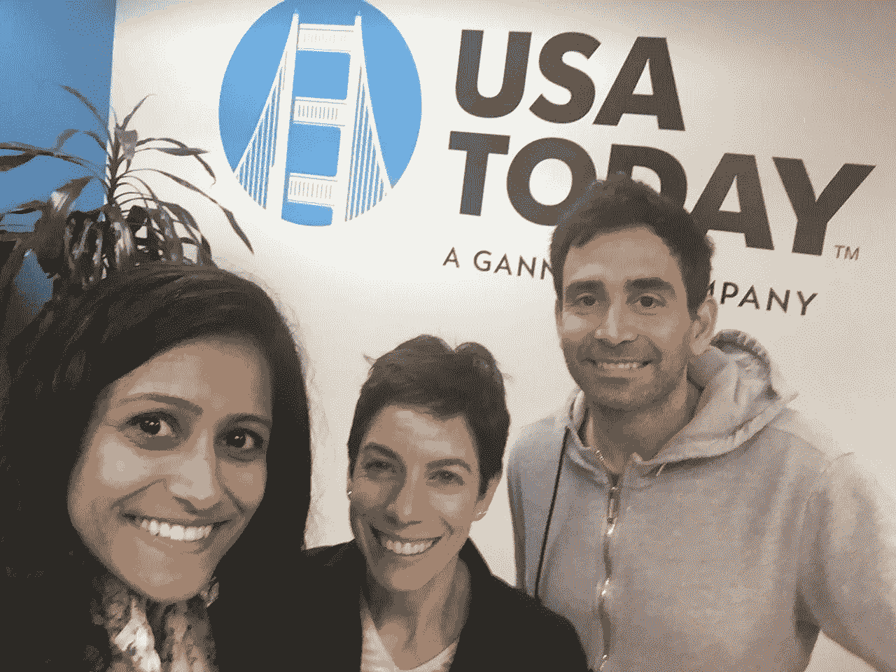

# Airbnb、Pinterest 和 Square 的一位投资者分享了创始人应该关注的问题

> 原文：<https://medium.com/hackernoon/how-to-be-navigate-silicon-valley-successfully-be170e2c3247>

[Shruti Gandhi](https://twitter.com/atShruti) ([*Array Ventures*](http://www.array.vc)), [*Laura Mandaro*](https://twitter.com/lauramandaro) *(USAToday),* [*Elad Gil*](https://twitter.com/eladgil) *(*[Color Genomics](https://www.color.com/)*)*

## [Elad Gil](https://twitter.com/eladgil) 股份[*Shruti Gandhi*](https://twitter.com/atShruti)*[*数组风投*](http://www.array.vc)*&*[*劳拉·曼达罗*](https://twitter.com/lauramandaro) 他如何投资[Airbnb](http://airbnb.com)[Pinterest](http://pinterest.com)[Square](https://squareup.com/)[Stripe](https://stripe.com/)[许愿](https://www.wish.com/)*

# ***早期职业&发展***

****来自 Elad 的早期职业见解****

> *-在日常工作中选择合作对象，因为通常是一小群人最终做了大事(例如“PayPal 黑手党”)*
> 
> *-了解你工作的公司类型的市场——为成长中的公司工作对你的成功至关重要*

**要从 Elad 那里获得更多的职业建议，请访问他的博客文章* [*这里*](http://blog.eladgil.com/2015/03/career-decisions.html)*

*从麻省理工学院(MIT)获得生物学博士学位后，Elad 知道他想在技术领域工作。虽然他没有任何技术经验，但他有机会进入这个领域。他与任何人会面，乞求别人给他一份工作。*

*他最终得以在思科实习，并利用这段经历在 21 世纪初的一家电信设备公司工作——那是在科技泡沫时期。*

*在换了一份工作后，Elad 决定只在软件公司工作。再一次，他戴上了他的皮条客帽子，并愿意最初免费工作来获得他的一只脚。*

# ***企业家的生活***

****企业家洞察来自 Elad****

> *-优秀的公司对客户有明确的价值主张*
> 
> *-不要提前加注，你不必接受更高的估值*
> 
> *-有一个明确的财务计划:了解你的消耗率，并有足够的现金用于 18 个月、24 个月或 36 个月，然后储蓄超过预期*

*在谷歌工作了三年后，Elad 与人合作创办了他的第一家公司——Mixer Labs。这是一家为开发者创造位置引擎的公司。创立公司两年后，Twitter 以大约 500 万美元的价格收购了 Mixer Labs。*

*在 Twitter 工作几年后，Elad 与人合作创办了另一家名为 Color Genomics 的公司。该公司筛选你的 DNA，以显示你患某些癌症的风险。2016 年 9 月，它筹集了 4500 万美元的 B 轮融资。*

*该公司的价值主张很明确。与其他公司的 4000 美元相比，Color Genomics 的测试套件售价为 250 美元，这对消费者来说是一个重大的成本降低！*

***作为投资者的洞察力***

****投资洞察来自 Elad****

> *-了解您或企业是否会使用该产品*
> 
> *-了解市场规模和动态*
> 
> *-只有在愿意输掉所有钱的情况下才投资*
> 
> *-了解团队如何运作非常重要*

*Twitter 收购 Mixer Labs 后，Elad 投资了许多不同的伟大公司——[Airbnb](http://airbnb.com)、 [Gusto](https://gusto.com/) ( [查看](/@atshruti/ceo-of-gusto-joshua-reeves-shares-how-to-build-a-diverse-mission-driven-company-f996b49731a9#.dk4k5efqa)我对 Gusto CEO 的采访)、 [Square](https://squareup.com/) 、 [Stripe](https://stripe.com/) 、 [Pinterest](http://pinterest.com) 、 [Wish](https://www.wish.com/) 、 [Zenefits](https://www.zenefits.com/) 。作为一名投资者，他通过招聘和融资指导为早期创业者增加价值。在后期，他帮助创始人制定收购策略。他的电话线路也总是开通的；他在一个周六的深夜联系了 Stripe 的创始人！*

****对市场的洞察****

*当市场好转时，尽管增长乏力，但创始人认为他们的公司会被更大的公司收购。当市场泡沫更多时，更大的公司甚至会仅仅为了他们的人才基础而收购初创企业。*

*如今，随着估值的下降，大公司只会进行收购以获得市场份额、增加收入或削减成本。此外，如果大公司认为一家初创公司有更好的产品，它们会进行收购。*

*正如我们在 Elad 的职业生涯中所看到的，拥有骗子的雄心和承担适度的风险可以在未来获得非常高的回报。*

*还想要更多吗？点击这里查看整个播客:*

*[*Shruti Gandhi*](https://twitter.com/atShruti) *感谢 Elad Gil 在*[*Array Ventures*](http://www.array.vc)*早期的建议和支持。*[*Array Ventures*](http://www.array.vc)*是一家风险投资公司，专注于投资那些利用数据、人工智能和新行为为大型市场创造新平台的创始人。**

******

> *[黑客中午](http://bit.ly/Hackernoon)是黑客如何开始他们的下午。我们是 T21 家庭的一员。我们现在[接受投稿](http://bit.ly/hackernoonsubmission)并乐意[讨论广告&赞助](mailto:partners@amipublications.com)机会。*
> 
> *如果你喜欢这个故事，我们推荐你阅读我们的[最新科技故事](http://bit.ly/hackernoonlatestt)和[趋势科技故事](https://hackernoon.com/trending)。直到下一次，不要把世界的现实想当然！*

**