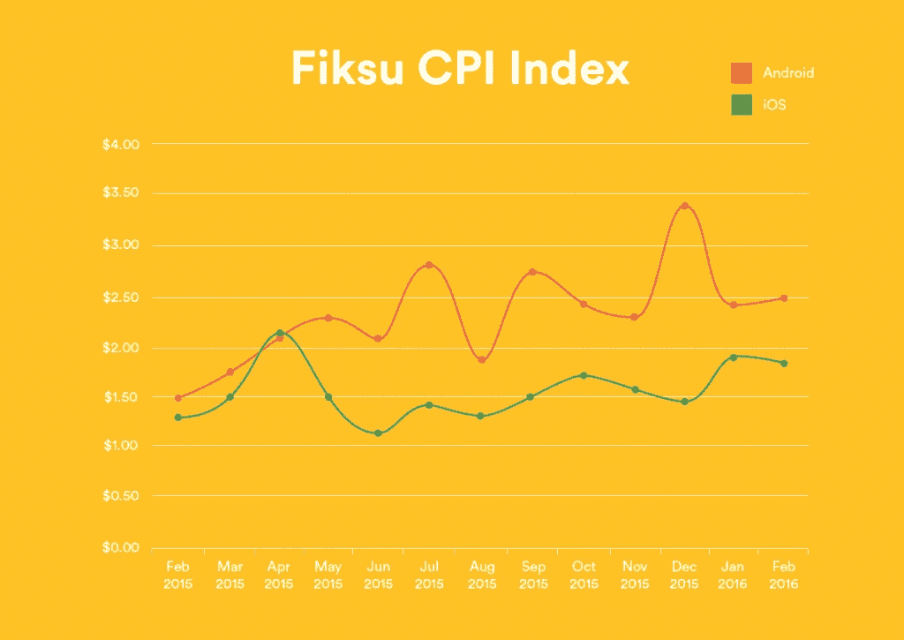
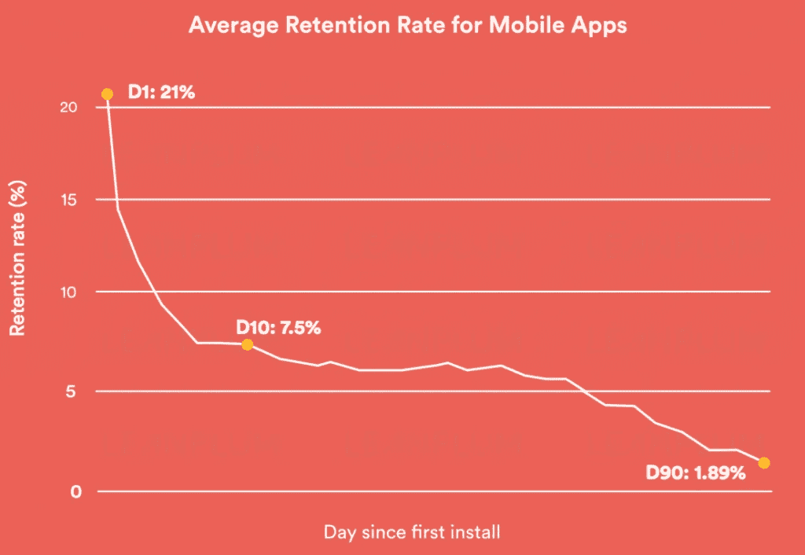
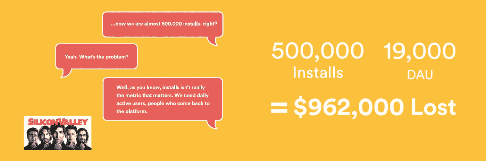
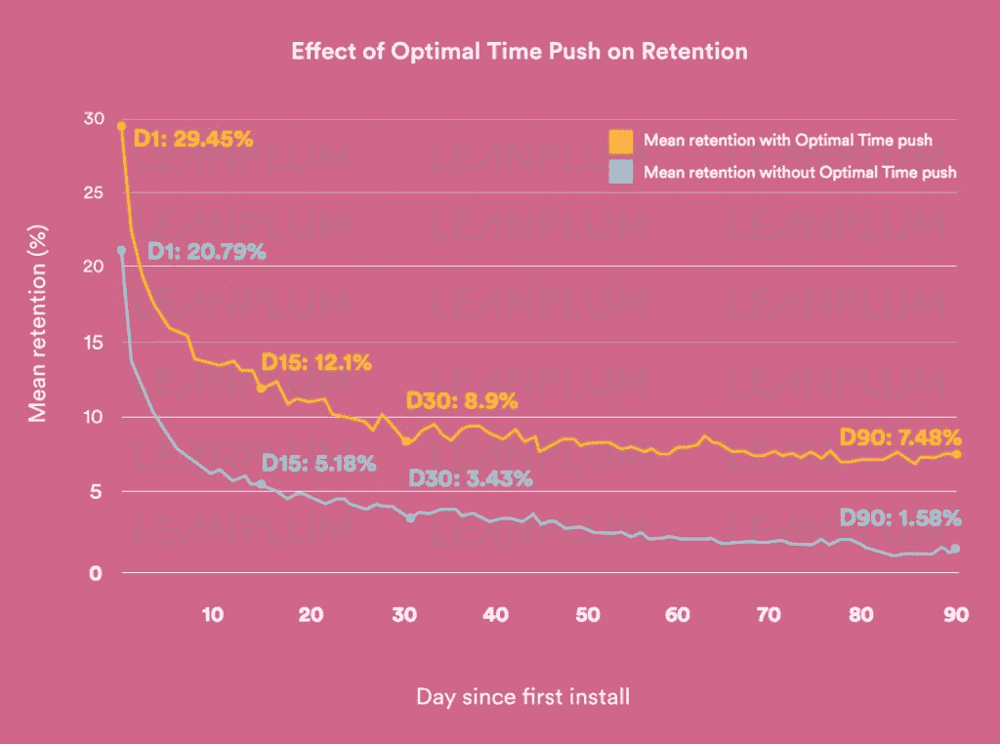
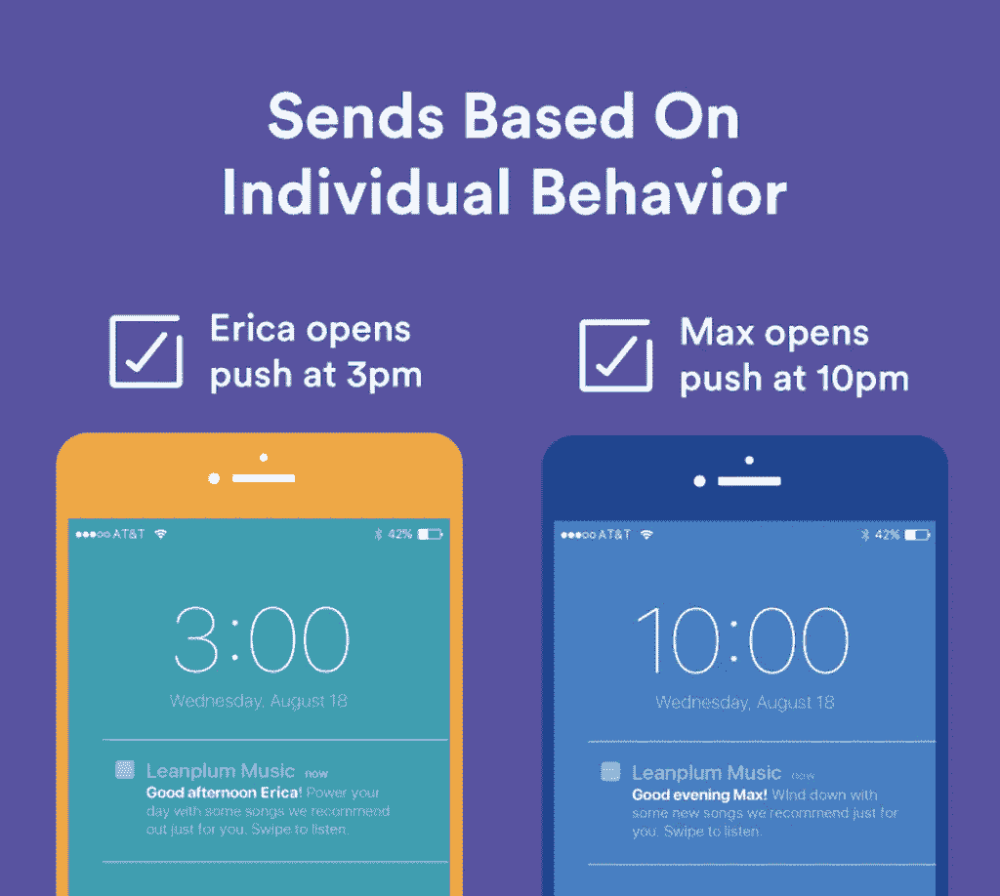

# 如何盈利:应用获取与应用保留成本

> 原文：<https://medium.com/hackernoon/how-to-be-profitable-app-acquisition-vs-app-retention-costs-ba57e33e796c>

成长是许多移动团队的定义标准。无论是以无序增长黑客攻击还是大预算品牌广告的形式，不可否认，收购是最受欢迎的营销目标之一。

毕竟，你需要一个增长计划来获得你的应用的第一批用户，并保持稳定的增长。

但是，如果没有一个可靠的保留策略，你的增长资金将被浪费。这就是为什么我们为您提供所有您需要的事实，以提高应用程序的留存率。

Leanplum 的报告名为 [*保留，揭示了:应用程序保留背后需要知道的事实& ROI*](https://www.leanplum.com/resources/library/retention-revealed/) ，提出了移动团队面临的真正棘手的问题。付费获取并不便宜，移动端的留存率也很低。应用程序发行商花钱获得用户，结果却在他们产生任何收入之前失去了他们。

想让你的 app 盈利？给你一个提示:保留是关键。

# 为什么应用留存很重要？

在美国，每个垂直应用和平台的平均每次安装成本(CPI)各不相同。据 [Fiksu](https://fiksu.com/resources/fiksu-indexes/2016/february) 称，平均价格约为 2 美元，但会涨到 3.34 美元。同一份报告显示，每位忠实用户的花费远远超过 4 美元。当应用程序在收购成本上花了这么多钱，考虑到应用程序商店优化(ASO)策略、广告等等，为保留分配预算有时会半途而废。

更重要的是，你需要大量的下载才能被认为是主流的成功。分析 App Store 排名前 100 的应用，排名靠前的应用至少有 [5MM 的下载量](http://www.apptentive.com/blog/app-store-top-charts/)。这相当于近 1700 万美元的收购费用。

然而，大多数用户在使用第一天后就放弃了这些应用。这就是为什么保护您的购买投资并在用户的整个生命周期中留住他们变得越来越重要。

换句话说，**没有一个保持策略，你的应用就在流血 T11。**

# 提高应用留存率的机会

那么，目前的应用留存基准是什么？

让我们从几个不同的方面来看一下保留拆分。正如你在这张图表中看到的，在第一个应用程序打开后，应用程序失去了大部分用户。

一些亮点:

*   第一天，应用程序只有 21%的保留率。
*   到第 10 天，这个数字下降到 7.5%，并在第一个月保持稳定。到了第 90 天，这个数字下降到 1.7%。

这张图表显示了应用程序经理的一个有趣的机会。第 10 天到第 30 天的保留率是一致的。通过专注于提高第 10 天的数字，你可以在用户的第一个月积极地影响他们的保留。由于大部分放弃都发生在第一个月，从长远来看，你可以增加所有用户的保留率。

# 低应用留存率让你付出了多少代价？

从平均留存率的角度来看，电视节目*硅谷*中有一个场景，剧中人物讨论他们的应用程序的下载量与日活跃用户数(DAU)。在节目中，该应用程序有 50 万次下载，但只有 1.9 万次 DAU。

从前面提到的 CPI 数据来看，这意味着**的角色在获取用户上花费了大约 100 万美元，但只保留了大约 3.8%的用户**。从这些数字来看，他们的保留率处于平均水平的较高一侧，但他们损失了一大笔钱——96.2 万美元——因为用户再也没有回到应用程序。

# 应用程序如何盈利？

应用程序应该像关注获取用户一样关注留住用户。

一个强有力的营销策略包括花一半的钱来获得合适的用户。然后，用剩下的一半在用户的一生中留住他们。

但是你如何投资留住人才呢？在众多可能的解决方案中，我们找到的最佳解决方案之一是 [**推送通知**](https://www.leanplum.com/what-are-push-notifications/) 。

事实证明，在营销策略中实施推送通知可以将许多应用的留存率提高至少 20%。对于这么简单的解决，这*的影响是巨大的*。

然而还有更好的。基于个人行为的个性化推送通知发送次数可以将留存率提高 7 倍**。**

在下图中，您可以看到，在第 90 天，无论个人行为如何，发送的推送通知的平均保留率为 1.58%。但考虑到个人行为的推送通知的平均保留率为 7.48%。这是一个巨大的差异。

那么…如何个性化推送通知发送时间呢？

# 推送通知个性化—变得简单

当然，个性化可以增加参与度的事实并不令人惊讶。每个人都喜欢个性化的内容，而不是通用的内容。但是，最简单的个性化推送通知发送时间的方法是什么，而不会花费你的团队大量的时间？

一些营销解决方案(如 Leanplum)提供了一种算法，可以分析个人应用程序的使用模式，以便在人们最有可能打开时自动发送消息。虽然所有艰难的分析都在后端完成，但移动团队看到的只是一个复选框——使个性化发送时间变得非常简单。

因此，如果 Erica 更有可能在下午打开推送通知，而 Max 更有可能在晚上打开，那么选中这个小框将确保他们在不同的时间接收到相同的重要内容。这意味着当你的用户最有可能出现在你的应用中时，你就能抓住他们。

# 准备好增加应用参与度了吗？

个性化不一定很难。有了正确的解决方案，这实际上非常简单。

在这篇文章中，你学到了:

*   app 留存的现状
*   如何创建平衡用户获取和保留的营销计划
*   简单的策略，将增加保留和节省你的应用程序的钱

渴望了解更多信息？

我们的报告提供了增加你的保留率的必读策略。**下载** [**留存揭示**](https://www.leanplum.com/resources/library/retention-revealed/) 了解个性化推送通知如何将您的留存提升 7 倍。

*合著者:Stefan Bhagwandin 和 Brittany Fleit*

*本帖原载于* [*手机大师杂志*](https://mmmag.appsee.com/2017/02/15/how-to-be-profitable-app-acquisition-vs-app-retention-costs/?cpnid=701b0000000Wd7c) *。这些意见由 Leanplum 表达，并不反映 Appsee 的意见。Appsee 不对 Leanplum 提供的任何信息的准确性负责。*