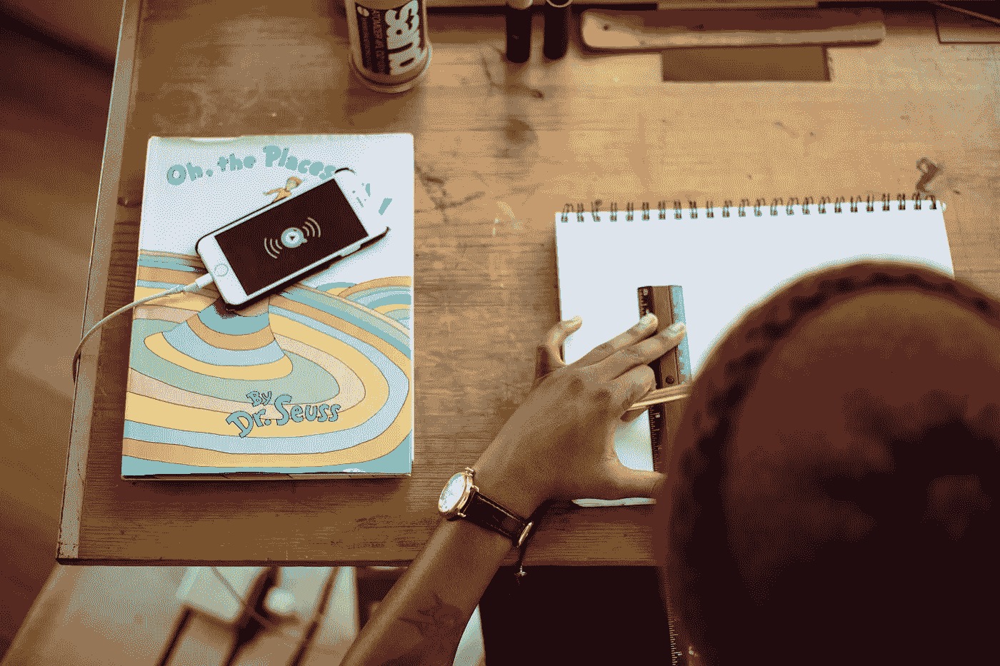

# 如何成为一名更好的设计师

> 原文：<https://medium.com/hackernoon/how-to-become-a-better-designer-f9812ee2dff6>

Photo by [Tamarcus Brown](http://Tamarcus Brown)

## 从 GitHub、Stripe 和 Playbook 设计师身上学到的东西

[**Kathy 郑，GitHub** 的设计师](https://twitter.com/pifafu)

> **问:“你是如何让你的设计令人耳目一新、直观、创新、自然的？**

这取决于你的勤奋和耐心，能够坚持学习，以及你提出正确问题的能力。如果你想提高你的视觉技能，模仿现有的作品是有意义的，这样你就可以建立品味、审美和更高的令人愉快的基线。

如果你想改善你对产品和产品设计的看法，你应该问为什么。你应该学习识别问题、探索潜在的解决方案、确定如何衡量你的解决方案是成功还是失败，以及一旦你知道了这些，你该如何前进。你一直在学习如何与你为之设计的人交谈，以及如何从他们的叙述中提炼出真知灼见。

[**Jared Erondu，设计师兼创业顾问**](https://twitter.com/erondu)

> **问:“年轻设计师磨练手艺的最好方式是什么？”**

磨练任何事情的最好方法就是重复。你只要一直做下去，直到它变成肌肉记忆。无论是在初创公司、机构还是大型科技公司，这都无关紧要。

从个人经验来说，我走的是创业路线，这有很多好处。你离客户如此之近，以至于在你设计任何东西之前，你必须真正理解你试图为他们解决什么问题。大多数创业公司都会失败，所以你也学会了如何理解失败只是生活的一部分。

在中介公司，你也可以学到这些技能。代理商教设计师如何不要太依赖他们的想法，因为很多想法都被抛弃了。即使是被接受的，也大多没有实施。

在大型科技公司，你会学习如何改进你的流程，因为他们会确保人们能够真正理解并做好它。所以，选择你想要的任何一条路，但在一天结束时，这是重复。理解设计师的流程是什么，并多次这样做，直到它深入你的内心。

[**Maddie Simens，UX 条纹设计师**](https://twitter.com/maddiesimens)

> **问:“对于一个强大的 UX 设计组合，你有什么高招？”**

确保投资组合的 UX 是好的。它应该易于在移动设备上查看，并且有人可以快速找到您的联系信息。这听起来很容易，你可以认为这是理所当然的，但如果你做错了，它真的会损害你投资组合中的工作。

追求质量胜于数量。最好有几个，真正好的，有深度的案例研究，而不是大量的产品镜头。试着展示你的过程，而不仅仅是最终产品。解释让你到达那里的决定和探索，以及在这个项目中你本可以做什么不同的事情。

尽可能地使用真实的作品。如果你不得不做一个不请自来的设计来充实你的作品集，尽你最大的努力首先理解那些设计师的决策和约束，然后从那里开始逆向工作。

## 这些问题是从鲸鱼视频中转录出来的。 [***下载巨鲸🐳对于 iOS***](http://bit.ly/askwhale) *扩展你的知识面或者在我们的网站上观看更多。*

 [## 在鲸鱼上加我！用户名:皮法富

### 凯西的视频问答(design @ github & pokémon dweeb)。

askwhale.com](https://askwhale.com/add/pifafu)  [## 在鲸鱼上加我！用户名:erondu

### Jared Erondu(产品设计师和创业顾问)的视频问答。

askwhale.com](https://askwhale.com/add/erondu)  [## 在鲸鱼上加我！用户名:maddiesimens

### UX 设计师 Maddie Simens 的视频问答。只是一个来自克利夫兰的孩子。).

askwhale.com](https://askwhale.com/add/maddiesimens) 

> [黑客中午](http://bit.ly/Hackernoon)是黑客如何开始他们的下午。我们是阿妹家庭的一员。我们现在[接受投稿](http://bit.ly/hackernoonsubmission)并乐意[讨论广告&赞助](mailto:partners@amipublications.com)机会。
> 
> 如果你喜欢这个故事，我们推荐你阅读我们的[最新科技故事](http://bit.ly/hackernoonlatestt)和[趋势科技故事](https://hackernoon.com/trending)。直到下一次，不要把世界的现实想当然！

