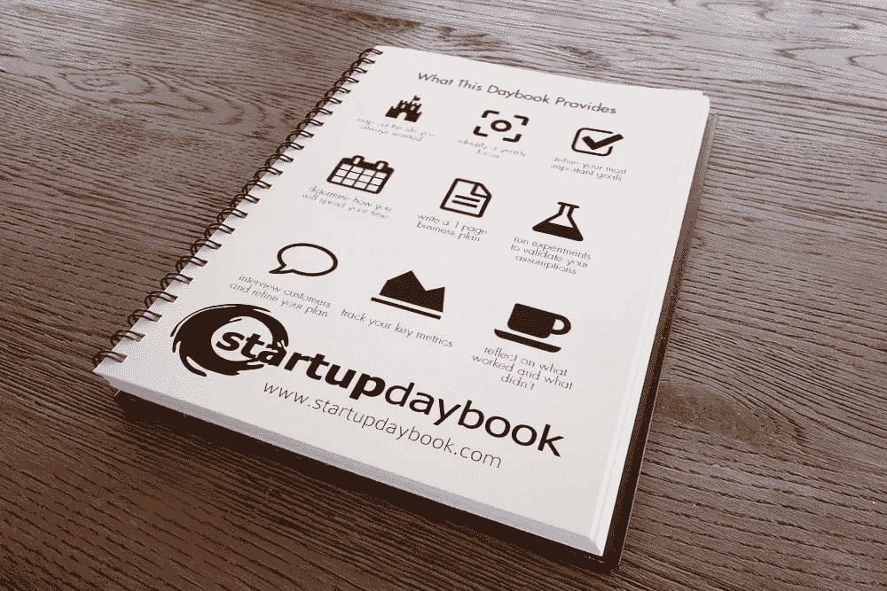

# 如何成为目标黑客？

> 原文：<https://medium.com/hackernoon/how-to-become-a-goal-hacker-4959441aa3e9>

## 为什么习惯的力量让我们不由自主地成功。

每年新年，我们都会为设定新目标而兴奋不已。有无数的文章和新闻故事与决心、目标和开始新的你有关——毕竟*新年，新的你*对吗？

> 今年我要做出我一直想做的重大改变！

不幸的是，我们很少能实现我们的目标。25%的人会在一周后放弃新年决心，60%的人会在六个月内放弃。

因此，几天或几周后，你只是简单地回到你的生活中，那些希望和梦想被锁在一个盒子里，代之以日常的琐事。

不再是了！我是来确保这种事不会再发生的。

# 今天你成为了目标黑客。

大目标或新年决心背后的想法不是问题。下定决心去改变一个不受欢迎的特质或行为绝对是一件好事，但是缺乏计划是整个概念崩溃的地方。

**这让我想到了每个目标黑客都知道的坚持改变的秘密:习惯。**

> **习惯让我们不由自主地成功。**

通过完全创造一个新习惯，我们的大脑实际上在自动驾驶，那些我们讨厌做或想停止做的事情简单地成为我们的一部分，不需要任何思考。

我们从认同某人想去健身房，到认同某人每周 5 天早上 6 点去健身房，甚至没有质疑。很棒吧？

并不是说会那么容易。

养成一个习惯平均需要 66 天(不是我们一直听说的 21 天)。但是什么是不需要努力就值得做的事情呢？

好消息是，我将与你分享这 7 个小贴士，这会让事情变得更简单。

我们开始吧。

# 1.把你的计划写成文字。

*“把你的计划简化为写作。当你完成这一步的时候，你一定会给无形的欲望以具体的形式。”—拿破仑·希尔，《思考致富》作者。*

把事情写下来有巨大的力量。我们的大脑可以想象和实现概念，这意味着我们实际上可以看到自己获得它们。

加州多米尼加大学的心理学教授盖尔·马修斯博士对 267 名参与者进行了一项关于目标设定的研究。她发现，只要把目标写下来，你实现目标的可能性就会增加 42%。

还有什么要说的吗？写下来！

# 2.设定更短的目标时间框架。

当你建立目标时，用 100 天冲刺来计划它们。这是完成大事的完美时间，但也足够短，一旦时间到了，你可以改变或跳过它，而不会打乱你的一整年。

# 3.简单点，笨蛋。

从小处着手。不要说你的目标是实现 10 亿美元的创业估值或被脸书收购，而是从一个合理的收入或用户目标开始，然后不断发展。

制定减肥 5 磅的计划比减肥 100 磅更容易。

减掉 20 次 5 磅，你会得到你一直想要的结果。

# 4.弄个系统。

目标是终点，而不是旅程本身。

> 目标只是一种机制，用来决定我们需要做什么来实现我们想要的。

真正的魔力在于活动本身。

下面是我喜欢的分解方式:

**目标** —创建项目的终点和路线图。
**项目**——为达到目标而计划的工作活动。
**任务/习惯** —完成项目需要做什么。

一旦你建立了你的任务或习惯，这就是你应该关注的全部。这些是你每天都要做的事情，以获得你想要的结果。

# 5.自我认同。

为了对抗你的大脑在试图创造一个新习惯时提出的阻力，你必须将自己视为一个已经实现目标的人。

要做到这一点，在做之前要相信自己的目标。

> 告诉你自己:“我是那种选择蔬菜而不是糖的人”或者“我是一家成功创业公司的创始人，帮助改变了世界”。

# 6.背负式。

我们都有很多现成的习惯，想想你每天早上的例行公事。所以把你的新习惯和旧习惯结合起来。与你每天执行的另一个习惯或仪式捆绑在一起会让它变得容易得多。

> 当我倒一杯咖啡时，我会记下我的日记。

# 7.追踪他们。

*“你无法管理你无法衡量的东西。”—彼得·德鲁克*

保持得分！这就是你看待进步的方式，毕竟除非成功被定义和追踪，否则你无法知道自己是否成功。

现在你知道如何成为一名目标黑客了。永远记住，成功是习惯的结果。

现在有一个额外的技巧:

# 8.创业日记

习惯和目标设定是如此重要，尤其是对企业家来说，所以我为他们创建了一个完整的日程计划和工作手册，你可能会感兴趣。

它叫做 [**创业日记**](http://www.startupdaybook.com) 。超过 1，000 名企业家已经签约获得早期访问，以便他们可以设定更好的目标，更快地实现他们的创业梦想。

Startup Daybook — www.startupdaybook.com

您可以在此注册[加入他们，并获得一份免费的 PDF 样本。](http://www.startupdaybook.com)

# 那么你的目标是什么？先把它们写在下面的评论里，或者发微博给我

> [黑客中午](http://bit.ly/Hackernoon)是黑客如何开始他们的下午。我们是 [@AMI](http://bit.ly/atAMIatAMI) 家庭的一员。我们现在[接受投稿](http://bit.ly/hackernoonsubmission)，并乐意[讨论广告&赞助](mailto:partners@amipublications.com)机会。
> 
> 如果你喜欢这个故事，我们推荐你阅读我们的[最新科技故事](http://bit.ly/hackernoonlatestt)和[趋势科技故事](https://hackernoon.com/trending)。直到下一次，不要把世界的现实想当然！

