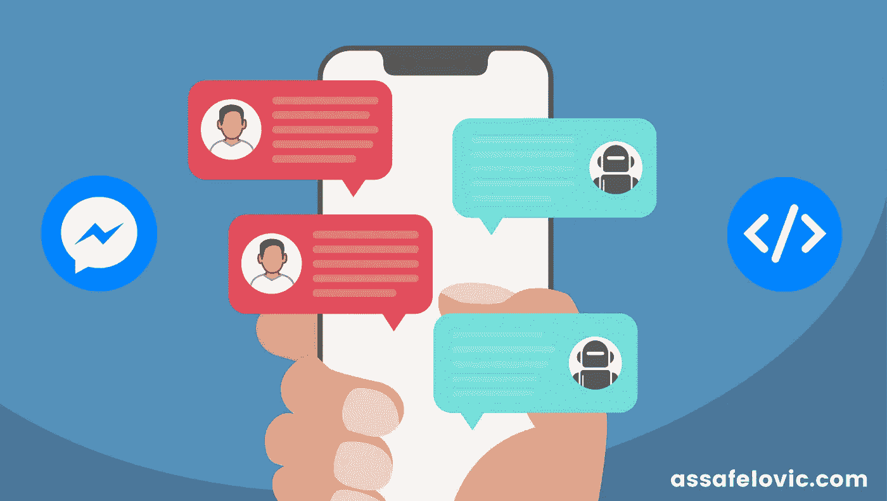

# 如何在 12 分钟内更好地构建你的第一个聊天机器人

> 原文：<https://medium.com/hackernoon/how-to-better-build-your-first-chatbot-in-under-7-minutes-b18a1c6891fd>



Building a chatbot is actually building a conversation between two or more people

**跳过教程，随意从我的** [**Github repo 这里**](https://github.com/assafelovic/facebook_messenger_bot) **下载源代码。**

关于如何构建一个基本的聊天机器人，有很多很棒的教程供初学者使用。然而，这些教程中的大部分描述了无状态聊天机器人的实现。

这意味着，在正在进行的对话中，不会保存关于用户状态的信息。例如，如果机器人问“你在哪里？”而用户回复“旧金山”，机器人就没有办法把问题和用户的回复联系起来。

因为你正在构建一个聊天机器人，你实际上构建的是两个或更多人之间的对话。其中一个恰好是你的机器人。就像在任何对话中一样，你的机器人应该知道如何回复信息，并理解什么时候有人回复他的信息。为此，您必须保存过去消息的历史记录和已定义的对话用户状态。

在我看来，保存用户在对话中的状态对于任何基本的聊天机器人来说都是至关重要的。它允许聊天机器人以自然的流程与用户交流，并获得基本到高级功能的必要信息，否则这是不可能的。

这就是为什么我决定写这篇教程，它解释了如何构建一个基本的有状态 Facebook Messenger bot，它不需要任何先前的 chatbot 开发经验。

# 入门指南

首先，你需要一个脸书开发者账户，可以在这里找到。

其次，按照创建脸书页面的流程开始，通过点击[此处设置一个“网页挂钩”(直到第 5 步)。](https://developers.facebook.com/docs/messenger-platform/quickstart)注意:你应该写下你在教程中提供给网络钩子的验证码。最后，一旦您建立并运行了一个脸书页面，查找页面令牌，并发送一个 POST 请求，内容如下:

```
https://graph.facebook.com/v2.6/me/subscribed_apps?access_token=<TOKEN_GOES_HERE>
```

您应该得到一个响应“真”,这意味着您已经用提供的 API 同步了您的脸书页面。

最后，请熟悉一下 [Node.js](https://nodejs.org/en/download/) 和 [MongoDB](https://docs.mongodb.com/manual/installation/) 的基础知识。另外，你要了解 ES6 的写作基础。

现在让我们为您创建第一个脸书信使聊天机器人！

# 脸书 API 结构化消息

重要的事情先来。了解并学习脸书 API 的基本概念— [点击此处](https://developers.facebook.com/docs/messenger-platform/send-api-reference)。让我们看一个例子:

```
welcome_message: {
   attachment: {
      type: "template",
      payload: {
         template_type: "button",
         text: "Hello and welcome to your first bot. Would you like to get see our products?",
         buttons: [
            {
               type: "postback",
               title: "Yes",
               payload: "get_options"
            },
            {
               type: "postback",
               title: "No",
               payload: "no_options"
            }
         ]
      }
   }
}
```

在上面的例子中，您可以看到，对于发送到脸书的每条消息，我们需要声明消息的类型，在本例中，它是一个模板(对于基本文本，文本就足够了)。此外，我们声明模板的类型(在本例中是按钮)和按钮本身。对于每个按钮，我们需要声明按钮标题、类型和有效载荷。按钮类型是，因此我们将知道如何处理按钮点击，有效负载是，因此我们可以识别用户点击了哪个按钮(源代码中描述了进一步的示例)。

# 服务器端

服务器端的基本和必需实现是为 Messenger webhook 设置一个 GET 和 POST 处理程序。GET 处理程序用于在应用 url webhook 时进行脸书验证，应该如下所示:

```
**function** facebookVerification(req, res) {
    res.send(req.query['hub.challenge']);
}
```

注意:上面的 WEBHOOK_TOKEN 将被设置为您在初始化 WEBHOOK 时声明的那样。脸书以‘我的声音是我的密码验证我’为例。您可以保持原样并更新源代码。

第二个也是最重要的方法是帖子。Facebook Messenger 将发送到您的 bot 页面的每个 ICM(传入消息)通过 POST 发送到您在开发者门户中声明的 url。该方法应该处理所有 ICM，无论是通过用户点击还是通过自由文本到达的 ICM。请注意，你可以添加更多的[模板](https://developers.facebook.com/docs/messenger-platform/send-api-reference/templates)。我将描述在这种情况下使用的三种方法:

```
// 0
app.post('/webhook/', messengerListener);// 1
**function** messengerListener(req, res) {
    **let** messaging_events = req.body.entry[0].messaging;
    **for** (**let** messagingItem **of** messaging_events) {
        **let** user_id = messagingItem.sender.id;
        getUser(user_id, messagingItem, parseICM);
    }
    res.sendStatus(200);
}// 2 **function** getUser(user_id, incoming_message, callback) {
    User.findById(user_id, **function** (err, user_object) {
        callback(user_id, incoming_message, user_object);
    });
}// 3
**function** parseICM(user_id, message_item, user_object) {
   **var** current_state = "welcome_message";
   **if** (message_item.message && message_item.message.text) {
      fb_api.sendFacebookGenericMsg(user_id, message_templates.templates[current_state]);
   }
   user_models.set(user_id, {current_state: ""});
}
```

第一步(注释)是监听 POST 请求，并将它们转发给一个名为 **messengerListener** 的方法(方法 1)。然后，这个方法从 POST 主体中提取相关信息，比如消息项(由用户惟一 id、消息文本等组成)，并将内容转发给一个名为 **getUser** 的方法(方法 2)。

方法 **getUser** (方法 2)尝试从 DB 中检索具有给定惟一 id 的用户。如果找不到用户，则返回 null。最后，用户查询结果被传递给一个回调函数，在我们的例子中是 parseICM(方法 3)。

**parseICM** 方法负责根据用户的 ICM(传入消息)和当前状态发送 OGM(传出消息)。在上面的例子中，默认状态是“welcome_message”。该方法首先对 ICM 类型进行分类，它可以是文本消息，也可以是点击消息(当用户点击 bot 提供的按钮时)。根据 ICM 和用户的状态，发送回相关的响应消息。上面的代码中声明了一些额外的方法，我就不解释了，因为它们基本上是不言自明的，可以在这篇文章顶部(或结尾)提供的源代码中找到它们的完整内容。请随意问我关于服务器端的任何方法和一般流程的任何问题。

最后，为了向最终用户发回一个响应，您需要发送一个 POST 请求，该请求带有如上所述的消息模板，并且具有以下结构:

```
**function** sendFacebookGenericMsg(user_id, message_template) {
    request({
        url: 'https://graph.facebook.com/v2.6/me/messages',
        qs: {access_token: FB_TOKEN},
        method: 'POST',
        json: {
            recipient: { id: user_id },
            message: message_template
        }
    }, facebookCallbackResponse);
}
```

上面显示的 FB_TOKEN 是您通过脸书开发者门户页面收到的页面令牌。

恭喜你！你已经完成了你的第一个 Facebook Messenger 机器人。源代码是以这样一种方式构建的，你可以很容易地将其扩展为一个功能齐全的聊天机器人。

从这里开始，我强烈推荐阅读我写的一篇文章，关于如何通过三个简单的步骤[](https://chatbotsmagazine.com/how-to-improve-your-chatbot-in-3-simple-steps-36f9d26d7f2f)**来提高你的聊天机器人。本文包括如何实现自然语言理解和对话流架构设计的简单方法。**

**要查看完整的项目源代码， [**点击这里**](https://github.com/assafelovic/facebook_messenger_bot) **！请随意提问，我会尽快回答你。****