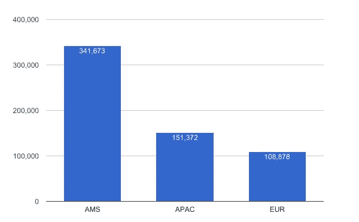
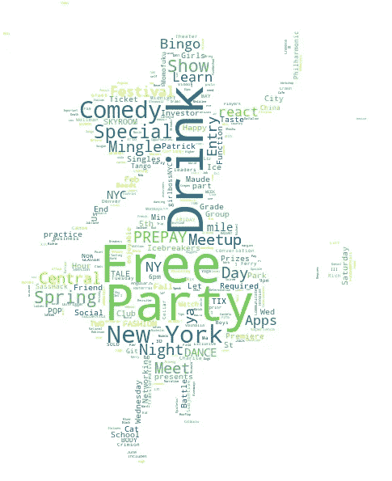
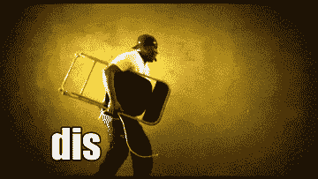

# 如何用机器学习更好地对 Coachella 进行分类(上)

> 原文：<https://medium.com/hackernoon/how-to-better-classify-coachella-with-machine-learning-part-1-dc84c53d1a9c>

这是寒冷的冬季即将结束的时候。气温慢慢上升，鲜花盛开，空气中弥漫着烧烤的清香，我们很快就开始在外面随着脉动的节拍跳舞，周围是一群汗流浃背的人。夏天的节日到了。科切拉音乐节拉开了美国大型户外现场音乐周末活动的序幕。

对于少数不了解的人来说，科切拉音乐艺术节是一年一度的活动，在加州印第奥的帝国马球俱乐部举行。自 1999 年以来，它每年吸引成千上万的游客来欣赏日益广泛的艺术家阵容，这些艺术家以前被认为是主流之外的。一些评论家可能会说，科切拉试图成为每个人的一切，因此失去了个性。其他人会说，参加 Lady Gaga 的科切拉演唱会的人比唐纳德·特朗普的就职典礼还多。但是我有什么资格来评判呢？

但是科切拉到底是什么？是一场音乐演唱会，一场艺术展览，还是只是一片富豪热热闹闹的人山人海？甚至我们人类也很难对这些事件进行分类。机器更是如此。对机器来说,“音乐”、“艺术”或“摇摆的人类”只是一系列的“1”和“0”以及它们之间的无限数量的有理数。

## 类别很重要。

人们快速自动地解释他们看到的东西，从而将熟悉的物体识别为类别成员。这有助于我们快速做出决定。类别允许人类和机器有效地找到他们需要的信息。另一方面，我个人非常想知道，如果我们在超市里用字母表存储物品，会发生什么。A 通道有苹果、阿司匹林和鳄梨。B 通道有香蕉、面包、黄油和发酵粉。但是字母表本身又是一种分类。

我们就随机配货吧，天天换。

但是谁会做这样的事呢？

我想我们需要《T2》中的佩里·法雷尔来拯救世界。

分类与我们的经历和偏好密切相关。因此，正确的分类是我们购买的服务或商品的整体体验的关键部分。

对于机器来说，分类是一项艰巨的任务，教会机器支持我们人类的分类需求是困难的。当技术故障影响了他们的表现时，电台司令今年肯定有故事可讲。在这里，我公开承认从《T4》开始就是他的粉丝。顺便说一句，这张专辑很棒。

那么如何才能教会机器更好地分类呢？我们的人气[下降！in app](https://itunes.apple.com/us/app/drop-in/id1038351294?mt=8) 在全球拥有日活跃用户。从伯利兹到马拉克什，从墨尔本到东京，这个星球上的每个角落都有人每天都在寻找附近正在发生的事件。当然还有[滴！in](http://idrop.in) 是这方面最好的 app。实际上，活动非常多，在运营的第一年，我们的用户已经在我们的平台上生成了 601，923 个活动，它们之间有数亿次交互。

Event volume by region 2016

我们在操作上遇到的问题是，我们无法让每个国家的人通过人工或系统支持对事件进行正确分类。这导致不愉快的用户依赖于寻找体育事件而不是食物事件。这就是机器学习的用武之地。

以下是作战计划:由于我们已经在过去对事件进行了正确分类，我们使用事件数据作为监督学习的来源，并排除我们知道分类不正确的数据。更详细地说，我们想用对具体事件的描述来给我们的[词汇袋](https://en.wikipedia.org/wiki/Bag-of-words_model)对事件进行正确的分类。

## 尤马帐篷仍然是这个节日保守得最好的秘密

它总是从一个问题开始，对吗？问题是，我们拥有的原始数据是可变大小的文本，不能直接提供给 ML 算法，因为它们需要固定大小的数字特征向量。

我们的问题的解决方案是结合 TF-IDF 矢量化和多项式朴素贝叶斯分类。我们使用多项式朴素贝叶斯分类是一种概率学习方法，因为它计算给定事件描述属于给定事件类别的可能性。

我们将假设事件描述中的词对于给定的类别是有条件独立的。例如，如果对于给定的事件描述，cat= 1 表示“艺术”，“科切拉”是单词 420，“出汗”是单词 1036；那么我们假设，如果我告诉你特定事件是‘Arts’，那么单词 420 的知识(如果“Coachella”出现在事件描述中)对“sweaty”是否出现 1036 没有影响。

第二个组件是 T [f-idf](https://en.wikipedia.org/wiki/Tf%E2%80%93idf) 矢量化，它遵循两个主要概念。

1.  在文档中出现的术语的**权重**简单地与术语频率成比例。(《卢恩假设》，1957 年)
2.  术语的**特异性**可以被量化为它出现的文档数量的反函数。

因此，当电台司令玩科切拉时，许多人在推特(或 instagram)上谈论它，这些词共同出现在每个描述中，那么这些词的权重就增加了。当然，如果人们在另一个帖子里抱怨科切拉的长队和汗流浃背的人，那么电台司令的特殊性增加了，而科切拉的特殊性减少了。听起来很简单，对吧？

## 哦爱丽丝！我们去兔子洞

A wordcloud made from 50,000 events in New York in 2016

我们将 tf–idf 计算为术语频率(TF)和逆文档频率(IDF)的乘积。但是在开始计算之前，我们需要根据事件的描述字段生成“相同长度”的向量。文本主体的矢量化会为事件描述中的每个单词分配一个编号。幸运的是，Python 在精彩的 sklearn 包中有一个 TfidfVectorizer。

为了让算法按预期工作，非常常见的词，如“a”或“the”，就像 MTV 上的麦当娜。他们很棒，但也很普通，所以 tf-idf 的分数会大打折扣。

计算的结果是一个 tf-idf 得分矩阵，每个文档一行，列数与数据集中的不同单词数一样多。

如果文本太长，我们需要找到降低维度的方法。幸运的是，在我们的数据集中，基于文本需要在手机上显示的概念，观察的最大长度只有 102 个单词(平均 673.1 个字符)。

谢谢你一路读到这里。在第 2 部分中，我们将展示 Python 的实际实现。

*本文由* [*tenqyu*](http://tenqyu.com) *为您带来，这是一家利用大数据、机器学习和大量创意让城市生活变得更加有趣、健康、包容和繁荣的初创公司。*

[1][https://www.coachella.com/](https://www.coachella.com/)

[2][http://cs229.stanford.edu/notes/cs229-notes2.pdf](http://cs229.stanford.edu/notes/cs229-notes2.pdf)

> [黑客中午](http://bit.ly/Hackernoon)是黑客如何开始他们的下午。我们是阿妹家庭的一员。我们现在[接受投稿](http://bit.ly/hackernoonsubmission)并乐意[讨论广告&赞助](mailto:partners@amipublications.com)的机会。
> 
> 如果你喜欢这个故事，我们推荐你阅读我们的[最新科技故事](http://bit.ly/hackernoonlatestt)和[趋势科技故事](https://hackernoon.com/trending)。直到下一次，不要把世界的现实想当然！

