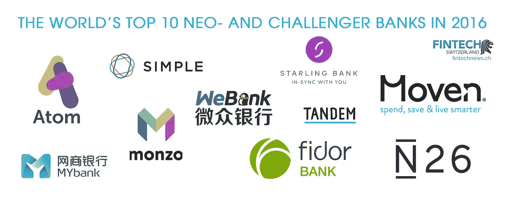
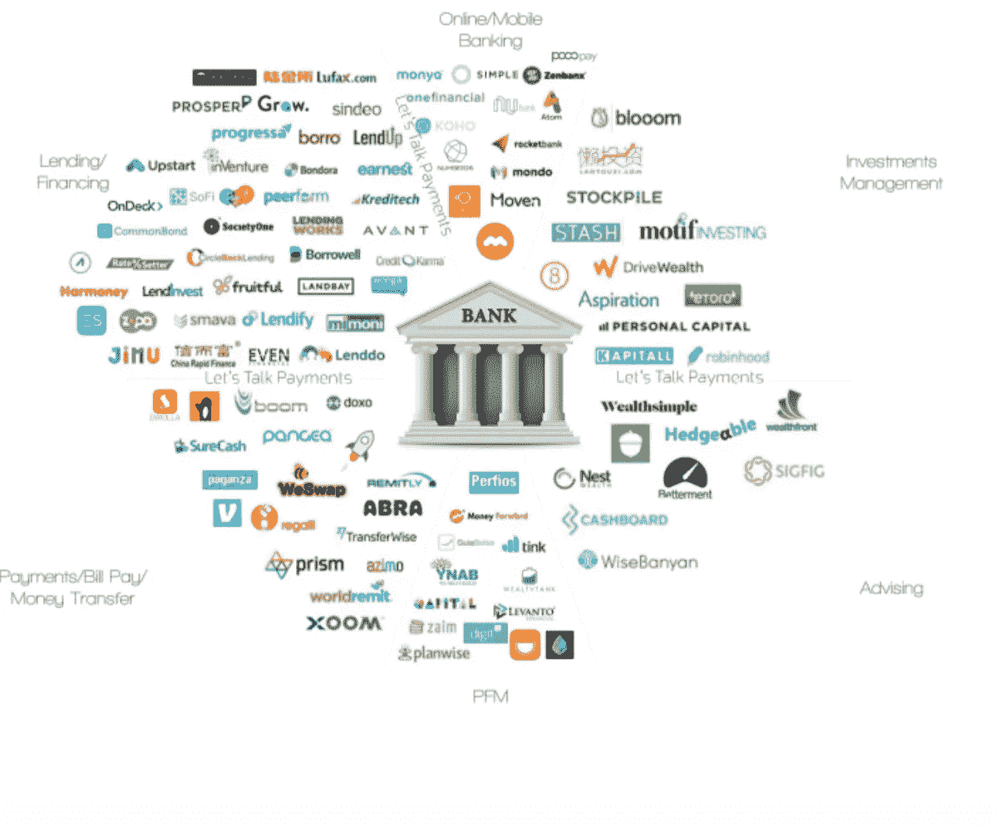

# 如何建立一家银行

> 原文：<https://medium.com/hackernoon/how-to-build-a-bank-cf27d0ca3824>

## 审视银行业的替代模式

> 预测未来的最好方法是创造未来。—亚伯拉罕·林肯

当我写这篇文章的时候，未来正在被创造。我做梦也想不到，在未来，隐藏在先进技术平台外表下的数学将彻底改变金融服务的面貌。数豆子也变得非常复杂。

如今，人们谈论苹果(Apple)和亚马逊(Amazon)等科技公司创建自己的银行。这是为什么呢？想想吧。这些公司不仅代表了出色的客户体验(通过 NPS 和纯粹的增长来衡量)，更重要的是，他们的武器库中有两个工具:技术和资产负债表规模。

我并不是说这些公司一定会成立一家银行，但对于每一个考虑创办一家新银行的企业家来说，扩大分配给竞争对手的盒子，以纳入一系列具有不同实力的参与者，是一个经常被重复的常识。

在我们生活的这个世界里，在《魔兽世界》等游戏中买卖的视频游戏货币(计算机代码片段)有一天可能会以比特币/加密货币(利用密码学和分布式网络安全传播)的名义成为现代货币的前身。

具有讽刺意味的是，电子游戏代币让我想起了我们史前祖先用作货币的贝壳，也可能是用来玩的。那么问题就变成了:我们到底有没有进化？但是，这是另一个时间的讨论。

今天，技术正在使银行的创建民主化。新银行是否能承受动荡、扩大规模和/或整合是一个值得关注的有趣故事。

# 一份推荐信

对于我所有的读者来说，如果你还没有读过这个迷你系列的第一部分，它的开头标题是“你可以在银行里看到硅谷，而不是在硅谷的银行”，请阅读它[这里](/@abhishekkothari/you-can-find-silicon-valley-in-a-bank-not-a-bank-in-silicon-valley-2baed316d411)。

虽然这篇文章也可以独立阅读，但我还是建议阅读第一部分，以全面了解当今的游戏状态。

# 新的挑战者

今天的伦敦被广泛认为是金融科技的全球领导者。可以理解的是，纯粹的数字银行，如 Atom、Monzo、Starling 等。总部在英国之外。中国是另一个与微众银行和 MyBank 齐名的后起之秀。Fidor 和 N26 是德国球员，Klarna 是瑞典人。澳大利亚最近见证了一个名为 [Xinja](http://xinja.com.au) 的“新银行”的诞生。

我在这里的有限观点是，数字银行正在世界各地兴起。更大的集中发生在欧洲。然而，印度的支付处理金融科技公司申请银行牌照可能只是时间问题。

印度的数字银行已经是数字银行的典范，就像美国的 Ally bank 和哈萨克斯坦的 B1NK 一样。Tide Bank 还提供完全数字化的商业银行账户。

根据[让我们谈谈支付](https://medium.com/u/c77b990407ec?source=post_page-----cf27d0ca3824--------------------------------)，[它追踪的全球金融科技初创公司中，近 19%是支付公司](https://letstalkpayments-com.cdn.ampproject.org/c/s/letstalkpayments.com/how-fintech-serves-gig-economy-and-workforce/amp/)。PayTM 在印度就是一个很好的例子。

支付领域的金融科技公司已经开始获得许可证。根据[《经济学家》](https://www.economist.com/news/finance-and-economics/21723857-fintech-firms-are-beginning-compete-head-banks-klarna-swedish-fintech):“2017 年 6 月 19 日，价值 22.5 亿美元的瑞典支付公司 Klarna 成为最新一家——也是迄今为止最大的一家——获得该奖项的公司”

孟加拉国的 bKash 和肯尼亚的 M-Pesa 也在推动移动支付，并可能扩大规模。

Bunq 是一家荷兰支付公司，开始时和 Klarna 一样，但是扩展到了存款账户。一些银行，如德国的 N26 或英国的 Atom Bank，从一开始就寻求成为提供全面服务的在线零售银行。一家新的英国清算和结算银行 ClearBank 希望为其他公司提供服务。(来源:《经济学人》)

这里需要注意的是，任何与不同形式的货币(包括加密货币)打交道的玩家都可以真正考虑成为一家银行。因此，实际上竞争可能来自任何角落。尽管这很可怕，但对于银行来说，这也是一个令人兴奋的时刻，它们要改造陈旧的系统，成为金融包容性、货币和经济政策的复兴提供者。从某种意义上说，现任者已经领先一步。

下图描述了一些新出现的金融科技银行:

Fintechnews.ch

我可以去讨论每个单独的实体，但这意味着陈述显而易见的事实，让你(我的读者)不必经历了解不同故事的有趣旅程。相反，我将把重点放在建设新时代银行的一些基本要素上。

这是一张来自[让我们来谈谈支付](https://medium.com/u/c77b990407ec?source=post_page-----cf27d0ca3824--------------------------------)的信息图，它提出了一个相关的问题:是否每一项银行服务都有一家金融科技初创公司？

# 如何启动数字银行

简单来说，银行接受存款，发放贷款，并从贷款利息和存款利息中赚取利差，称为净息差。这是一个财务描述，但更重要的是:

> 让客户成为体验的核心

## 亲爱的，这都是为了钱

金融科技公司的管理层要么拥有传统银行业的经验，要么拥有资本来源，即财团。合格投资者、风险资本、私募股权、家人、朋友(千万富翁朋友不是我们普通人)。后来，可以从传统金融机构获得循环信贷或其他信贷额度。具有讽刺意味的是，资本可能从金融科技公司试图扰乱的业务中筹集。

如果不良贷款的净利息收入或信贷成本高于融资成本和/或固定成本和管理费用，该金融科技平台可能很快变成一艘沉船。因为其他资金的成本普遍高于要支付给储户的利息，所以提高存款成为必然。后来，规模变得至关重要。

## 未得到充分服务的部分:

金融世界的大部分都是建立在模型之上的。以 FICO 评分为例，它将信用历史的长度作为决定信用评分的关键因素，这是正确的，一致性是一个很好的预测因素。然而，可能会有年轻的借款人，他们没有长期的信用历史，但有一些其他的补偿因素，如良好的教育。金融科技模型融入了其中一些因素，以服务于不应得的细分市场。此外，它们还可以服务于千禧一代或早期新兴的富裕人群，这些人还没有足够的存款来维持一个高余额要求的存款账户。这可能是另一个服务不足的细分市场。

另一方面，中小型企业也可能是得不到充分服务的部分。通常，满足传统商业银行所需的收入水平和/或流程可能无法由小企业家实现。

金融科技银行对包容性的承诺可能是科技的一种理想用途。这个想法让人想起孟加拉国小额信贷机构格拉米银行的创始人穆罕默德·尤努斯的一句话。

> 穷人自己可以创造一个没有贫困的世界。我们所要做的就是把他们从我们套在他们身上的枷锁中解放出来！

这意味着包容必须先于利润。在当今世界，这是一项说起来容易做起来难的任务，但有了健康的公私伙伴关系，就可以迈出第一步。

## R **监管审批:**

在没有存款的今天，金融科技公司利用从各种投资者那里筹集的部分资本来放贷或上市融资。

然而，要真正创建一家银行，金融科技公司必须获得存款机构牌照，这比听起来要难。

监管者应被视为客户和金融服务实体之间的桥梁。监管者希望两者都能成功。

今天，在美国，FDIC(联邦存款保险公司)为储户的部分存款提供保险。在银行挤兑(流动性危机)的情况下，即人们排队等候从分行或自动取款机取钱，联邦存款保险公司将保证储户取回高达 25 万美元的钱。

货币监理署于 2017 年 3 月发布了一份“[许可手册补充草案，用于评估金融科技公司](https://www.occ.gov/news-issuances/news-releases/2017/nr-occ-2017-31.html)的特许申请。这为金融科技公司打开了大门，让它们开始向银行迈进。

在美国，要成为一家成熟的银行，需要遵守许多州和联邦监管机构的规定。虽然艰难，但旅程已经开始。相比之下，在英国，金融服务管理局是主要监管机构。

因此，对接纳数字银行采取更积极姿态的地区已经出现了许多新的参与者。

当然，没有什么能阻止现有银行建立一家完全独立的子公司，一家纯粹的数字银行。瑞典的 Swish 和美国的 Zelle Pay 已经是现有企业涌入点对点支付应用领域的例子。

事实上，风险管理通常是银行的一大优势，可以通过以较低成本快速获得客户而得到显著增强。

## I **T 基础:**

金融科技实体可以选择采用“全栈”方法，即从头开始构建他们的数字系统或从旧机构接管遗留系统。英国的一些银行(如 Starling)从头开始构建 it 系统，而 Atom bank 使用商品化的软件。金融科技玩家还需要从与现任银行/监管机构一起在沙盒中工作开始，并使用他们的 API 访问常见的客户数据。API 是应用程序编程接口(API)，称之为连接金融科技玩家程序和现任程序的粘合剂，允许应用程序在客户许可的情况下验证和更改客户数据。

什么是沙盒？API 沙箱是一个测试环境，类似于真实的生产环境，开发人员可以使用它来进行测试，以了解他们需要的 API 如何与他们自己的编程 API 进行交互。

英国政府在 2015 年创建了一个监管沙盒，以帮助促进创新。

## **诱人的定价**

由于纯粹的数字银行没有遗留的基础设施，它可能会提供比其他参与者更好的利率。这是一个伟大的客户获取工具，因为它试图减少客户从现任者的转换成本。然而，只有优质的服务才能留住新银行的客户。

## 一 **TM 网:**

虽然不是必需的，但允许全面服务借记卡取款的 ATM 网络可能是一个有吸引力的附加功能。没有自己的自动取款机吗？没问题。用别人的。例如，[第一数据](https://www.firstdata.com/en_us/products/global-and-national-financial-institutions/atm-debit-processing.html)为银行提供 ATM &网络解决方案。这个领域的早期参与者之一是一家名为 Simple 的初创公司，它利用了 First Data 的星型 ATM 网络。

## **区块链账本:**

分布式数据库或区块链账本，不变地记录交易。

未来，区块链账本还可以促进几乎即时、不可改变和更便宜的国际货币转移。

一个包含世界上发展最快的语言的区块链——表情符号可能是一种真正有趣的体验。想想区块链上的 Venmo。

显然，建立一家银行需要更多的东西:赢得信任、健全的管理团队、客户支持团队、客户体验团队、营销、机器人顾问、智能合同等。

我在上面(通过构建自己的银行框架)强调了一些基本要素，以解释已经出现和即将出现的数字银行。

# 最后的想法

我个人没有建银行。我也看不清未来。

但是，我试图捕捉新时代银行的基本要素(通过建立新银行的视角)，在这个时代，技术已经消除了创建银行的许多摩擦。

其次，创建一家银行是一回事，经受时间的摧残又是另一回事。可持续性和可扩展性是持续建立信任和惊人的客户体验的功能。

最后，永远不要忽视企业正在解决的问题。最终，我们的目标不是颠覆任何行业，而是让人们的生活更轻松。颠覆伴随着进化而来——只有适应性强的才能生存。

在这个迷你系列的第三部分中，我将讨论可能出现的未来场景。这样做，我想促成一场围绕一个简单问题的大辩论:令人惊叹的客户体验是“为他人而活”的另一个名称吗？当然，最后是有经济回报的。

不讨论金融科技对人类的影响，任何关于金融科技的讨论都是不完整的。

因此，我留给你们一个想法:

> 商业是利他主义的一种形式吗？(服务他人在先，利益在后为善的‘因缘’)

免责声明:以上表达的所有观点都是我的个人观点，不代表任何其他实体的观点。

## 感谢您的阅读。如果你喜欢这篇文章，请点击下面的心形推荐它。

## 如果你认为这篇文章有教育意义，请与你在脸书、推特、LinkedIn 或其他社交媒体上的关注者分享。

## 你也可以在推特上关注我:@akothari_mba