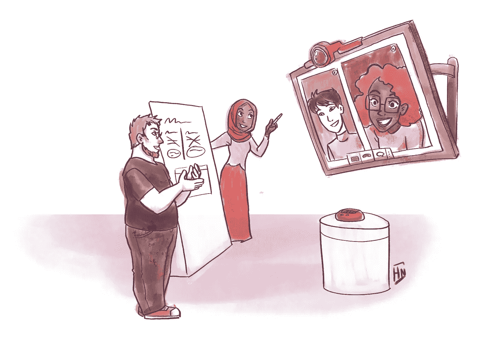
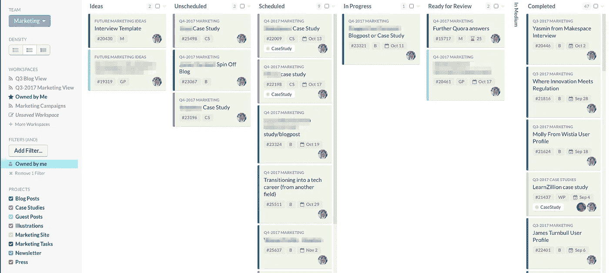
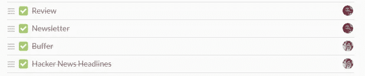

# 如何建立更好的营销团队

> 原文：<https://medium.com/hackernoon/how-to-build-a-better-marketing-team-ea524b23a32b>

Illustration by [Havana Nguyen](http://www.havananguyen.com/)

今天的工作看起来不像五十年前——甚至十年前。除了更强大的技术影响我们工作的方式之外，越来越多的人开始从事自由职业或远程工作。在过去的十年里，全职远程工作者的数量增加了 115% ，43%的美国人[说他们在 2016 年至少有一部分时间在家工作。说到自由职业者，](https://www.nytimes.com/2017/02/15/us/remote-workers-work-from-home.html)[最近估计他们占美国劳动力的 35%](https://www.bbbtrusted.org/blog/2017/08/rise-freelance-workers/) ,在过去几年中有强劲的上升趋势。

这些转变的连锁反应将在许多地方和方式上被广泛感受到。但是他们的意思是，我们不必再像以前那样工作了。

一个典型的例子是:我工作过的许多初创公司已经转向混合营销团队，由远程/办公室员工和自由职业者/全职员工组成。这种类型的团队有很多优点，但是也有一些陷阱需要避免。

**首先，我们来谈谈什么是混合营销团队:**

# 混合营销团队:崩溃

出于这篇文章的目的，我将使用 [Clubhouse](https://clubhouse.io/) 团队作为例子。在 Clubhouse，营销团队由两名内部员工和两名远程自由职业者组成:

*   Camille Acey，客户成功副总裁，在所有博客文章和其他内容/文案发布之前对其进行审核和编辑，贡献自己的内容，撰写和安排新闻简报，并从以客户为中心的角度为我们的营销战略提供意见
*   帕夫拉·米库拉，客户成功主管，负责客户访谈，有时为博客撰写内容
*   米歇尔·罗森塔尔，我们所有的插图都是她画的
*   当然，还有[我](http://www.chelleshock.me)——我撰写大部分内容，同时编辑/校对其他人的作品，偶尔撰写文案，社交媒体工作，并与团队的其他成员共同创建一个强大的内容策略

卡米尔和帕夫拉有时在现场工作，有时在远处工作，就像俱乐部团队的其他成员一样。两个米歇尔都是远程工作的承包商。

## **混合团队结构的其他几个例子:**

*   一名编辑/内容营销经理，他是一名员工和一个自由撰稿人团队(对于启动内容营销战略的初创公司来说很好)
*   内部内容营销经理，负责监管宏观战略，但不亲自编辑，有自由编辑和作家(非常适合需要制作大量内容的企业，内容营销经理不会成为流程中的瓶颈)
*   内部营销经理和自由职业的内容营销经理，他们也撰写大部分文章(非常适合非常小的企业或具有强大的“传统”营销成分的企业，如报纸或电视广告等。)

这些例子各有利弊。**一般来说，让一个人监督、批准和管理多个自由职业者的问题是，他们几乎不可避免地会成为一个瓶颈。**这种情况发生在*我所在的每个*团队中，一个编辑为多人工作，尤其是当编辑还做其他工作的时候。

## 避免瓶颈:

如果你有不止一个自由撰稿人，也计划和一个自由编辑一起工作，或者制定具体的计划来防止过程中的瓶颈。计算出你的内容营销经理/编辑/员工一周需要编辑多少内容，以跟上你的编辑日程，如果这些指标没有达到，就制定一个应急计划。

# 你为什么要这样组建营销团队？

如果你执意只雇佣员工，你可能会想为什么和自由职业者一起工作并让他们成为你的营销团队和过程中非常核心的一部分是有意义的。

有潜在的不利因素。自由职业者是出了名的古怪(我说的是古怪！)，而且有时候，他们对你的公司或产品的投入比员工还少。好消息是，一旦你知道自己在做什么，淘汰不可靠的自由职业者是相当容易的——稍后会有更多的介绍。

不可否认，自由职业者对你的事业不如雇员投入，但这种差异可能比你想象的要小得多，尤其是最新一代的雇员经常跳槽(跳槽在初创公司的雇员中很常见)。

创业公司的优势？管理费用比雇佣一名员工的*低得多*。除了[招聘、雇佣和入职新员工的时间和金钱成本](https://www.fastcompany.com/3028628/infographic-how-much-a-bad-hire-will-actually-cost-you)，还有一个有经验员工的薪水问题。现在，我已经有了八年的自由职业经验，并且在 B2B SaaS 领域工作了几年。雇用有这种经验的人可不便宜。

与自由职业者一起工作也使得与一群在工作中非常优秀的人一起工作变得容易。如果你只有一名员工的预算，你可以从以下选项中选择一项:

*   试图找到那种罕见的(有人会说是不存在的)对一切数字化事物都感到惊奇的营销者
*   雇用专门研究你认为你的营销策略将围绕的东西的人(并希望数据不会告诉你其他东西会更好)
*   雇佣在某一方面非常出色，而在其他方面相当出色的人

能够写出长篇博文的人不一定就是能够震撼你的网页文本或电子邮件营销的人。如果你愿意和自由职业者一起工作，你可以用和雇佣一名员工相同或更低的价格让专家来完成所有这些事情，而且还能获得更好的效果。

**与承包商合作还能让你的战略更加精益和灵活。**如果一个自由职业者不适合工作(或者你的营销策略改变，不再需要他们的技能)，改变你的团队结构很容易，不必考虑遣散费或再次经历完整的员工招聘/雇用/入职流程。

## 审查你的自由职业者

说完这些，让我们来谈谈如何扫清与自由职业者共事的最大障碍:剔除那些不靠谱的人。当我和 Clubhouse 开始合作时，最初的流程是:

1.  与卡米尔面谈以评估适合度
2.  与 Kurt 和 Andrew(联合创始人)面谈，继续评估 fit，谈论我的背景/经验/与以前客户的合作结果等。
3.  向会所团队提供以前客户工作的参考资料
4.  向 Camille、Kurt 和 Andrew 发送一份建议书，概述 90 天试用期的交付成果和目标(我为我所有的聘用客户提供 90 天试用期，以确保我们非常合适，这对每个人都很好)
5.  根据会所团队的意见，根据需要对提案进行编辑/修订/调整

所有这些花费了大约 4-6 周的时间，只有在这个过程之后，我们才签署了合同并开始一起工作。

在合作一份高承诺的合同时，询问推荐人总是一个好主意，就像询问某种提议一样。即使提案在成为合同之前被大量修改，这也是测试沟通、响应和周转时间的好方法。安排会议也是如此。如果有人每次开会都迟到 15 分钟，那就是危险信号。

**据我所知，越来越多的公司正在采用类似上述的充实的自由职业者“招聘”流程。**当你迫不及待地想要启动营销时，很难等到额外的时间来全面审查自由职业者，但以我的经验来看，那些根据一封电子邮件聘用自由职业者的公司往往没有能够先全面审查该自由职业者，然后后悔。而且，如果你的时间表允许，你可以将上述过程压缩到 1-2 周，这是一个完全合理的等待时间。

## 什么*不*要做

我*不会*建议的是期望合同工在你的审查过程中做以下任何一件事:

*   免费工作(即免费测试职位)
*   “如果我们喜欢/使用它，我们会付钱给你”的工作
*   打折作品

任何有足够经验的自由职业者都会拒绝。当他们可以为另一个客户做有偿工作时，他们为什么要为你做免费工作？这种方法不会帮助你审查你的自由职业者，相反，它可能会让你从一堆不那么优秀的作品中筛选出来，不得不从头开始。

还有独立承包人和雇员的额外问题，当和聘用的自由职业者一起工作时，这个问题会很棘手。**确保阅读**[**IRS 指南**](https://www.irs.gov/businesses/small-businesses-self-employed/independent-contractor-self-employed-or-employee) **并创建面向自由职业者的零工/职位发布。**

## 自由职业者，以下是你的收获:

对于自由职业者来说，最大的缺点是把大部分鸡蛋放在一个篮子里。如果你每月收入的很大一部分来自一个客户，而这种工作安排结束了，那么很难迅速填补这个缺口。

然而，这也是自由职业游戏的名字。这就是为什么你不打算无限期地拥有某些客户，定期跟进以前的客户，并在好的几个月里存钱以度过不好的几个月。

自由职业者的优势显而易见:稳定的收入。也有机会真正投入到一个项目中。我喜欢写作，否则我不会花这么多时间在这上面——但能够以一种我无法真正与那些“仅仅”利用我发布博客帖子或销售文案的客户打交道的方式，获得内容营销和 Clubhouse 战略的超级实践，这是一种额外的满足感(和乐趣)。

# 幕后:我们的营销流程

我们保持我们的营销流程相当轻便，以符合我们团队的混合风格:

*   每周，营销团队都会在 Google Hangouts 上召开 30 分钟的状态会议，讨论一周内完成的工作，讨论任何可以做得更好的障碍或事情，并计划下周的工作。我还每周给 Kurt、Andrew 和 Camille 发一封电子邮件，回顾我的工作，这样就有了一个连续的进度日志。
*   在季度初，我们评估上一季度完成的工作，并召开 60-90 分钟的会议来集体讨论下一季度的战略和目标。会议记录保存在谷歌文档中，任务会立即上传到俱乐部。
*   当然，所有的工作都在俱乐部会所中进行跟踪。例如，对于书面内容，我们为想法、待办事项、下一步、进行中、准备审阅和中等设置了专栏。当我们处理文章或内容时，文章或内容会以看板的方式全面移动。
*   我们在不开会的时候用 Slack 来交流，用 Clubhouse 来留下关于特定任务的评论或更新，用 Buffer 来安排社交媒体更新，用 Google Docs 来组织我们所有的内容/文案/策略笔记并跟踪修订。

**从始至终，我们的内容创作过程看起来像:**

1.  想出一个主意(通常来自客户访谈或我们的周会)
2.  在俱乐部会所为它创造一个故事，并指定一个日期
3.  我在 Google Docs 上写草稿，而 Michele 为这篇文章做插图(这篇文章是通过一个链接到博客文章的独立故事来跟踪的)
4.  草稿完成后，我会在 Clubhouse 中发布链接，给 Camille 添加一个任务来审阅它，有时会让她休息一下(这取决于她当时的工作量以及她错过 Clubhouse 通知的可能性)
5.  在她最初的评论之后，我处理了她所有的编辑请求和评论/问题(我们大量使用了谷歌文档上的编辑建议和评论功能)
6.  她又审阅了一遍，然后给我发帖子开了绿灯(或者发回去做更多的编辑)
7.  我把它放入 Medium，加上 Michele 的插图和一些其他的润色，然后把它作为草稿提交给俱乐部博客
8.  卡米尔接受并安排了时间，帖子上线了
9.  我在公司缓冲账户中为该职位安排股份

每当我完成一轮工作，我就把这个故事全盘搬移。与修订过程无关的工作通过故事中的任务来处理:

有一次，卡米尔和我做了额外的每周例会来检查，但我们发现他们是多余的。在很大程度上，团队很乐意在空闲时交流，我个人也讨厌不必要的会议，所以这很好。

这有助于我们对每个工具都有一个非常具体的用例，而不是将一些东西放在 Google Docs 中，一些放在 Evernote 中，或者在 Slack 上进行一些对话，一些通过电子邮件进行。每个人都在办公室的团队可以稍微放松一下，但是当涉及到远程或部分远程团队时，我强烈建议坚持使用每个工具的特定用例。

我可以永远谈论营销过程(我最喜欢的书呆子话题之一——随时让我知道你对未来的帖子有什么问题！).**简而言之，这就是我们的工作方式，我所在的大多数成功的混合营销团队都使用了这些流程的一些变体。**

# 但是……有用吗？

因为我知道你在想:这有用吗？**这样的团队真的能取得成效吗？**答案:是的！Clubhouse 的混合营销团队始于 2016 年底。从 2017 年 1 月到现在，与去年同期相比，浏览量增长了 181.77%，我们的用户转化率增长了 202.13%。

显然，这不仅仅是团队结构——如果你没有战略来实施，拥有一个令人惊叹的团队是不会有结果的。但那完全是另一篇博文。

重点是:当你开始一家新公司，或者在你的公司里开始一个新团队时，你不应该觉得有必要坚持传统的团队结构。**混合团队灵活、精干，可以用更少的预算为你带来成果——所以为什么不试一试呢？**