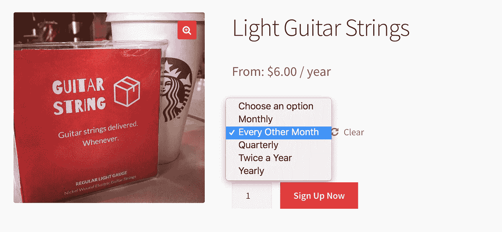
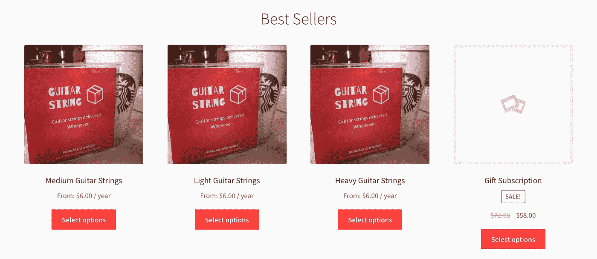

# 如何在 1 天内建立一个订阅网站

> 原文：<https://medium.com/hackernoon/how-to-build-a-box-subscription-site-in-1-day-8dd041fdfe5>

## 有效建立 box 订阅初创公司的 3 个技巧

# 学习一项新技能=不好

建立一个电子商务订阅商店出奇的困难。在过去的两个星期里，我一直在用一个新的框架 Moltin，建立一个定制商店。这为我提供了比任何其他方法都多得多的定制和可扩展性，但这是有代价的——它很慢，很复杂，而且 Moltin 是早期[创业公司](https://hackernoon.com/tagged/startup)的事实对此没有帮助。我发现了半打以上的 bug 和丢失的文档，进一步减慢了开发速度。

我认为 Moltin 是我的订阅店的正确选择。我意识到学习一项新技能实际上是不好的，至少有时是这样。我想要的灵活性实际上使事情变得更加复杂和令人沮丧。当你需要完成某件事时，坚持你所知道的，不要试图去学习。

# 解决你今天的问题

莫尔丁也是错误的选择，因为我关注的是“未来”，而不是“现在”。如果吉他弦盒爆炸，需要真正的可伸缩性，当然，Moltin 可能比其他解决方案更好。但这解决了一个我可能永远也不会有的问题，并马上产生了问题。解决你现在在创业的验证阶段遇到的问题。你可以在有付费客户的时候处理未来，而不是之前。

# 依靠你已经知道的有用的东西

我放弃了我的网站，重新开始。最快可行的解决方案是什么？Squarespace 和 Shopify 都是建设商店的良好平台，但都不支持订阅产品。让你设置订阅的插件很糟糕，因为客户必须经历额外的结账步骤。不太好。

Wordpress 占据了 [26%的互联网份额](https://managewp.com/statistics-about-wordpress-usage)。woo commerce(Wordpress 最大的电子商务插件)在互联网上有超过 200 万次安装。好的，这很有效。让我们利用这一点。

The products

*利用你的优势，不要改进你的劣势(当专注于速度时)*

Wordpress 还有一个额外的好处，就是易于使用，这也是我刚起步时花了很多时间学习的。我花了两个星期试图让 Moltin 工作，并有一个半成品。Wordpress 设置 2 小时后，我就建起了我的整个商店。订阅、产品、动态定价，我想要的一切。通过利用我已经掌握的技能，我从 2 周缩短到了 2 小时。我再也不会犯那个错误了。

**使用的工具**

*   wordpress 软件
*   网络商务
*   网络商务订阅
*   店面 Wordpress 主题
*   店面 Wordpress 子主题(用于自定义)
*   一些基本的自定义主题，使它看起来不蹩脚

# 什么时候学习，什么时候做

学习新工具很有趣，但它不会很快给你带来成效。我开始制作吉他弦盒的时候并没有明确的目标。如果主要目标是学习，好吧，那就专注于此。但是，如果你的主要目标是建立一个企业或完成一些事情，那么就专注于此，并利用你已经知道的东西。

不要通过学习新工具和扩大规模来增加自己的工作难度。你可以以后需要的时候再处理。现在你需要获得用户。注重完整，而不是完美。

# 后续步骤

吉他弦盒的下一步是设计网站，设置安全检查，并获得产品！给我们绳子的中国工厂应该能在两周内发货！一旦我有了样品，我会贴上照片的。

我花了 6 个月的时间在 4 周内完成了发布。到目前为止，我有两个失败的产品，一个等待应用程序商店的批准，一个正在进行中。一旦吉他弦盒完成，我将自学拼图的最后一块，获得用户！这是

*   ✅创意精选
*   ✅打造产品
*   ✅保持专注
*   ✅优化结果/速度
*   ⬜️获得用户/收入

**问题:**你最需要什么帮助？创意选择、保持专注、构建产品或获得用户/收入。通过[邮件](mailto:elijah@4weekstolaunch.com)，回复/评论，或者[电话](https://calendly.com/elijahmurray-1)让我知道。

> [黑客中午](http://bit.ly/Hackernoon)是黑客如何开始他们的下午。我们是 [@AMI](http://bit.ly/atAMIatAMI) 家庭的一员。我们现在[接受投稿](http://bit.ly/hackernoonsubmission)并乐意[讨论广告&赞助](mailto:partners@amipublications.com)机会。
> 
> 如果你喜欢这个故事，我们推荐你阅读我们的[最新科技故事](http://bit.ly/hackernoonlatestt)和[趋势科技故事](https://hackernoon.com/trending)。直到下一次，不要把世界的现实想当然！

