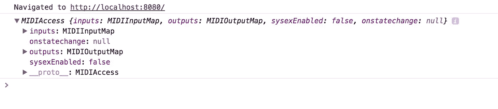

# 如何用 Express.js & Socket.io 构建协同 MIDI App

> 原文：<https://medium.com/hackernoon/how-to-build-a-collaborative-midi-app-with-express-js-socket-io-273663b63201>

在本教程中，我将向你展示如何构建一个应用程序，让你可以使用 midi 键盘与朋友实时制作音乐！这是我们正在建造的:

Key light up pink for you, blue for other users.

> 试试现场演示:[https://midi-collaboration.herokuapp.com/](https://midi-collaboration.herokuapp.com/)
> 
> 查看代码:【https://github.com/agbales/web-midi-collaboration】T2

如你所见，弹奏一个音符会点亮一个粉红色的键，并在列表中显示输入数据。如果另一个用户加入该会话，他们的输入将显示为蓝色，他们的数据将在列表中显示为蓝色条目。

我们将该过程分为 5 个部分:

1.  使用 Express.js 创建应用程序
2.  连接 Midi 控制器
3.  为协作添加 Socket.io
4.  式样
5.  部署到 Heroku

# **第一步:创建一个 Express.js 应用**

我们将首先创建一个目录，并使用以下三个终端命令初始化项目:

```
mkdir midi-collaboration
cd midi-collaboration
npm init
```

NPM 实用程序将要求提供一些信息来设置 package.json 文件。请随意提供这些信息，或者按 enter 键暂时将这些字段留空。

接下来，添加 Express:

```
npm install express --save
```

在 package.json 中，您现在会看到 Express 作为一个依赖项包含在内。

在根文件夹中，使用以下内容创建 server.js:

```
touch server.js
```

在 server.js 中，添加以下内容:

```
var express = require('express');
var app = express();
const port = process.env.PORT || 8080;
var server = app.listen(port);app.use(express.static('public'));
```

这将创建一个 Express 实例，并将端口默认设置为 8080。app.use 指示 express 提供“公共”文件夹中的文件。如果你现在运行服务器，你会得到一个错误。那是因为我们还没有公共文件夹！

**公共文件夹**

让我们创建公共文件夹:

```
mkdir public
cd public
```

在里面，我们将创建 index.html、index.js 和一个包含 style.css 的 CSS 文件夹:

```
touch index.html
touch index.js
mkdir css
cd css
touch style.css
```

“公共”文件夹应该如下所示:

```
public
  --> index.html
  --> index.js
  css
     --> style.css
```

index.js 应该链接到 style.css 和 index.js。所以让我们添加以下内容:

```
<!-- /public/index.html --><html>
  <head>
    <title>Midi Collaboration</title>
    <link rel="stylesheet" href="css/style.css">
  </head>
  <body>
    <div>
      <h1>MIDI Collaboration</h1>
      <ul id="midi-data">
      </ul>  
    </div>
  </body>
  <script src="index.js" type="text/javascript"></script>
</html>
```

这就产生了一个简单的头，后面跟着一个空的无序列表——这是我们记录 midi 数据的地方。在主体之后，它引用 index.js。现在，让我们向 index.js 添加一个简单的 console.log，这样我们就可以确保它正常工作:

```
// public/index.jsconsole.log('index.js is connected!');
```

**更新 package.json**

最后，我们希望更新 package.json，这样我们就可以用终端命令' npm start '运行我们的服务器。将下面一行添加到“脚本”中:

```
"start": "node server.js"
```

您的 package.json 应该如下所示:

```
{
  "name": "remaking-midi-maker",
  "version": "1.0.0",
  "description": "",
  "main": "index.js",
  "scripts": {
    "test": "echo \"Error: no test specified\" && exit 1",
    "start": "node server.js"
  },
  "author": "",
  "license": "ISC",
  "dependencies": {
    "express": "^4.15.3"
  }
}
```

确定您在 midi-collaboration 文件夹中，并启动您的应用程序:

```
npm start
```

太好了！它现在位于 [http://localhost:8080/](http://localhost:3000/)

# **步骤 2:连接您的 Midi 控制器**

我们将使用 Web Midi API 将 USB midi 控制器连接到应用程序。如果你看到“index.js 已连接！”在您的控制台中，让我们将 console.log 替换为:

```
// public/javascript/index.jsvar context = new AudioContext();
var oscillators = {};
var midi, data;if (navigator.requestMIDIAccess) {
  navigator.requestMIDIAccess({
    sysex: false
  }).then(onMIDISuccess, onMIDIFailure);
} else {
  console.warn("No MIDI support in your browser");
}function onMIDISuccess(midiData) {
  console.log(midiData);
  midi = midiData;
  var allInputs = midi.inputs.values();
  for (var input = allInputs.next(); input && !input.done; input = allInputs.next()) {
    input.value.onmidimessage = onMIDImessage;
  }
}function onMIDIFailure() {
  console.warn("Not finding a MIDI controller");
}
```

如果您的 midi 控制器已连接，您应该会看到 MIDIAccess 对象的 console.log:



在 onMIDISuccess()中，for 循环监听 midi 消息。现在它应该在控制台中导致一个错误。为什么？因为我们还没有定义当它接收到一个 midi 信息时要做什么。

让我们创建循环中引用的 onMIDImessage 函数:

```
function onMIDImessage(messageData) {
  var newItem = document.createElement('li');
  newItem.appendChild(document.createTextNode(messageData.data));
  newItem.className = 'user-midi';
  document.getElementById('midi-data').prepend(newItem);
}
```

这个函数创建一个新的

*   元素。它用我们的 midi 数据附加一个文本节点。它添加了一个 user-midi 的 css 类(这在后面会很重要)。最后，它用 id“midi-data”将新的列表项添加到无序列表中。

Midi keyup and keydown events

很酷，是吧？

但是这些数字意味着什么呢？还有:声音在哪里？

**MIDI 协议**

MIDI 协议本身就是一个兔子洞，但出于我们的目的，您可以通过一个简单的图表来理解这些数字:

> 开/关→ 144 / 128
> 
> 螺距→0–127
> 
> 速度→0–127

在处理这些数据时，我们将第一个数字视为一个开关。144 =开，128 =关。第二个数字是音高的范围。在我们这里的用法中，最终速度输入也可以理解为*体积*。

如果你想更深入地了解 midi，这里的[是开始](https://www.cs.cmu.edu/~music/cmsip/readings/MIDI%20tutorial%20for%20programmers.html)的好地方。

**声音**

MIDI 数据不是声音，而是一组方向:开/关、音高、力度。我们需要制造自己的合成器，将这些信息转换成音乐音调。

首先，让我们将数组中的值集转换成一个可以传递给声音播放器的“note”对象。在 onMIDImessage 函数中，添加:

```
var d = messageData.data; // Example: [144, 60, 100]
var note = {
  on: d[0], 
  pitch: d[1],
  velocity: d[2]
}
play(note);
```

上面，变量' d '被赋予了输入数据:一个由三个数字组成的数组。这三个值通过它们的索引进行访问，并被指定为对象属性的值。然后，音符对象被传递给播放函数。让我们编写这个函数:

```
function play(note){
    switch(note.on) {
      case 144:
        noteOn(frequency(note.pitch), note.velocity);
        break;
      case 128:
        noteOff(frequency(note.pitch), note.velocity);
        break;
    } function frequency(note) {
      return Math.pow(2, ((note - 69) / 12)) * 440;
    } function noteOn(frequency, velocity) {
      var osc = oscillators[frequency] = context.createOscillator();
          osc.type = 'sawtooth';
          osc.frequency.value = frequency;
          osc.connect(context.destination);
          osc.start(context.currentTime);
    } function noteOff(frequency, velocity) {
        oscillators[frequency].stop(context.currentTime);
        oscillators[frequency].disconnect();
    }
  }
```

该功能检查音符是开(144)还是关(128)，并触发适当的命令。noteOn 和 noteOff 都引用了我们在 index.js 顶部建立的两个全局变量来处理声音的开始和停止。

frequency 函数用于将 midi 音符数转换为赫兹频率。如果你好奇，你可以[在这里](https://en.wikipedia.org/wiki/Piano_key_frequencies)了解更多。

您的应用程序现在应该像合成器一样播放。万岁。

# 步骤 3:为协作添加 Socket.io

现在是有趣的时候了:在一个会话中同步多个用户！Socket.io 将通过实现“实时双向基于事件的通信”来帮助我们做到这一点。这意味着当 midi 信息在任何浏览器上被触发时，我们可以发送和接收它们。将 Socket.io 添加到项目中:

```
npm install socket.io --save
```

您还需要将它添加到 index.html 的头部:

```
<!-- public/index.html --><script src="[https://cdnjs.cloudflare.com/ajax/libs/socket.io/2.0.3/socket.io.js](https://cdnjs.cloudflare.com/ajax/libs/socket.io/2.0.3/socket.io.js)"></script>
```

注意:我使用的是 2.0.3 版本——确保你的 Socket.io 版本与你的 package.json 和 html 脚本相匹配。你可能想要这个链接到 [*CDN*](https://cdnjs.com/libraries/socket.io) *。*

对于连接用户的 Socket.io，我们需要确保:

> 1)用户可以发送和接收笔记
> 
> 2)服务器监听用户输入，并将其广播给其他用户

**用户发送/接收**

首先，让我们确保用户每次弹奏音符时都会发出一个信号。这可以通过打开 index.js 并向 onMIDImessage 函数添加一行代码来实现。确保在定义了注释对象后添加此*。*

```
// public/index.js (inside onMIDImessage)socket.emit('midi', note);
```

我们还想播放来自其他用户的任何外部注释。在 index.js 中，添加以下内容:

```
// public/index.jsvar socket = io();
socket.on('externalMidi', gotExternalMidiMessage);function gotExternalMidiMessage(data) {
  var newItem = document.createElement('li');
  newItem.appendChild(document.createTextNode('Note: ' + data.pitch + ' Velocity: ' + data.velocity));
  newItem.className = "external-midi";
  document.getElementById('midi-data').prepend(newItem); playNote(data);
}
```

当我们从服务器收到“externalMidi”消息时，它会触发 gotExternalMidiMessage。这个函数看起来应该很熟悉——事实上，我们可以在以后重构它，但是为了清楚起见，现在我们将重复代码。它在视图中显示外部音符的方式几乎与我们处理自己键盘上的 midi 输入的方式相同。然而，我们给了

*   一个类名‘external-midi’。当我们添加风格来区分我们的 midi 输入和外部用户的输入时，这一点很重要。

最后，音符被传递给玩家以触发声音。

**服务器**

现在让我们在用户之间架起一座桥梁。我们希望处理任何传入的信号，并将它们传递给任何其他会话。

在 server.js 中，需要 Socket.io 并添加函数 newConnection。当服务器获得一个新的连接时，这将被触发。

```
// server.jsvar socket = require('socket.io');
var io = socket(server);io.sockets.on('connection', newConnection);function newConnection(socket) {
  console.log('new connection from:' + socket.id); socket.on('midi', midiMsg);
  function midiMsg(data) {
    socket.broadcast.emit('externalMidi', data);
  }
}
```

每次建立新连接时，newConnection console.log 都会出现在终端中。我们还有 socket.on 来监听来自任何用户的消息，然后触发 midiMsg，它将数据广播给除了原始用户之外的每个用户。

就这样，我们都准备好了！

# 第三步:造型

如果你只是想看到你的笔记与其他玩家的不同，你可以在这里走捷径，只需将这些类添加到你的 style.css:

```
// public/css/sytle.css.user-midi {
  color: green;
}.external-midi {
  color: blue;
}
```

就是这样！现在，您将看到自己的输入为绿色，任何外部信号为蓝色。请随意跳到下一步，将您的应用部署到 Heroku！

如果你想创建一个键盘界面，让我们继续:

**构建键盘**

我们将制作的这款键盘基于@baileyparker 的 [CodePen 项目](https://codepen.io/baileyparker/pen/pgPxYZ)。我们将对设计和功能进行一些修改，以适应我们的使用。首先，在一个单独的窗口中打开这支笔:

**HTML**

带有类“piano”的 div 存放了我们所有的键，这些键标有各种选择器。按照钢笔中的 html 结构，将 piano div 及其所有键粘贴到您的文档(/public/index.html)中。

**CSS**

这是我们风格的重大更新。我们导入一个谷歌字体，给身体分配一个背景图片，最后给颜色来区分。用户-midi(粉色)和。外部 midi(蓝色)信号。ul 和 li 元素的设计使得它们可以以令人满意的角度向后倾斜。

键盘样式占据了 [CSS](https://hackernoon.com/tagged/css) 的剩余部分。这里值得注意的是“活动”类，如。钢琴-键-自然:主动'或'。'钢琴-键-自然-外部:主动'。当演奏一个音符时，这些由 [Javascript](https://hackernoon.com/tagged/javascript) 触发。如果它与数据号匹配，CSS 将激活那个键，对于你的笔记是粉红色的，对于任何外部输入是蓝色的。

> 当您将笔中的 CSS 复制到项目的样式表(/public/style.css)中时，请确保遵循其中包含的注释。最重要的是，您需要更新到背景的路径。

**JS**

您将对 Javascript 做同样的事情:将它剪切并粘贴到我们编写的代码下面的/public/index.js 中。同样，阅读并遵循代码中的一些注释也很重要。

这段代码将管理 midi 控制器连接。但是您会希望将重点放在两个函数上:onMidiMessage 和 updateKeyboard。前者处理本地输入，并应用适当的类来照亮按键。后者对外部消息做同样的事情(但使用不同的类)。

要让外部音符点亮键盘，我们需要返回函数 gotExternalMidiMessage。在我们调用 play()之后，添加以下代码:

```
var msg = { }
    msg.data = [];
    msg.data.push(data.on);
    msg.data.push(data.pitch);
    msg.data.push(data.velocity);updateKeyboard(data);
```

键盘需要一种特定的对象数据结构来更新，所以我们创建 msg 并用笔记中的数据填充它。该 msg 对象被传递给 updateKeyboard，它为该外部信号点亮蓝色的按键。

你现在应该看到你的键为你自己的输入亮起粉红色！当我们连接到 Heroku 添加更多用户时，您会看到这些外部 midi 信息以蓝色亮起！

# 步骤 4:部署到 Heroku

我不会在这里逐一介绍，而是将您引向 Heroku 的综合文档。他们在审查部署选项方面做得很好:

[](https://devcenter.heroku.com/articles/git) [## 使用 Git | Heroku 开发中心部署

### Git 是一个强大的分散版本控制系统，是将应用程序部署到 Heroku 的手段。

devcenter.heroku.com](https://devcenter.heroku.com/articles/git) 

# 摘要

如果一切顺利，你现在应该有一个应用程序，可以将信号从一个用户传递到下一个用户，并播放每个用户的笔记。对于您的输入和外部输入，键盘应该以不同的颜色亮起。


Completed App!

我对这个协作应用程序感到兴奋。把它连接起来并邀请其他州的朋友登录并播放音乐真是令人兴奋！回过头来看，我也看到了数据可以更有效地传递的方法和设计可以改进的地方——例如，它对小屏幕不友好。

我很想听听你如何使用这个应用程序，我希望它能让你更好地理解如何结合 Express.js、Socket.io 和 Web MIDI API！