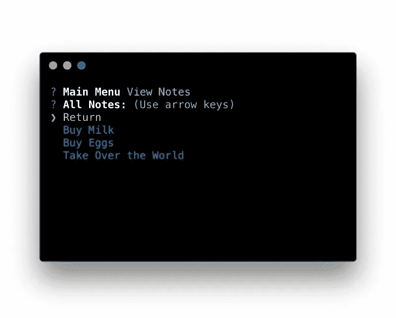

# 如何构建命令行笔记应用程序

> 原文：<https://medium.com/hackernoon/how-to-build-a-command-line-note-taking-app-ed307dcdf2d7>



这篇文章最初出现在宇宙 JS 博客上。

在本教程中，我将向你展示如何构建一个简单的笔记记录[应用](https://hackernoon.com/tagged/app)，它可以在你的命令行中使用。我们将使用 Cosmic JS，它允许我们在任何地方任何[设备](https://hackernoon.com/tagged/device)上查看这些笔记。

# TL；速度三角形定位法(dead reckoning)

[在 GitHub 上下载并安装应用](https://github.com/cosmicjs/notetoself)

# 设置

在空目录中启动一个新的 npm 项目。

```
npm init
```

接下来，您需要添加以下包。

*   cosmicjs(使访问您的 bucket 端点更容易)
*   meteor-random(生成一个格式良好的 16 字符序列)
*   粉笔(在给终端输出着色方面做得很好)
*   inquirer(命令行框架)

```
npm install --save cosmicjs meteor-random chalk inquirer
```

现在让我们看一下 package.json。如果到目前为止你做的一切都是正确的，它应该是这样的。

```
{
  "name": "NoteToSelf",
  "version": "1.0.0",
  "description": "",
  "main": "index.js",
  "scripts": {
    "test": "echo \"Error: no test specified\" && exit 1"
  },
  "keywords": [],
  "author": "",
  "license": "ISC",
  "dependencies": {
    "chalk": "^1.1.3",
    "cosmicjs": "^2.39.0",
    "inquirer": "^3.0.6",
    "meteor-random": "^0.0.3"
  }
}
```

现在让我们花一点时间来设置我们的 [index.js](https://cosmicjs.com/blog/index.js) 文件。我们需要做的第一件事是在页面顶部导入我们的包

```
const chalk = require('chalk');
const inquirer = require('inquirer');
const Random = require('meteor-random');
const Cosmic = require('cosmicjs');
```

当我们完成这些之后，接下来我们需要设置我们的存储桶信息以备后用。

```
var config = {};
config.bucket = {
  slug: '',
  read_key: '',
  write_key: ''
}
```

您需要在上面的对象中填入您的存储桶信息。现在我们需要设置主菜单，这是你启动程序时会看到的。

# 代码概述

```
const MainMenu = () => {
  inquirer.prompt(
    {
      type: 'list',
      name: 'mainMenu',
      message: 'Main Menu',
      choices: [
        'New Note',
        'View Notes',
        new inquirer.Separator(),
        'Exit'
      ]
    }
  ).then((answers)=>{
    if(answers.mainMenu === "New Note"){
      NewNote()
    } else if(answers.mainMenu === "View Notes"){
      ViewNotes()
    } else {
      process.exit()
    }
  })
}
MainMenu()
```

让我们把它分解一下，这样我更容易理解。

1.  生成包含 3 个选项的 cli 界面
2.  选择一个选项后，它会运行一系列 if 语句，引导您进入下一个界面

现在我们将创建添加新注释的界面。系好安全带，因为这里会变得有点混乱。

```
const NewNote = () => {
  var question = {
    type: 'input',
    name: 'note_text',
    message: 'Note'
  } // 1
  inquirer.prompt(question).then((answers) => { // 2
    var params = {
      write_key: config.bucket.write_key,
      type_slug: 'notes',
      slug: Random.id().toLowerCase(),
      title: answers.note_text,
      content: ''
    } // 3
    if(answers.note_text === ''){
      console.log(chalk.red("You cannot add an empty note"))
      MainMenu()
      return;
    }
    Cosmic.addObject(config, params, (error, response) =>{ // 4
      if(response.object){
        console.log(chalk.green("\u2713" + " Success"))
      }
      if(error){
        console.log(error)
      }
      MainMenu() //5
    })
  })
}
```

这不是太混乱，别担心，我们会一起走过它。

1.  我们创建问题类型并将其声明为一个变量
2.  然后，我们将它发送给一个查询函数，以获取用户输入的注释文本
3.  现在我们用宇宙 js 需要的所有信息创建一个对象。它自动从 inquirer 获取输入文本，并从 meteor 随机包中构建一个 slug。
4.  我们现在使用宇宙 JS 的奇迹并且创造一个新的物体。
5.  返回主菜单

下一个菜单有点混乱，所以我们要把它分成几个小块。

```
const ViewNotes = () => {
  var params = {
    type_slug: 'notes',
    limit: 10,
    skip: 0
  };

  Cosmic.getObjectType(config, params, (error, response)=>{ //fetches all notes
    var notes = []
    var noteText = [chalk.yellow("Return")]
    if(response.total === undefined){
      console.log(chalk.red("No notes found."))
      MainMenu()
      return;
    }
    sortedresponse = response.objects.all.sort((a,b)=>{
      return new Date(b.created) - new Date(a.created)
    })
    const amount = response.objects.all.length
    sortedresponse.map((note)=>{
      var newnote = {
        name: note.title,
        slug: note.slug
      }
      noteText.push(chalk.blue(note.title) + chalk.hidden('slug - '+note.slug + ' | ') )
      notes.push(newnote)
      if(notes.length === amount){
        inquirer.prompt(
          {
            type: 'list',
            name: 'allnotes',
            message: 'All Notes:',
            choices: noteText
          }).then((answers)=>{
            if(answers.allnotes === "\u001b[33mReturn\u001b[39m"){
              MainMenu()
              return;
            }
            var regexSearch = /(\w{17})/
            var newvalue = answers.allnotes.match(regexSearch)
            Cosmic.getObject(config, {slug: newvalue[0]}, (error, response)=>{
              inquirer.prompt({
                type: 'expand',
                message: chalk.blue(response.object.title),
                name: 'morecontext',
                choices: [
                  {
                    key: 'e',
                    name: 'Edit',
                    value: 'edit'
                  },
                  {
                    key: 'd',
                    name: 'Delete',
                    value: 'delete'
                  },
                  {
                    key: 'l',
                    name: 'Leave',
                    value: 'leave'
                  }
                ]}).then((answers)=>{
                  if(answers.morecontext === 'edit'){
                    inquirer.prompt(
                      {
                        type: 'input',
                        name: 'newText',
                        message: 'New Text:'
                      }).then((answers)=>{
                        var params = {
                          write_key: config.bucket.write_key,
                          slug: response.object.slug,
                          type_slug: 'notes',
                          title: answers.newText,
                          content: ''
                        }
                        Cosmic.editObject(config, params, (error, response)=>{
                          if(response.object){
                            console.log(chalk.green("\u2713" + " Success"))
                          }
                          MainMenu()
                        })
                      })

                  } else if(answers.morecontext === 'delete'){
                    var params = {
                      write_key: config.bucket.write_key,
                      slug: response.object.slug
                    }
                    Cosmic.deleteObject(config, params, (error, response)=>{
                      if(error){
                        console.log(error)
                      }
                      if(response.object){
                        console.log(chalk.green("\u2713" + " Success"))
                      }
                      MainMenu();
                    });
                  } else {
                    MainMenu();
                  }
                })
              })
            })
          }
        })
      })
}
```

如果这看起来完全是胡言乱语，那也没关系，我们可以一次只看一部分。让我们从上半部分开始，在那里我们得到你所有的笔记(最多十个)并在列表视图中显示它们。

```
var params = {
    type_slug: 'notes',
    limit: 10,
    skip: 0
  };

  Cosmic.getObjectType(config, params, (error, response)=>{ // 1
    var notes = []
    var noteText = [chalk.yellow("Return")]
    if(response.total === undefined){
      console.log(chalk.red("No notes found."))
      MainMenu()
      return;
    }
    sortedresponse = response.objects.all.sort((a,b)=>{
      return new Date(b.created) - new Date(a.created)
    }) // 2
    const amount = response.objects.all.length
    sortedresponse.map((note)=>{
      var newnote = {
        name: note.title,
        slug: note.slug
      }
      noteText.push(chalk.blue(note.title) + chalk.hidden('slug - '+note.slug + ' | ') ) // 3
      notes.push(newnote)
      if(notes.length === amount){
        inquirer.prompt(
          {
            type: 'list',
            name: 'allnotes',
            message: 'All Notes:',
            choices: noteText
          }).then((answers)=>{
            if(answers.allnotes === "\u001b[33mReturn\u001b[39m"){
              MainMenu()
              return;
            }
            var regexSearch = /(\w{17})/
            var newvalue = answers.allnotes.match(regexSearch) // 4
            Cosmic.getObject(config, {slug: newvalue[0]}, (error, response)=>{ // 5
              inquirer.prompt({ // 6
                type: 'expand',
                message: chalk.blue(response.object.title),
                name: 'morecontext',
                choices: [
                  {
                    key: 'e',
                    name: 'Edit',
                    value: 'edit'
                  },
                  {
                    key: 'd',
                    name: 'Delete',
                    value: 'delete'
                  },
                  {
                    key: 'l',
                    name: 'Leave',
                    value: 'leave'
                  }
                ]})
```

1.  我们使用 Cosmic JS 包来抓取所有的物体。
2.  我们获取对象的数组，并对它们进行排序，所以最新的在最上面。
3.  我们创建一个由两部分组成的字符串。第一部分是使用粉笔包样式为蓝色的注释文本。接下来，我们获取该项目的一小段，并将其传入，但将其隐藏。这样做是为了我们可以在程序的后面获取更多关于这个音符的信息。
4.  我们获取用户选择的字符串，并将其与 regex 搜索进行匹配，regex 搜索将找到该段文字并将其返回。
5.  我们获得对象的特定信息，这允许我们以后更好地使用它。
6.  我们使用新获取的数据生成下一个提示，并将注释文本放在消息字段中。

这是获取数据和操作返回的基础，在这个实例中我们可以正确地使用它。现在我们来看看视图函数的后半部分。在这里我们可以编辑和删除我们以前选择的 not from。

```
]}).then((answers)=>{
    if(answers.morecontext === 'edit'){
      inquirer.prompt(
        {
          type: 'input',
          name: 'newText',
          message: 'New Text:'
        }).then((answers)=>{ // 1
          var params = {
            write_key: config.bucket.write_key,
            slug: response.object.slug,
            type_slug: 'notes',
            title: answers.newText,
            content: ''
          } // 2
          Cosmic.editObject(config, params, (error, response) => { // 3
            if(response.object){
              console.log(chalk.green("\u2713" + " Success"))
            }
            MainMenu()
          })
        })
    } else if(answers.morecontext === 'delete'){
      var params = {
        write_key: config.bucket.write_key,
        slug: response.object.slug
      }
      Cosmic.deleteObject(config, params, (error, response)=>{
        if(error){
          console.log(error)
        }
        if(response.object){
          console.log(chalk.green("\u2713" + " Success"))
        }
        MainMenu();
      });
    } else {
      MainMenu();
    }
  })
```

1.  创建一个提示并要求用户输入新的注释文本
2.  我们再一次用你需要的所有必要部件来构建一个对象。

*   我们从早期的宇宙 JS 请求中找到了弹头
*   标题由框中键入的内容决定
*   内容故意保留为空白字符串

1.  一旦我们有了所有的片段，这就是我们把它们放在一起并编辑笔记内容的地方。

# 最后的步骤

在所有这些代码之后，最终还不算太糟糕。读完这个概述后，你应该对这个程序的功能有一个大致的了解。如果你仍然不明白发生了什么，我只是一封电子邮件。尽管如此，仍有一些事情需要做。首先，我们需要对 package.json 文件进行一些调整。

```
{
  "name": "NoteToSelf",
  "version": "1.0.0",
  "description": "",
  "main": "index.js",
  "scripts": {
    "test": "echo \"Error: no test specified\" && exit 1"
  },
  "bin": {
    "notetoself": "./index.js"
  },
  "keywords": [],
  "author": "",
  "license": "ISC",
  "dependencies": {
    "chalk": "^1.1.3",
    "cosmicjs": "^2.39.0",
    "inquirer": "^3.0.6",
    "meteor-random": "^0.0.3"
  }
}
```

这将使应用程序可以在系统范围内安装，并且可以通过使用“notetoself”来调用。剩下要做的就是将软件包安装到您的系统中。

```
npm install -g
```

完成后，只需运行以下命令:

```
notetoself
```

您可以随时获得系统范围内的注释。

如果你有任何关于安装和使用这个应用的问题[，请加入 Slack 上的 Cosmic JS 社区](https://cosmicjs.com/community)，或者[关注并联系 Twitter](https://twitter.com/cosmic_js) 。

[](http://bit.ly/HackernoonFB)[](https://goo.gl/k7XYbx)[](https://goo.gl/4ofytp)

> [黑客中午](http://bit.ly/Hackernoon)是黑客如何开始他们的下午。我们是 [@AMI](http://bit.ly/atAMIatAMI) 家庭的一员。我们现在[接受投稿](http://bit.ly/hackernoonsubmission)并乐意[讨论广告&赞助](mailto:partners@amipublications.com)机会。
> 
> 如果你喜欢这个故事，我们推荐你阅读我们的[最新科技故事](http://bit.ly/hackernoonlatestt)和[趋势科技故事](https://hackernoon.com/trending)。直到下一次，不要把世界的现实想当然！

