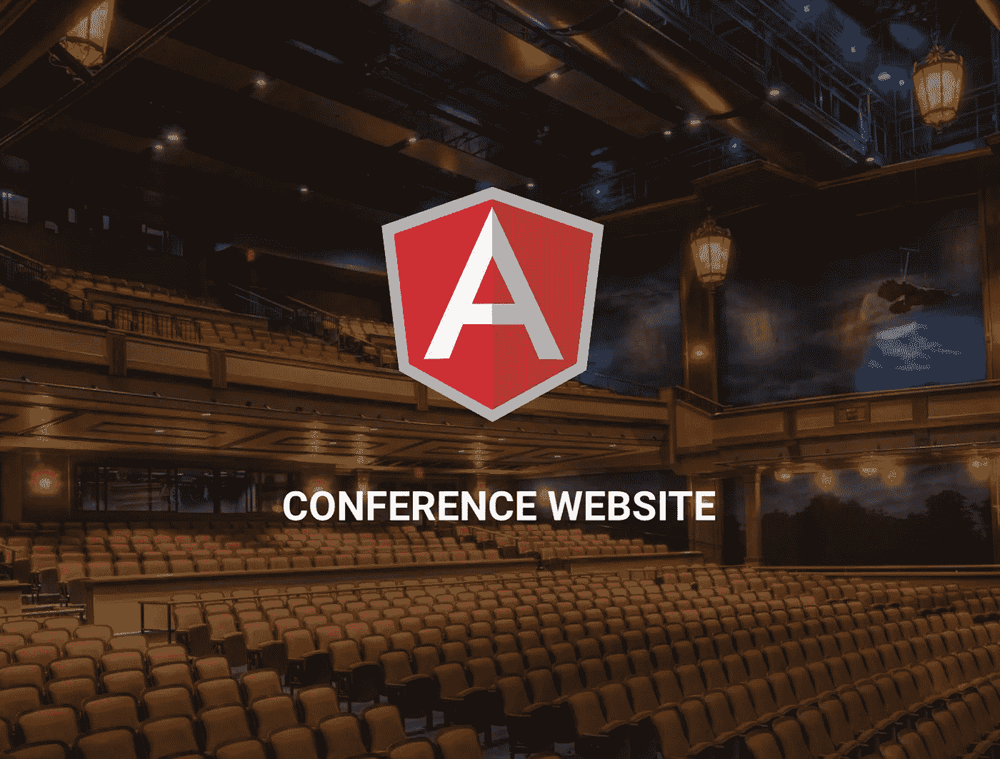
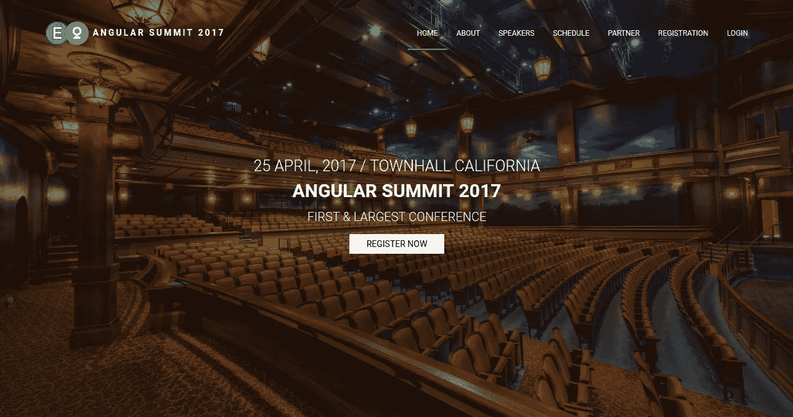
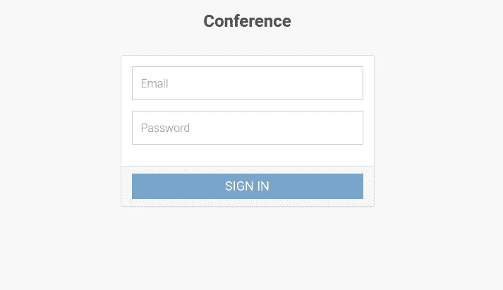

# 如何使用 AngularJS 搭建会议 App

> 原文：<https://medium.com/hackernoon/how-to-build-a-conference-app-using-angularjs-5a3d80f226c6>



在本教程中，我将向你展示如何使用 AngularJS、一点 Node 和 [Cosmic JS](https://cosmicjs.com) 创建一个“会议”应用程序。您可以在管理面板中添加演讲者和赞助商，编辑内容和管理本次会议的成员。让我们开始吧。

# TL；速度三角形定位法(dead reckoning)

[下载 GitHub 回购。](https://github.com/cosmicjs/conference-website)
[查看试玩。](https://cosmicjs.com/apps/conference-website)

# 开始使用:

首先，让我们创建一个新目录来构建我们的项目，并创建一个 package.json 文件。

现在，在您的 package.json 中，下面是我们将如何用代码实现它:

```
mkdir conference-app
conference-app$ touch package.json
```

其次，我们来做一个 bower.json 文件。

```
conference-app$ touch bower.json
```

我们将为我们的 bower.json 构建这个特性:

配置应用服务器:

```
conference-app$ touch app-server.js
```

# 我们正在安装什么，为什么:

1.  我们将使用 AngularJS 框架来构建单页面应用程序
2.  我们正在为创建多视图安装 angular-ui-router。
3.  我们将使用 gulp 把所有的 js 和 css 文件构建成一个文件。

# 构建我们的应用程序:

现在我们将构建我们的文件结构，这样我们就可以组织我们的 angular 模块和 js 文件。我们的会议应用程序目录应该是这样的:

现在我们将设置我们的 index.html:

在这里，我们将把我们的“根”视图作为目标，稍后放置我们的角度模块。位于我们的 dist 目录中的 main.js 文件是我们的 gulpfile.js 文件在捆绑了我们所有的 angular 模块之后将会显示的内容。

现在，设置我们的 gulpfile.js。我们将为我们的应用程序构建这个特性:

之后，我们可以创建主模块。下面是我们如何在 main.mdl.js 文件的代码中实现它:



现在，我们将设置我们的授权控制器。下面是我们如何在 auth.ctrl.js 文件的代码中实现它:

我们将为我们的应用程序构建认证服务:



# 这是怎么回事:

1.  我们使用 ui 路由器来配置路由。
2.  我们为对我们的 Cosmic JS API 的异步调用创建了 Auth Service。
3.  我们创建了身份验证控制器来检查凭证。

这是这篇文章的节略版。要了解完整教程，请访问 Cosmic JS 网站上的[如何使用 AngularJS](https://cosmicjs.com/articles/how-to-build-a-conference-app-using-angularjs-j8z1tldg) 构建会议应用。

# 结论:

我们能够使用 AngularJS 创建一个会议网站，连接到 Cosmic JS [CMS API](https://cosmicjs.com) 。内容可以直接在网站的管理区或通过 Cosmic JS 仪表板进行管理。我希望你和我一样喜欢这个教程，如果你有任何问题[在 Twitter 上联系我们](https://twitter.com/cosmic_js)和[加入我们的 Slack 社区](https://cosmicjs.com/community)。