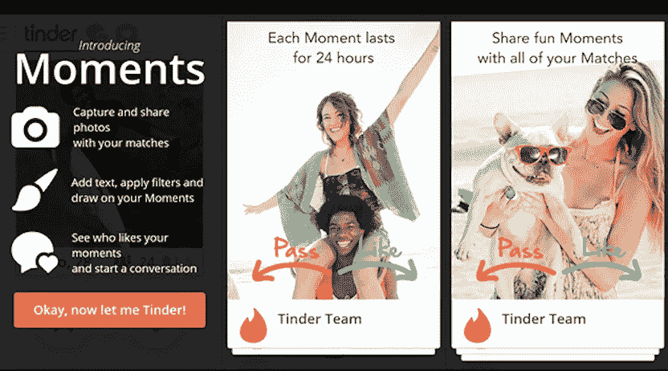
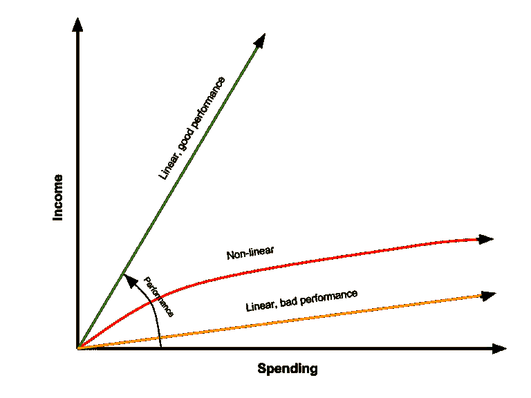
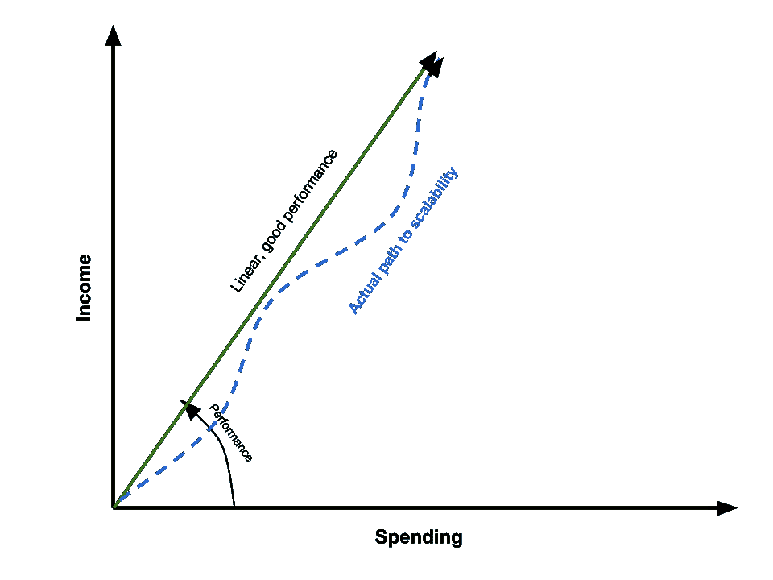
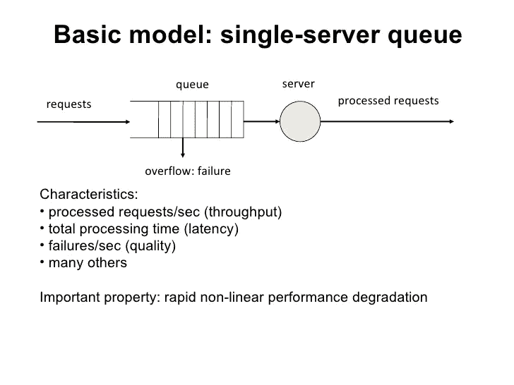
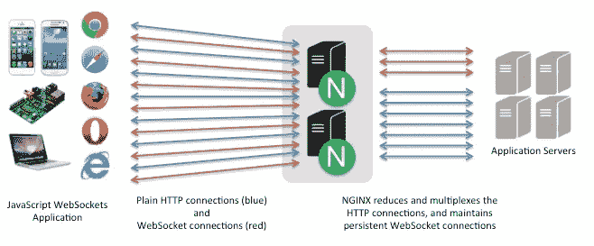
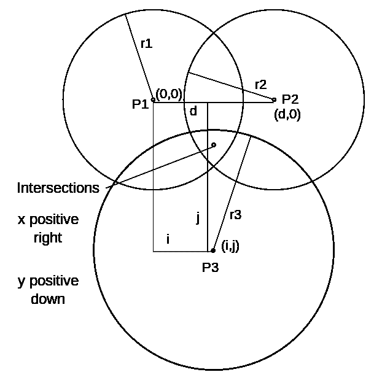
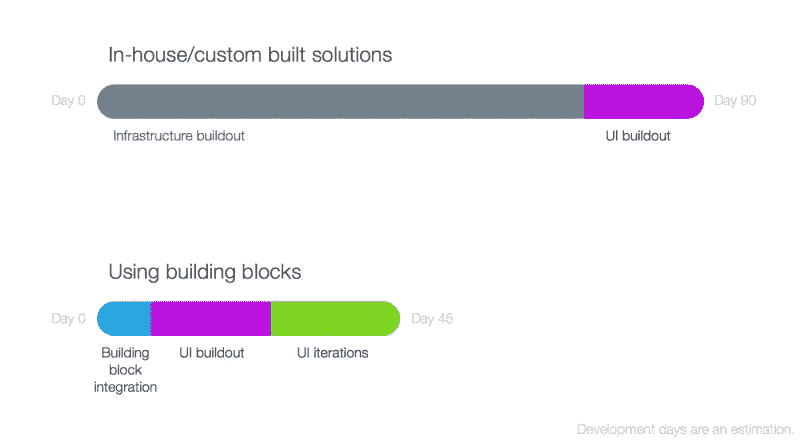

# 如何搭建一个交友应用？

> 原文：<https://medium.com/hackernoon/how-to-build-a-dating-application-55d5ca0c8f5c>



> 剧透:这是建立一个约会应用程序的最广泛的指南，包括概念，建立 MVP，优化，后端稳定性，应用程序安全性，实时聊天实现，tinder 匹配算法和内容审核。

想为约会小众打造一款类似 Tinder 的 app？

你可能听说过很多关于约会应用已经饱和并且竞争激烈的事情，但是..

这完全是主观的，及时的中断通常会验证不饱和度！更有甚者，利基约会是严重不饱和的。

用 Tinder 联合创始人肖恩·拉德的话说..

> **这不仅仅是向左或向右滑动的问题，而是潜在的哲学问题。**

好得难以置信？让我们看看！

最近取得巨大成功的一些小众约会应用程序:

*   [**Twindog**](http://www.twindog.co/) 上线 2 个月内获得近 10 万用户
*   [**Bristlr**](http://www.bristlr.com/) **，**一款女性寻找大胡子男人的 app
*   [**The League**](http://www.theleague.com/) ，一款太受欢迎的交友应用
*   [**盲人相亲**](http://www.rlsb.org.uk/tech-hub/tingle-app-dating-personalities-not-selfies) ，由 RLSB 开发

现在，你的疯狂约会应用程序的想法似乎没有那么疯狂，对不对？

值得注意的是，这样的应用程序是出于自我热情而发展的，所以，假设你已经熟悉你所在领域的一些属性是安全的。你可以很快地把你的一些想法放在一起，讨论和测试，看看你是否有市场。

注意:如果你计划开发克隆产品，你应该明白你的市场验证已经完成了。

## 你会学到什么:

*   搭建交友 app 的不同方式？
*   打造约会 app MVP
*   针对可用性、性能和安全性优化您的应用

# 如何创建一个交友 app？

事情是这样的，创业公司的应用程序开发没有固定的标准。通常，有三种方法来构建应用程序:

1.  使用应用构建器
2.  开发定制应用程序
3.  自定义克隆脚本

让我们来看看这些选项

## 约会应用构建者

有许多约会应用程序生成器，允许你拖放创建用户界面，调整后端和玩一点点。

使用这些应用构建器的最大好处是它们带来的便利:

大多数这些所见即所得的建设者收取每月费用的应用功能，他们主持和保持你的后端。它们提供了可以用来制作应用程序的 UI 元素。

为了帮助您创建应用程序，大多数应用程序构建器都提供了文档。如果事情变得复杂，他们还提供随叫随到的支持。但是他们有一些严重的问题:

*   它们分别是 ***限量*** 在定制、创新功能方面(对 Tinder 来说是刷卡)
*   在某些情况下，一旦你停止每月付款，驱动应用程序 ***的代码就无法导出*** 并变得不可访问
*   几乎 ***不可能*** 优化用户体验；这类约会应用的核心
*   就他们所提供的 ***快速*** 技术变化而言有限

虽然未来我们可以期待有可靠的应用程序开发者，但现在，他们不是构建约会应用程序的好选择。

# 开发定制约会应用

[自定义应用](https://en.wikipedia.org/wiki/Custom_software)可以是[原生](https://en.wikipedia.org/wiki/Native_(computing))也可以是[跨平台](https://en.wikipedia.org/wiki/Cross-platform)。

他们需要一个数据库来存储数据，需要一个后端来运行。当这些应用在本地构建时，运行效率会更高。这是我们不久前写的一篇关于本地与跨平台开发的对比研究。

以这种方式开发应用程序也有利于迭代产品开发。如果需要，您实际上可以旋转整个产品。但是…

定制应用程序开发会带来额外的成本。除此之外，以这种方式开发应用程序没有任何缺点。如果你真的相信你的想法，去看看如何使用定制开发制作一个约会应用程序。

# 约会(Tinder)应用克隆脚本

基本上，克隆脚本是在线市场上现有流行应用程序的源代码副本。有了这个选项，你可以在互联网上查找你想要的约会应用程序中已经存在的代码。

你最终会发现外面有一打 Tinder 克隆脚本。买了克隆脚本后，你会雇一个自由职业者来定制，帮你把应用上传到相关的应用商店。

这些脚本通常花费 100-700 美元，开发人员可能会收取定制费用。到目前为止一切顺利，对吧？

不尽然！苹果迟早会打击这种剽窃行为！

这种方法还有其他缺点:

*   首先，任何开发人员都可以轻松完成非常小的定制。但是，即使有一点点的复杂性，定制的成本也会急剧上升。
*   最坏的情况是，*开发人员可能会失败*或者根本拒绝开发代码。
*   有经验的开发人员通常会直接拒绝定制这样的代码。并建议从头开始编写代码。
*   更有可能的是代码*没有合适的文档*，注释来帮助你的开发者

**可扩展性怎么样？**

过去，可扩展性扼杀了许多登上 App store 排行榜榜首的初创公司。通常，这样的代码写得很差，而且**根本无法扩展**。

假设你的应用有市场，你仍然需要**创新** *你的产品至少 10%* 。克隆脚本并不能帮你做到这一点。

这里值得一提的是，使用这种克隆脚本的大多数人本质上都是 blackhat 营销人员。大多数 blackhat 营销人员并不是被服务用户的愿望所驱动。他们宁愿发送垃圾邮件，并迅速赚钱。在这种情况下，用户保持率很低。

最后，无论你是使用约会应用源代码、应用构建器还是定制开发来构建你的应用，*你都需要让自己*沉浸在构建一个成功的约会应用的过程中。

这可能看起来势不可挡。不要担心…

在下一节中，我们将向您展示一种构建 MVP 和优化应用程序特性的可能方法。不仅如此，你还将能够正确理解关键应用程序功能的详细情况。

# 如何制作一款交友 app——MVP

创建这样一个应用 MVP 需要你具备 iOS、Android 和后端开发技能。iOS 开发主要使用 Swift 和 Objective C 完成，而对于 Android 你需要有 Java 经验的人。

对于后端，您可以使用 Javascript、PHP 或任何其他您喜欢的语言。这个选择完全是主观的。前进的最佳方式是遵循最小可行产品方法。你应该非常小心你如何决定你的最低成功。

Tinder 的联合创始人肖恩·拉德在 2014 年谷歌 I/O 大会上的演讲中承认了这一点:

> 我们严重低估了 MVP 一切都将在 24 小时内崩溃，因为这种架构有其瓶颈，它不会超越这个瓶颈。

这发生在 Tinder 即将在一夜之间从 2 万用户转移到 50 万用户的时候。这对肖恩来说压力很大。所以，想出一个恰当定义的 MVP 真的很重要。

**咖啡遇见百吉饼的 Arum Kang** 在下面的视频中展示了 MVP 的方法:

从她的谈话中应该非常仔细地注意到以下内容:

1.  实际上，你可以在没有技术联合创始人的情况下打造你的 MVP
2.  一旦你建立了一个 MVP，找到一个技术合伙人就变得更容易了

现在，您已经正确定义了您的最低成功(MVP ),您可以开始下一部分了。

**最常见的是，我们在约会应用中看到了以下功能:**

*   滑动手势
*   匹配用户
*   内容审核
*   实时聊天
*   地理位置

这里的目标应该是为可用性、性能和安全性创建功能。

# 优化你的约会应用

## 建筑物滑动手势

构建滑动手势并不困难，任何优秀的开发人员都可以做到。不过，在实现滑动手势时需要小心。您的实现可能没有针对目标受众进行优化。

以下因素极大地影响了滑动转换的用户友好性:

*   一个动作发生所需的中间距离
*   刷卡时卡会挤压多少，它应该旋转多少
*   刷卡时卡应该缩小多少
*   旋转的角度及其强度

下面的动画很好地说明了微小的变化如何影响这些滑动过渡的体验。


找出最适合您的目标受众的方式，并优化滑动手势。

# 构建后端以实现可扩展性

> 许多人经常问最简单的方法来获得一个可扩展的应用程序，我们经常重复——**最简单的方法通常不是构建一个可扩展应用程序的最佳方法。**

对于 MVP 来说， *MySQL* + *MongoDB* 数据库和 Node.js 最适合这类应用。

有些人建议这类应用使用独立的 MongoDB，这不是最好的方式。大多数这样的建议来自围绕 MongoDB 的神话，查看下面的视频来了解围绕 MongoDB 的神话。

Tinder 本身使用的是 MongoDB，遇到了很多问题。他们最终不得不将重心从产品转移到扩展服务上。

在 MongoDB 上设计数据库有点棘手。它要求您提前计划您希望实现什么特性，以及您需要提取什么信息。

综上所述，你的 app 所有非结构化的数据都要去 MongoDB，结构化的会存储在 MySQL 数据库上。

**Node.js 和静态服务**

Node.js 对于可变任务来说很棒……但是对于静态内容来说就不太好用了。使用缓存机制可以解决这个问题。稍后你会在博客中读到更多。

让我们回到可伸缩性。

技术可伸缩性应该是你当前产品路线图的中心。

**Chris Lalonde，**(他将 Ebay 的用户规模扩大到了数百万人)就创业公司的可扩展性发表了以下观点:

> **我从自己的成功中知道十几个失败的创业公司。这些问题只会越来越严重。**

下图从 ROI 的角度很好地说明了可伸缩性的重要性。



图表中的绿线看起来太奇特了，不像是真的；通常情况下，事实并非如此。

对于大多数创业公司来说，实际的发展路径如下图所示:



让我们将可伸缩性更进一步，并且*优化服务器队列*。服务器队列基本上是应用程序处理请求的模型。

因此，在为约会应用建立服务器模型时，我们建议不要选择 **N 个服务器+ N 个队列**或单个服务器+单个队列，我们更喜欢**单个队列+ N 个服务器**。

这个“N”取决于你的输入流量，这是系统设计的一部分。



现在，您可以与您的产品和开发团队坐下来确定:

*   在你发布你的应用程序后，马上会发生什么(信息的频率，请求的数量，等等)？
*   什么模型可以处理最少的需求？
*   涉及哪些风险？
*   最重要的是，如果需要的话，你怎样才能换到不同的安排呢？

在继续之前，请与您的开发人员讨论单服务器+ N 队列是否真正解决了您的所有问题。

在下一节中，将帮助您优化您的约会应用程序，以便在 node.js 服务静态文件时获得更好的性能。

# API 缓存使 node.js 更快

正如我们之前告诉你的，node.js 并不是提供静态内容(比如图片)的最有效的框架。一个缓存方法会给 node.js 带来巨大的性能提升。

为了简单起见，可以把缓存看作是*临时存储信息*，这样当用户再次请求时就可以很容易地检索到。

以下面的图片作为参考，如果没有缓存(在这种情况下是 Nginx)，你的应用程序会无缘无故地打开超过所需的套接字连接。*蓝线*表示 HTTP 请求，*红线*表示套接字连接。



缓存大大减少了应用程序需要调用主数据库的次数。有三种方法可以在应用中实现缓存，各有利弊:

*   直连缓存
*   API 缓存层
*   本地缓存

或者，你可以让它们在你的应用中服务于不同的目的。对一个 MVP 来说，这有点过了。

# 制作安全的约会应用程序

约会应用程序通常很容易受到攻击。此外，还有一些简单的策略，通过这些策略可以提取个人的私人信息，从而造成伤害。

而打造一个 MVP，一个创业公司没有能力花几十万也是可以理解的。也就是说，你应该注意常见的*易修复漏洞*。

一个常见的众所周知的漏洞是[tri alternation](https://en.wikipedia.org/wiki/Trilateration#Derivation)。

Trilalteration 是如何工作的？

约会应用程序通常会在用户的应用程序中共享位置信息。

然而，用户可以在应用的用户界面上看到“3 英里外”或“5 英里外”:


但是，如果你稍微研究一下后端，你会发现用户距离的形式是“3.01156”或“5.223254”。

为了得到一个用户的准确位置，你需要做的就是创建三个不同的配置文件，在这些账户中有三个任意的位置。

然后你会得到 3 个距离，比如说“3.01156”，“3.10022”和“3.00011”。然后，任何人都可以进行三边测量，以获得目标用户的大致位置。



虽然 Tinder 曾经提供这些信息，但现在不再提供了。但是，我们看到许多应用程序仍在这样做，危及用户安全。很多时候，这类 app 背后的创业者甚至不知道，获取确切位置是如此容易。

以这种方式暴露用户信息对你的应用程序的用户来说是致命的。同性恋约会应用 Grindr 也以与 Tinder 相同的方式分享信息。埃及当局利用这一信息获得了同性恋者*的确切位置，并处决了他们*。

为了避免这种情况，不要给你的移动用户界面提供精确的位置信息。

黑客获取用户数据的另一种方式是通过[反编译](https://en.wikipedia.org/wiki/Decompiler)你的应用。

## **反编译一款交友 app**

反编译你的应用程序非常容易。一旦您的代码被反编译，攻击者就可以:

*   找出任何硬编码的第三方后端的 ID 和登录凭证。他们可以用它来访问 app 的服务器。
*   如果应用程序开发人员未将其关闭，请查看调试消息。这使得攻击者能够访问潜在的敏感信息流。

要使攻击者的工作变得更加困难，您需要:

*   混淆源代码。不应该是明文。
*   确保没有登录凭证不是源代码中的硬键编码。

**加密和加密哈希**

您的应用程序与服务器的每次通信都应该加密。基于 [PGP](https://en.wikipedia.org/wiki/Pretty_Good_Privacy) 的密码加密在这里就足够了。

我们不推荐加密哈希，因为购买或下载所有电话号码的哈希列表非常容易。

这里列出的安全措施非常容易实施，并且成本效益高，是约会应用 MVP 的最佳安全技术。

# 实时聊天实现

当您的用户匹配时，他们会在见面之前交换信息。

现在，你应该知道*一个简单的聊天*和*一个实时聊天*实现之间有着巨大的差异。前者要求用户刷新应用程序以获得新消息，而在后者中，聊天会自动更新。

基于简单(HTTP)的聊天应用程序将:

*   浪费不必要的资源
*   提供较差的性能和用户体验
*   无法保证消息会及时送达
*   无法正确扩展，最终会失败

到目前为止，我们看到的每个著名的聊天应用中都有实时聊天功能。

如何在你的约会应用中实现实时聊天？

你可以这样做:

*   套接字编程
*   XMPP 服务器集成
*   使用微信等第三方 SDK

每一种都有自己的优点和缺点。最后一个主要用于预算紧张的情况。

## **套接字编程？**

从头开始实现聊天功能并不是初创公司最喜欢的解决方案。只是建造它需要太多的时间和精力。

Layer 每月收费*1500 美元*是有原因的。更好的方法是要么用 [Firebase](https://firebase.google.com/) 要么用 [OpenFire](https://www.igniterealtime.org/projects/openfire/) 。它们都为聊天功能提供了 XMPP 协议。两者都是很好的选择，并且经常会产生相同的结果。

但是，也有一些不同之处:

*   Firebase 是付费的；并将兼顾高速度和可伸缩性
*   另一方面，Openfire 是免费的，但是你要对速度和可扩展性负责

如果没有预算限制，你应该选择 Firebase，否则你可以坚持使用 Openfire。

**误区**:很多人声称 Openfire 最多可以同时处理 4000 个用户。实际上…

类 Unix 系统限制了 Openfire 可以拥有的打开请求的数量。它通常默认设置为 4，000。您可以轻松定制和增加它。

这种设置可以轻松处理多达 50，000 个用户同时活跃。使用 XMPP 的其他一些好处:

*   更加抵制审查
*   多设备体验、消息同步

[**层**](https://layer.com/) 是在你的应用内构建聊天功能的另一个好选择。

它利用预打包的聊天基础设施构建模块，而不是定制的聊天解决方案。这大大减少了构建聊天功能所需的时间:



Layer 极其昂贵，只有一小部分初创公司用得起。他们声称这是约会应用中聊天的一站式解决方案，并提供从 gif、贴纸、音乐或任何其他富媒体的一切。

但是，我们经常会看到层不足的独特用例。例如，在层中没有预定义的“ *Last seen* ”特性，需要开发人员定制层实现来实现它。

开发 Tinder like 约会应用的另一个有趣部分是匹配算法。

## Tinder 算法是如何工作的？

令人沮丧的是，除了少数人之外，没有人知道 Tinder 的算法背后到底是什么。但是，在宏观层面上，它是受现实世界系统动力学启发的机器学习的组合，为其用户提供大多数上下文配置文件。

事实证明，这在精确匹配用户时非常有效。但是创建一个合适的机器学习算法对创业公司来说意味着开销成本。它通常会将总拥有成本提高 4 到 5 倍。

那么，创业公司应该怎么做呢？

好吧，如果你的团队中没有机器学习的人，你可以随时观察你的利基，并找出他们如何互动，以及关系如何培养。以下是您应该尝试映射的一些一般属性:

*   **联系程度—** 联系程度(第一、第二和第三)如何影响配对成功。注意，就连接程度而言，可能有两种不同的类型:1。从你的约会生态系统 2。来自脸书。
*   **影响** **of** **相似/相异—** 在这里，您将主要评估如何为相似或相异的兴趣添加权重，以使配对过程更加有效。
*   **简档完成—** 不完整的交友简档会告诉你很多关于用户的信息。你可以查看用户交友档案中的各个字段来调整你的算法。例如，如果用户有个人资料图片、添加了工作细节、用于描述他/她自己的数字字符，或者他/她是否添加了个人细节等，您可以向约会等式添加权重
*   **是否启用了推送通知？—** 社交应用的 iOS 推送通知[选择加入率](http://andrewchen.co/why-people-are-turning-off-push/)为 30–45%。这种对时间敏感的价值主张的偏差是日期算法中的一个重要参数。选择加入的用户可以直观地理解推送通知将在约会应用的功能中扮演重要角色。这也可以解释为对约会生态系统的高度重视。
*   **利基相关参数—** 这些参数是对您的利基极其特定的参数。例如，如果你正在建立一个专业的约会，你可能希望给一个人获得的专业学位的数量增加一些权重。

通过观察、测试和迭代，你可以很容易地得出一个数学公式，为你的 MVP 提供高达 90%的准确性。

## 火绒匹配算法:爱情方程式

以 100 分为标准对用户进行排名的公式如下所示:

```
**Points**  = H1(**min**(1st degree, x1)/x1) + H2(Degree on **Facebook**) + H3 + H4(**min**(2nd degree, x4)/x4) + … + Hn(yn)Hi is the coefficient of independent variables xi and yi.
```

随着应用程序的成熟和获得更多用户，交互的多样性和复杂性使得很难使用精确的数学公式来匹配用户。当这种情况发生时，这将是向匹配用户的机器学习迁移的正确时间。

# 提高用户质量

很多约会应用都有虚假的个人资料，这通常会降低约会生态系统的价值，并赶走用户。这个问题如此严重，以至于网上有很多指南[检测虚假的约会简介](http://www.lifehacker.com.au/2015/10/how-to-a-fake-profile-on-tinder/)。

在最基本的层面上，你可以要求用户在脸书上注册，并从脸书的数据中验证他们的身份。现在，你认为你需要多长时间来创建一个假的脸书个人资料？

大概一分钟(甚至更短！).

一个简单的解决办法:你可以从脸书，*获取用户数据，对有效用户必须拥有的用户数量、个人资料信息、喜欢等设置一个阈值*。

这个门槛可以很容易地减少你的脸书虚假简介。另一个提高用户质量的好方法来自于内容适度。

## 约会应用中的内容调节

约会应用程序经常充斥着你可能想象的各种垃圾邮件和不适当的内容。

最重要的是，这类应用程序中经常出现欺凌和骚扰事件。而且，不应该随便处理。

您可以:

*   为用户提供一种报告不当内容或任何形式骚扰的方式。
*   您可以添加一个阈值，例如一个阈值(内容/配置文件被报告的次数)，在该阈值之后，内容/配置文件将被删除/暂停
*   做**两个**

收到标志后，管理员可以手动调节并采取合理的措施。

## 处理付款

在约会应用程序上进行的购买通常属于数字商品类别。因此，禁止使用任何支付网关。

要在你的应用中处理应用内购买，你需要在你的应用中集成苹果和谷歌的钱包。

**为什么要这样搭建一个交友 app？**

约会应用很少为早期的开发者提供足够的前期盈利。当用户数量开始增加时，就增加了对可靠应用基础设施的需求以及运行它的运营成本。

而且，当它不再可行的时候，创业公司经常不得不寻找资金。你未来的投资者不会接受建立在应用构建器和克隆脚本之上的应用，他们可能会认为这是一个不那么严重的冒险。

毕竟，如果你认为他们应该投资你的创业公司，你为什么不投资呢？没错。