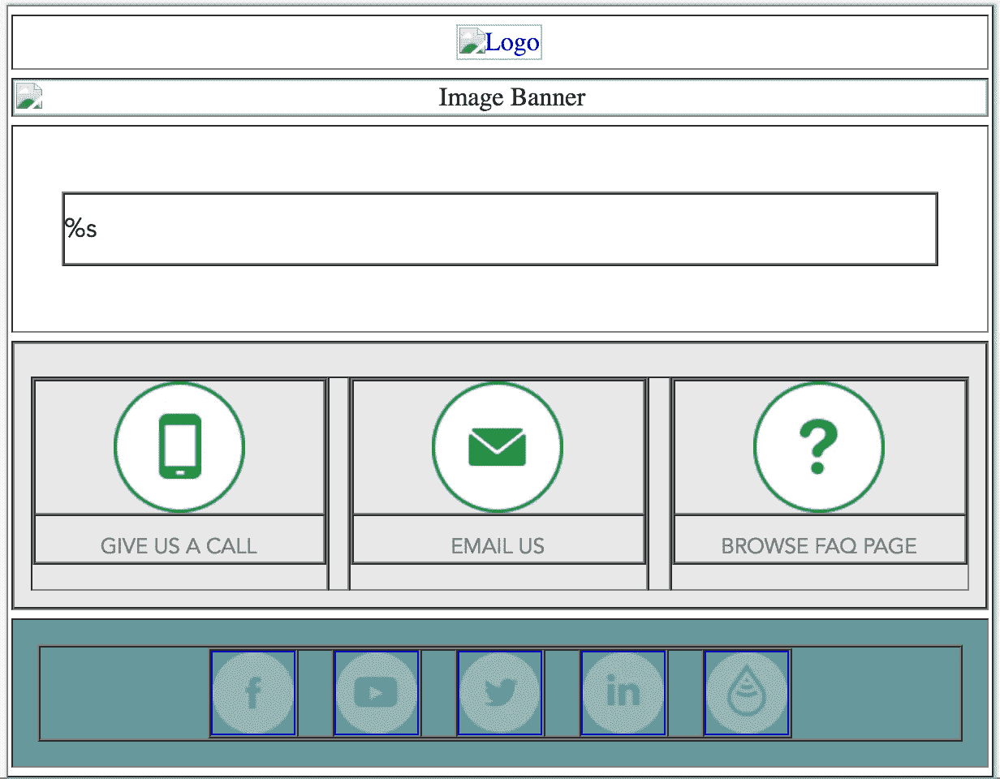
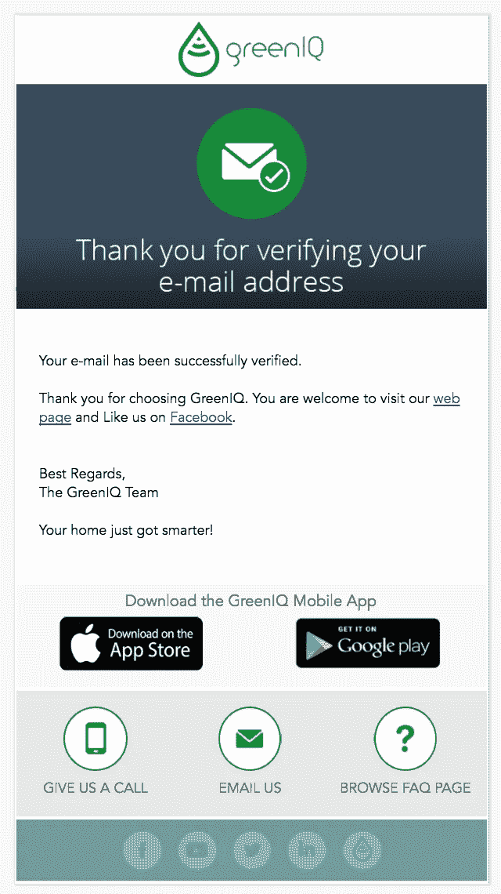

# 如何在 10 分钟内建立一个动态邮件模板

> 原文：<https://medium.com/hackernoon/how-to-build-a-dynamic-email-template-in-under-10-minutes-1fe85ad40e35>


## 在过去的几年里，自动化电子邮件取得了长足的进步。过去只有文本的电子邮件，现在包含各种形式、动态链接和图像，这取决于每个公司的设计。

如今，接收格式良好、设计时尚的 HTML 电子邮件已经成为大多数公司的标准，这就是为什么采用这一原则而不是普通的纯文本电子邮件成为必须的。

开发 HTML 模板并不需要很多编码技能，但是知道如何编码模板以在所有设备和旧的电子邮件客户端上正确显示才是真正的挑战。

在这篇博文中，我将一步一步地介绍如何通过 HTML、CSS 和 PHP 构建跨平台兼容的动态电子邮件模板。

# 基本准则

如上所述，开发 HTML 电子邮件模板的最大挑战是确保它的跨平台兼容性。有这么多的电子邮件客户端，如谷歌邮件，苹果邮件，Outlook，美国在线，雷鸟，雅虎！、Hotmail、Lotus Notes 等。就 CSS 支持而言，其中一些客户端和其他客户端落后于八球，这意味着如果我们真的希望电子邮件模板为每个用户一致地显示，我们必须求助于使用 HTML 表格来控制设计布局。

事实上，使用 HTML 表格是实现跨不同电子邮件客户端呈现一致的布局的最佳方式。可以把模板想象成由表中表中表构成的…

其次，我们必须使用内联 CSS 来控制电子邮件中的元素，比如背景颜色和字体。CSS 样式声明应该非常简单，不需要使用任何 CSS 文件。

为了强调上面的 HTML 表格规则，请看下面的例子，我修改了每个表格的 border 属性，使其可见。请注意,%s 是一个占位符，动态文本和图像将被填充，我将很快看到描述(滚动到末尾以查看最终的电子邮件模板):



正如你在上面看到的，整个布局是由 HTML 表格构建的。我们将使用 PHP 库解析%s 占位符，并在电子邮件发送给用户之前用动态文本填充它。

# 开发静态模板

所以开始编程吧！

在我们开始模板本身之前，您需要以一个 [XHTML 文档](http://www.w3schools.com/html/html_xhtml.asp)开始您的 HTML 文件:

```
<!DOCTYPE html PUBLIC "-//W3C//DTD XHTML 1.0 Transitional//EN" "http://www.w3.org/TR/xhtml1/DTD/xhtml1-transitional.dtd">
<html >
 <head>
  <meta http-equiv="Content-Type" content="text/html; charset=UTF-8" />
  <title>Demystifying Email Design</title>
  <meta name="viewport" content="width=device-width, initial-scale=1.0"/>
</head>
</html>
```

我建议用 border="1 "定义所有的表格，如上所示，因为这样更容易发现错误，并且可以看到布局的框架。首先，让我们创建基本布局:

```
<body style="margin: 0; padding: 0;">
 <table border="1" cellpadding="0" cellspacing="0" width="100%">
  <tr>
   <td>
    My first email template!
   </td>
  </tr>
 </table>
</body>
```

将单元格边距和单元格间距设置为零，以避免表格中出现任何意外的空间。同样将宽度设置为 100%,因为这个表格是我们电子邮件的真正正文标签，因为正文标签的样式并不完全支持。

现在，我们将添加“我的第一个电子邮件模板！”另一个表格将显示实际的电子邮件模板显示:

```
<table align="center" border="1" cellpadding="0" cellspacing="0" width="600" style="border-collapse: collapse;">
 <tr>
  <td>
   This is the email template body
  </td>
 </tr>
</table>
```

如您所见，宽度设置为 600 像素。600 像素是您的电子邮件在大多数电子邮件客户端上正确显示的最大安全宽度。此外，将 border-collapse 属性设置为 collapse，以确保表格和边框之间没有多余的空格。

在上面的示例中，您可以看到我们的电子邮件模板由五个部分(行)组成，这就是为什么我们将创建这些行，然后根据每个行添加表格，以完成模板。

```
<table align="center" border="1" cellpadding="0" cellspacing="0" width="600">
 <tr>
    <td>
       Row 1
    </td>
 </tr>
  ...
 <tr>
    <td>
       Row 5
    </td>
 </tr>
</table>
```

在每一行，我们将创建一个新的表，其中的神话与上面的相似。我们还将相应地添加列和正确的填充来对齐所有对象，以达到所需的模板。

下面是最终的 HTML 模板，命名为“template.html”，也可以在[项目 Github 页面](https://github.com/CodingStartups/dynamic_email)中找到:

一些观察结果:

1.  在需要的地方添加 alt 属性，以便在电子邮件客户端无法正确加载它们的情况下显示文本而不是图像。
2.  根据电子邮件使用情况，在您希望数据动态显示的位置添加%s 占位符。
3.  如果仔细观察，百分比值会多一个“%”。这就是为什么 PHP 库用来使这个动态，知道如何正确地解析文本。

注意！出于安全和隐私考虑，我已经删除了这些网址。请随意用您自己的图片和个人链接替换它们。

就是这样！您已经成功开发了自己的电子邮件静态模板。现在让我们把手弄脏，让它充满活力！

# 用 PHP 构建动态模板

在服务器端，创建下面的电子邮件发送方法:

```
function send_mail_template($to, $from, $subject, $message)
{
  $headers = "MIME-Version: 1.0" . "\r\n";
  $headers .= "Content-type:text/html;charset=UTF-8" . "\r\n";
  $headers .= "From: ContactNameGoesHere <" . $from . ">\r\n";
  $response = mail($to, $subject, $message, $headers);
}
```

现在，如果你仔细查看 template.html 文件，你会发现我在某些地方添加了%s 个占位符。更具体地说，在图像横幅元素和正文中。

现在我们需要做的就是导入上面的 template.html 文件，像普通文本一样解析它，添加相关的文本来代替“%s”并使用上面的 send_mail_template 方法。

```
function build_email_template($email_subject_image, $message)
{
    // Get email template as string
    $email_template_string = file_get_contents('template.html', true);
    // Fill email template with message and relevant banner image
    $email_template = sprintf($email_template_string,'URL_to_Banner_Images/banner_' . $email_subject_image. '.png', $message, $mobile_plugin_string);
    return $email_template;
}
```

解决了这个问题后，我们可以使用这两种方法来发送我们的第一封动态邮件！

我们来举个例子。假设一个新用户刚刚验证了他的电子邮件。我们希望在服务器端自动执行该用例，并向用户发送一封“您的电子邮件已成功验证”的电子邮件。

假设我们有用户验证的电子邮件“user@user.com”，公司的电子邮件是“company@company.com”。

我们现在可以发送一封自动电子邮件:

```
$from = "company@company.com";
$to = "user@user.com";
$body_text = "Your email has been successfully verified...";
$banner_image_subject = "account_verified";
$final_message = build_email_template($banner_image_subject, $body_text);
send_email($to, $from, "You email has been verified", $final_message);
```

终于！现在，您可以根据需要使用这种方法。发送此示例后，在应用 GreenIQ 的公司图像和文本时，这是发送给用户的最终电子邮件模板:



简单吧？

查看 [CodingStartups](http://codingstartups.com) 为技术企业家和数据黑客提供的更多有见地的帖子。

如果你喜欢这首曲子，那就鼓掌吧👏🏻！你也可以在网上的某个地方分享，这样其他人也可以阅读。