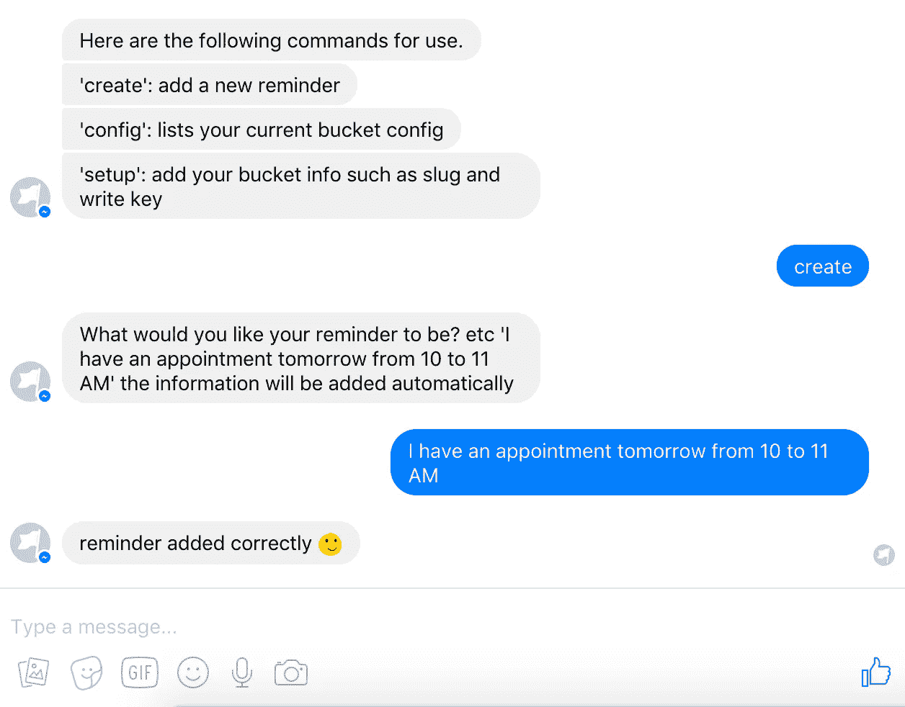
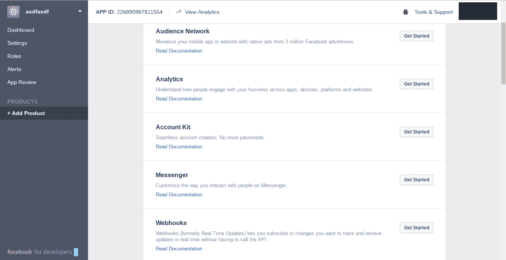
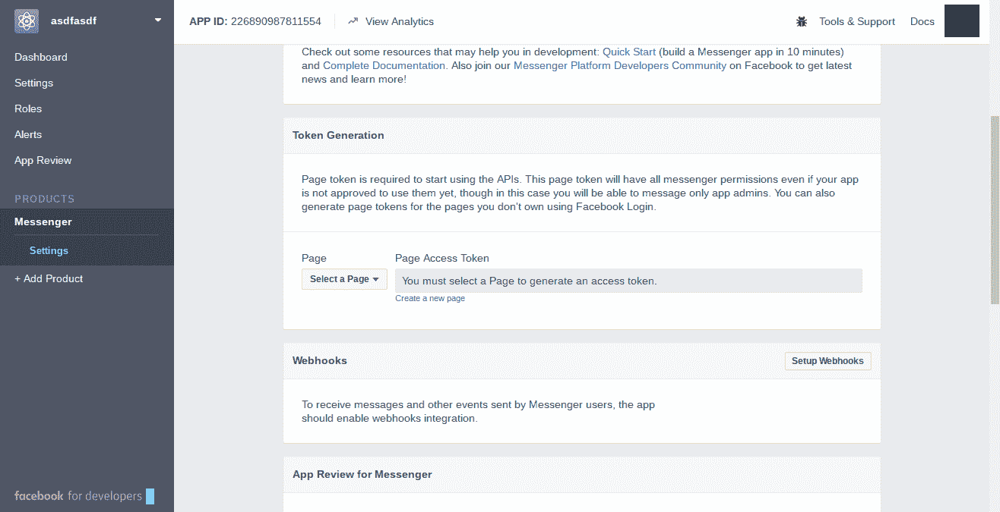
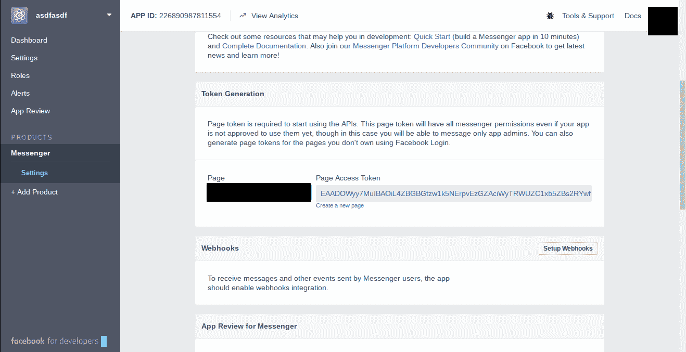
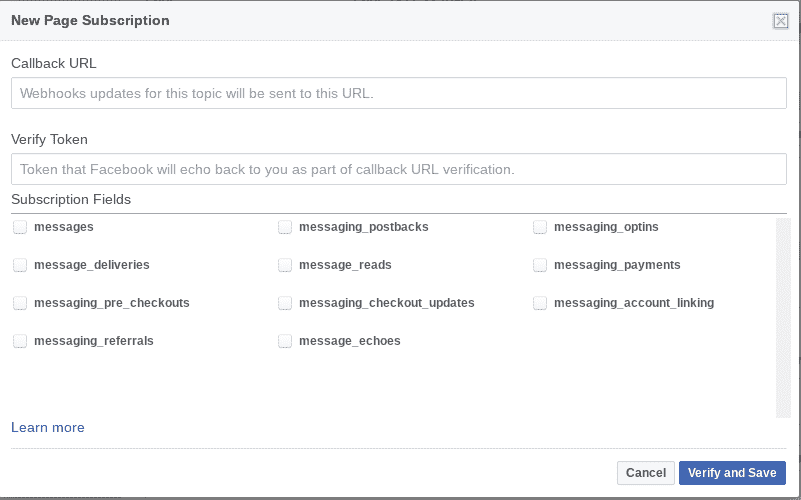
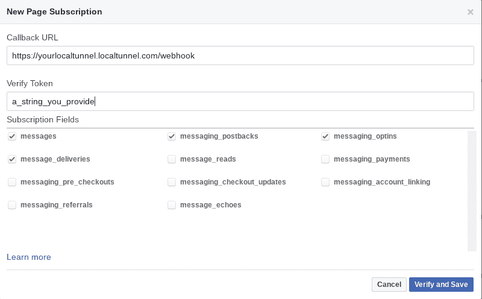

# 如何使用 Node.js 构建脸书 Bot App

> 原文：<https://medium.com/hackernoon/how-to-build-a-facebook-bot-app-using-node-js-74629d4243ec>



这篇文章最初出现在宇宙 JS 博客上。

# TL；速度三角形定位法(dead reckoning)

[在 GitHub](https://github.com/cosmicjs/facebook-bot) 上查看源代码。

建造你的信使机器人的过程相当简单，最难的是设置你的机器与脸书对话。这就是为什么今天我会很快地向你们介绍一下。一旦这些都完成了，你就可以开始创建你自己的机器人了。

# 安装项目

转到您希望项目存在并运行的文件夹。

```
git clone https://github.com/cosmicjs/facebook-bot
cd facebook-bot
yarn install
```

还有一件事！在 index.js 文件中，删除第 38 行之后的所有内容。我们稍后将返回并添加该内容。应该是这样的。

```
const express = require('express')
const bodyParser = require('body-parser')
const request = require('request')
const app = express()
const Cosmic = require('cosmicjs')
const BootBot = require('bootbot')
require('dotenv').config()
const chrono = require('chrono-node')
var schedule = require('node-schedule')
const EventEmitter = require('events').EventEmittervar config = {}const reminders = []const eventEmitter = new EventEmitter()app.set('port', (process.env.PORT || 5000))
app.use(bodyParser.urlencoded({extended: false}))
app.use(bodyParser.json())app.get('/', function(req, res) {
  res.send("hey there boi")
})app.get('/webhook/', function(req, res) {
  if (req.query['hub.verify_token'] === process.env.VERIFY_TOKEN){
    return res.send(req.query['hub.challenge'])
  }
  res.send('wrong token')
})app.listen(app.get('port'), function(){
  console.log('Started on port', app.get('port'))
})
```

这只会启动 express 服务器，并防止我们在有机会启动之前出现错误。请参见代码行“process.env.APP_SECRET ”,这是一个环境变量。有几种方法可以设置这些，但现在我们将使用我最喜欢的方法“env”包。

创建一个文件来存储所有的变量。

```
touch .env
```

这允许我们以纯文本形式存储 are 变量，并清理 start 命令。例如我的看起来像这样。我删除了所有敏感代码。

```
APP_SECRET='some secret string of numbers and letters'
ACCESS_TOKEN='some secret string of numbers'
VERIFY_TOKEN='DogLover49'
```

我们稍后将填写 APP_SECRET 和 ACCESS_TOKEN，但现在请确保您在 VERIFY_TOKEN 字段中有一些内容。它可以是任何东西。为了这个例子，我使用了 DogLover49。

# 启动应用程序

现在，您需要启动您的应用程序来运行下一部分。在应用程序根文件夹中打开两个独立的终端窗口。

```
npm run start
```

先运行这个并保持它运行。现在，在下一个终端窗口中，我们将安装和设置本地隧道。

本地隧道是一个很好的小工具，它接受您指定的端口，并通过给它一个安全的 web 地址将其路由到外部世界。我们必须尽快安装好。

```
npm install -g localtunnel
```

你现在要做的就是跑。

```
lt --port 3000 --subdomain <domainpick>
```

它应该返回这个。

```
your url is: https://<domainpick>.localtunnel.me
```

这将启动一个隧道，给你的机器一个脸书要寻找的 url。无论何时启动应用程序，都要确保在启动本地隧道之前启动它，否则它将找不到端口并返回错误。

# 脸书发展小组时间

您需要做的第一件事是创建一个新的应用程序。去[脸书开发者面板](https://developers.facebook.com/apps/)创建一个新的应用。进入“添加产品”后，找到 Messenger 部分，然后单击“开始”。



在那之后，你需要点击设置标签，这将在之后弹出。向下滚动，直到你看到这个。



这里有两个重要的部分需要注意“令牌生成”和“Webhooks”。我们要讨论的第一个问题是令牌生成。选择您要使用的脸书页面这将是您发送消息的目标帐户。



当你从下拉列表中选择一个页面后，它将生成一个页面访问令牌。您现在可以返回并将其添加到您的。环境文件。一旦完成，我们将把我们的重点转移到网页挂钩上。

一旦你点击“设置网页挂钩”的按钮，你就会看到这个。一开始可能看起来很吓人，但是不要担心。



您需要选择的订阅字段只有 messages、messaging _ postbacks、messaging_optins 和 message_deliveries。现在是验证令牌字段。你还记得你在。VERIFY_TOKEN 下的 env 文件？这就是你想要在这个模型中放入盒子的东西。对于回调的网址使用本地隧道的网址，并添加“/webhook”到我的末尾，这将是 https://noahsmessengerbog.localtunnel.me/webhook.If 你填写正确的领域，它应该看起来像这样。



现在回到您的应用程序，确保它正在运行，并且您也在转发 url。仔细检查 url，确保它与回拨 url 字段中显示的内容相同。

一旦运行成功，你可以点击“验证并保存”。这将使脸书向回调 url 发送一个请求，并期望你从 json 对象返回正确的项目。

至此，您应该已经在。除了 App Secret 以外的 env 文件。这可以很容易地在你的仪表板上找到。

# 接下来是机器人

还记得我们之前移除了第 38 行之后的所有内容吗？现在你可以把它粘贴回去了。它应该与该文件完全匹配。当这些都完成后，我们就可以检查代码并了解它是如何工作的。应该是这样的。

```
const express = require('express')
const bodyParser = require('body-parser')
const request = require('request')
const app = express()
const Cosmic = require('cosmicjs')
const BootBot = require('bootbot')
require('dotenv').config()
const chrono = require('chrono-node')
var schedule = require('node-schedule')
const EventEmitter = require('events').EventEmittervar config = {}const reminders = []const eventEmitter = new EventEmitter()app.set('port', (process.env.PORT || 5000))
app.use(bodyParser.urlencoded({extended: false}))
app.use(bodyParser.json())app.get('/', function(req, res) {
  res.send("hey there boi")
})app.get('/webhook/', function(req, res) {
  if (req.query['hub.verify_token'] === process.env.VERIFY_TOKEN){
    return res.send(req.query['hub.challenge'])
  }
  res.send('wrong token')
})app.listen(app.get('port'), function(){
  console.log('Started on port', app.get('port'))
}) const bot = new BootBot({
  accessToken: process.env.ACCESS_TOKEN,
  verifyToken: process.env.VERIFY_TOKEN,
  appSecret: process.env.APP_SECRET
})bot.setGreetingText("Hello, I'm here to help you manage your tasks. Be sure to setup your bucket by typing 'Setup'. ")bot.setGetStartedButton((payload, chat) => {
  if(config.bucket === undefined){
    chat.say('Hello my name is Note Buddy and I can help you keep track of your thoughts')
    chat.say("It seems like you have not setup your bucket settings yet. That has to be done before you can do anything else. Make sure to type 'setup'")
  }
  BotUserId = payload.sender.id
});bot.hear('setup', (payload, chat) => {
  const getBucketSlug = (convo) => {
    convo.ask("What's your buckets slug?", (payload, convo) => {
      var slug = payload.message.text;
      convo.set('slug', slug)
      convo.say("setting slug as "+slug).then(() => getBucketReadKey(convo));
    })
  }
  const getBucketReadKey = (convo) => {
    convo.ask("What's your buckets read key?", (payload, convo) => {
      var readkey = payload.message.text;
      convo.set('read_key', readkey)
      convo.say('setting read_key as '+readkey).then(() => getBucketWriteKey(convo))
    })
  }
  const getBucketWriteKey = (convo) => {
    convo.ask("What's your buckets write key?", (payload, convo) => {
      var writekey = payload.message.text
      convo.set('write_key', writekey)
      convo.say('setting write_key as '+writekey).then(() => finishing(convo))
    })
  }
  const finishing = (convo) => {
    var newConfigInfo = {
      slug: convo.get('slug'),
      read_key: convo.get('read_key'),
      write_key: convo.get('write_key')
    }
    config.bucket = newConfigInfo
    convo.say('All set :)')
    convo.end();
  }

  chat.conversation((convo) => {
    getBucketSlug(convo)
  })
})bot.hear(['hello', 'hey', 'sup'], (payload, chat)=>{
  chat.getUserProfile().then((user) => {
    chat.say(`Hey ${user.first_name}, How are you today?`)
  })
})bot.hear('config', (payloadc, hat) => {
  if(JSON.stringify(config.bucket) === undefined){
    chat.say("No config found :/ Be sure to run 'setup' to add your bucket details")
  }
  chat.say("A config has been found :) "+ JSON.stringify(config.bucket))
})bot.hear('create', (payload, chat) => {
  chat.conversation((convo) => {
    convo.ask("What would you like your reminder to be? etc 'I have an appointment tomorrow from 10 to 11 AM' the information will be added automatically", (payload, convo) => {
      datetime = chrono.parseDate(payload.message.text)
      var params = {
        write_key: config.bucket.write_key,
        type_slug: 'reminders',
        title: payload.message.text,
        metafields: [
         {
           key: 'date',
           type: 'text',
           value: datetime
         }
        ]
      }
      Cosmic.addObject(config, params, function(error, response){
        if(!error){
          eventEmitter.emit('new', response.object.slug, datetime)
          convo.say("reminder added correctly :)")
          convo.end()
        } else {
          convo.say("there seems to be a problem. . .")
          convo.end()
        }
      })
    })
  })
})bot.hear('active', (payload, chat) => {
  chat.say('finding all of your ongoing reminders.')
})eventEmitter.on('new', function(itemSlug, time) {
  schedule.scheduleJob(time, function(){
    Cosmic.getObject(config, {slug: itemSlug}, function(error, response){
      if(response.object.metadata.date == new Date(time).toISOString()){
        bot.say(BotUserId, response.object.title)
        console.log('firing reminder')
      } else {
        eventEmitter.emit('new', response.object.slug, response.object.metafield.date.value)
        console.log('times do not match checking again at '+response.object.metadata.date)
      }
    })
  })
})bot.start()
```

这个机器人带有一些互动功能，可以让我们离开地面。每一个都是完全独立的，所以你可以随意删除和修改它们。为了这个目的，我把它留得尽可能光秃秃的。让我们来看看它们。

```
const bot = new BootBot({
  accessToken: process.env.ACCESS_TOKEN,
  verifyToken: process.env.VERIFY_TOKEN,
  appSecret: process.env.APP_SECRET
}) // 1bot.setGreetingText("Hello, I'm here to help you manage your tasks. Be sure to setup your bucket by typing 'Setup'. ") // 2bot.setGetStartedButton((payload, chat) => {
  if(config.bucket === undefined){
    chat.say('Hello my name is Note Buddy and I can help you keep track of your thoughts')
    chat.say("It seems like you have not setup your bucket settings yet. That has to be done before you can do anything else. Make sure to type 'setup'")
  }
  BotUserId = payload.sender.id
}); // 3
```

1.  这将创建一个与 bootbot npm 包对话的对象。这允许我们使用 webhooks 之类的东西。
2.  在您决定向脸书页面发送消息之前，这向您显示了一个不错的小消息。
3.  创建一个“开始”按钮，作为向机器人发送消息之前的进入屏障。它还检查您是否已经设置了 bucket 配置信息。这是稍后通过调用某个命令来完成的。您也可以修改它，使它与您的存储桶信息硬连线。

```
bot.hear('setup', (payload, chat) => { // 1 
  const getBucketSlug = (convo) => { // 2
    convo.ask("What's your buckets slug?", (payload, convo) => {
      var slug = payload.message.text;
      convo.set('slug', slug) // 3
      convo.say("setting slug as "+slug).then(() => getBucketReadKey(convo)); // 3 
    })
  }
  const getBucketReadKey = (convo) => {
    convo.ask("What's your buckets read key?", (payload, convo) => {
      var readkey = payload.message.text;
      convo.set('read_key', readkey)
      convo.say('setting read_key as '+readkey).then(() => getBucketWriteKey(convo))
    })
  }
  const getBucketWriteKey = (convo) => {
    convo.ask("What's your buckets write key?", (payload, convo) => {
      var writekey = payload.message.text
      convo.set('write_key', writekey)
      convo.say('setting write_key as '+writekey).then(() => finishing(convo))
    })
  }
  const finishing = (convo) => {
    var newConfigInfo = {
      slug: convo.get('slug'),
      read_key: convo.get('read_key'),
      write_key: convo.get('write_key')
    } 
    config.bucket = newConfigInfo // 4
    convo.say('All set :)')
    convo.end();
  }

  chat.conversation((convo) => {
    getBucketSlug(convo) // 5
  })
})
```

1.  这将启动一个监听特定关键字的函数。这里我们监听“设置”,但它可以更改为任何内容。它甚至可以接受正则表达式语句。
2.  创建一个函数，以后可以调用它来启动这个链。
3.  将您发送的内容作为答案，并将其设置为一个 slug 值，该值可在此会话实例中调用。如果您稍后在单独的实例中开始另一个对话，则不会记住该值。
4.  现在我们开始完成最后的设置过程。我们首先要做的是收集所有的信息。在这里，我们通过调用“convo.get”来获取所有信息。然后我们将它添加到前面声明的 config 对象中。
5.  这是一切开始的地方。我们开始对话，并开始传递 convo 值。

```
bot.hear(['hello', 'hey', 'sup'], (payload, chat)=>{
  chat.getUserProfile().then((user) => {
    chat.say(`Hey ${user.first_name}, How are you today?`)
  })
})
```

这里我们使用“bot.hear”方法，对用户友好。还记得我之前说过可以使用 regex 来监听用户输入吗？你也可以使用一组特定的单词！当用户说“你好”时，我们会从脸书那里获取个人信息，并称呼他们的名字。一开始可能有点奇怪，但我保证机器人知道你的名字是正常的。

```
bot.hear('create', (payload, chat) => {
  chat.conversation((convo) => { 
    convo.ask("What would you like your reminder to be? etc 'I have an appointment tomorrow from 10 to 11 AM' the information will be added automatically", (payload, convo) => { // 1
      datetime = chrono.parseDate(payload.message.text) // 2
      var params = {
        write_key: config.bucket.write_key,
        type_slug: 'reminders',
        title: payload.message.text,
        metafields: [
         {
           key: 'date',
           type: 'text',
           value: datetime
         }
        ]
      } // 3
      Cosmic.addObject(config, params, function(error, response){ // 4
        if(!error){
          eventEmitter.emit('new', response.object.slug, datetime) //5
          convo.say("reminder added correctly :)")
          convo.end()
        } else {
          convo.say("there seems to be a problem. . .")
          convo.end()
        }
      })
    })
  })
})
```

1.  在对话中，我们问用户一个问题，然后等待回答。
2.  现在我们获取用户所说的内容，并使用一个自然日期解析包 Chrono 对其进行解析。
3.  我们构建了 params 对象，用于添加 Cosmic JS 对象。
4.  现在，我们使用前面创建的参数，获取 Cosmic JS 包并插入我们的新对象。
5.  在这里，我们发送一个 nodejs 事件发射器，传递来自 return 的 slug 和我们之前创建的 datetime。

```
bot.hear('help', (payload, chat) => {
  chat.say('Here are the following commands for use.')
  chat.say("'create': add a new reminder")
  chat.say("'setup': add your bucket info such as slug and write key")
  chat.say("'config': lists your current bucket config")
})
```

这将返回一系列消息，告诉您可以和不可以使用该机器人做什么。

```
eventEmitter.on('new', function(itemSlug, time) { // 1
  schedule.scheduleJob(time, function(){ // 2
    Cosmic.getObject(config, {slug: itemSlug}, function(error, response){ // 3
      if(response.object.metadata.date == new Date(time).toISOString()){ // 4
        bot.say(BotUserId, response.object.title) // 5
        console.log('firing reminder')
      } else {
        eventEmitter.emit('new', response.object.slug, response.object.metafield.date.value) // 6
        console.log('times do not match checking again at '+response.object.metadata.date)
      }
    })
  })
})
```

现在我们正在玩事件发射器，这些都是 NodeJS 提供的现成功能。它们的工作方式几乎和调用函数一样，但是它们更加通用。6.我们创建一个事件发射器来监听要传递的新事件。7.现在，我们使用调度包，并告诉它等待，直到你之前通过的时间。8.接下来我们调用 cosmicjs 并获取您刚刚创建的特定对象。9.现在，我们获取响应，并将其与您最初经过的时间进行比较。如果时间改变了，我们会将其发送回事件发射器，并在改变的时间再次检查。10.这里我们再次调用事件发射器。

如果你做的一切都正确，你应该能够通过输入几个命令来启动机器人。

```
npm run start
```

现在在不同的终端窗口中

```
npm run forward
```

这将使用本地隧道让您的应用程序与脸书对话。现在你可以随意修改它，它会像你希望的那样工作。现在您已经将笔记保存到了 Cosmic JS API 中，您可以检索它们并将其发送到任何连接的应用程序。感谢您的阅读，如果您有任何问题，请在 Twitter 上联系我们，并加入 Slack 社区。

[](http://bit.ly/HackernoonFB)[](https://goo.gl/k7XYbx)[](https://goo.gl/4ofytp)

> [黑客中午](http://bit.ly/Hackernoon)是黑客如何开始他们的下午。我们是 [@AMI](http://bit.ly/atAMIatAMI) 家庭的一员。我们现在[接受投稿](http://bit.ly/hackernoonsubmission)，并乐意[讨论广告&赞助](mailto:partners@amipublications.com)机会。
> 
> 如果你喜欢这个故事，我们推荐你阅读我们的[最新科技故事](http://bit.ly/hackernoonlatestt)和[趋势科技故事](https://hackernoon.com/trending)。直到下一次，不要把世界的现实想当然！

