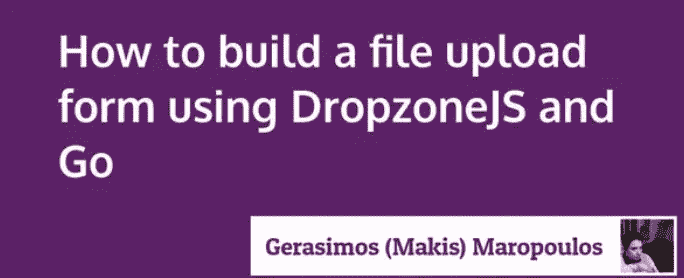
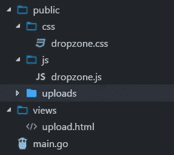
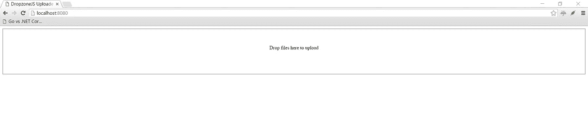
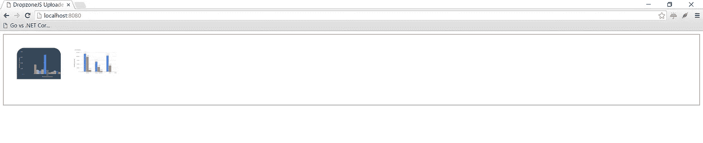
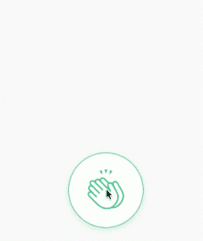

# 如何使用 DropzoneJS 和 Go 构建文件上传表单

> 原文：<https://medium.com/hackernoon/how-to-build-a-file-upload-form-using-dropzonejs-and-go-8fb9f258a991>



这是 DropzoneJS + Go 系列的第 1 部分，共 2 部分。

*   [第 1 部分:如何构建文件上传表单](/@kataras/how-to-build-a-file-upload-form-using-dropzonejs-and-go-8fb9f258a991)
*   [第二部分:如何显示服务器上的现有文件](/@kataras/how-to-display-existing-files-on-server-using-dropzonejs-and-go-53e24b57ba19)

# DropzoneJS + Go:如何构建文件上传表单

DropzoneJS 是一个开源库，提供图像预览的拖放文件上传。这是一个很棒的 JavaScript 库，实际上它甚至不依赖于 JQuery。
在本教程中，我们将使用 DropzoneJS 构建一个多文件上传表单，后端将由 Go 和 [Iris](https://iris-go.com) 处理。

# 目录

*   准备
*   使用 DropzoneJS
*   使用 Go 工作

# 准备

1.  下载 [Go(Golang)](https://golang.org/dl) ，按照图中所示设置您的电脑，然后继续 2。
2.  安装[光圈](https://github.com/kataras/iris)；打开终端并执行`go get -u github.com/kataras/iris`
3.  从[这个 URL](https://raw.githubusercontent.com/enyo/dropzone/master/dist/dropzone.js) 下载 DropzoneJS。DropzoneJS 不依赖 JQuery，你不用担心升级 JQuery 版本会破坏你的应用。
4.  如果你想要一些已经制作好的 css，从这个 URL 下载 dropzone.css。
5.  创建一个文件夹”。/public/uploads”，这是用于存储上传的文件。
6.  创建一个文件”。/views/upload.html”，这是针对前端表单页面的。
7.  创建一个文件”。/main.go "，这是为了处理后端文件上传过程。

准备后，您的文件夹和文件结构应该如下所示:



# 使用 DropzoneJS

打开文件”。/views/upload.html”并创建一个 DropzoneJs 表单。

将下面的内容复制到”。/views/upload.html”，我们将逐个检查每一行代码。

1.  包括 CSS 样式表。
2.  包括 DropzoneJS JavaScript 库。
3.  用 css 类“dropzone”创建一个上传表单，“action”是路由路径“/upload”。请注意，我们确实为回退模式创建了一个输入字段。这都是 DropzoneJS 库自己处理的。我们需要做的就是将 css 类“dropzone”分配给表单。默认情况下，DropzoneJS 会找到所有带有“dropzone”类的表单，并自动将自己附加到它上面。

# 使用 Go 工作

现在你已经到了教程的最后一部分。在本节中，我们将存储从 DropzoneJS 发送到。/public/uploads”文件夹。

打开“main.go”并复制下面的代码:

1.  创建新的 Iris 应用程序。
2.  从“视图”文件夹中注册并加载模板。
3.  使“/public”路由路径静态地服务于。/public/…文件夹的内容
4.  创建一个为上传表单服务的路由。
5.  创建一个路由来处理 DropzoneJS 表单中的 POST 表单数据
6.  为目标文件夹声明一个变量。
7.  如果文件被发送到页面，将文件对象存储到一个临时“file”变量中。
8.  根据 uploads dir+上传文件的名称将上传的文件移动到目标位置。

# 运行服务器

在当前项目的目录下打开终端并执行:

```
$ go run main.go
Now listening on: http://localhost:8080
Application started. Press CTRL+C to shut down.
```

现在进入浏览器，导航到 [http://localhost:8080](http://localhost:8080) ，你应该能看到如下页面:



通过[点击此处](/@kataras/how-to-display-existing-files-on-server-using-dropzonejs-and-go-53e24b57ba19)前进到第 2 部分。

我想亲自感谢[开发团队在他们的 twitter 账户上分享我的新文章！](https://dev.to/@kataras)

我喜欢不止一次点击按钮时的视觉效果，你呢？很简单:只要点击拍手按钮。如果感觉强烈，再点一下**(或者直接按住** **)。**

