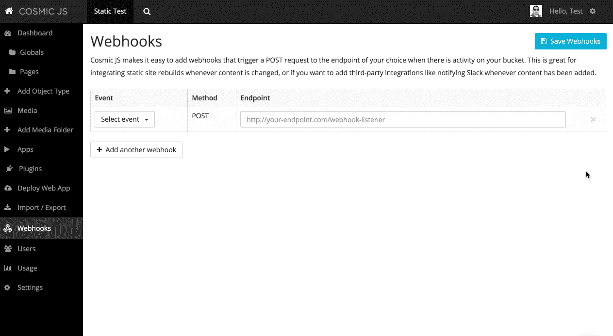

# 如何建立一个 JAMstack 网站

> 原文：<https://medium.com/hackernoon/how-to-build-a-jamstack-website-f067a2b0c79a>


最近对静态网站的兴趣激增，因为它们提供了包括快速页面加载和安全性在内的好处。这种新的网站建设方式有一个新的术语，是由在网上生活的人们创造的，叫做 T2 jam stack T3(不要和 T4 玩电吉他最上瘾的方式 T5 混淆)。如果您对这个概念不熟悉，那么 JAMstack 由 JavaScript 驱动的页面交互前端(J)、连接到各种 API 以获得第三方功能的 API(A)和部署到您的实例的普通旧标记(HTML)组成(M)。

《粉碎》杂志最近对创建他们的新 JAMstack 网站赞不绝口，目前正在对他们现有的网站进行大规模改造。在 Netlify 和 Netlify 开源 CMS 的帮助下，他们正在放弃他们目前维护的臃肿、易受痛点困扰的 WordPress monolith，转而支持一个基于 JAMStack 的网站。

# 宇宙干扰

在本文中，我将向您展示如何使用 Cosmic JS 来部署您自己的 JAMstack 网站，只需点击几下鼠标。当你使用 Cosmic 时，你不仅可以从一个快速、优化的静态网站中获益，而且你的内容也可以在 Cosmic JS API 中获得。这使得其他应用程序可以轻松访问您的内容，包括登录页面、微型网站或原生 iOS 和 Android 应用程序。

# TL；速度三角形定位法(dead reckoning)

1.[安装宇宙 JS 静态网站](https://cosmicjs.com/apps/static-website)。
2。[查看 GitHub 上的代码](https://github.com/cosmicjs/static-website)看看这个应用是如何构建的。
3。通过转到您的存储桶>部署 Web 应用程序，将您的应用程序部署到 Cosmic 应用程序服务器。
4。设置位于铲斗>网钩中的网钩。

# 入门指南

我们将安装[宇宙 JS 应用商店](https://cosmicjs.com/apps)中的[静态网站应用](https://cosmicjs.com/apps/static-website)。当你这样做的时候，你也应该[将回购](https://github.com/cosmicjs/static-website)分支到你自己在 GitHub 上的仓库。这样，您就可以按照自己的方式进行所有需要的定制。

让我们看看这个应用程序是如何组装的。如需跟进，[请访问 GitHub repo](https://github.com/cosmicjs/static-website) 。下面是 app.js 文件:

```
// app.js
var buildSite = require('./build-site')
buildSite()
var express = require('express')
var app = express()
app.set('port', process.env.PORT || 3000)
app.use(express.static('build'))
app.get('/rebuild-site', (req, res) => {
  buildSite()
  res.end('Site rebuilt!')
})
app.post('/rebuild-site', (req, res) => {
  buildSite()
  res.end('Site rebuilt!')
})
app.get('*', (req, res) => {
  res.redirect('/404')
})
app.listen(app.get('port') || 3000, () => {
  console.info('==> 🌎  Go to http://localhost:%s', app.get('port'))
})
```

首先，我们从一个 Node.js 应用程序开始，该应用程序包括几条路线:

`/rebuild-site`(为了方便起见既有 GET 又有 POST)
`/404`
`/build`(为了保存我们所有的静态网站构建文件)

接下来让我们看看网站是如何建立的。

```
// build-site.js
var Metalsmith = require('metalsmith')
var markdown = require('metalsmith-markdown')
var layouts = require('metalsmith-layouts')
var permalinks = require('metalsmith-permalinks')
var sass = require('metalsmith-sass')
var metalsmithPrism = require('metalsmith-prism');
var Cosmic = require('cosmicjs')
var async = require('async')
var mkdirp = require('mkdirp')
var del = require('del')
var mv = require('mv')
var createPage = require('./create-page')
var config = require('./config')
module.exports = () => {
  async.series([
    // Create build-new folder
    callback => {
      mkdirp(__dirname + '/build-new', err => {
        callback()
      })
    },
    callback => {
      Cosmic.getObjects(config.cosmicjs, (err, res) => {
        var pages = res.objects.type.pages
        var cosmic = res
        // Create dynamic static pages
        async.eachSeries(pages, (page, callbackEach) => {
          var args = {
            page: page,
            pages: pages,
            cosmic: cosmic
          }
          createPage(args, callbackEach)
        }, () => {
          // Create markdown static pages
          var year = (new Date()).getFullYear() // make your footer year dynamic ;) 
          Metalsmith(__dirname)
            .metadata({
              cosmic: cosmic,
              year: year
            })
            .source('./src')
            .destination('./build-new')
            .clean(false)
            .use(sass({
              outputDir: 'css/',
              sourceMap: true,
              sourceMapContents: true
            }))
            .use(markdown( { langPrefix: 'language-' } ))
            .use(metalsmithPrism())
            .use(permalinks())
            .use(layouts({
              engine: 'handlebars',
              partials: 'layouts/partials'
            }))
            .build((err, files) => {
              if (err) { throw err }
              callback()
            })
        })
      })
    },
    // Delete build folder
    callback => {
      del([__dirname + '/build']).then(() => {
        callback()
      })
    },
    // Move build-new to build folder
    callback => {
      mv(__dirname + '/build-new', __dirname + '/build', { mkdirp: true }, () => {
        callback()
      })
    },
    // Delete build-new folder
    callback => {
      del([__dirname + '/build-new']).then(() => {
        // done
      })
    }
  ])
}
```

这个文件包含了所有的魔法，让我们来解开这里发生的事情:
1。我们正在使用 [Metalsmith](http://www.metalsmith.io/) 来构建我们的网站文件。还有其他的构建工具，但是对于 JavaScript 构建的静态站点来说，这是最好的(IMO)。
2。`build-new`文件夹是为我们的新构建创建的临时位置。这是为了让我们不会从当前在网站上的用户那里得到任何停机时间。
3。接下来，我们将使用宇宙 JS NPM 模块和方法`Cosmic.getObjects`
4 获取宇宙 JS 桶中的所有对象。然后，我们将从我们的响应解析所有页面。然后开始一个循环，为每个页面对象创建一个新的静态页面。
5。然后，每个页面对象将被传递给 Metalsmith 来构建我们的页面。
6。在 Metalsmith 完成将我们的标记插入到`build-new`文件夹后，构建文件夹被删除。7 .毫不犹豫地，新的`build`文件夹就用新的构建创建好了。

就是这样！您的 Cosmic JS 内容现在可以在 JAMstack 生成的 HTML 文件中以静态形式获得。另外，您可以通过 Cosmic JS API 访问您的所有内容。此外，如果你需要不精通 Markdown 的人来编辑内容，他们可以通过 Cosmic JS 仪表板中的 WYSIWYG 编辑器轻松编辑内容。

# 使用 Webhooks 进行自动重建

Cosmic JS 提供了一个很好的方法，可以在每次使用 Webhooks 编辑内容时自动重建 JAMstack 静态网站。设置 webhooks 很容易。只需转到 Bucket > Dashboard > Webhooks，将 POST 设置为您选择的端点和动作。在这个例子中，你可以设置你的 Webhook 来发布到`[your-app-hostname]/rebuild-site`。



# 最后

在这篇文章中，我们谈到了静态网站最近的更名(干扰听起来比静态网站建设有趣得多)。我们讨论了如何使用 [Cosmic JS 静态网站应用](https://cosmicjs.com/apps/static-website)点击几下就可以安装一个支持 JAMstack 的网站。我们向您展示了如何通过 Cosmic JS Webhooks 在内容发生变化时自动重建您的网站。如果你有任何问题，[加入我们的休闲频道](https://cosmicjs.com/community)和[在 Twitter 上联系](https://twitter.com/cosmic_js)。

[](http://bit.ly/HackernoonFB)[](https://goo.gl/k7XYbx)[](https://goo.gl/4ofytp)

> [黑客中午](http://bit.ly/Hackernoon)是黑客如何开始他们的下午。我们是 [@AMI](http://bit.ly/atAMIatAMI) 家庭的一员。我们现在[接受投稿](http://bit.ly/hackernoonsubmission)并乐意[讨论广告&赞助](mailto:partners@amipublications.com)机会。
> 
> 如果你喜欢这个故事，我们推荐你阅读我们的[最新科技故事](http://bit.ly/hackernoonlatestt)和[趋势科技故事](https://hackernoon.com/trending)。直到下一次，不要把世界的现实想当然！

