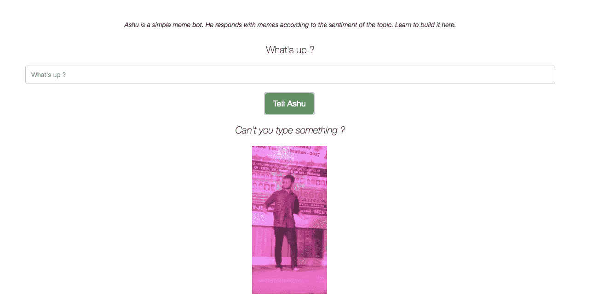
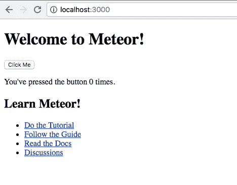
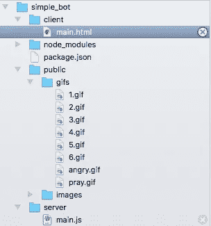

# 如何使用 Meteor 在 30 分钟内构建一个简单的 meme bot

> 原文：<https://medium.com/hackernoon/how-to-build-a-meme-bot-in-30-minutes-using-meteor-dbbe6d2bcbf0>


我们将建造一个简单的迷因机器人。它根据话题的情绪用模因来回应。在这里获取源代码[。如果你对制作云应用感兴趣。做结帐我的书](https://github.com/jamesfebin/simplebot)[云易如反掌](http://amzn.to/2n32wJT)。点击获取免费章节[。](http://bit.ly/2izUg2h)



# 安装流星

**如果你使用的是 OSX/Linux**

```
curl [https://install.meteor.com/](https://install.meteor.com/) | sh
```

**如果你用的是 Windows**

在这里下载安装程序

现在在你的终端

```
meteor create simplebot
cd simplebot
meteor npm install
meteor
```

现在访问 [http://localhost:3000/](http://localhost:3000/)



我们需要六张 gif，三张代表积极情绪，另一张代表消极情绪。从三张 gif 中随机抽取一张展示。

这六个迷因必须是 gif 格式，文件名为 1.gif，2.gif，…、6.gif 以及文件名为“angry.gif”的另一个。我们将把前三个用于消极情绪，另外三个用于积极情绪。(你可以用我用过的 gif，在这里得到它们

创建一个名为 public 的文件夹。在里面创建一个名为 gifs 的文件夹。把 gif 放在里面。



对于样式，让我们添加 twitter 引导。转到终端并键入以下命令(*使用 CTRL + C 停止 meteor，然后执行以下命令*)

```
meteor add twbs:bootstrap
```

添加这个包用于情感分析

```
meteor add art1sec8:sentiment
```

让我们通过键入

```
meteor
```

下面的代码会给我们写的文本的情绪。

```
sentiment(“I am so Happy”, function( e, result ) {console.log(result.score);});
```

这就为“我好开心”这几个字计算了情绪。因为这是一个肯定句，所以我们得到零分以上。否则我们会得零分。

下面是根据积极和消极情绪选择随机 gif 的代码。(*通读代码，暂时不要在你的文件中使用。*)

```
var responses = [“God , help us.”,”Let’s scoot”,”Just through it away”,”Danda nakka …”, “Like that huh? ;) “,”Because am happy …”];sentiment($(“#text”).val(), function( e, result ) { if(result.score < 0){ pos = getRandom(1,3); prepareResponse(“/gifs/”+pos+”.gif”,responses[pos-1]); }else{ pos = getRandom(4,6); prepareResponse(“/gifs/”+pos+”.gif”,responses[pos-1]);
}});
```

如果用户不输入任何东西或输入较少的单词，我们会给他看愤怒的 gif。这是代码。*(通读代码，暂时不要在你的文件中使用。)*

```
function checkIfBlank(){ if($(“#text”).val() == “”){ $(“#answer”).attr(“src”, “gifs/angry.gif”); $(“#response”).html(“<p class=’lead’> <i> Can’t you type something ?</i></p>”); showResponses(); return false;
     } return true;}function checkIfLessWords(){ if($(“#text”).val().split(“ “).length<=5){ $(“#answer”).attr(“src”, “gifs/angry.gif”); $(“#response”).html(“<p class=’lead’> <i> Seriously? Type at least six words! </i></p>”); showResponses(); return false;
       } return true;}
```

现在，让我们将上面的代码集成到一个 html 文件中。用以下代码行替换您的 main.html

```
<head><title>A Simple Bot</title><meta name=”viewport” content=”width=device-width, initial-scale=1, maximum-scale=1"></head><body>{{> info}}</body><template name=”info”><center><br/><br/><br/><form><div class=”form-group” style=”width:80%”><br/><br/><p><i> Ashu is a simple meme bot. He responds with memes according to the sentiment of the topic. </i></p><br/><p class=”lead” >What’s up ?</p><input style=”height:40px;display:inline” type=”text” class=”form-control” id=”text” placeholder=”What’s up ?” /><br/><br/><button class=”btn btn-lg btn-success” id=”tell” >Tell Ashu</button><br/><br/><p id=”response”> </p><br/><br/></div><script type=”text/javascript”>function hideResponses(){$(“#answer”).hide();
$(“#response”).hide();}function showResponses(){$(“#answer”).show();
$(“#response”).show();}function checkIfBlank(){ if($(“#text”).val() == “”){ $(“#answer”).attr(“src”, “gifs/angry.gif”); $(“#response”).html(“<p class=’lead’> <i> Can’t you type something ?</i></p>”); showResponses(); return false;
} return true;}function checkIfLessWords(){ if($(“#text”).val().split(“ “).length<=5){ $(“#answer”).attr(“src”, “gifs/angry.gif”); $(“#response”).html(“<p class=’lead’> <i> Seriously? Type at least six words! </i></p>”); showResponses(); return false;
     } return true;}function prepareResponse(filename,response){ $(“#answer”).attr(“src”, filename); $(“#response”).html(“<p class=’lead’> “ + response + “ </p>”); showResponses();}function getRandom(min, max) { return Math.round(Math.random() * (max — min) + min);}$(“document”).ready(function(){ $( “#text” ).on(‘input’,function(e){    hideResponses(); 
    // Hide the gif if user is inputing text }); hideResponses();var responses = [“God , help us.”,”Let’s scoot”,”Just through it away”,”Danda nakka …”, “Like that huh? ;) “,”Because am happy …”];$(“#tell”).click(function(e){ e.preventDefault(); if(!checkIfBlank()) return; if(!checkIfLessWords()) return ; sentiment($(“#text”).val(), function( e, result ) { if(result.score < 0){ pos = getRandom(1,3); prepareResponse(“/gifs/”+pos+”.gif”,responses[pos-1]); }else{ pos = getRandom(4,6); prepareResponse(“/gifs/”+pos+”.gif”,responses[pos-1]); } });});});</script><br/></form></center></template>
```

现在访问 [http://localhost:3000](http://localhost:3000)

恭喜你，你创造了一个迷因机器人:D


对制作云应用感兴趣？做结帐我的书[云易如反掌](http://amzn.to/2n32wJT)。在这里获得免费章节。

如果您需要任何编程方面的帮助，请填写此[表格](https://docs.google.com/forms/d/e/1FAIpQLSfT53VfKPOyBBDxN8F5fOSDt0Uj3XGUoRqH2xXKC_CWqIBSeg/viewform)。我会尽快回复你。

[](http://bit.ly/HackernoonFB)[](https://goo.gl/k7XYbx)[](https://goo.gl/4ofytp)

> [黑客中午](http://bit.ly/Hackernoon)是黑客如何开始他们的下午。我们是 [@AMI](http://bit.ly/atAMIatAMI) 家庭的一员。我们现在[接受投稿](http://bit.ly/hackernoonsubmission)并乐意[讨论广告&赞助](mailto:partners@amipublications.com)机会。
> 
> 如果你喜欢这个故事，我们推荐你阅读我们的[最新科技故事](http://bit.ly/hackernoonlatestt)和[趋势科技故事](https://hackernoon.com/trending)。直到下一次，不要把世界的现实想当然！

