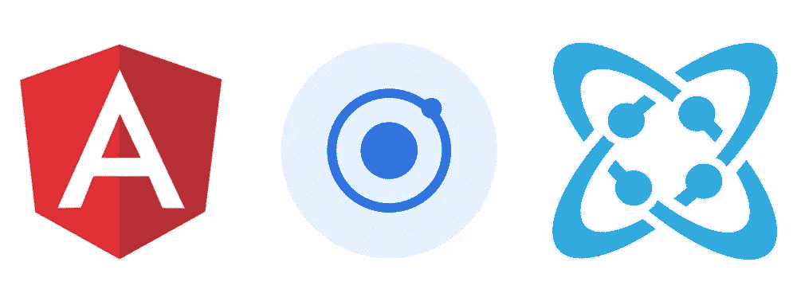
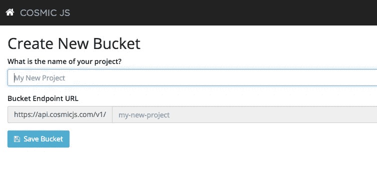
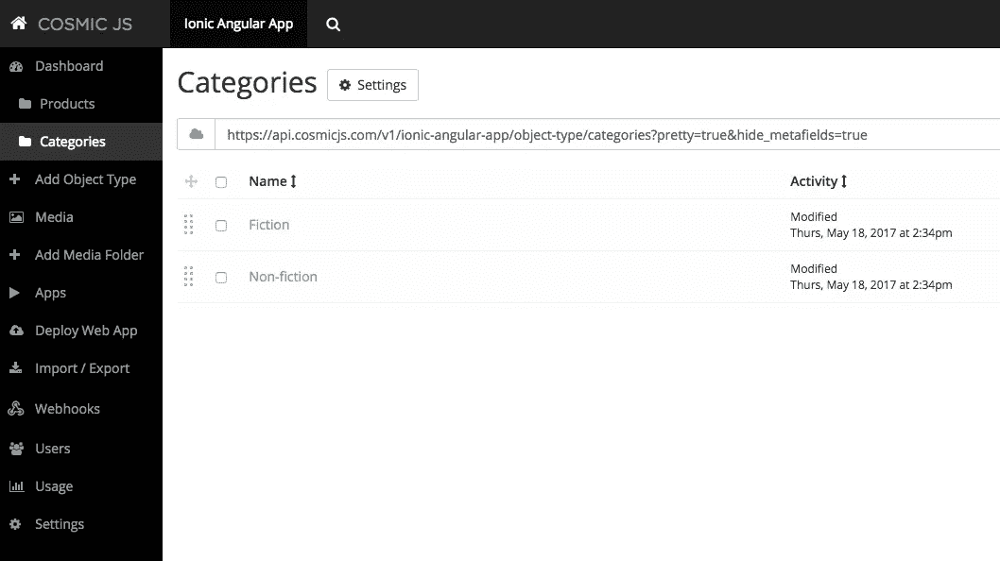

# 如何使用 Angular JS、Ionic 和 Cosmic JS 构建移动产品目录 App

> 原文：<https://medium.com/hackernoon/how-to-build-a-mobile-product-catalog-app-using-angular-js-ionic-and-cosmic-js-ca939517aba1>



这篇文章最初出现在宇宙 JS 博客上。

# **TL；博士**

[在 GitHub 上查看代码库并遵循安装说明。](https://github.com/cosmicjs/ionic-angular-app)

在本教程中，我将向您展示如何使用 Cosmic JS 和 Ionic Framework 创建一个简单的目录移动应用程序。

# 先决条件

您需要预先安装 node.js、npm 和 ionic cli。在开始之前确保你已经有了它们。请参考 ionic docs 如何做到这一点。你需要 Ionic framework >= 2.0 来运行这个例子，所以要确保你有正确的 Ionic 版本:

```
ionic -v
```

# 入门指南

首先，我们需要创建一个离子项目。我们将使用标准选项卡模板，并将修改一个选项卡以保留我们的目录组件。因此，一旦安装了所有的先决条件，就需要设置新的 Ionic 项目:

```
ionic start cosmic-demo tabs --v2
```

设置好这个项目后，您就可以运行了

```
ionic serve
```

在浏览器中玩你的应用程序

# 建立宇宙 JS 库

首先安装 Cosmic JS Angular/JavaScript 库

```
npm install cosmicjs --save
```

现在你应该能够导入宇宙对象并执行宇宙 JS API 调用，如下所示:

```
import Cosmic from 'cosmicjs';
const bucket = { slug: 'your-bucket-slug' };Cosmic.getObjects({ bucket }, (err, res) => {
  console.log(res.objects);
});
```

# 用宇宙 JS 设置事物

创建桶并记住桶名(在我们的例子中是“宇宙离子”):



然后创建一个名为“Category”的新对象类型，请记住对象类型 slug(“categories”)。



我们现在不需要任何额外的设置，所以只需设置名称和保存对象类型。保存后，您将被重定向到“新类别”页面。使用此页面创建一些类别并保存它们。

现在使用与类别相同的方法创建产品对象类型。但是我们有一个不同之处——请进入“图元字段模板”选项卡，并添加“图像/文件”类型的图元字段，关键字为“图像”。这个元字段将存储产品图像。

您需要添加的第二个元字段是“单个对象关系”。请创建这样的元字段，并将类别选择为“可供选择的对象类型”。

这样的产品结构允许我们在产品和类别之间建立一对多的关系。

创建产品对象类型后，请添加一些演示产品，并将它们分配到不同的类别。确保你在一个类别中有 5 个以上的产品——这让我们可以测试无限滚动。

# 应用程序的离子部分

使用以下内容创建 src/pages/categories _ list/categories _ list . ts 文件:

```
import { Component } from '@angular/core';
import { NavController } from 'ionic-angular';
import Cosmic from 'cosmicjs';
import { ProductsList } from '../products_list/products_list';@Component({
    selector: 'page-categories',
    templateUrl: 'categories_list.html'
})
export class CategoriesList {
    public categories; constructor(
        public navCtrl: NavController
    ) {
        this.categories = []; Cosmic.getObjectType({
            bucket: {
                slug: 'cosmic-ionc'
            }
        }, {
            type_slug: 'categories'
        }, (err, res) => {
            this.categories = res.objects.all;
        });
    }
    navToCategory(category) {
        this.navCtrl.push(ProductsList, { title: category.title, id: category._id });
    }
}
```

然后为 CategoriesList 组件创建模板:

```
<ion-header>
  <ion-navbar>
    <ion-title>
      Categories
    </ion-title>
  </ion-navbar>
</ion-header>
<ion-content padding>
    <ion-list>
        <button ion-item *ngFor="let category of categories" (click)="showProducts()">
            {{ category.title }}
        </button>
    </ion-list>
</ion-content>
```

向 app.module.ts 添加 CategoriesList 组件，就像对 HomePage 等其他组件一样，并将其设置为 TabsPage 组件的第一个选项卡。

# 这里发生了什么？

我们的类别列表组件在其构造函数中使用了 Cosmic JS API 来接收我们拥有的类别列表。它使用两种方法来实现所需的功能:

*   通过宇宙 JS 桶过滤对象
*   按对象类型过滤对象

类别列表组件引用产品列表组件—一旦用户单击类别项目，它就会导航到产品列表页面。因此，我们需要 ProductsList —组件，它将为我们显示每个特定类别的产品列表。来介绍一下吧！

```
import { Component } from '@angular/core';
import { NavController, NavParams } from 'ionic-angular';
import {Http} from '@angular/http';
import { DomSanitizer } from '@angular/platform-browser'
@Component({
    selector: 'page-products-list',
    templateUrl: 'products_list.html'
})
export class ProductsList {
    public products;
    public category_title;
    constructor(
        public navCtrl: NavController,
        public params: NavParams,
        public http: Http,
        private sanitizer: DomSanitizer
    ) {
        this.products = [];
        this.category_title = this.params.get('title');        this.http.get(`https://api.cosmicjs.com/v1/cosmic-ionc/object-type/products/search?metafield_key=category&metafield_value=${this.params.get('id')}`).subscribe((resp) => {
            let data = resp.json();
            if (data.objects) {
                this.products = data.objects;
            }
            else {
                this.products = [];
            }
        });
    }
    getImageUrl(product) {
        let url = product.metafields.find((v) => { return (v.key == 'image') }).value;
        return `https://cosmicjs.imgix.net/${url}`;
    }
    sanContent(product): any {
        return this.sanitizer.bypassSecurityTrustHtml(product.content);
    }}
```

这里我们有产品列表模板:

```
<ion-header>
  <ion-navbar>
    <ion-title>
      {{ category_title }}
    </ion-title>
  </ion-navbar>
</ion-header>
<ion-content padding>
    <ion-card ion-item *ngFor="let product of products">
        
        <ion-card-content>
            <ion-card-title>{{ product.title }}</ion-card-title>
            <div class="white-space-normal" [innerHTML]="sanContent(product)"></div>
        </ion-card-content>
    </ion-card>
</ion-content>
```

# 这里发生了什么事？

Cosmic JS JavaScript 库没有提供任何根据属性过滤对象的方法，但是 REST API 提供了。这就是为什么我们使用 Angular Http 模块向 Cosmic JS API 发出 HTTP 请求。

在这种情况下，请求 URL 应该如下所示:

```
[https://api.cosmicjs.com/v1/BUCKET_NAME/object-type/OBJECT_TYPE_SLUG/search?metafield_key=CATEGORY_OBJECT_TYPE_SLUG&metafield_value=CATEGORY_OBJECT_ID](https://api.cosmicjs.com/v1/BUCKET_NAME/object-type/OBJECT_TYPE_SLUG/search?metafield_key=CATEGORY_OBJECT_TYPE_SLUG&metafield_value=CATEGORY_OBJECT_ID)
```

我们要看的第二个有趣的东西是 getImageUrl 函数。图像是产品元数据的一部分，这就是为什么它将是每个 API 响应对象的元字段数组的一项。我们的目标是提取所需的 metafieldsarray 项(键字段等于‘image’—我们在创建元字段时输入的键)。这个数组项也有值键——它是图像文件名，我们需要在它前面加上[https://cosmicjs.imgix.net/](https://cosmicjs.imgix.net/)来获得完整的图像 URL。

我们在这里使用 Angular 4，这就是为什么我们必须使用 DomSanitizer 来显示从 Cosmic JS API 接收的 HTML 标记。

# 结论

Cosmic JS 让我们不用过多考虑后端和 API 就可以快速开始移动应用开发。一般来说，一切都可以使用你的 Ionic/Angular developer 来完成，这将为你节省大量的时间和金钱。可以快速添加/删除或修改任何后端/API 实体，以满足您的项目需求。

[](http://bit.ly/HackernoonFB)[](https://goo.gl/k7XYbx)[](https://goo.gl/4ofytp)

> [黑客中午](http://bit.ly/Hackernoon)是黑客如何开始他们的下午。我们是 [@AMI](http://bit.ly/atAMIatAMI) 家庭的一员。我们现在[接受投稿](http://bit.ly/hackernoonsubmission)并乐意[讨论广告&赞助](mailto:partners@amipublications.com)机会。
> 
> 如果你喜欢这个故事，我们推荐你阅读我们的[最新科技故事](http://bit.ly/hackernoonlatestt)和[趋势科技故事](https://hackernoon.com/trending)。直到下一次，不要把世界的现实想当然！

