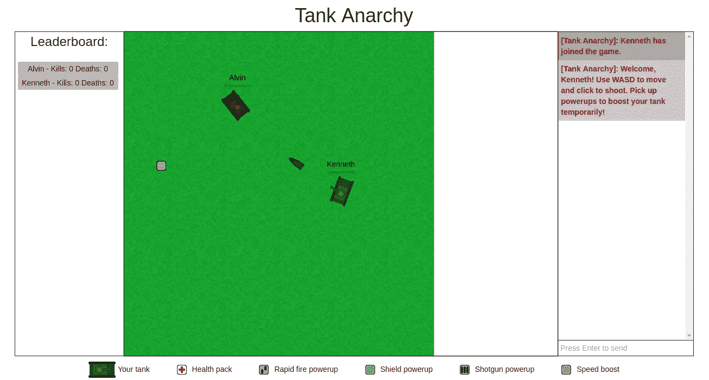
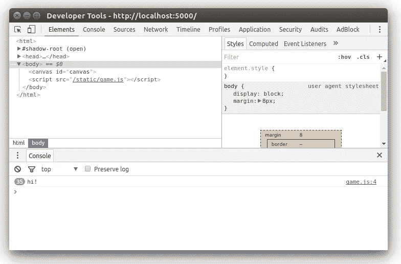

# 如何构建一个多人浏览器游戏(第 1 部分)

> 原文：<https://medium.com/hackernoon/how-to-build-a-multiplayer-browser-game-4a793818c29b>



Tank Anarchy

回到 2014 年，我参加了我在纽约的第一次代码日。虽然 CodeDay 不完全是一个黑客马拉松，但这是我第一次体验类似黑客马拉松的活动。在这次活动中，我和我的朋友肯尼斯·李(Kenneth Li)一起制作了一个多人坦克战斗游戏。由于我的一些朋友对我如何构建它表示了兴趣，我想我应该在这里记录这个过程。

在这篇文章中，我将快速回顾一下我的思考过程，并给出一个如何复制架构的演示，如果你想自己尝试的话，还会提供一些提示和技巧。这篇文章假设你已经掌握了 JavaScript 和 node.js 的基础知识。如果你没有，有很多[很棒的在线资源](https://nodeschool.io/)可以学习以上内容。

我在 node.js 后端构建了这个游戏，使用 WebSockets 提供客户端和服务器之间的实时通信。游戏本身呈现在客户端的 HTML5 画布上。要开始，你当然需要 node.js。对于这篇文章，我将使用 node . js 6 . 3 . 1 版，但你可以使用几乎任何版本(0.12 以上)，应该没问题。

让我们先从依赖关系开始。为您的项目创建一个目录，并在其中运行以下内容:

```
npm init
npm install --save express socket.io
```

我们将使用 [Express framework](http://expressjs.com/) 来快速设置服务器，并使用 [socket.io](http://socket.io) 包来处理服务器上的 WebSockets。将以下内容放入名为`server.js`的文件中:

```
// Dependencies
var express = require('express');
var http = require('http');
var path = require('path');
var socketIO = require('socket.io');var app = express();
var server = http.Server(app);
var io = socketIO(server);app.set('port', 5000);
app.use('/static', express.static(__dirname + '/static'));// Routing
app.get('/', function(request, response) {
  response.sendFile(path.join(__dirname, 'index.html'));
});// Starts the server.
server.listen(5000, function() {
  console.log('Starting server on port 5000');
});
```

上面的代码是一个使用 Express 框架的非常标准的 node.js 服务器。它为服务器设置依赖关系和基本路由。对于这个演示应用程序，我们将只为单个的`index.html`和`static`目录服务。在根项目文件夹中创建一个名为`static`的目录和一个`index.html`文件。HTML 文件非常简单，所以我们现在就写:

```
<html>
  <head>
    <title>A Multiplayer Game</title>
    <style>
      canvas {
        width: 800px;
        height: 600px;
        border: 5px solid black;
      }
    </style>
    <script src="/socket.io/socket.io.js"></script>
  </head>
  <body>
    <canvas id="canvas"></canvas>
  </body>
  <script src="/static/game.js"></script>
</html>
```

对于较大规模的项目，应该将 CSS 样式放在单独的专用样式表中。您可能还会有更多的 UI 和显示元素。为了简单起见，我将 CSS 保留在 HTML 代码中。注意，我还包含了一个`socket.io.js`脚本。这是在托管服务器时由 socket.io 包自动提供的。

现在我们将在服务器上为 WebSockets 做一些设置。将此行添加到`server.js`的末尾:

```
// Add the WebSocket handlers
io.on('connection', function(socket) {
});
```

我们还没有它的任何功能，所以现在就让它保持原样吧。为了进行测试，在`server.js`的末尾添加以下几行:

```
setInterval(function() {
  io.sockets.emit('message', 'hi!');
}, 1000);
```

这将向所有连接的套接字发送名为“message”和内容为“hi”的消息。记住稍后删除这段代码，因为它只是用于测试。

在`static`目录下创建一个名为`game.js`的文件。我们可以编写一个快速函数来记录来自服务器的消息，以便验证我们正在接收它们。将以下内容放入`static/game.js`:

```
var socket = io();
socket.on('message', function(data) {
  console.log(data);
});
```



运行服务器(使用命令`node server.js`)并在任何 web 浏览器中导航到 [http://localhost:5000](http://localhost:5000) 。如果您打开开发人员控制台，您会注意到每秒钟都会出现一条消息(右键单击- > Inspect)。

一般来说，`socket.emit(name,data)`如果在客户端被调用，会向服务器端发送一条带有给定名称和数据的消息，反之亦然。要侦听具有特定名称的消息，您需要创建一个如下所示的事件处理程序:

```
socket.on('name', function(data) {
  // data is a parameter containing whatever data was sent
});
```

你可以使用`socket.emit()`发送任何东西。您还可以将 JSON 对象传递给数据参数，这对我们来说非常方便。这允许我们在服务器和客户端之间即时地来回发送游戏信息，形成了大多数多人游戏功能的主干。

让客户端发送一些键盘状态。将以下代码放在`static/game.js`的末尾:

```
var movement = {
  up: false,
  down: false,
  left: false,
  right: false
}
document.addEventListener('keydown', function(event) {
  switch (event.keyCode) {
    case 65: // A
      movement.left = true;
      break;
    case 87: // W
      movement.up = true;
      break;
    case 68: // D
      movement.right = true;
      break;
    case 83: // S
      movement.down = true;
      break;
  }
});
document.addEventListener('keyup', function(event) {
  switch (event.keyCode) {
    case 65: // A
      movement.left = false;
      break;
    case 87: // W
      movement.up = false;
      break;
    case 68: // D
      movement.right = false;
      break;
    case 83: // S
      movement.down = false;
      break;
  }
});
```

这是一些输入处理程序的基本代码，用来跟踪 WASD 键何时被按下。在这之后，我们将添加一条消息来提醒服务器有新玩家加入，并创建一个循环来不断地向服务器发送他们的键盘输入。

```
socket.emit('new player');
setInterval(function() {
  socket.emit('movement', movement);
}, 1000 / 60);
```

这将每秒钟向服务器发送 60 次该客户端的键盘状态。现在我们需要在服务器上处理这个输入。将以下内容添加到`server.js`的末尾:

```
var players = {};
io.on('connection', function(socket) {
  socket.on('new player', function() {
    players[socket.id] = {
      x: 300,
      y: 300
    };
  });
  socket.on('movement', function(data) {
    var player = players[socket.id] || {};
    if (data.left) {
      player.x -= 5;
    }
    if (data.up) {
      player.y -= 5;
    }
    if (data.right) {
      player.x += 5;
    }
    if (data.down) {
      player.y += 5;
    }
  });
});setInterval(function() {
  io.sockets.emit('state', players);
}, 1000 / 60);
```

我们来分析一下。我们将把所有连接的玩家存储为 JavaScript 字典(JSON 对象)。因为连接到服务器的每个套接字都有一个唯一的 ID，所以我们也可以使用这个 ID 来标识玩家。字典中的每个键将是所连接的播放器的套接字的套接字 ID，值将是包含 x 和 y 位置的另一个字典。

当服务器接收到“新玩家”消息时，它将使用发送该消息的套接字的 ID 在玩家对象中添加一个新条目。当服务器收到“移动”消息时，它将更新与该套接字关联的播放器(如果存在的话)。

`io.sockets.emit()`是一个调用，它将给定的消息和数据发送到所有连接的套接字。服务器将每秒 60 次向所有连接的客户端发送其状态。

在这一点上，客户端实际上并没有对这些信息做任何事情，所以让我们在客户端添加一个处理程序，将服务器上的数据绘制到 HTML5 画布上。将此代码添加到`static/game.js`的末尾:

```
var canvas = document.getElementById('canvas');
canvas.width = 800;
canvas.height = 600;
var context = canvas.getContext('2d');
socket.on('state', function(players) {
  context.clearRect(0, 0, 800, 600);
  context.fillStyle = 'green';
  for (var id in players) {
    var player = players[id];
    context.beginPath();
    context.arc(player.x, player.y, 10, 0, 2 * Math.PI);
    context.fill();
  }
});
```

这段代码访问画布并在其上进行绘制。每次从服务器收到“状态”消息时，客户端将清空画布，并将所有玩家重新绘制为画布上的绿色圆圈。

任何连接的客户端现在都可以将所有连接的玩家的状态绘制到画布上。运行服务器(再次使用命令`node server.js`)并在 web 浏览器中打开两个选项卡。如果您导航到 [http://localhost:5000，](http://localhost:5000,)，您应该会看到类似这样的行为:

差不多就是这样！如果你跟不上，这里有一个到包含这个最小实现的库的链接。

## 提示和技巧

如果您正在制作一个真实的游戏，那么将本演示中使用的大量代码重构到它们自己的文件中会是一个更好的主意。

这些多人游戏是 MVC 架构的很好的例子。所有的游戏逻辑都应该在服务器上处理，客户端唯一应该做的事情就是将用户输入发送到服务器，并呈现服务器发送的信息。

尽管这个演示项目有一些缺陷。游戏更新依赖于套接字监听器。如果我想改变游戏状态，我可以在检查器中输入以下内容:

```
while (true) {
  socket.emit('movement', { left: true });
}
```

根据电脑的不同，运动数据现在每秒钟被发送到服务器超过 60 次，导致玩家开始疯狂地快速移动。这让我想到了另一个被称为权威服务器确定的概念。

在任何时候，客户端都不应该控制服务器上的任何数据。例如，您不应该在服务器上编写允许客户端根据通过套接字传递的数据来设置其位置/健康状况的代码，因为用户可以很容易地伪造从套接字发出的消息，如上所述。

当我构建我的第一个多人游戏时，我对它进行了编码，这样每当发送“射击”消息时，玩家就会射击，这与客户端的鼠标按下事件相关联。[一个聪明的玩家](http://jjl.nu/)能够通过注入一行与上面非常相似的 JavaScript 来利用这一点，从而获得近乎无限的拍摄速度。

我能做的最好的类比是，客户端应该只发送*意图*到服务器，然后被处理并用于修改玩家的状态，如果它们是有效的。

理想情况下，客户机和服务器上的更新循环应该独立于套接字。尽量不要让你的游戏在一个`socket.on()`块中更新，因为你会有很多不稳定的行为，因为你的游戏更新将与你的套接字更新绑定在一起。

此外，尽量避免类似这样的代码:

```
setInterval(function() {
  // code ...
  player.x += 5;
  // code ...
}, 1000 / 60);
```

在这个代码片段中，玩家的 x 位置更新与游戏的帧速率相关联。`setInterval()`并不总是保证在给定的时间间隔内运行，特别是当运行的函数计算量很大并且运行时间超过 60 秒时。相反，您应该这样做:

```
var lastUpdateTime = (new Date()).getTime();
setInterval(function() {
  // code ...
  var currentTime = (new Date()).getTime();
  var timeDifference = currentTime - lastUpdateTime;
  player.x += 5 * timeDifference;
  lastUpdateTime = currentTime;
}, 1000 / 60);
```

这是很多沉闷，但将保证更平滑和更一致的行为，通过计算时间之间的最后一次更新和当前时间，以计算出适当的距离来移动球员。派生演示项目并尝试实现上面的代码。加入一些功能，尝试制作一款成熟的游戏。

另一件要实现的事情可能是移除断开连接的播放器。当套接字断开连接时，会自动发送一条名为“disconnect”的消息，因此您可以使用:

```
io.on('connection', function(socket) {
  // other handlers ...
  socket.on('disconnect', function() {
    // remove disconnected player
  });
});
```

试着在服务器上写你自己的物理引擎，这很有趣，也是一个很大的挑战。如果你想试试这个，我强烈推荐阅读[《代码的本质》](http://natureofcode.com/book/)，因为它提供了很多有用的见解。

如果你想看一个更高层次的例子，这里有一个我做的多人游戏，以及一个链接到它的[源代码](https://github.com/penumbragames/tankanarchy)，如果你想细读我是怎么做的。我目前只有这些了。感谢阅读！如果你喜欢这篇文章，请点击下面的拍手按钮:)

编辑:[我已经发表了这篇文章的第 2 部分！](/@omgimanerd/how-to-build-a-multiplayer-browser-game-part-2-2edd112aabdf#.imv6b3b33)

在推特上关注我: [@omgimanerd](http://twitter.com/omgimanerd)

[](http://bit.ly/HackernoonFB)[](https://goo.gl/k7XYbx)[](https://goo.gl/4ofytp)

> [黑客中午](http://bit.ly/Hackernoon)是黑客如何开始他们的下午。我们是 [@AMI](http://bit.ly/atAMIatAMI) 家庭的一员。我们现在[接受投稿](http://bit.ly/hackernoonsubmission)，并乐意[讨论广告&赞助](mailto:partners@amipublications.com)机会。
> 
> 如果你喜欢这个故事，我们推荐你阅读我们的[最新科技故事](http://bit.ly/hackernoonlatestt)和[趋势科技故事](https://hackernoon.com/trending)。直到下一次，不要把世界的现实想当然！

