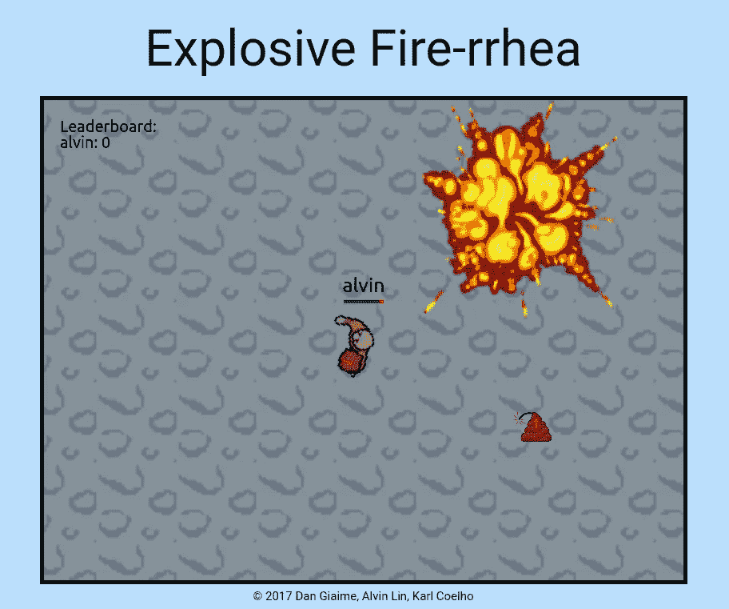
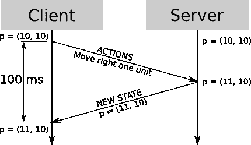
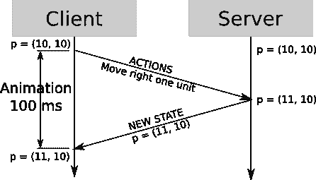
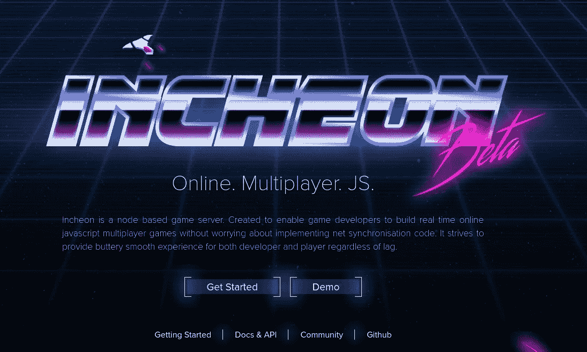
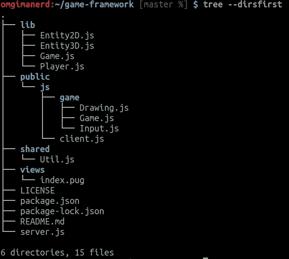
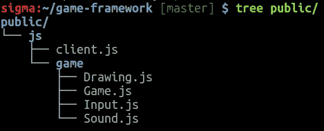
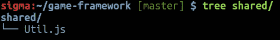

# 如何构建一个多人浏览器游戏(第二部分)

> 原文：<https://medium.com/hackernoon/how-to-build-a-multiplayer-browser-game-part-2-2edd112aabdf>



[Explosive Fire-rrhea](http://explosivefirerrhea.com), [submission](http://github.com/karlcoehlo/brickhack3) for [BrickHack3](http://brickhack.io)

这篇文章是我不久前写的一篇关于构建多人浏览器游戏的文章的后续。在这次技术演讲中，我将快速回顾延迟如何影响你的游戏，以及如何应对。我将简要讨论几个游戏框架，包括我在 [BrickHack3](http://brickhack.io) 建立的一个，以及如何将声音融入你的游戏。

# 延迟和 laaaaaaaaaaaaaaaaaaaaaaaaaaaaaaa

首先，什么是延迟？嗯，如果你以前玩过任何在线游戏，你可能经历过这样的现象，当你点击或试图执行一个动作时，游戏中什么也没有发生，直到稍后。通常被称为“滞后”，对于像多人射击游戏这样的实时游戏来说，这是非常令人沮丧的。

延迟的产生仅仅是因为您的计算机和您所连接的服务器之间的物理距离。还记得在[第一部分](/@omgimanerd/how-to-build-a-multiplayer-browser-game-4a793818c29b#.ze2sd72nq)中我们如何谈论权威服务器确定吗？这就是导致延迟的原因，因为你的输入需要时间发送到服务器，验证，然后再发送回来。

http://gabrielgambetta.com 有很棒的资源和解释，关于为什么会发生这种情况以及如何处理，我会从他的网站上链接很多资源。



A single client-server interaction (image from [gabrielgambetta.com](http://www.gabrielgambetta.com/fpm2.html))

为了对抗滞后，我将引入一个叫做客户预测/外推的想法。这个概念基本上包括在客户端的动作之前播放动画，然后由服务器确认以模拟无缝游戏。客户端基本上是在确认后预测服务器的状态。

特别是对于玩家的移动，如果你有一个确定的世界模型，这就变得很容易实现。如果你的游戏世界是由可预测和计算的物理控制的，那么客户端可以做出有根据的假设，即它的输入是有效的，这样玩家移动动画可以在收到来自服务器的确认之前开始。



Client prediction (image from [gabrielgambetta.com](http://www.gabrielgambetta.com/fpm2.html))

除了这些令人惊叹的图表之外，Gabriel Gambetta 的网站上还有很多关于这是如何工作的很酷的可视化图片，以及对其中一些问题的解释。[一定要看看他的现场演示](http://gabrielgambetta.com/fpm_live.html)。因为这篇文章主要是抽象地介绍这个想法，所以如果你想在自己的代码中实现它，我强烈建议你也看看他的[样本代码](http://www.gabrielgambetta.com/fpm_live.html)。

# [仁川. gg](http://incheon.gg)



The homepage to [incheon.gg](http://incheon.gg)

在[如何构建多人游戏(第一部分)](/@omgimanerd/how-to-build-a-multiplayer-browser-game-4a793818c29b#.ze2sd72nq)的评论中，[第一部分](https://medium.com/u/f4d2676865d6#.ze2sd72nq)中构建的模型的重构、注释和清理版本。在下一节中，我将详细解释这个框架的每个部分。如果你愿意的话，我建议克隆这个库。

```
git clone https://github.com/omgimanerd/game-framework
```



Files included in the [game framework](https://github.com/omgimanerd/game-framework)

先说 [package.json](https://github.com/omgimanerd/game-framework/blob/master/package.json) ，任何 node.js 项目的面包黄油。我拥有的主要依赖项有 [express](http://expressjs.com/) 、 [hashmap](https://www.npmjs.com/package/hashmap) 、 [morgan](https://www.npmjs.com/package/morgan) 、 [pug](https://pugjs.org/api/getting-started.html) 和 [socket.io](https://www.npmjs.com/package/socket.io) 。这个项目唯一绝对需要的是 socket.io 和 hashmap。morgan 只是一个有用的日志工具，express 是一个广泛使用的中间件框架，而 pug 是一个模板引擎，但是如果你愿意，你可以很容易地把它们换成你更喜欢的东西。hashmap 包用于将每个客户端的 socket ID 映射到它们的 Player 实例，当然需要 socket.io 来支持实时通信。

“lib”文件夹包含处理和存储游戏及其实体状态的服务器端文件。 [Entity2D.js](https://github.com/omgimanerd/game-framework/blob/master/lib/Entity2D.js) 和 [Entity3D.js](https://github.com/omgimanerd/game-framework/blob/master/lib/Entity3D.js) 是 [ES5 样式类](http://eli.thegreenplace.net/2013/10/22/classical-inheritance-in-javascript-es5)，封装了一个具有基本物理和圆形/球形 hitbox 的实体。如果你想变得更有野心，你可以在这个类中实现更复杂的物理，重力，hitbox 网格等等。

```
Entity2D.prototype.update = function(deltaTime) {
  var currentTime = (new Date()).getTime();
  if (deltaTime) {
    this.deltaTime = deltaTime;
  } else if (this.lastUpdateTime === 0) {
    this.deltaTime = 0;
  } else {
    this.deltaTime = (currentTime - this.lastUpdateTime) / 1000;
  }
  for (var i = 0; i < DIMENSIONS; ++i) {
    this.position[i] += this.velocity[i] * this.deltaTime;
    this.velocity[i] += this.acceleration[i] * this.deltaTime;
    this.acceleration[i] = 0;
  }
  this.lastUpdateTime = currentTime;
};
```

请注意我们是如何实现在[第一部分](/@omgimanerd/how-to-build-a-multiplayer-browser-game-4a793818c29b#.ze2sd72nq)中讨论的帧率独立更新的。位置和速度的更新是使用 deltaTime 完成的，这样我们就可以获得一致的行为。 [Player.js](https://github.com/omgimanerd/game-framework/blob/master/lib/Player.js) 只是 [Entity2D.js](https://github.com/omgimanerd/game-framework/blob/master/lib/Entity2D.js) 的一个扩展，只是在基本物理的基础上处理用户输入，以实现模型演示的目的。

[Game.js](https://github.com/omgimanerd/game-framework/blob/master/lib/Game.js) 更有趣一点。

```
function Game() {
  this.clients = new HashMap();
  this.players = new HashMap();
}
```

在这个基本的构造函数之上，我们有一些方法来方便玩家的连接和断开。本质上，这个类所做的就是处理服务器状态的更新和广播。

```
Game.prototype.update = function() {
  var players = this.getPlayers();
  for (var i = 0; i < players.length; ++i) {
    players[i].update();
  }
};Game.prototype.sendState = function() {
  var ids = this.clients.keys();
  for (var i = 0; i < ids.length; ++i) {
    this.clients.get(ids[i]).emit('update', {
      self: this.players.get(ids[i]),
      players: this.players.values().filter(
          (player) => player.id != ids[i])
    });
  }
};
```

`Game.prototype.update()`简单的更新游戏中的每一个实体，`Game.prototype.sendState()`将游戏状态广播给每一个连接到服务器的客户端。需要注意的唯一有趣的事情(这是我的实现特有的)是，我们过滤掉当前连接的播放器，并分别发送它们。这绝不是做事情的唯一方法，我只是发现这是这个演示中最容易使用的方法。

转到“public”目录，该文件夹包含所有静态提供的客户端 JavaScript 文件。



还记得我们在[第一部分](/@omgimanerd/how-to-build-a-multiplayer-browser-game-4a793818c29b#.ze2sd72nq)中提到的重构是个好主意吗？这只是做这件事的一种方式。构建一组模块，每个模块专门处理功能的特定部分，这通常是一个好主意，也是一个好的软件设计。

[Drawing.js](https://github.com/omgimanerd/game-framework/blob/master/public/js/game/Drawing.js) ，给定一个 HTML5 canvas 上下文对象，将处理所有游戏精灵在其上的绘制。客户端 [Game.js](https://github.com/omgimanerd/game-framework/blob/master/public/js/game/Game.js) 使用`window.requestAnimationFrame()`在客户端运行游戏循环，将用户输入发送到游戏服务器，并呈现接收到的游戏状态。

```
Game.prototype.animate = function() {
  this.animationFrameId = window.requestAnimationFrame(
      Util.bind(this, this.update));
};Game.prototype.update = function() {
  if (this.selfPlayer) {
    // Emits an event for the containing the player's input.
    this.socket.emit('player-action', {
      keyboardState: {
        left: Input.LEFT,
        right: Input.RIGHT,
        up: Input.UP,
        down: Input.DOWN
      }
    });
    // Draws the state of the game onto the canvas.
    this.draw();
  }
  this.animate();
};
```

这个片段展示了这个功能是如何工作的。如果你不知道 requestAnimationFrame 文档的作用，这里有一个[链接。如果您想知道，`Util.bind()`创建了一个函数，将游戏对象的上下文绑定到`update()`函数，这样它就可以被`requestAnimationFrame()`调用。这是一种深入 JavaScript 技术细节的攻击，所以我不会真正讨论这个问题，因为你可以很容易地用匿名函数实现同样的事情。](https://developer.mozilla.org/en-US/docs/Web/API/window/requestAnimationFrame)

[Input.js](https://github.com/omgimanerd/game-framework/blob/master/public/js/game/Input.js) 是我在游戏中经常重复使用的文件(有一些变化)。它绑定必要的事件处理程序来跟踪用户键盘/鼠标输入，并存储它们以便于访问。通过将这种功能抽象出来并保存在一个单独的类中，我不必担心从其他地方获取用户输入。

接下来，“共享”目录只包含一个文件， [Util.js](https://github.com/omgimanerd/game-framework/blob/master/shared/Util.js) 。



[Util.js](https://github.com/omgimanerd/game-framework/blob/master/shared/Util.js) 是我在项目之间经常回收的另一个文件。它包含各种有用的实用函数，可以在客户端和服务器端使用。“共享”文件夹是静态提供的，因此我可以包含 HTML 文件中的脚本，并在任何需要的地方从服务器端请求它。如今，这可能用像 [webpack](https://webpack.js.org/) 这样的模块捆绑器做得更好。

我使用“共享”文件夹的另一种方式是存储服务器和客户端都需要访问的游戏常量。例如，我将有一个类似这样的类:

```
function Constants() {}Constants.PLAYER_HITBOX = 10;Constants.WORLD_SIZE = 2500;if (typeof(module) === 'object') {
  module.exports = Constants;
} else {
  window.Util = Util;
}
```

这使得该类可以方便地加载到客户端或服务器端。同样，这也是现在更普遍使用的模块加载器，如 [webpack](https://webpack.js.org/) 。

“views”文件夹相对来说没什么意思，它包含了模型演示的模板。

```
doctype htmlhtml
  head
    title Game!
  body
    canvas(id='canvas' width='800px' height='600px')
  script(src='/socket.io/socket.io.js')
  script(src='/public/bower/jquery/dist/jquery.min.js')
  script(src='/shared/Util.js')
  script(src='/public/js/game/Drawing.js')
  script(src='/public/js/game/Game.js')
  script(src='/public/js/game/Input.js')
  script(src='/public/js/game/Sound.js')
  script(src='/public/js/client.js')
```

我使用 [pug 模板引擎](https://pugjs.org/api/getting-started.html)，但是你可以很容易地插入你选择的任何模板。

最后，我们在根目录中有 [server.js](https://github.com/omgimanerd/game-framework/blob/master/server.js) 。这个文件是一个非常标准的 node.js 服务器，使用了 [express 中间件框架](http://expressjs.com/)。不过，有两个重要的片段需要注意。

```
const FPS = 60;io.on('connection', (socket) => {
  socket.on('player-join', () => {
    game.addNewPlayer(socket);
  }); socket.on('player-action', (data) => {
    game.updatePlayerOnInput(socket.id, data);
  }); socket.on('disconnect', () => {
    game.removePlayer(socket.id);
  })
});setInterval(() => {
  game.update();
  game.sendState();
}, 1000 / FPS);
```

套接字事件处理程序在[第一部分](/@omgimanerd/how-to-build-a-multiplayer-browser-game-4a793818c29b#.ze2sd72nq)中介绍过，这是重构和清理过的实现，我们利用了之前在[游戏类](https://github.com/omgimanerd/game-framework/blob/master/lib/Game.js)中定义的方法。`setInterval()`游戏循环只是以大约 60 FPS 的速度反复运行游戏更新和状态广播。

# 后续步骤

从这里开始，我强烈建议您采用这个框架并对其进行修改。自己做，自己写代码，打印出来烧了，我不管。尝试升级物理或编写自己的动画引擎。我希望你能从无所事事中学到一些东西，我也希望你能做出一些很酷的东西。

如果你真的做了很酷的东西，请与我分享！我对你做的任何东西都非常感兴趣。我目前只有这些了。感谢阅读！如果你喜欢这篇文章，请点击下面的❤按钮:)

在推特上关注我: [@omgimanerd](https://twitter.com/omgimanerd)

[](http://bit.ly/HackernoonFB)[](https://goo.gl/k7XYbx)[](https://goo.gl/4ofytp)

> [黑客中午](http://bit.ly/Hackernoon)是黑客如何开始他们的下午。我们是 [@AMI](http://bit.ly/atAMIatAMI) 家庭的一员。我们现在[接受投稿](http://bit.ly/hackernoonsubmission)并乐意[讨论广告&赞助](mailto:partners@amipublications.com)机会。
> 
> 如果你喜欢这个故事，我们推荐你阅读我们的[最新科技故事](http://bit.ly/hackernoonlatestt)和[趋势科技故事](https://hackernoon.com/trending)。直到下一次，不要把世界的现实想当然！

