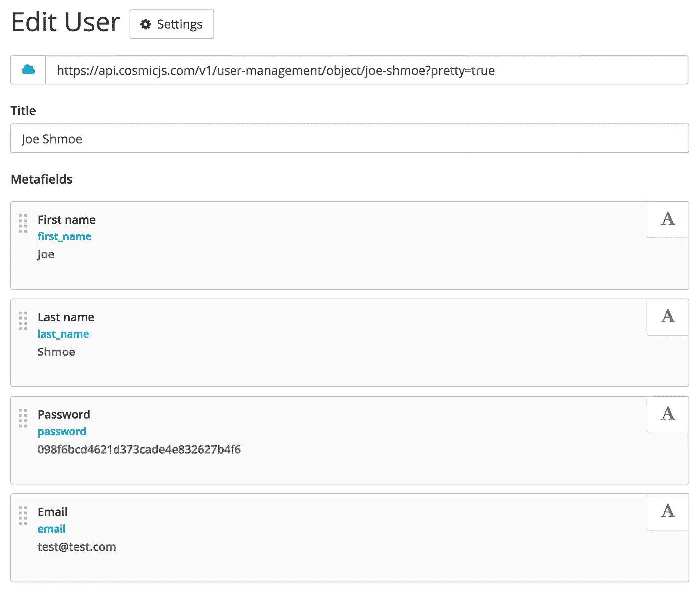

# 如何搭建 Node.js 用户管理 App

> 原文：<https://medium.com/hackernoon/how-to-build-a-node-js-user-management-app-12d900695ef6>


> 托尼·斯皮罗是 Cosmic JS T1 的联合创始人，这是一个 API 优先的 T2 内容管理平台 T3，用于构建基于内容的应用程序。

在本教程中，我将向你展示如何使用 Node.js 和 [Cosmic JS CMS API](https://cosmicjs.com/) 构建一个用户管理应用。

# TL；速度三角形定位法(dead reckoning)

[查看 GitHub 上的完整源代码](https://github.com/cosmicjs/user-management)
[查看演示](https://cosmicjs.com/apps/user-management/demo)

该应用程序将包括以下页面:

*   注册
*   注册
*   用户列表(仅限登录用户访问)

# 入门指南

创建名为 app-server.js 文件的文件，并添加以下内容:

```
// app-server.js
import express from 'express'
import hogan from 'hogan-express'
import http_module from 'http'
import bodyParser from 'body-parser'
import compression from 'compression'
import session from 'express-session'
import config from './config'
import cors from 'cors'
const app = express()
app.use(cors({credentials: true, origin: true}))
app.use(bodyParser.json())
app.use(compression())
app.engine('html', hogan)
app.set('views', __dirname + '/views')
app.set('port', process.env.PORT || 3000)
app.use(express.static(__dirname + '/public'))
app.set('trust proxy', 1) // trust first proxy
app.use(session({
  secret: 'keyboard cat',
  resave: false,
  saveUninitialized: true
}))
app.use((req, res, next) => {
  if (req.url === '/favicon.ico')
    return res.end()
  // Set global variables
  res.locals.year = new Date().getFullYear()
  // Set dev
  if (process.env.NODE_ENV === 'development')
    res.locals.is_dev = true
  next()
})
const partials = {
  header: 'partials/header',
  footer: 'partials/footer'
}
require('./routes')(app, config, partials)
const http = http_module.Server(app)
http.listen(app.get('port'), () => {
  console.info('==> 🌎  Go to http://localhost:%s', app.get('port'));
})
```

这是我们的应用程序的入口点，用于初始化我们的用户管理应用程序所需的一切。我们使用 Express for the Node.js framework，Hogan Express for view rendering from Mustache 模板。快速会话用于初始化和保存会话。

我们将在模板、页眉和页脚中提供几个部分，因为我们所有的页面都将共享这些部分。

# 了解你的路线

接下来，让我们看看 routes 文件夹中的 index.js。

```
// Routes
module.exports = (app, config, partials) => {
  require('./home')(app, config, partials)
  require('./signup')(app, config, partials)
  require('./users')(app, config, partials)
  require('./auth')(app, config, partials)
  require('./logout')(app, config, partials)
  require('./404')(app, config, partials)
}
```

这里有我们所有的路线。

# 登录

让我们看看 home.js，这是我们应用程序的登录页面:

```
// home.js
import Cosmic from 'cosmicjs'
module.exports = (app, config, partials) => {
  app.get('/', (req, res) => {
    Cosmic.getObjects({ bucket: { slug: config.COSMIC_BUCKET } }, (err, response) => {
      res.locals.cosmic = response
      if (req.query.message === 'unauthorized')
        res.locals.unauthorized_message = true
      return res.render('index.html', {
        partials
      })
    })
  })
}
```

这里没有做太多，只是从 Cosmic JS 加载我们的动态内容，以及 HTML 登录表单。

查看 auth.js 文件，您会看到这是登录表单将数据发送到用户登录的地方。

```
// auth.js
import Cosmic from 'cosmicjs'
import async from 'async'
import _ from 'lodash'
import bcrypt from 'bcrypt'
const saltRounds = 10
module.exports = (app, config, partials) => {
  // Submit form
  app.post('/auth', (req, res) => {
    const data = req.body
    Cosmic.getObjectType({ bucket: { slug: config.COSMIC_BUCKET } }, { type_slug: 'users' }, (err, response) => {
      if (err)
        res.status(500).json({ status: 'error', data: response })
      else {
        async.eachSeries(response.objects.all, (user, eachCallback) => {
          if (!_.find(user.metafields, { key: 'email', value: data.email.trim().toLowerCase() }))
            return eachCallback()
          const stored_password = _.find(user.metafields, { key: 'password' }).value
          bcrypt.compare(data.password, stored_password, function(err, correct) {
            if(correct)
              res.locals.user_found = user
            eachCallback()
          })
        }, () => {
          if (res.locals.user_found) {
            req.session.user = {
              first_name: res.locals.user_found.metafield.first_name.value,
              last_name: res.locals.user_found.metafield.last_name.value,
              email: res.locals.user_found.metafield.email.value
            }
            req.session.save()
            return res.json({ status: 'success', data: response })
          }
          return res.status(404).json({ status: 'error', message: 'This user was not found or the email and password are incorrect.' })
        })
      }
    })
  })
}
```

当数据发送到/auth 时，Cosmic NPM 模块首先搜索电子邮件，如果找到，则尝试将提交的密码与保存在 Cosmic JS API 中的密码进行匹配(使用 [bcrypt](https://www.npmjs.com/package/bcrypt) )。如果用户的电子邮件和密码都匹配，则创建会话，用户从登录页面重定向到用户页面。让我们看看用户列表页面。

# 访问独家内容

用户成功登录后，他们将被重定向到用户列表页面。看起来是这样的:

```
app.get('/users', (req, res) => {
  if(!req.session.user)
    return res.redirect('/?message=unauthorized')
  res.locals.user = req.session.user
  async.series([
    callback => {
      Cosmic.getObjectType({ bucket: { slug: config.COSMIC_BUCKET } }, { type_slug: 'users' }, (err, response) => {
        res.locals.users = response.objects.all
        callback()
      })
    },
    callback => {
      Cosmic.getObjects({ bucket: { slug: config.COSMIC_BUCKET } }, (err, response) => {
        res.locals.cosmic = response
        return res.render('users.html', {
          partials
        })
      })
    }
  ])
})
```

如果没有设置用户会话，他们会立即被重定向到登录页面，并显示一条未经授权的消息。如果他们有用户会话，他们将能够看到所有注册用户的列表(从 users 对象类型)。这让你知道如何在我们的应用程序中限制用户访问。通过在任何页面上检查 req.session.user，您可以将访问权限限制为仅登录用户。

# 报名

让我们来看看当新用户将他们的信息发布到/users 时会发生什么:

```
app.post('/users', (req, res) => {
  const data = req.body
  async.series([
    callback => {
      let user_found = false
      Cosmic.getObjectType({ bucket: { slug: config.COSMIC_BUCKET } }, { type_slug: 'users' }, (err, response) => {
        _.forEach(response.objects.all, user => {
          if (_.find(user.metafields, { key: 'email', value: data.email.trim() }))
            user_found = true
        })
        if (!user_found)
          return callback()
        // User found
        return res.status(409).json({ status: 'error', message: 'Email already in use' })
      })
    },
    callback => {
      bcrypt.hash(data.password, saltRounds, function(err, hash) {
        res.locals.hash = hash
        callback()
      })
    },
    callback => {
      // Send to Cosmic
      const object = {
        type_slug: 'users',
        title: data.full_name,
        metafields: [
          {
            title: 'First name',
            key: 'first_name',
            type: 'text',
            value: data.first_name
          },
          {
            title: 'Last name',
            key: 'last_name',
            type: 'text',
            value: data.last_name
          },
          {
            title: 'Password',
            key: 'password',
            type: 'text',
            value: res.locals.hash
          },
          {
            title: 'Email',
            key: 'email',
            type: 'text',
            value: data.email.trim().toLowerCase()
          }
        ]
      }
      if (config.COSMIC_WRITE_KEY)
        object.write_key = config.COSMIC_WRITE_KEY
      Cosmic.addObject({ bucket: { slug: config.COSMIC_BUCKET } }, object, (err, response) => {
        if (err)
          res.status(500).json({ status: 'error', data: response })
        else
          res.json({ status: 'success', data: response })
        res.end()
      })
    }
  ])
})
```

这里发生了一些事情。首先，根据当前用户列表检查电子邮件。如果没有找到匹配，就用用户的每个数据点创建用户对象:名、姓、电子邮件和密码，作为元字段存储在 Cosmic JS API 中。

更进一步，在您登录到您的 Cosmic JS bucket 并转到您的 Users 对象类型之后，您将能够为您的系统中的用户添加更多的元字段。这使得添加动态扩展数据变得非常容易。例如，假设您需要添加一个个人资料图片、地址、GitHub 用户名等。所有这些都可以作为元字段添加到用户对象中。见下面截图:



# 下次见

现在让我们看看当用户访问/logout 路由时会发生什么:

```
// logout.js
module.exports = (app, config, partials) => {
  app.get('/logout', (req, res) => {
    req.session.destroy()
    return res.redirect('/')
  })
}
```

会话被简单地销毁，用户被重定向回登录页面。

# HTML 在哪里？

我不打算详细介绍 HTML，但基本上登录和注册表单都有 JQuery 验证，并向路由端点提交 AJAX 请求。[查看 GitHub 上的 main.js 文件](https://github.com/cosmicjs/user-management/blob/master/public/js/2-main.js),看看 JQuery 是如何用于这个和其他 UI 和 UX 的。

# 结论

仅此而已。Cosmic JS 是一个强大的内容创建和应用程序数据管理平台。有了 Cosmic JS 支持的用户管理应用程序，您现在可以使用 Cosmic JS API 或从 Cosmic JS Bucket 仪表板扩展您的用户数据。

我希望这篇教程对你有所帮助。如果你有任何问题或反馈，你可以[在 Twitter 上联系我们](https://twitter.com/cosmic_js)或者[在 Slack 社区和我们聊天](https://cosmicjs.com/community)。

[](http://bit.ly/HackernoonFB)[](https://goo.gl/k7XYbx)[](https://goo.gl/4ofytp)

> [黑客中午](http://bit.ly/Hackernoon)是黑客如何开始他们的下午。我们是 [@AMI](http://bit.ly/atAMIatAMI) 家庭的一员。我们现在[接受投稿](http://bit.ly/hackernoonsubmission)并乐意[讨论广告&赞助](mailto:partners@amipublications.com)机会。
> 
> 如果你喜欢这个故事，我们推荐你阅读我们的[最新科技故事](http://bit.ly/hackernoonlatestt)和[趋势科技故事](https://hackernoon.com/trending)。直到下一次，不要把世界的现实想当然！

