# 如何从 AWS CloudFront 构建一个 React GraphQL 静态站点

> 原文：<https://medium.com/hackernoon/how-to-build-a-react-graphql-static-site-served-from-aws-cloudfront-a2c4b7826a79>

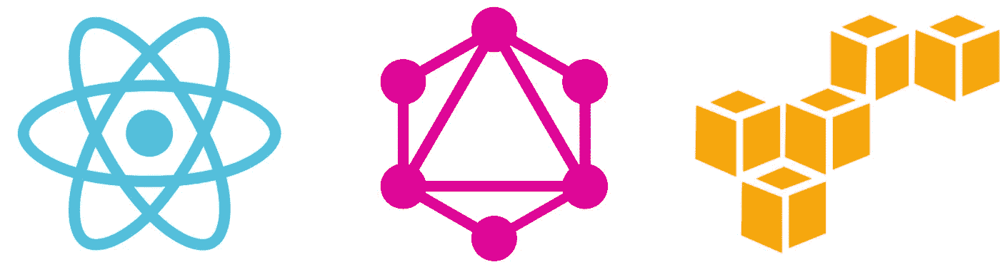

这篇文章最初出现在宇宙 JS 博客上。

所以你已经阅读了所有的理由 [go API-first](https://cosmicjs.com/why-cms-api) ，并且你已经制作了一个好看的单页应用程序来显示你的内容。但是你如何把它提供给用户呢？

您可以设置一个完整的节点服务器来托管、路由和服务您的站点。或者你可以使用 AWS S3 和 CloudFront 静态托管你的网站！这意味着你只需把你的网站源文件放到网上，它们就可以立即提供给用户，不需要服务器处理。

具有客户端渲染的静态托管有几个很大的优势:+极快(没有服务器预处理)+非常简单(没有服务器架构需要维护)+疯狂可用(如果没有服务器，您的服务器不会崩溃)+即时更新(不必等待站点重建才能看到您的更改)

建立一个静态网站比你想象的要容易，本教程将带你了解如何建立一个静态网站，从 Cosmic JS 获取数据并在 10 分钟内呈现在客户端上！

我们还将介绍一些你可能不知道的关于如何最大限度地利用静态站点的提示和技巧，这将是非常有用的，即使你不是在构建一个纯静态的站点。

# TL；速度三角形定位法(dead reckoning)

[点击此处观看演示](http://react-graphql-blog.cosmicapp.co/)

[查看 React GraphQL 静态站点代码库](https://github.com/cosmicjs/react-graphql-static-site)

# 我们将要托管的网站

我们的示例网站是一个静态的单页面应用程序，在我们的例子中使用了`webpack`和`react`，用`react-router`处理路由，用 [Cosmic JS 的 GraphQL API](https://cosmicjs.com/docs/graphql) 获取数据(教程即将推出)。

如果你想在家继续学习，你可以[在这里](https://github.com/cosmicjs/react-graphql-static-site)下载我们的演示代码。

我们的演示站点结构如下:

```
.
├── asset-manifest.json
├── favicon.ico
├── index.html
└── static
    └── js
        ├── main.3c8c3c1e.js
        ├── manifest.4a707e54.js
        ├── vendor.94287fcf.js
        ├── vendorConstant.0e34bc16.js
        └── vendorReactApollo.c8e28b23.js
```

我们已经把我们的`js`分成了几个不同的文件，这样它们可以被独立缓存；如果`vendorReactApollo`是唯一改变的文件，那么它是我们的客户在再次访问我们的网站时必须重新获取的唯一文件。

`index.html`是我们需要部署的唯一一个 HTML 文件，它是最小的:

```
<!DOCTYPE html>
<html lang="en">
   <head>
      <meta charset="utf-8">
      <meta name="viewport" content="width=device-width,initial-scale=1,shrink-to-fit=no">
      <link rel="shortcut icon" href="/favicon.ico">
      <title>React App</title>
   </head>
   <body>
      <div id="root"> </div>
      <script type="text/javascript" src="/static/js/manifest.4a707e54.js"> </script>
      <script type="text/javascript" src="/static/js/vendorConstant.0e34bc16.js"></script>
      <script type="text/javascript" src="/static/js/vendorReactApollo.c8e28b23.js"></script>
      <script type="text/javascript" src="/static/js/vendor.94287fcf.js"></script>
      <script type="text/javascript" src="/static/js/main.3c8c3c1e.js"></script>
   </body>
</html>
```

有了这个单页应用程序结构，我们就可以开始使用 AWS S3 将它作为一个静态站点来提供服务了！

# S3 设置

AWS S3 存储桶只需很少的设置就可以将内容作为静态网页提供。这为提供静态文件(如我们的网站)提供了一个简单快捷的解决方案。

在 S3 上启用网站托管需要几个步骤:

# 1.木桶策略

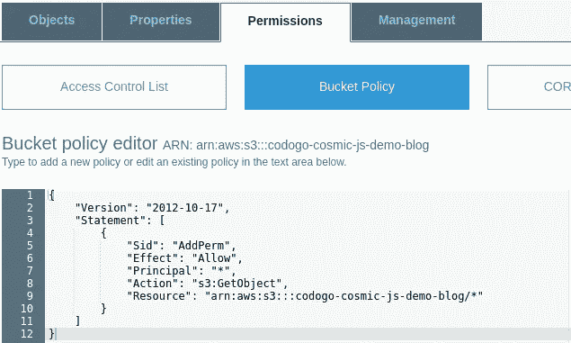

首先，您需要为 S3 存储桶中的所有文件设置权限，以便任何人都可以读取它们。您可以复制粘贴我们使用的代码，并用您自己的名称替换我们的 bucket 名称(`codogo-cosmic-js-demo-blog`):

```
{
    "Version": "2012-10-17",
    "Statement": [
        {
            "Sid": "AddPerm",
            "Effect": "Allow",
            "Principal": "*",
            "Action": "s3:GetObject",
            "Resource": "arn:aws:s3:::codogo-cosmic-js-demo-blog/*"
        }
    ]
}
```

# 2.网站托管

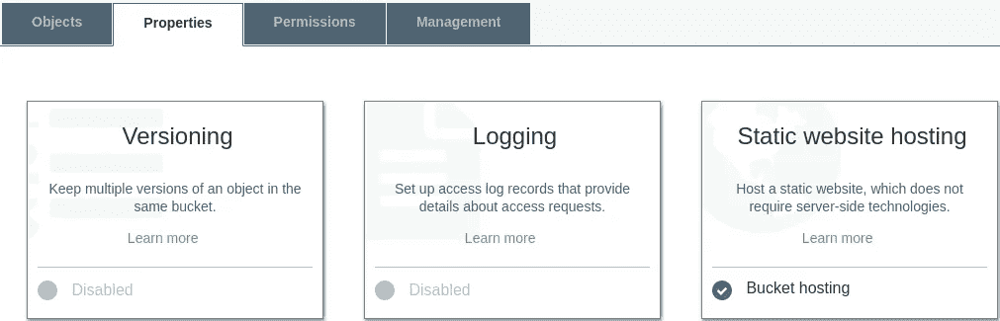

点击`Static website hosting`，填写如下详细信息。

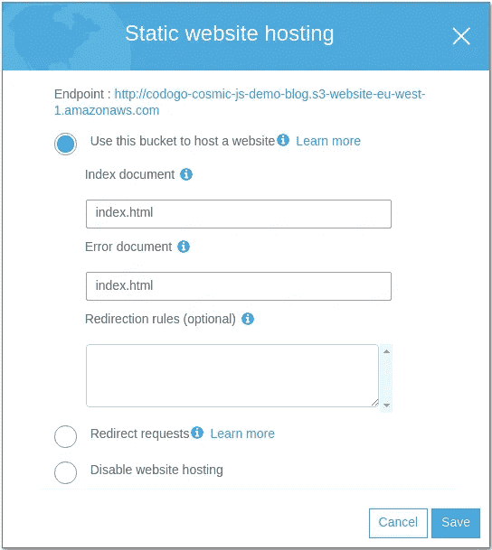

需要*索引文档*，它告诉 S3 桶如果我们导航到我们网站的根目录，应该提供哪个文件。

*错误文档*是每当客户端导航到桶中不存在的文件时提供的文件。这是本教程最重要的设置，因为这意味着无论用户导航到哪条路径，他们仍然会得到我们的`index.html`文件。

# 3.上传您的文件

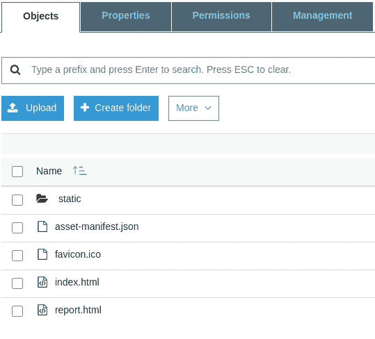

上传你的网站到你的 S3 桶的根，你的网站就可以服务了。

# 测试托管

导航到`Static Website Hosting`框中显示的*端点* URL，您应该会看到您的 web 应用程序！你可以在这里查看我们的演示。

尝试导航到其他页面并刷新页面-您应该会看到您的 web 应用程序加载起来就像您正在导航的页面实际存在于服务器上一样。

# 后续步骤

对于低流量、不重要的小网站，例如公司内部网站，这种托管就足够了。然而，这种托管解决方案有两个主要问题:

1.  **从一个地区提供服务**:该网站将只从您所在的 AWS 地区提供服务，因此世界其他地区的用户将会看到较差的性能。
2.  **HTTP 404 响应代码**:如果你打开浏览器网络检查器并导航到一个页面，你会看到服务器用一个`404`代码响应，而不是我们想要的`200` / `302`。

让我们网站的每一页都返回一个`404`代码对 SEO 来说是很糟糕的，因为任何检查 HTTP 响应代码的网络爬虫都会认为我们网站上的每个链接都坏了！在下一节中，我们将看看如何使用 AWS CloudFront 来缓存我们的站点，处理我们的流量，并修复我们的错误代码问题。

# CloudFront 配置

# 1.创建一个 CloudFront 发行版

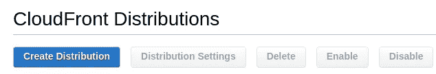

我们需要创建一个 CloudFront web 分布，所有的 web 流量都将通过它流动。这将处理我们的 S3 网站的全球分布，并可以拦截和纠正我们的`404`代码。

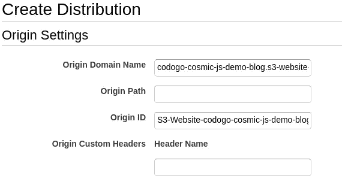

在`Origin Domain Name`字段中，您可以选择您的 S3 桶。不要这样做！相反，将`Origin Domain Name`设置为你的 S3 网站 URL。例如，对于我们的演示，它将是 codogo-cosmic-js-demo-blog . S3-website-eu-west-1 . Amazon AWS . com，而不是 codogo-cosmic-js-demo-blog.s3.amazonaws.com。

# 2.缓存长期文件

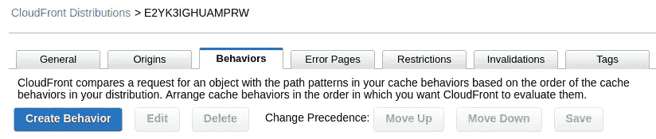

现在我们将告诉 CloudFront 如何缓存我们的`static`文件。为此，我们需要创造一种新的行为。

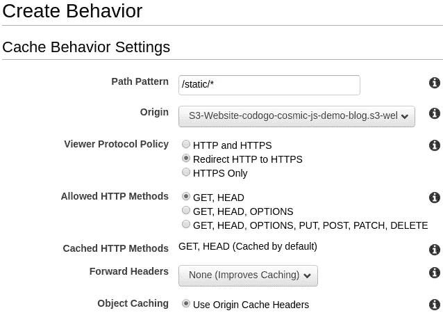

我们希望我们的`Path Pattern`匹配静态文件夹中的所有内容。`Object Settings`应该保持原样。

# 3.正确的响应代码

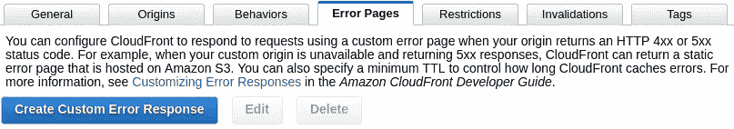

现在我们创建一个新的错误页面来拦截来自 S3 的错误。

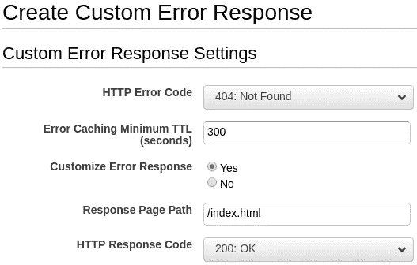

如上填写自定义响应。

你需要给你的 CloudFront 发行版大约 15 分钟的时间来完全部署，但是它应该可以通过它的域名访问，我们的是这样的:d2hqptkles3gsg.cloudfront.net。

# 结论

这样你就有了:一个简单的客户端呈现的静态站点，显示来自 Cosmic JS 的内容，超级快速和超级简单。

如果你在用 Cosmic JS [做一个静态网站，或者其他什么，联系我们的 Slack](https://cosmicjs.com/community) 或者 Twitter；我们很想看看你在做什么。这篇文章是由 [Codogo](https://codogo.io/) 撰写的，这是一家充满激情创造惊人数字体验的新兴数字机构。请关注我们的下一篇文章，关于使用 React 和 GraphQL 创建 Cosmic JS 站点的最佳实践。

[](http://bit.ly/HackernoonFB)[](https://goo.gl/k7XYbx)[](https://goo.gl/4ofytp)

> [黑客中午](http://bit.ly/Hackernoon)是黑客如何开始他们的下午。我们是阿妹家庭的一员。我们现在[接受投稿](http://bit.ly/hackernoonsubmission)并乐意[讨论广告&赞助](mailto:partners@amipublications.com)的机会。
> 
> 如果你喜欢这个故事，我们推荐你阅读我们的[最新科技故事](http://bit.ly/hackernoonlatestt)和[趋势科技故事](https://hackernoon.com/trending)。直到下一次，不要把世界的现实想当然！

