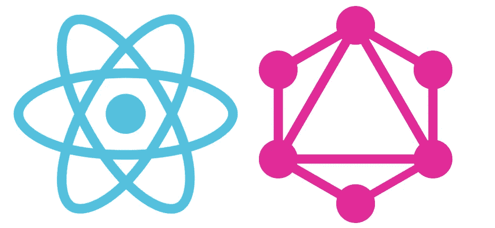

# 如何构建一个由 Cosmic JS GraphQL API 支持的 React 网站

> 原文：<https://medium.com/hackernoon/how-to-build-a-react-website-powered-by-the-cosmic-js-graphql-api-1fc246137b57>



这篇文章最初出现在宇宙 JS 博客上。

构建和维护一个 React 应用程序绝非易事。有很多教程涵盖了制作 React 应用程序的技术方面，但与任何技术一样，通常很难找到关于最佳实践的信息。

在本帖中，我们将探索一些我们在为客户开发 React/GraphQL 应用时学到的技巧、诀窍和技术。希望这些能帮助你提高项目的性能，简化维护。

# TL；速度三角形定位法(dead reckoning)

[查看演示](https://cosmicjs.com/apps/react-graphql-blog/demo)
[在 Cosmic JS 上安装 app](https://cosmicjs.com/apps/react-graphql-blog)
[在 GitHub 上查看代码库](https://github.com/cosmicjs/react-graphql-blog)

# 你可能不需要国家

如果您使用 React 已经有一段时间了，那么在开始一个新项目时，您的第一反应可能是建立一个状态管理库，比如 Redux、MobX 或 freactal。这些对于状态管理来说是非常强大的解决方案，可以使处理大型应用程序的状态变得更加容易管理。

但是，像任何库一样，除非确实需要，否则不应该开始使用这些状态管理解决方案！对于一个简单的博客，就像我们今天要构建的，你真正需要的唯一状态就是当前的 URL。

“但是！”我听到你哭喊“我将如何存储/缓存/处理我通过网络从 Cosmic JS 这样的伟大服务中获取的 API 优先的数据？”。别担心！在本文的后半部分，我们将探索 GraphQL，这是一个以声明方式从服务器获取数据的系统，特别是 Apollo GraphQL 客户端，用于简单地与 GraphQL 接口。

在这篇文章中，我们关注的是一个简单的、仅供查看的应用程序，但是值得一提的是，基于类的 React 组件提供的状态对于只影响应用程序局部的状态来说已经足够了。Dan abra mov(Redux 的创建者)在这里写了更多关于这个主题的细节

# 使用路由存储您的视图信息

当然，如果我们没有一些状态，我们只是一次显示整个 web 应用程序。幸运的是，你的浏览器提供了一个内置的状态存储，包括撤销历史、无摩擦共享和一个简单的界面:你的 URL 栏。

出色的 React 路由器库提供了一个简单而富于表现力的界面来导航您的应用。我们示例应用程序中的大部分路由都是在以下文件中处理的:

```
// src/components/posts.jsimport styled from "styled-components";
import { Route, Switch, } from "react-router";import Post, { Blank, Home, FourOhFour, } from "./post";
import Sidebar from "./Sidebar";const PostsStyled = styled.div`
    background-color: ${R.path(["theme", "white",])};
    flex-direction: row;
`;export default () => (
   <PostsStyled> <Route path = "/post" component = { Sidebar } /> <Switch> 
            <Route path = "/post/:postSlug" component = { Post } />
            <Route path = "/post/" component = { Blank } />
            <Route path = "/" exact component = { Home } />
            <Route component = { FourOhFour } />
        </Switch> </PostsStyled>
);
```

第一种方法为任何以/post 开头的 URL 呈现侧栏

Switch 组件用匹配的路径呈现它的第一个孩子。我们的路由配置执行以下操作:

*   如果 URL 是/post/some-post-slug，我们显示带有 slug some-post-slug 的帖子
*   如果网址是/post，我们只显示侧边栏，让你选择一篇文章
*   如果 URL 是/我们显示主页
*   对于任何其他网址，我们显示 404 页

所有这些意味着我们可以通过改变 URL 在应用程序的所有不同视图之间切换。

React 路由器提供了一个链接组件，它的作用就像一个增压的标签。你应该使用链接来链接那些不在你网站之外的超链接。

# 样式组件和主题提供者位于你的样式之上

像 SASS 这样的 CSS 预编译器首先使 web 开发人员能够开始在他们的样式中使用变量和函数。然后 React 出现了，并普及了内嵌风格系统:

```
<div
   style = {{
      display: "flex",
      backgroundColor: "red",
      color: "white",
      margin: "4px",
   }}
/>
```

最热门的新趋势是 Styled Components，它允许您通过指定一个组件来创建新的组件，以及您想要应用于它的 CSS 样式。这些样式会自动加上厂商前缀，最终都会转换成样式表。

```
const Link = styled.a`
   color: white;
   font-size: 0.8em;
   text-decoration: none;
`;
```

样式化组件还提供了一种设置全局变量的方法，这些变量由每个样式化组件继承。ThemeProvider 组件可用于为每个样式化组件提供变量，如下所示:

```
const theme = {
    white: "#fff",
    blue: "#00afd7",
};export default () => (
    <ThemeProvider theme = { theme }>
      <App/>
    </ThemeProvider>
);
```

现在，作为 App 子组件的每个样式化组件都可以使用样式中的函数来访问这些变量:

```
const Link = styled.a`
   color: ${ (props) => props.theme.blue };
   font-size: 0.8em;
   text-decoration: none;
`
```

主题对象可以是任何 javascript 对象，而${ }块中的函数可以是任何函数，所以在样式化的组件中可以做大量很酷的事情，同时仍然将所有变量保存在一个统一的地方。

# GraphQL

GraphQL 是一个声明性的、自我文档化的 API 规范，它允许您只向 API 请求您需要的数据。它对您的 API 施加了一些限制和想法，允许 GraphQL 客户端创建一些非常酷的特性，包括:

*   自动缓存。
*   从存储的数据中智能解析数据请求。
*   将数据获取连接到显示数据的组件。

我们将仔细检查并解释我们在示例项目中使用的所有步骤，但是如果您想要 GraphQL 协议的更完整的解释，您可以在这里阅读它的全文。

Cosmic JS 提供的 GraphQL API 有 3 个查询:

*   objects:获取桶中的所有对象
*   objectsByType:获取桶中某一类型的所有对象
*   object:通过 slug 获取特定对象

这里完整记录了这些查询。

# 设置 Cosmic JS GraphQL API

首先我们需要设置我们的 ApolloClient:

```
//src/GraphQL/index.jsimport { ApolloClient, createNetworkInterface, } from "react-apollo";const networkInterface = createNetworkInterface({
    uri: "https://graphql.cosmicjs.com/v1",
});const client = new ApolloClient({
    networkInterface,
});export default client;
```

然后我们使用 ApolloProvider 将它提供给应用程序的其余部分:

```
//src/app.jsimport React from "react";
import { ApolloProvider, } from "react-apollo";
import styled, { ThemeProvider, } from "styled-components";import client from "./GraphQL";export default () => (
    <ThemeProvider theme = { theme }>
        <ApolloProvider client = { client }>
         <App />
        </ApolloProvider>
    </ThemeProvider>
);
```

Apollo provider 意味着我们的应用程序中的任何组件都可以将自己连接到 GraphQL 查询，这意味着每个组件都可以要求客户端准确获取呈现自己所需的数据。不用担心多个组件向服务器发送垃圾请求；ApolloClient 自己处理缓存和重复数据删除！

在我们开始探索如何在这个应用程序中使用 GraphQL 之前，我们现在将花一点时间来探索一些可以让 graph QL 更好用的方法。在这篇博文中，我们没有包括运行这个示例所需的所有代码，但是您可以在这里找到我们演示项目的源代码。跟着走！

# 使用片段重用数据

有时，您希望在两个不同的查询中从一个对象获得相同的字段，GraphQL 提供了一个以片段形式实现这一点的系统。片段允许你从一个对象中挑选一些字段，并且只要求这些字段。

例如，在侧边栏中，我们只需要一篇文章的一些基本信息:

```
fragment PostPreview on Object {
    slug
    typeSlug: type_slug
    title
    modifiedAt: modified_at
}
```

但是在帖子本身中，我们想要所有的信息，再加上更多:

```
fragment PostAllContent on Object {
    ...PostPreview
    content
    metadata
    order
}
```

然后，我们可以在侧栏使用的查询中使用 PostPreview 片段:

```
# getAllPostsQuery
query($bucketSlug: String! $readKey: String!){
    objects: objectsByType(bucket_slug: $bucketSlug, read_key: $readKey, type_slug: "posts") {
        ...PostPreview
    }
}
```

和 Post 组件使用的查询中的 PostAllContent 片段

```
# getPostQuery
query($bucketSlug: String! $readKey: String! $postSlug: String!){
    object(bucket_slug: $bucketSlug, read_key: $readKey, slug: $postSlug) {
        ...PostAllContent
    }
}
```

碎片之所以伟大，有两个原因:

1.  它们允许您模块化和重用您想要从查询中获得的属性
2.  它们确保应该获得相同信息的两个查询始终保持同步，因此 Apollo 可以成功地缓存结果

# 使用组件属性作为查询参数

您会注意到上面的查询有 2/3 的输入字段:

*   $bucketString:我们要从中获取对象的桶的段
*   $readKey:从桶中读取的读取键(如果需要)
*   $postSlug:我们想要获取的特定对象的 Slug(如果需要的话)

这些变量用于将查询导向正确的数据。Apollo 为我们提供了一个强大的 API 来设置这些变量，但通常对于简单的组件，使用 props 来设置它们会更容易:

## 默认道具

对于在我们的应用程序中相同的变量，比如$bucketSlug，我们可以使用它们的 defaultProps 将它们添加到我们的组件中:

```
//src/components/sidebar.jsconst Sidebar = graphql(getAllPostsQuery, { name: "allPosts", })(
   props => (
      <SidebarStyled>
         <Nav>
            <SidebarText>
               Posts
            </SidebarText> {
            props.allPosts.loading
               ? <Loading />
               : props.allPosts.objects.map(({ slug, ...rest }) => (
                  <PostLink key = { slug } slug = { slug } { ...rest } />
               ))
            } </Nav>
      </SidebarStyled>
   )
);SideBar.defaultProps = {
    bucketSlug: config.bucket.slug,
    readKey: config.bucket["read_key"],
};
```

## 动态道具

对于因组件的不同实例而变化的变量，如$postSlug，您可以将它们作为道具传递给组件的每个实例:

```
//src/components/post.js
const PostWrapper = GraphQL(getPostQuery)(props => (
    <PostContainerStyled>
        {
         props.data.loading
            ? <Loading />
            : <Post
               noShare = { props.noShare }
               title = { R.path(["data", "object", "title",])(props) }
               content = { R.path(["data", "object", "content",])(props) }
               />
      }
    </PostContainerStyled>
));PostWrapper.defaultProps = {
    bucketSlug: config.bucket.slug,
    readKey: config.bucket["read_key"],
};export const Home = () => <PostWrapper noShare postSlug = "home" />;
```

# 预加载数据

在用户需要之前预取我们的数据总是好的，这加快了页面转换的时间，并有助于更好的 UX，Apollo 提供了一个非常简单的方法来做到这一点。

当侧边栏获得显示每篇文章预览所需的查询时，它还执行另一个查询:

```
#getAllPostsWithExtraQuery
query($bucketSlug: String! $readKey: String!){
    objectsWithExtra: objectsByType(bucket_slug: $bucketSlug, read_key: $readKey, type_slug: "posts") {
        ...PostAllContent
    }
}
```

该查询获取每篇文章的所有字段，这意味着在我们导航到文章页面之前，所有数据都已经加载到缓存中。您可以使用 react-apollo 包中的 compose 函数将多个查询附加到一个组件上。

```
//src/components/sidebar.jsconst Sidebar = compose(
    GraphQL(getAllPostsQuery, { name: "allPosts", }),
    GraphQL(getAllPostsWithExtraQuery, { name: "allPostsPreFetch", }),
)(props => (
    <SidebarStyled>
        <Nav>
            <SidebarText>
                Posts
            </SidebarText> <Line /> {props.allPosts.loading
                ? <Loading />
                : props.allPosts.objects.map(({ slug, ...rest }) => (
                    <PostLink key = { slug } slug = { slug } { ...rest } />
                    ))} </Nav>
    </SidebarStyled>
));SideBar.defaultProps = {
    bucketSlug: config.bucket.slug,
    readKey: config.bucket["read_key"],
};
```

然而，如果你只是这样做，你将看不到网络性能的改善，而且每次你加载一个新的帖子，你都必须发出一个新的网络请求。为了从这种预加载中受益，我们必须告诉 ApolloClient 更多的事情。

# 教阿波罗你的数据的形状

默认情况下，ApolloClient 假设 API 返回的每个对象都可以通过一个名为 id 或 _id 的字段来标识。在 Cosmic JS 中，每个物体都可以通过一个名为 slug 的字段来识别。

告诉阿波罗这件事很简单:

```
import { ApolloClient, createNetworkInterface, } from "react-apollo";
import { toIdValue, } from "Apollo-client";// ------------------------------const networkInterface = createNetworkInterface({
    uri: "https://GraphQL.cosmicjs.com/v1",
});const dataIdFromObject = ({ __typename, slug, }) => __typename + slug;const customResolvers = {
    Query: {
        object: (_, args) =>
            toIdValue(
                dataIdFromObject({ __typename: "Object", slug: args.slug, }),
            ),
    },
};const client = new ApolloClient({
    networkInterface,
    dataIdFromObject,
    customResolvers,
});//------------------------------export default client
```

dataIdFromObject 函数告诉 ApolloClient 如何从它获得的任何对象生成唯一的 ID。

对象 customResolvers 告诉 ApolloClient，每当我们进行对象查询时，我们可以尝试使用查询变量 slug 在缓存中查找。

现在我们的侧边栏使用 getAllPostsWithExtraQuery 预加载所有的帖子，将来任何获取帖子数据的调用都将由 ApolloClient 的缓存提供服务，而不是通过网络。

# 用 webpack 加载 GraphQL 查询

最后，Apollo 为我们提供了另一种漂亮的技术来改善开发人员的体验。

如果您使用 webpack 作为构建系统的一部分，您可以将所有 GraphQL 查询和变体保存在单独的文件中，并像其他文件一样将它们导入 javascript。这仅仅意味着可以从分区代码和语法突出显示中受益，这也意味着 webpack 可以在构建时将 GraphQL 查询预编译成 Apollo 自己的内部表示，而不是在用户的浏览器中。

将 GraphQL 加载器集成到 webpack 中很容易，您只需在 webpack 配置中包含以下代码:

```
module: {
   rules: [
      {
         test: /\.(GraphQL|gql)$/,
         exclude: /node_modules/,
         loader: 'GraphQL-tag/loader',
      },
   ],
},
```

# 结论

现在你知道了一些我们从在生产应用中使用 React 和 GraphQL 中学到的技巧、诀窍和技术。如果你学到了什么，请分享这篇文章！

如果你在用 Cosmic JS [制作一个静态网站，或者别的什么，联系我们的 Slack](https://cosmicjs.com/community) 或者 [Twitter](https://twitter.com/cosmic_js) ，我们很想看看你在做什么。

这篇文章由 [Codogo](https://codogo.io/) 撰写，这是一家屡获殊荣的数字机构，致力于创造令人惊叹的数字体验。

[](http://bit.ly/HackernoonFB)[](https://goo.gl/k7XYbx)[](https://goo.gl/4ofytp)

> [黑客中午](http://bit.ly/Hackernoon)是黑客如何开始他们的下午。我们是 [@AMI](http://bit.ly/atAMIatAMI) 家庭的一员。我们现在[接受投稿](http://bit.ly/hackernoonsubmission)并乐意[讨论广告&赞助](mailto:partners@amipublications.com)机会。
> 
> 如果你喜欢这个故事，我们推荐你阅读我们的[最新科技故事](http://bit.ly/hackernoonlatestt)和[趋势科技故事](https://hackernoon.com/trending)。直到下一次，不要把世界的现实想当然！

