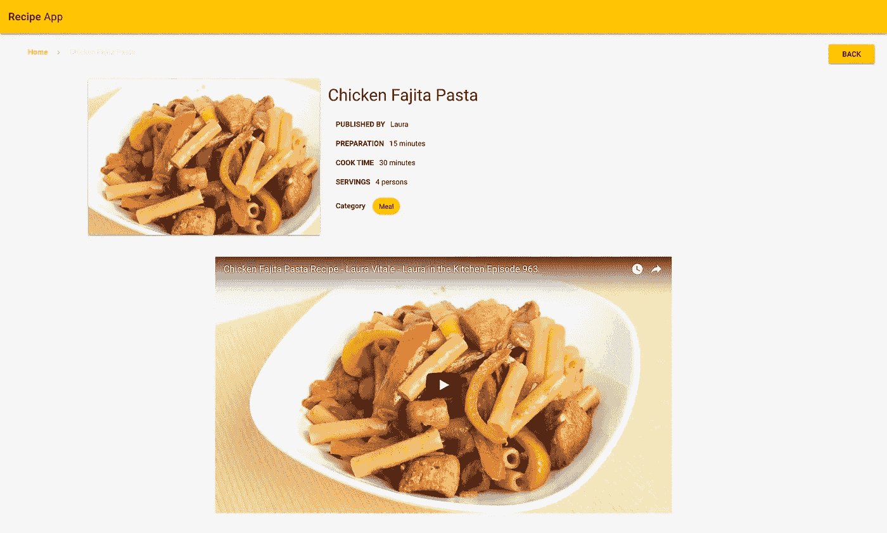

# 如何用 Vue.js 和 Vuex 搭建一个菜谱 app

> 原文：<https://medium.com/hackernoon/how-to-build-a-recipe-app-using-vue-js-and-vuex-7830998050b9>


Yum yum

在本教程中，我将向你展示如何使用 [Vue2](https://vuejs.org/) 、 [Vuex](https://vuex.vuejs.org/en/) 、 [Vuetify](https://vuetifyjs.com/) 和 [Cosmic JS](https://cosmicjs.com) 创建一个优雅的**食谱 App** 。为了理解如何使用 Restful API，本教程将展示如何向 Cosmic JS API 发出 AJAX (XHR)请求，以便在我们的 Cosmic JS 桶中检索、添加、更新和删除数据/媒体。让我们开始吧。

[下载 GitHub 回购](https://github.com/cosmicjs/recipe-app)
[查看演示](https://cosmicjs.com/apps/recipe-app)



Here’s what it will look like

# 先决条件

您将需要节点 JS 和 npm。在开始之前，确保你已经有了它们。

# 入门指南

# 使用现有的 git repo 做任何事情

首先，您必须确保安装了 node > 6.x，然后运行以下命令:

```
npm install -g vue-cli
git clone https://github.com/cosmicjs/recipe-app/
cd recipe-app 
npm install 
npm run dev
```

运行最后一个命令后，浏览器窗口将自动打开。

`package.json`会是这个样子。

```
{
 "name": "recipe-app",
 "description": "A Vue.js project",
 "version": "1.0.0",
 "author": "Jazib Sawar ",
 "private": true,
 "scripts": {
 "dev": "cross-env NODE_ENV=development webpack-dev-server --open --inline --hot",
 "build": "cross-env NODE_ENV=production webpack --progress --hide-modules"
 },
 "dependencies": {
 "cosmicjs": "^2.4.11",
 "js-beautify": "^1.6.14",
 "lodash": "^4.17.4",
 "vee-validate": "^2.0.0-rc.17",
 "vue": "^2.4.2",
 "vue-router": "^2.7.0",
 "vue-wysiwyg": "^1.2.6",
 "vuetify": "^0.15.7",
 "vuex": "^2.4.0"
 },
 "devDependencies": {
 "babel-core": "^6.0.0",
 "babel-loader": "^6.0.0",
 "babel-plugin-add-filehash": "^6.9.4",
 "babel-plugin-transform-imports": "^1.4.1",
 "babel-preset-env": "^1.5.1",
 "babel-preset-es2015": "^6.24.1",
 "babel-preset-stage-2": "^6.24.1",
 "cross-env": "^3.0.0",
 "css-loader": "^0.25.0",
 "file-loader": "^0.9.0",
 "node-sass": "^4.5.0",
 "sass-loader": "^5.0.1",
 "style-loader": "^0.13.1",
 "stylus": "^0.54.5",
 "stylus-loader": "^3.0.1",
 "vue-loader": "^12.1.0",
 "vue-template-compiler": "^2.4.2",
 "webpack": "^2.6.1",
 "webpack-dev-server": "^2.4.5"
 }
}
```

# 我们正在安装什么，为什么

1.  我们将使用 **vue** 和 **vuex** 库来创建组件和管理状态。
2.  我们使用 **vue-router** 包在我们的组件之间导航。
3.  我们正在使用**vue 化**包来使用 vue 组件创建漂亮的布局。
4.  我们将使用 **cosmicjs** 库来处理我们对 cosmicjs 桶的请求。
5.  **vue-wysiwyg** 用于编辑& **vee-validate** 用于表单验证。

# 构建我们的应用

现在我们将在根目录下设置我们的 index.html，我们将在那里改变图标，你也可以添加元标签。

下面是 index.html 的档案。这里唯一重要的代码块是包含构建脚本 **< script src=。/dist/build . js "></script>**在 body 标签的末尾创建一个元素**<div id = " app "></div>**其中 **vue** 将引导您的应用程序。

```
<!DOCTYPE html>
<html lang="en">
 <head>
 <title>Recipes App</title>
 <meta charset="utf-8">
 <meta http-equiv="X-UA-Compatible" content="IE=edge">
 <meta name="viewport" content="width=device-width, initial-scale=1.0">
 <link href='https://fonts.googleapis.com/css?family=Roboto:300,400,500,700|Material+Icons' rel="stylesheet" type="text/css">
 <link href='./public/font-awesome-4.7.0/css/font-awesome.min.css' rel="stylesheet" type="text/css">
 <link rel="icon" type="image/png" href="./public/favicon-32x32.png" sizes="32x32">
 </head>
 <body>
 <div id="app"></div>
 <script src="./dist/build.js"></script>
 </body>
</html>
```

# Setup main.js

你可能知道 **main.js** 是创建 vue 实例和渲染第一个组件的主文件。

```
import Vue from 'vue'
import VueRouter from 'vue-router'
import store from './vuex/store'
import App from './App.vue'
import Vuetify from 'vuetify'
import VeeValidate from 'vee-validate';
import wysiwyg from "vue-wysiwyg";
import RecipeList from './components/RecipeList.vue'
import RecipeSingle from './components/RecipeSingle.vue'
import './stylus/main.styl'Vue.use(VueRouter)
Vue.use(Vuetify)
Vue.use(VeeValidate)
Vue.use(wysiwyg,{
 hideModules: { bold: true, table: true, image: true }
})const routes = [
 { name: 'home', path: '/', component: RecipeList },
 { name: 'recipes', path: '/recipes', component: RecipeList },
 { name: 'recipe', path: '/recipe/:id', component: RecipeSingle }
];const router = new VueRouter({
 routes
});new Vue({
 store,
 el: '#app',
 router,
 render: h => h(App),
 beforeMount: function(){
 this.$store.dispatch("getRecipes");
 }
})
```

在最初的几行中，我将所有的包和组件导入到应用程序中。将我们的包注入 vue 以便我们可以使用它。`Vue.use(VueRouter)`在我们的应用中包含路由器。这将为应用程序提供导航。

## 按指定路线发送

```
const routes = [
 { name: 'home', path: '/', component: RecipeList },
 { name: 'recipes', path: '/recipes', component: RecipeList },
 { name: 'recipe', path: '/recipe/:id', component: RecipeSingle }
];
```

这些是我们可能的路线。主页和食谱用于显示食谱列表。然后`/recpie/:id`会展示食谱。

## Vue 实例

```
new Vue({
 store,
 el: '#app',
 router,
 render: h => h(App),
 beforeMount: function(){
 this.$store.dispatch("getRecipes");
 }
})
```

这里创建了 Vue 实例。`el: '#app'`是来自 index.html 的元素的 id，vue 将在这里注入应用程序。`store`是 vuex 商店。我稍后会谈到 vuex。`router`正在注入路由器对象。`render: h => h(App)`正在告诉 app 先在 App 中注入 App 组件。

# 设置 App.vue

`\src\App.js`是将呈现的第一个组件。我为 UI 使用了 vuetify 组件，为 css 提供了手写笔。你可以在这里查看他们的文档[。这里最重要的代码块包括模板`<router-view></router-view>`中的路由器视图。这段代码将根据路由呈现路由器和相应的组件。](https://vuetifyjs.com/vuetify/quick-start)

# Vuex

接下来，我首先讨论 Vuex 以及我们为什么应该使用它。显然，对于较小的应用程序，可以使用简单的状态和道具。但是对于大型应用程序，我们必须使用某种状态管理，比如 React 中的 redux。Vuex 由 vue 团队维护，使用广泛。今天我们将。下面是我将要解释的 Vuex 流程图。


vuex 中有四个主要概念。

*   状态
*   行动
*   突变
*   吸气剂

**状态**是我们整个应用程序状态/数据将被存储的地方。那么它将如何工作呢？例如，您正在组件中使用这个存储，并希望更改一些状态值。您必须分派一个**动作**。然后**动作**将提交**突变**并且它将改变状态。所以为什么需要行动，我们可以在突变中直接改变状态。行动很重要。当我们必须调用任何异步函数，然后在它成功时改变状态时，我们需要动作。在 API 的情况下，我们在动作中使用请求，并提交变化来改变状态。这非常简单，但遵循起来非常重要。

**Getters** 是简单的获取组件状态值的 getter 函数。如果在不同的组件中需要一个状态值，那么最好为它创建 getter，并在组件中将该 getter 用作计算属性。

惯例是先创建 vuex 文件夹，然后在其中创建 store.js。于是我也这样做了，创造了`src/vuex/store.js`。下面是 store.js 代码:

```
import Vue from 'vue'
import Vuex from 'vuex'
import Request from '../common/request'
import _ from 'lodash';Vue.use(Vuex)// the root, initial state object
const state = {
 recipes: [
 ],
 status: {
 loading: false,
 success: false,
 error: false
 },
 categories: [
 "Dessert",
 "Meal"
 ],
 recipe: {
 metadata:{
 feature_image: {
 },
 ingredients:[]
 }
 },
 editForm: false,
 editting: false,
 pagination: {
 page: 1,
 limit: 12,
 total: 0
 }
}// define the possible getters that can be applied to our state
const getters = {
 recipes(state){
 return state.recipes;
 },
 recipe(state){
 return (keyword) => _.find(state.recipes,['_id', keyword]);
 },
 recipeModel(state){
 return state.recipe;
 },
 loading(state){
 return state.status.loading;
 },
 editForm(state){
 return state.editForm;
 },
 categories(state){
 return state.categories;
 },
 editting(state){
 return state.editting;
 },
 pagination(state){
 return state.pagination;
 },
 page(state){
 return state.pagination.page;
 }
}// define the possible mutations that can be applied to our state
const mutations = {
 SET_TOTAL(state,payload){
 state.pagination.total = Math.ceil(payload / state.pagination.limit);
 },
 SET_RECIPES(state,payload){
 state.recipes = payload;
 },
 SET_RECIPE(state,payload){
 state.recipe = payload;
 },
 ADD_RECIPE(state,payload){
 state.recipes.unshift(payload);
 },
 EDIT_RECIPE(state,payload){
 state.recipes = _.unionBy([payload],state.recipes,'_id');
 },
 DELETE_RECIPE(state,payload){
 _.remove(state.recipes, function (recipe) {
 return recipe._id === payload._id
 });
 },
 LOADING(state){
 state.status = {
 loading: true,
 success: false,
 error: false
 };
 },
 SUCCESS(state){
 state.status = {
 loading: false,
 success: true,
 error: false
 };
 },
 ERROR(state,payload){
 state.status = {
 loading: false,
 success: false,
 error: payload
 };
 },
 CLEAR_ERROR(state){
 state.status = {
 loading: false,
 success: false,
 error: false
 };
 },
 TOGGLE_EDITFORM(state,payload){
 state.editForm = payload;
 },
 ADD_INGREDIANT_RECIPE(state,payload){
 state.recipe.metadata.ingredients.push({
 ingredient: payload
 });
 },
 REMOVE_INGREDIANT_RECIPE(state,payload){
 state.recipe.metadata.ingredients.splice(payload, 1);
 },
 SET_RECIPE_IMAGE(state,payload){
 state.recipe.metadata.feature_image.url = payload;
 },
 SET_RECIPE_FILE(state,payload){
 state.recipe.metadata.feature_image.file = payload;
 },
 TOGGLE_EDITTING(state){
 state.editting = !state.editting;
 },
 SET_RECIPE_DEFAULT(state){
 state.recipe = {
 metadata:{
 feature_image: {
 },
 ingredients:[]
 }
 };
 },
 PAGINATE(state,payload){
 state.pagination.page = payload;
 }
} // define the possible actions that can be applied to our state
const actions = {
 getRecipes(context){
 context.commit('LOADING');
 Request.getRecipes(context.getters.pagination).then(res => {
 context.commit('SET_RECIPES',res.objects.all || []);
 context.commit('SET_TOTAL',res.total || 0);
 context.commit('SUCCESS');
 })
 .catch(e => {
 context.commit('ERROR',e);
 });
 },
 setRecipe(context,payload){
 context.commit('SET_RECIPE',_.cloneDeep(payload));
 },
 setRecipeDefault(context){
 context.commit('SET_RECIPE_DEFAULT');
 },
 addRecipe(context,payload){
 context.commit('LOADING');
 Request.addRecipe(payload).then(recipe => {
 context.commit('ADD_RECIPE',recipe);
 context.commit('SET_RECIPE_DEFAULT');
 context.commit('TOGGLE_EDITFORM',false);
 context.commit('SUCCESS');
 })
 .catch(e => {
 context.commit('ERROR',e);
 });
 },
 editRecipe(context,payload){
 context.commit('LOADING');
 Request.editRecipe(payload).then(recipe => {
 context.commit('EDIT_RECIPE',recipe);
 context.commit('SET_RECIPE_DEFAULT');
 context.commit('TOGGLE_EDITTING');
 context.commit('TOGGLE_EDITFORM',false);
 context.commit('SUCCESS');
 })
 .catch(e => {
 context.commit('ERROR',e);
 });
 },
 deleteRecipe(context,payload){
 context.commit('LOADING');
 Request.deleteRecipe(payload).then((res) => {
 if(res.status == 200){
 context.commit('DELETE_RECIPE',payload);
 context.commit('SUCCESS');
 }
 else{
 context.commit('ERROR',res);
 }
 })
 .then((e) => {
 context.commit('ERROR',e);
 });
 },
 clearError(context){
 context.commit('CLEAR_ERROR');
 },
 setEditForm(context,payload){
 context.commit('TOGGLE_EDITFORM',payload);
 },
 addIngrediantInRecipe(context,payload){
 context.commit('ADD_INGREDIANT_RECIPE',payload);
 },
 removeIngrediantInRecipe(context,payload){
 context.commit('REMOVE_INGREDIANT_RECIPE',payload);
 },
 setRecipeImage(context,payload){
 context.commit('SET_RECIPE_IMAGE',payload);
 },
 setRecipeFile(context,payload){
 context.commit('SET_RECIPE_FILE',payload);
 },
 toggleEditting(context){
 context.commit('TOGGLE_EDITTING');
 },
 paginate(context,payload){
 context.commit('PAGINATE',payload);
 context.dispatch('getRecipes');
 }
}// create the Vuex instance by combining the state and mutations objects
// then export the Vuex store for use by our components
export default new Vuex.Store({
 state,
 getters,
 mutations,
 actions
})
```

# 配置

`src/config/config.js`是存储使用其 api 或 npm 包访问 cosmicjs 桶数据的基本配置的文件。

```
const config = {
 bucket: {
 slug: YOUR_BUCKET_SLUG,
 read_key: YOUR_BUCKET_READ_KEY,
 write_key: YOUR_BUCKET_WRITE_KEY
 },
 object_type: YOUR_OBJECT_TYPE,
 image_folder: IMAGE_FOLDER_SLUG
};export default config;
```

# 英国国会下院

在`src/common/`我创造了三个。js 文件来构建我的代码并使其可伸缩。`src/common/request.js`文件将使用`src/common/Cosmic.js`包，向提供的端点发出请求并返回承诺。`src/common/paramMapping.js`在添加和编辑时会创建一个请求对象。

在`src/common/Cosmic.js`中，我扩展了 cosmic-js 包，因为它在`getObjectsByType`函数中缺少了`deleteMedia`和排序功能。

`Note: I created a PR I hope it will be added out of the box in cosmic-js package.`

Cosmic.js 扩展代码如下。

```
import Cosmic from 'cosmicjs';
var api_url = 'https://api.cosmicjs.com';
var api_version = 'v1';Cosmic.getObjectsByType = function(config, object, callback){
 var endpoint = api_url + '/' + api_version + '/' + config.bucket.slug + '/object-type/' + object.type_slug + '?read_key=' + config.bucket.read_key;
 if (object.limit) endpoint += '&limit=' + object.limit;
 if (object.skip) endpoint += '&skip=' + object.skip;
 if (object.locale) endpoint += '&locale=' + object.locale;
 if (object.sort) endpoint += '&sort=' + object.sort;
 fetch(endpoint)
 .then(function(response){
 if (response.status >= 400) {
 var err = {
 "message" : "There was an error with this request."
 }
 return callback(err, false);
 }
 return response.json()
 })
 .then(function(response){
 // Constructor
 var cosmic = {};
 var objects = response.objects;
 cosmic.objects = {};
 cosmic.objects.all = objects;
 cosmic.object = _.map(objects, keyMetafields);
 cosmic.object = _.keyBy(cosmic.object, "slug");
 cosmic.total = response.total;
 return callback(false, cosmic);
 });
};Cosmic.deleteMedia = function(config, object, callback){
 var endpoint = api_url + '/' + api_version + '/' + config.bucket.slug + '/media/' + object.media_id;
 fetch(endpoint, {
 method: 'delete',
 headers: {
 'Content-type': 'application/json'
 },
 body: JSON.stringify(object)
 })
 .then(function(response){
 if (response.status >= 400) {
 var err = {
 'message': 'There was an error with this request.'
 }
 return callback(err, false);
 }
 return response.json()
 })
 .then(function(response){
 return callback(false, response);
 });
};function keyMetafields(object){
 var metafields = object.metafields;
 if(metafields){
 object.metafield = _.keyBy(metafields, 'key');
 }
 return object;
}export default Cosmic;
```

# 成分

在这个应用程序中，我创建了以下组件。

*   RecipeList.vue
*   RecipeSingle.vue
*   RecipeForm.vue

# RecipeList.vue

RecipeList.vue 是主要组件。它将在卡片视图中显示食谱列表。我再次使用了 vue 化组件。它还提供添加、编辑、删除和分页功能。对于编辑和添加，我使用了模态/对话框来打开表单。存在于`RecipeForm.vue`组件中。

```
import {mapActions,mapGetters} from 'vuex';
```

这将把 vuex 存储的 getter 映射到 Vue 的计算属性，并将动作映射到方法。

```
<template>
 <div>
 <v-container fill-height class="noRecipes" v-if="recipes.length == 0 && !loading">
 <v-layout row wrap align-center>
 <v-flex class="text-xs-center">
 <h4>There is no recipe please add one!</h4>
 <v-btn light large class="amber" @click="openAddForm" :disabled="loading">Add Recipe</v-btn>
 </v-flex>
 </v-layout>
 </v-container>
 <v-container grid-list-lg text-xs-center>
 <v-layout row wrap v-if="recipes.length > 0">
 <v-flex md4 sm6 xs12 v-for="(recipe, index) in recipes" :key="index">
 <v-card>
 <router-link :to="{name:'recipe', params:{id:recipe._id}}">
 <v-card-media :src="recipe.metadata.feature_image.url.replace(/ /g,'%20')" height="200px">
 </v-card-media>
 </router-link>
 <v-card-title primary-title>
 <div>
 <h3 class="headline mb-0">
 <router-link :to="{name:'recipe', params:{id:recipe._id}}">
 {{recipe.title}}
 </router-link>
 </h3>
 <div>{{recipe.metadata.author}}</div>
 </div>
 </v-card-title>
 <v-card-actions class="white">
 <v-spacer></v-spacer>
 <v-btn icon :disabled="loading" @click="openEditForm(recipe)">
 <v-icon class="blue--text">edit</v-icon>
 </v-btn>
 <v-btn icon :disabled="loading" @click="deleteRecipe(recipe)">
 <v-icon class="red--text">delete</v-icon>
 </v-btn>
 <v-spacer></v-spacer>
 </v-card-actions>
 </v-card>
 </v-flex>
 <v-btn fixed light fab bottom right class="amber darken-2" @click="openAddForm" :disabled="loading" >
 <v-icon>add</v-icon>
 </v-btn>
 </v-layout>
 <div class="text-xs-center recipes-pagination" v-if="recipes.length > 0">
 <v-pagination :disabled="loading" :length="pagination.total" v-model="pagination.page" :total-visible="5" circle></v-pagination>
 </div>
 <recipe-form></recipe-form>
 <v-snackbar :timeout="2000" success v-model="success">
 Request done successfully!
 </v-snackbar>
 <v-snackbar :timeout="3000" error v-model="error">
 There was an error during request!
 </v-snackbar>
 </v-container>
 </div>
</template><script>
 import {mapActions,mapGetters} from 'vuex';
 import RecipeForm from './RecipeForm.vue';
 export default {
 components:{
 'recipe-form': RecipeForm
 },
 computed: {
 success: {
 get: function(){
 return this.$store.state.status.success;
 },
 set: function(value){
 this.$store.dispatch('clearError');
 }
 },
 error: {
 get: function(){
 return this.$store.state.status.error;
 },
 set: function(value){
 this.$store.dispatch('clearError');
 }
 },
 ...mapGetters([
 'recipes','pagination','loading','editForm','page'
 ])
 },
 watch: {
 page: 'getRecipes'
 },
 methods:{
 openAddForm(){
 this.$store.dispatch('setRecipeDefault');
 this.$store.dispatch('setEditForm',true);
 },
 openEditForm(recipe){
 this.$store.dispatch('setRecipe',recipe);
 this.$store.dispatch('toggleEditting');
 this.$store.dispatch('setEditForm',true);
 },
 deleteRecipe(recipe){
 this.$store.dispatch('deleteRecipe',recipe);
 },
 getRecipes(){
 this.$store.dispatch('getRecipes');
 }
 }
 }
</script><style lang="stylus" scoped>
 #keep
 .card__title
 display: block .headline
 a
 color: rgba(0,0,0,0.87)
 text-decoration: none
 .v-spinner
 text-align: center
 .noRecipes
 position: absolute
 right: 0
 left: 0
 text-align: center
 height: auto
 top: 60px
 bottom: 0
 .recipes-pagination
 margin-top: 80px
 .pagination >>> li > a.pagination__item--active
 background: #FFC107
 color: #000
 font-weight: bold
</style>
```

# RecipeForm.vue

RecipeForm.vue 用于提交表单并进行基本验证。

```
<template>
 <v-layout row justify-center>
 <v-dialog v-model="editForm" scrollable persistent width="50vw">
 <v-card>
 <v-card-title>
 <span class="headline">{{ editting ? 'Edit ' : 'Add ' }}Recipe</span>
 </v-card-title>
 <v-divider></v-divider>
 <v-card-text style="height: 70vh;">
 <v-container grid-list-md>
 <v-layout wrap>
 <v-flex xs12>
 <v-text-field v-model="recipeModel.title" label="Title" :error-messages="errors.collect('title')" v-validate="'required'" data-vv-name="title" required></v-text-field>
 </v-flex>
 <v-flex xs12>
 <div class="input-group input-group--dirty">
 <label>Content</label>
 <wysiwyg v-model="recipeModel.content" />
 </div>
 </v-flex>
 <v-flex xs12 class="mb-2">
 <div class="input-group input-group--dirty">
 <label class="ingredients_list_label">Ingredients</label>
 <ul class="ingredients_list">
 <li v-for="(item,index) in recipeModel.metadata.ingredients" :key="index">
 {{item.ingredient}}
 <v-btn fab dark small error @click="removeIngrediant(index)" class="btn_remove_ingredient">
 <v-icon dark>remove</v-icon>
 </v-btn>
 </li>
 </ul>
 </div>
 </v-flex>
 <v-flex xs10 class="mb-3">
 <v-text-field ref="addIngredientRef" label="Ingredient"></v-text-field>
 </v-flex>
 <v-flex xs2 class="mb-3">
 <v-btn warning fab small dark @click="addIngrediant($refs.addIngredientRef)">
 <v-icon>add</v-icon>
 </v-btn>
 </v-flex>
 <v-flex xs12>
 <v-text-field v-model="recipeModel.metadata.author" label="Author" :error-messages="errors.collect('author')" v-validate="'required'" data-vv-name="author" required></v-text-field>
 </v-flex>
 <v-flex xs12>
 <v-text-field v-model="recipeModel.metadata.preparation_time" label="Preparation Time (in minutes)" :error-messages="errors.collect('preparation')" v-validate="'required|numeric'" data-vv-name="preparation" required></v-text-field>
 </v-flex>
 <v-flex xs12>
 <v-text-field v-model="recipeModel.metadata.cook_time" label="Cook Time (in minutes)" :error-messages="errors.collect('cook')" v-validate="'required|numeric'" data-vv-name="cook" required></v-text-field>
 </v-flex>
 <v-flex xs12>
 <v-text-field v-model="recipeModel.metadata.servings" label="Servings (person)" :error-messages="errors.collect('servings')" v-validate="'required|numeric'" data-vv-name="servings" required></v-text-field>
 </v-flex>
 <v-flex xs12>
 <v-select
 v-bind:items="categories"
 v-model="recipeModel.metadata.category"
 label="Choose Category:"
 :error-messages="errors.collect('category')"
 v-validate="'required'"
 data-vv-name="category"
 required
 ></v-select>
 </v-flex>
 <v-flex xs12>
 <v-text-field v-model="recipeModel.metadata.youtube_id" label="Youtube ID" :error-messages="errors.collect('youtube')" v-validate="'required'" data-vv-name="youtube" required></v-text-field>
 </v-flex>
 <v-flex xs12>
 
 <form enctype="multipart/form-data" novalidate>
 <input type="file" @change="onFileChange" accept="image/*" data-vv-name="image" v-validate="'required|mimes:image/*'" required />
 <div class="input-group fileUploadError">
 <div class="input-group__error" v-show="errors.has('image') && !editting">
 {{ errors.first('image') }}
 </div>
 </div>
 </form>
 </v-flex>
 </v-layout>
 </v-container>
 <small>*indicates required field</small>
 </v-card-text>
 <v-divider></v-divider>
 <v-card-actions>
 <v-spacer></v-spacer>
 <v-btn error dark @click="closeDialog" :disabled="loading">Close</v-btn>
 <v-btn :loading="loading" :disabled="loading" primary dark @click="saveRecipe(recipeModel)">Save</v-btn>
 </v-card-actions>
 </v-card>
 </v-dialog>
 </v-layout>
</template><script>
import { mapActions, mapGetters } from 'vuex';
export default {
 computed: {
 ...mapGetters([
 'editForm', 'recipeModel','categories','editting','loading'
 ])
 },
 methods: {
 closeDialog() {
 this.$validator.reset();
 this.$store.dispatch('setRecipeDefault');
 this.$store.dispatch('setEditForm', false);
 },
 saveRecipe(recipe) {
 this.$validator.validateAll();
 if(this.$store.state.editting){
 if( (!this.errors.any()) || (this.errors.count() == 1 && this.errors.has('image'))) {
 this.$store.dispatch('editRecipe', recipe);
 }
 }
 else
 {
 if(!this.errors.any()){
 this.$store.dispatch('addRecipe', recipe);
 }
 }
 },
 addIngrediant(item){
 if(item.$refs.input.value){
 this.$store.dispatch('addIngrediantInRecipe', item.$refs.input.value);
 }
 },
 removeIngrediant(id){
 this.$store.dispatch('removeIngrediantInRecipe', id);
 },
 onFileChange(e){
 var files = e.target.files || e.dataTransfer.files;
 if (!files.length){
 this.$store.dispatch('setRecipeImage', '');
 this.$store.dispatch('setRecipeFile', '');
 return;
 }
 var image = new Image();
 var reader = new FileReader(); reader.onload = (e) => {
 this.$store.dispatch('setRecipeImage', e.target.result);
 this.$store.dispatch('setRecipeFile', files[0]);
 };
 reader.readAsDataURL(files[0]);
 }
 }
}
</script>
<style lang="stylus" scoped>
 .ingredients_list_label
 width: 100%
 .ingredients_list
 width: 100%
 li
 position: relative
 padding: 2px 40px 2px 0

 .btn_remove_ingredient
 position: absolute
 right: 10px
 width: 20px
 height: 20px
 margin: 0 !important
 i.icon
 font-size: 14px
 .upload_image
 width: 200px
 .fileUploadError
 padding: 2px 0 0
 .application .theme--dark.btn.primary.btn--disabled:not(.btn--icon):not(.btn--flat)
 background-color: #1976d2 !important
 border-color: #1976d2 !important
 .application .theme--dark.btn.error.btn--disabled:not(.btn--icon):not(.btn--flat)
 background-color: #ff5252 !important
 border-color: #ff5252 !important

</style>
```

# RecipeSingle.vue

RecipeSingle.vue 正在渲染单个配方。

```
<template>
 <div id="recipe_single">
 <div v-if="recipe">
 <v-breadcrumbs icons divider="chevron_right">
 <v-breadcrumbs-item replace :to="{name: 'recipes'}">
 Home
 </v-breadcrumbs-item>
 <v-breadcrumbs-item disabled>
 {{ recipe.title }}
 </v-breadcrumbs-item>
 <v-spacer></v-spacer>
 <v-btn primary light class="amber" replace :to="{name: 'recipes'}">Back</v-btn>
 </v-breadcrumbs>
 </div>
 <v-container fluid grid-list-lg>
 <v-layout row wrap>
 <v-flex md10 xs12 offset-md1 v-if="recipe">
 <v-layout row wrap>
 <v-flex xs12 sm6 md4>
 <v-card>
 <v-card-media :src="recipe.metadata.feature_image.url.replace(/ /g,'%20')" height="300px">
 </v-card-media>
 </v-card>
 </v-flex>
 <v-flex xs12 sm6 md8 class="recipe_info">
 <h1 class="headline mb-0">
 {{recipe.title}}
 </h1>
 <ul class="recipe_meta">
 <li><p><strong>PUBLISHED BY</strong>{{recipe.metadata.author}}</p></li>
 <li><p><strong>PREPARATION</strong>{{recipe.metadata.preparation_time}} {{ recipe.metadata.preparation_time > 1 ? 'minutes' : 'minute' }}</p></li>
 <li><p><strong>COOK TIME</strong>{{recipe.metadata.cook_time}} {{ recipe.metadata.cook_time > 1 ? 'minutes' : 'minute' }}</p></li>
 <li><p><strong>SERVINGS</strong>{{recipe.metadata.servings}} {{ recipe.metadata.servings > 1 ? 'persons' : 'person' }}</p></li>
 <li><p><strong>Category</strong><v-chip class="amber dark--text">{{recipe.metadata.category}}</v-chip></p></li>
 </ul>
 </v-flex>
 </v-layout>
 <p class="mt-3"></p>
 <v-layout row wrap class="recipe_content_wrap">
 <v-flex xs12 md8 offset-md2>
 <div class="video-responsive">
 <iframe width="560" height="315" :src="'https://www.youtube.com/embed/'+recipe.metadata.youtube_id" frameborder="0" allowfullscreen></iframe>
 </div>
 </v-flex>
 </v-layout>
 <p class="mt-5"></p>
 <v-card class="white">
 <v-layout row wrap class="recipe_content_wrap">
 <v-flex xs12 md6 order-md2>
 <h1 class="headline mb-0">
 Ingredients:
 </h1>
 <v-list avatar>
 <v-list-tile v-for="(item, index) in recipe.metadata.ingredients" :key="index">
 <v-list-tile-avatar>
 <v-icon class="amber--text text--darken-2">fa-circle</v-icon>
 </v-list-tile-avatar>
 <v-list-tile-content>
 <v-list-tile-title>{{item.ingredient}}</v-list-tile-title>
 </v-list-tile-content>
 </v-list-tile>
 </v-list>
 </v-flex>
 <v-flex xs12 md6>
 <h1 class="headline mb-0">
 Preparation:
 </h1>
 <p v-html="recipe.content" class="recipe_content"></p>
 </v-flex>
 </v-layout>
 </v-card>
 </v-flex>
 </v-layout>
 </v-container>
 </div>
</template><script>
 import {mapActions,mapGetters} from 'vuex'
 export default {
 computed: {
 recipe(){
 return this.$store.getters.recipe(this.$route.params.id)
 }
 },
 methods:{ }
 }
</script><style lang="stylus">
 #recipe_single
 .headline
 font-size: 32px !important
 padding-top: 15px
 .recipe_meta
 padding-top: 30px
 padding-left: 15px
 list-style: none
 strong
 margin-right: 10px
 .recipe_content_wrap
 padding: 10px 20px
 .recipe_content
 padding-top: 15px
 padding-left: 10px
 .list
 > li
 height: 30px
 .icon
 font-size: 16px
 .video-responsive
 overflow:hidden
 padding-bottom:56.25%
 position:relative
 height:0
 .video-responsive iframe
 left:0
 top:0
 height:100%
 width:100%
 position:absolute
 .breadcrumbs
 li:first-child
 a
 color: #FFC107
 li:nth-child(2):after
 content: ''</style>
```

# 结论

因此，这是一个应用程序，其中涵盖了使用宇宙 npm 包 vue & vuex 的宇宙 RESTful API 的每个场景。我希望你喜欢这个教程。如果您有任何问题，请[在 Twitter 上联系 Cosmic JS](https://twitter.com/cosmic_js)并加入 Slack 上的 [Cosmic JS 社区](https://cosmicjs.com/community)。