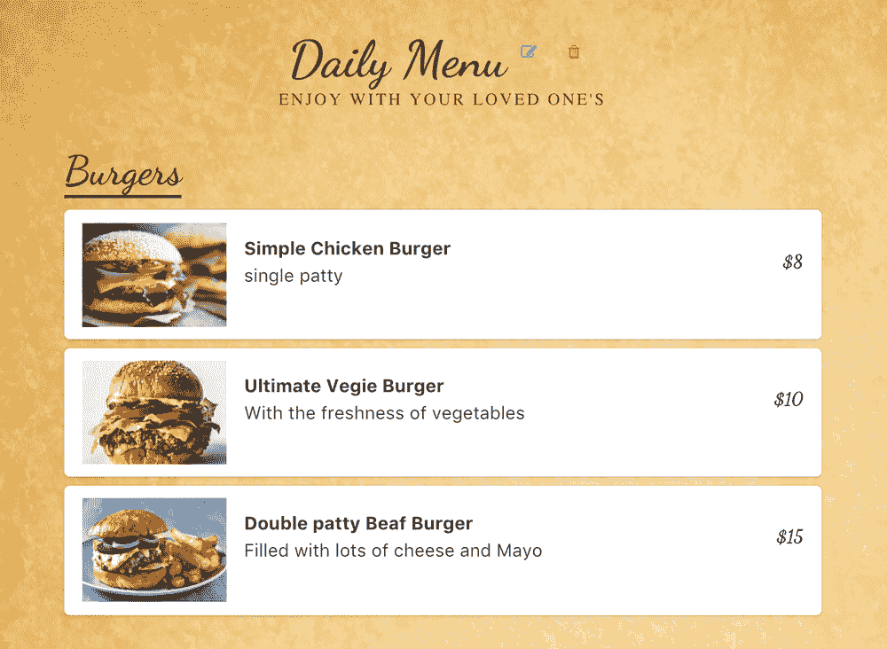

# 如何使用 Cosmic JS 在 Nuxt & Vuex 中构建餐厅菜单 App

> 原文：<https://medium.com/hackernoon/how-to-build-a-restaurant-menu-app-in-nuxt-vuex-using-cosmic-js-a311fb877907>

在本教程中，我将向你展示如何使用 [Vue2](https://vuejs.org/) 、 [Vuex](https://vuex.vuejs.org/en/) 、 [Buefy](https://buefy.github.io/) 和 [Cosmic JS](http://cosmicjs.com/) 创建一个**餐厅菜单 App** 。它托管在 Cosmic JS 应用服务器上。我们将使用 Cosmic JS npm 包来实现我们对象的基本 CRUD，并从 Cosmic JS 中检索数据和媒体。让我们开始吧。

[下载 GitHub 回购。！](https://github.com/cosmicjs/restaurant-menu-app)
[查看演示](https://cosmicjs.com/apps/restaurant-menu-app/demo)

# 先决条件

在启动之前，您需要安装节点 JS 和 npm。确保你已经有了。

# 入门指南

# 使用现有的 git repo 做任何事情

首先，您必须确保安装了 node > 6.x，然后运行以下命令:

成功完成最后一个命令后，浏览器窗口将自动打开

`package.json`会是这个样子。

# 我们正在安装什么，为什么

1.  我们将使用 **vue** 和 **vuex** 库来创建组件和管理状态。
2.  我们使用**异步**包向 Cosmic JS 发出异步请求，以循环删除媒体。
3.  我们正在使用 **buefy** 包来创建使用 vue 组件的布局。
4.  我们将使用**宇宙 JS** 库来处理我们对宇宙 JS 桶的请求。
5.  **vee-validate** 用于表单验证。
6.  **nuxt** 用于服务器端渲染。

# 构建我们的应用

现在，我们将在根目录中设置我们的 nuxt.config.js，在那里我们将更改 favicon 并为应用程序链接构建属性和林挺等设置其他基本属性。此外，我们将包括应用程序所需的外部 CDN。

下面是 nuxt.config.js 文件。

# 安装 default.js

layouts 目录下的 default.js 是所有 app 的起点。这里我们包括了像导航栏和页脚这样的主视图属性。这里重要的是 nuxt 标签将根据路由启动所有页面。

在 beforeMount 的脚本部分，我们已经调用了应用程序加载时需要调用的操作。这里的“getMenus”值得注意。当应用程序启动时，此操作获取当前日期的菜单。我们还向商店展示了 vue 组件。

## 按指定路线发送

当使用 nuxt.js 时，我们不需要担心创建路由。请为我们做这项工作。我们需要遵循 nuxt 描述的文件目录规则，它将为我们创建所有必要的路径。欲了解更多信息，请访问 [Nuxt 文档](https://nuxtjs.org/guide/routing)

# Setup index.vue

`\pages\index.vue`是将呈现的第一页。我已经为 UI 使用了 buefy 组件。你可以在这里查看他们的文件。此处最重要的代码块用于在模板中包含 landingpage 组件。这段代码将呈现 LandingPage 组件。

# Vuex

首先，我将讨论 Vuex 以及我们为什么应该使用它。显然，对于较小的应用程序，可以使用简单的状态和道具。但是对于大型应用程序，我们必须使用某种状态管理，比如 React 中的 redux。Vuex 由 vue 团队维护，使用广泛。今天我们将使用它。下面是我将要解释的 Vuex 流程图。

vuex 中有四个主要概念。

*   状态
*   行动
*   突变
*   吸气剂

**状态**是我们整个应用程序状态/数据将被存储的地方。那么它将如何工作呢？例如，您正在组件中使用这个存储，并希望更改一些状态值。你必须分派一个**动作**。然后**动作**将提交**突变**并且它将改变状态。所以为什么需要行动，我们可以在突变中直接改变状态。行动很重要。当我们必须调用任何异步函数，然后在它成功时改变状态时，我们需要动作。在 API 的情况下，我们在动作中使用请求，并提交变化来改变状态。这非常简单，但遵循起来非常重要。

**Getters** 是简单的获取组件状态值的 getter 函数。如果在不同的组件中需要一个状态值，那么最好为它创建 getter，并在组件中将该 getter 用作计算属性。

惯例是先创建 vuex 文件夹，然后在其中创建 store.js。于是我也这样做了，创造了`store/store.js`。

> 这是《如何搭建餐厅菜单 App》的缩略版。完整版可在 Cosmic JS 上获得。[点击此处查看全文](https://cosmicjs.com/articles/how-to-build-a-restaurant-menu-app-in-nuxt-vuex-using-cosmic-js)。

# 结论

这是一个使用 vue，vuex，Cosmic JS 和 nuxt.js 构建的餐馆菜单的基本应用程序。我希望你喜欢这个教程，并对你有所帮助。