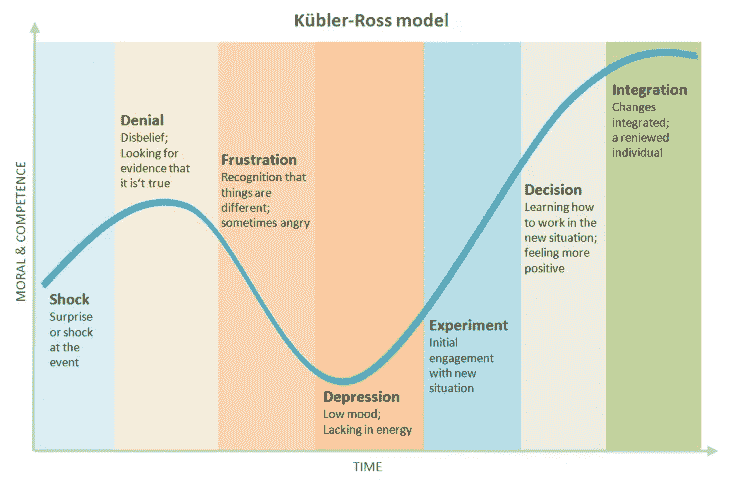

# 如何建立一个自我维持的开发团队

> 原文：<https://medium.com/hackernoon/how-to-build-a-self-sustaining-development-team-c1c280e608d5>

弗朗切斯科·塞萨里尼

**这是 Francesco Cesarini 和 Mike Williams 的《成功采用非主流编程语言的途径** **》中的摘录。**

所以你已经建立了原型，失败了，并获得批准继续设计最终产品。保留构建原型的团队并利用他们来指导新员工是至关重要的。在这样做的时候，你需要确保你的团队能够自我维持。

如果导师能坐在新员工旁边，那是最好的，双方的沟通需要快速高效。当成员转移到新的职位或分配到新的 POC 时，您需要能够替换他们，能够指导新加入者，使他们跟上速度。

我们的理念是与内部团队合作，发展团队的技能、知识和能力。创造一个成长的环境，培养成功的心态。

如果你是一家小公司，一个最小的团队应该由 4-5 人组成。

如果你是一家大公司，**10-12 名开发人员及以上**。

不是每个人都需要使用或开发 Erlang，但是他们应该对它充满热情，能够在短时间内投入工作并富有成效，并且能够轮换其他团队成员。

# 可转移的技能

招聘对你所采用的语言有经验的程序员总是一个错误；你需要优秀的、有经验的、思想开放的软件开发人员，他们理解不同的编程范例和方法。他们不需要知道编程语言，但是他们应该能够理解**的意思，使用正确的工具完成工作**。

> ***二郎，可以轻松学会。好的软件实践，不那么好。***

如果你收购了一家公司，你会得到一群已经拥有该领域知识的优秀开发人员。早在 2004 年，硅谷的一家公司就在招聘至少有十年 Erlang 经验的 Erlang 开发人员。他们通过收购采用了 Erlang，当时世界上可能只有 20 名合格的开发人员(包括这篇博客的作者)。

具有讽刺意味的是，该公司曾经雇用了另外 10 人，但刚刚关闭了他们在瑞典的业务，使他们成为多余的人。不要太在意地点。关注人才和生产力。

# 与您一起成长的团队

随着你的软件项目的进展，你的工作重点将会改变，在开始的时候，你的重点将会放在具有良好架构和编程技能的开发人员身上；稍后是配置管理、验证和测试；然后是部署、操作、维护和文档。

> 建立一个开发团队，他们能够掌握整个开发生命周期所需的技能。

您应该避免每个类别有不同的人，相反，您应该有那些自己能够掌握整个开发生命周期所需的技能的人。将知识从一个人传递给另一个人是容易出错的，而且成本很高，当一个人跨几个领域工作时，这是可以避免的。

# 改掉坏习惯

学习 Erlang/OTP 很容易，因为它是一种非常紧凑的语言和框架。困难的部分是忘记其他编程语言模型，并摆脱它们带来的坏习惯。

这就是指导和代码审查成为过程的重要部分的地方。审查所有代码，不仅是应用程序本身的代码，还有测试用例、模拟器和工具。

> 代码审查应该由有经验的开发人员领导，不仅关注质量、风格和文档，而且关注对开发人员进行系统整体的教育。

在对现有代码进行修改时，新员工通常会最快地上手。要谨慎，仔细审查新员工编写的新代码。

Ericsson 在 90 年代末做了一项研究，调查了参加过 Erlang 和 OTP 培训的毕业生和有经验的开发人员在大型项目中的工作效率。他们的结论是，一个大学毕业生在大约一个月后变得富有成效，因为他们可以很容易地学会新的编程模型并处理变化。

一个有经验的软件开发人员花了三个月的时间参加了同样的课程。他们很容易就学会了 Erlang，但是不得不花更多的时间来抛弃他们以前的编程范式，接受 Erlang 的方式。这一阶段的代码审查和指导至关重要。当我们说富有成效时，我们显然指的是他们各自级别的资历。

# 投资培训

在建立你的团队时，不要低估培训和学习圈的价值。当组织内部发生重大变革时，还必须向受影响者提供足够的培训和支持，并提供有效的反馈途径，以确保变革问题不会变成反对和抵制。

> 我们经常看到公司给他们的开发者一本书，希望他们变得更有生产力。为什么不呢？他们很聪明，收入也很高，因此应该有能力自己掌握一门新语言。

对于那些使用过其他函数式和并发编程语言的多语者来说，这可能是有效的，但是永远不要认为这是理所当然的。如果你想省钱并让你的开发人员快速高效地工作，投资于适当的培训和指导，尤其是当你正在组建一个十人或十人以上的团队时。这将允许他们快速理解和接受新的编程范例，并减少初学者的错误。

如果你走的是图书路线，那么如果项目遇到麻烦也不要惊讶。因小失大，你会吓跑 Erlang/OTP 专家，因为他们会耗尽所有时间来重构和调试糟糕的代码，而没有时间来指导那些真正需要的人。

请记住，核心开发团队之外的利益相关者将需要培训来保持对项目的热情和投资。过去对我们有效的一个策略是“新兵训练营”训练；我们已经看到它在变革领导团队中创造了正确的心态和对“变革工具”的理解。

Erlang 只是一种编程语言。这是容易的部分。学习应用程序领域可能是任何软件项目中最困难的任务。这就是垂直主题专家需要帮助的地方。

> 学习编程语言是容易的部分，永远不要低估垂直领域的专业知识。

接受这样一个事实，你必须用 Erlang 或者你使用的其他一些技术来培训你的新员工，但是也要接受这样一个事实，他们可能不是垂直领域的专家。他们可能会在几个月后发布代码，但是他们需要花更长的时间来学习必要的领域专业知识。

# 计划和行动时要考虑长期采用

如果你在大公司工作，继承了一个团队，记住你不能强迫他们使用他们不喜欢的技术。如果您打算使用 Erlang/OTP 或任何其他非主流语言，请确保团队了解其优势和好处，并接受正确的入职培训。

项目从非主流语言转移的一个主要原因是他们不能使团队自我持续。没有招聘渠道和失去团队的关键成员会给其他成员带来压力。

这类项目的一个关键方面是改变个人心态，从既定的做事方式转变过来。这包括通过展示从小的安全的渐进步骤到新的运营模式的方法来创造能量和热情。增量是关键。我看到变革的速度在变革的采用中起着至关重要的作用。如果有太多的变化，团队会感到不知所措。它可以把一个“变革倡导者”变成一个消极或者更坏的人，积极抵制变革。如果变化导致更多的工作或重复，也会引发这种行为。

库伯勒-罗斯变化曲线是理解人们在变化旅程中所处位置的有力工具。那些推动变革的人会比那些被迫变革的人走得更远。准备一个技术工具箱来帮助触发和刺激通过变化曲线的运动。例如，“市政厅”作为一种手段，确保对变革的反对意见得到表达，这样反对变革的人就不会被困在变革曲线的“否定”区域。记住:使用合适工具的项目通常由多种编程语言组成。并不是每个人都需要使用 Erlang，但是他们应该对 Erlang 有足够的了解，以便在必要的时候能够提供帮助。不要把反对者拒之门外，以后你可能会需要他们。

# 加入社区

承担暑期实习生和论文生；这是评价开发者的绝佳方式。当他们毕业时，他们可能会加入你。出席会议并让你的名字出现。在可能的情况下，如果有适合你的工作，加入学术研究项目。你的费用通常由助学金支付。

如果你是一家大公司，提供定期的课程，向公司的每个人开放，进行内部招聘。举办黑客马拉松、学习圈和聚会来激发兴趣和建立联系网络。使用并参与开源项目，并在可能的情况下，发布和维护其他人可能会发现有用的组件。那些出于好奇看到你在做什么并喜欢他们所看到的东西的人，很可能会在出现空缺时加入这个团队。

无耻之徒——我与人合著了两本关于 Erlang 的书——Erlang 编程和使用 Erlang/OTP 设计可伸缩性。

**这是 Francesco Cesarini 和 Mike Williams 的《成功采用非主流编程语言的途径** **中的一段摘录。**

[**订阅 Erlang Solutions 的时事通讯**](http://www2.erlang-solutions.com/emailpreference) **了解最新的 Erlang 和 Elixir 新闻，或** [**直接联系我们**](mailto:general@erlang-solutions.com) **了解如何向您的堆栈中引入新技术的更多信息。**

*原载于*[*www.erlang-solutions.com*](http://bit.ly/2sq0SDs)*。*