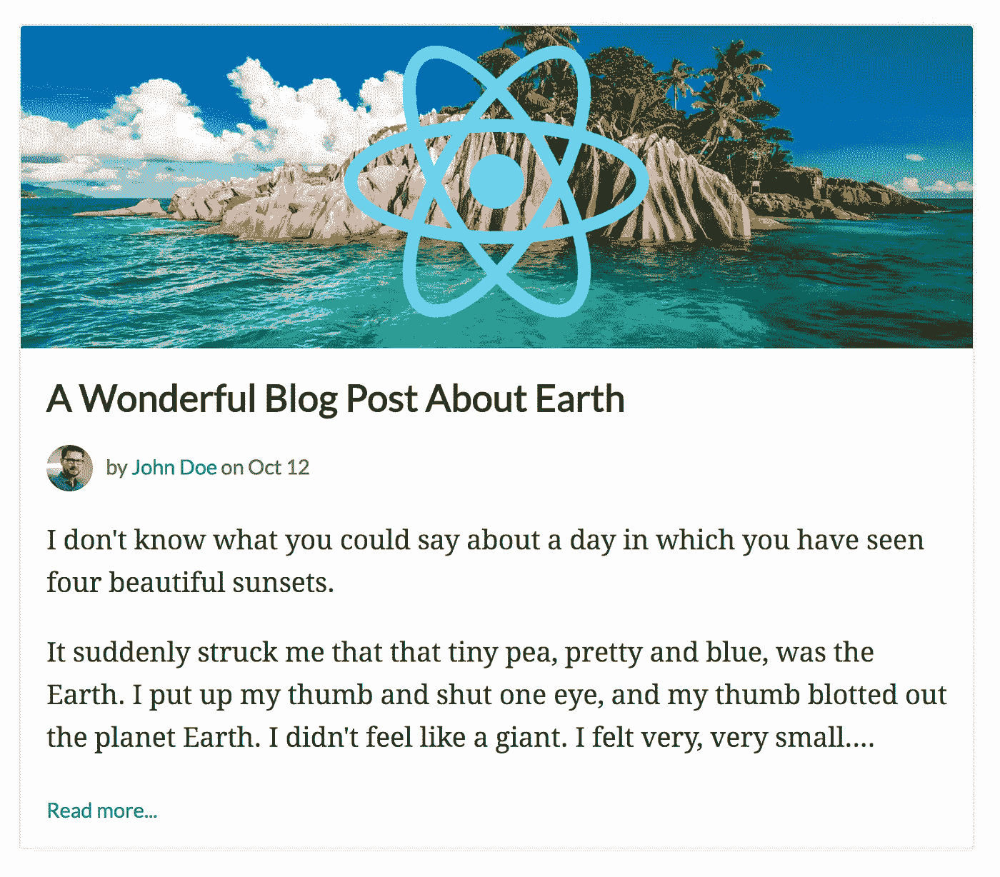
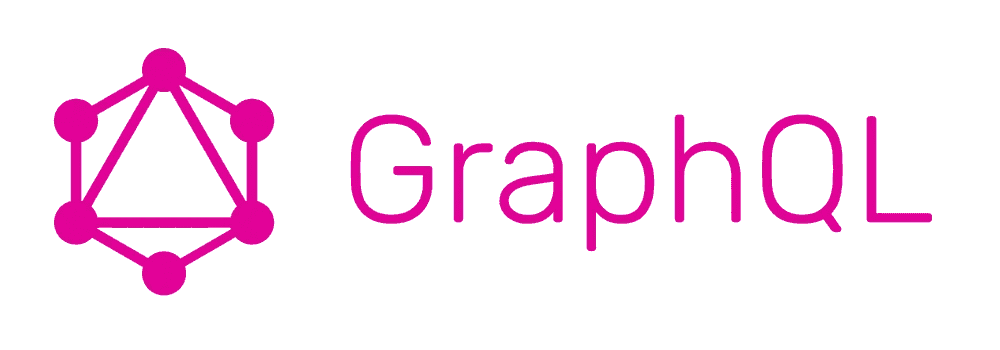

# 如何使用 React 和 GraphQL 构建一个简单的博客

> 原文：<https://medium.com/hackernoon/how-to-build-a-simple-blog-using-react-and-graphql-e32d78bbd724>



在本教程中，我将向你展示如何使用 React、 [GraphQL](http://graphql.org/) 和 [Cosmic JS](https://cosmicjs.com) 创建一个简单的博客。这将是基于现代技术构建的最快、最轻量级的博客。让我们开始吧。

# TL；速度三角形定位法(dead reckoning)

[查看演示](https://cosmicjs.com/apps/simple-react-blog/demo)
[在 Cosmic JS 上安装简单的 React 博客](https://cosmicjs.com/apps/simple-react-blog)
[在 GitHub 上查看代码库](https://github.com/cosmicjs/simple-react-blog)



# 入门指南

确保你的机器上安装了 Node.js 和 NPM，如果没有，[访问 Node.js 网站](https://nodejs.org/en/)安装最新版本。

让我们首先为我们的应用程序创建一个文件夹。在您喜欢的终端中运行以下命令:

```
mkdir simple-react-blog
cd simple-react-blog
```

现在，让我们添加一个 package.json 文件来导入应用程序的所有依赖项:

```
vim package.json
```

将以下内容添加到我们的 package.json 文件中:

对于一个非常轻的应用程序来说，这是一个非常轻的依赖列表。因此，我们将安装的是:

1. [Axios](https://www.npmjs.com/package/axios) 让我们基于 promise 的 HTTP 客户端从 [Cosmic JS GraphQL API](https://cosmicjs.com/docs/graphql) 获取内容。
2。 [Next.js](https://github.com/zeit/next.js/) 作为我们 React 通用框架。
3。[下一条路线](https://www.npmjs.com/package/next-routes)为动态路线。
4。 [Express](https://www.npmjs.com/package/express) 为我们的服务器端 web app 框架。
5。对我们的用户界面做出反应。

我们的脚本是在生产和开发中启动我们的应用程序所必需的。

运行以下命令来安装我们的依赖项:

```
npm i
```

# 建立我们的博客

接下来，让我们开始构建我们的博客页面。创建一个 pages 文件夹并添加 index.js 文件:

```
vim index.js
```

并将以下内容添加到 index.js 中:

这里发生了一些事情:

1.我们正在导入我们的基本模块:Axios、Lodash 以及其他助手和组件。
2。我们引入了一些部分:页眉和页脚，你可以从 GitHub 的代码库中引用这些部分。
3。我们查询 [Cosmic JS GraphQL API](https://cosmicjs.com/docs/graphql) 只返回我们需要的东西:_id、type_slug、slug、title、metadata 和 created_at。
4。我们将组件中的主要道具设置为“宇宙”物体。并使用 lodash 解析帖子和全局对象类型。
5。我们将帖子数组数据和图片 URL 返回到我们的主博客提要中。

# 单帖子查询

对于我们的单个帖子，我们在道具中添加了一个“post”属性。通过将 query.slug 与 Object slug 进行匹配来找到 Post:

查看 GitHub 上的[完整文件。](https://github.com/cosmicjs/simple-react-blog/blob/master/pages/post.js)

# 结论

这是[简单反应博客](https://cosmicjs.com/apps/simple-blog)的节略版，可以在[宇宙 JS 应用页面](https://cosmicjs.com/apps)下载。完整的代码库包括一个帖子页面视图，以及一个专门用于每个作者帖子的页面。[查看 GitHub 上的完整代码库](https://github.com/cosmicjs/simple-blog)并通过[将应用](https://cosmicjs.com/apps/simple-blog)安装到您的 Cosmic JS 桶中，在您的 Cosmic JS 仪表板上点击几下即可部署该应用。Cosmic JS 为你所有的 React 应用程序提供了一个很棒的 React CMS。

我希望你喜欢这个教程，如果你有任何问题[在 Twitter 上联系我们](https://twitter.com/cosmic_js)和[加入我们的 Slack 社区](https://cosmicjs.com/community)。