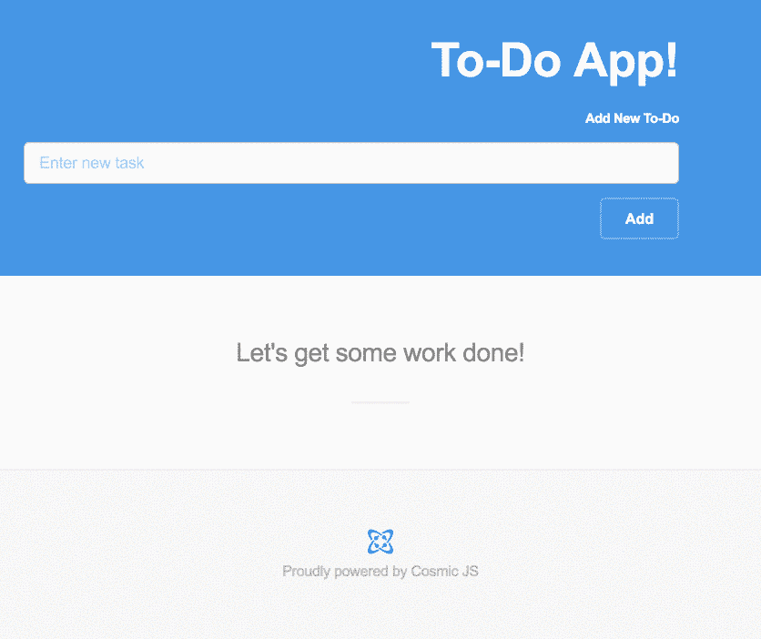

# 如何使用 React、Redux 和 Webpack 构建 ToDo 应用程序

> 原文：<https://medium.com/hackernoon/how-to-build-a-todo-app-using-react-redux-and-webpack-1aa99dc2f45c>



这篇文章最初出现在宇宙 JS 博客上。

在本教程中，我将向你展示如何使用 React、Redux、一点 Node 和 Cosmic JS 创建一个简单的“ToDo”应用程序。为了理解如何使用 Restful API，本教程将展示如何向 Cosmic JS API 发出简单的 AJAX 请求，以便检索、更新和删除 Cosmic JS 桶中的数据。让我们开始吧。

# TL；速度三角形定位法(dead reckoning)

[下载 GitHub 回购。](https://github.com/cosmicjs/todo-app)
[查看试玩。](https://cosmicjs.com/apps/todo-app)

# 开始使用:

首先，让我们创建一个新目录来构建我们的项目，并创建一个 package.json 文件。

```
mkdir cool-cosmic-todo-appcool-cosmic-todo-app$ touch package.json
```

现在，在您的 package.json 中，复制并粘贴下面的代码，然后运行 npm install 或 yarn(如果您是一个超级酷的 yarn 用户):

```
//cool-cosmic-todo-app/package.json
{
  "name": "cosmicToDo",
  "version": "1.0.0",
  "description": "A simple todo app thet uses the Cosmic JS API",
  "main": "index.js",
  "scripts": {
    "start": "npm run build; node server/index.js",
    "start-dev": "nodemon server/index.js",
    "build": "webpack -p",
    "build-dev": "webpack -w",
    "build-sass": "node-sass -w ./client/styles/main.scss -o ./client/styles/mainSheet",
    "test": "echo \"Error: no test specified\" && exit 1"
  },
  "author": "",
  "license": "ISC",
  "dependencies": {
    "axios": "^0.16.1",
    "body-parser": "^1.17.1",
    "css-loader": "^0.28.0",
    "express": "^4.15.2",
    "node-sass": "^4.5.2",
    "react": "^15.5.4",
    "react-addons-css-transition-group": "^15.5.2",
    "react-addons-transition-group": "^15.5.2",
    "react-dom": "^15.5.4",
    "react-redux": "^5.0.4",
    "react-router": "^3.0.0",
    "reactstrap": "^4.5.0",
    "redux": "^3.6.0",
    "redux-logger": "^3.0.1",
    "redux-thunk": "^2.2.0",
    "sass-loader": "^6.0.3",
    "style-loader": "^0.16.1",
    "babel": "^6.5.2",
    "babel-core": "^6.18.0",
    "babel-loader": "^6.2.7",
    "babel-preset-es2015": "^6.18.0",
    "babel-preset-react": "^6.16.0",
    "volleyball": "^1.4.1",
    "webpack": "^2.2.1",
    "webpack-livereload-plugin": "^0.10.0"
  },
  "devDependencies": {
    "chai": "^3.5.0",
    "cross-env": "^3.1.4",
    "mocha": "^3.1.2",
    "nodemon": "^1.11.0",
    "supertest": "^2.0.1",
    "supertest-as-promised": "^4.0.1"
  }
}
```

# 我们正在安装什么，为什么:

1.  我们将使用 axios 库来处理我们对宇宙 JS 桶的请求。
2.  我们正在安装 react 和 react-dom 来构建我们的 react 组件。
3.  我们将使用 redux、react-redux、redux-logger 和 redux-thunk 来帮助我们实现所谓的 Flux 架构。
4.  在开发依赖中唯一值得一提的是 webpack 和排球。Webpack 将帮助我们将所有的 react 和 redux 文件捆绑到一个大的“捆绑”文件中，该文件将在我们的 index.html 中使用。排球是一个很酷的小库，它允许我们在控制台中看到传入和传出的 HTTP 请求。

# 构建我们的应用程序:

现在，我们将构建我们的文件结构，以便我们可以组织我们的 react 组件和 redux 文件。我们的 cool-cosmic-todo-app 目录应该是这样的:

```
cool-cosmic-todo-app
|----client
|       |----components
|                 |----Home.js
|                 |----Section.js
|                 |----Task.js
|       |----index.html
|       |----dist
|----redux
|       |----store.js
|       |----reducer.js
|----server
|       |----index.js
|----webpack.config.js
|----package.json
```

现在，我们将在客户目录中设置我们的 index.html。将以下代码复制并粘贴到您的 index.html 文件中:

```
<!DOCTYPE html>
<html>
<head>
    <meta charset="UTF-8" />
    <meta name="viewport" content="width=device-width, initial-scale=1" />
    <title>Cosmic Todo App!</title>
    <link rel="stylesheet" href="https://maxcdn.bootstrapcdn.com/bootstrap/3.3.7/css/bootstrap.min.css">
    <script src="https://maxcdn.bootstrapcdn.com/bootstrap/3.3.4/js/bootstrap.min.js"></script>
    <link rel="stylesheet" href="./styles/mainSheet/main.css">
    <link rel="stylesheet" href="./styles/mainSheet/font-awesome.min.css">
    <script src="https://code.jquery.com/jquery-3.2.1.min.js"
            integrity="sha256-hwg4gsxgFZhOsEEamdOYGBf13FyQuiTwlAQgxVSNgt4="
            crossorigin="anonymous"></script>
    <script src="/dist/bundle.js" defer></script>
</head>
<body>
<div id="root"></div>
</body>
</html>
```

在这里，我们将“根”div 作为目标，稍后在其中放置 react 组件。位于我们的 dist 目录中的 [bundle.js](https://cosmicjs.com/blog/bundle.js) 文件是我们的 webpack.config 文件在捆绑了我们所有的 react 组件之后将会显示的内容。现在，设置我们的 webpack.config 文件来捆绑我们所有的 react 文件，并将该捆绑文件导出到我们的 dist 目录中。将以下代码复制到您的 [webpack.config.js](https://cosmicjs.com/blog/webpack.config.js) 文件中:

```
let path = require('path');
let LiveReloadPlugin = require('webpack-livereload-plugin');module.exports = {
  entry: './client/index.js',
  output: {
    filename: 'bundle.js',
    path: path.resolve(__dirname, 'client/dist')
  },
  context: __dirname,
  resolve: {
    extensions: ['.js', '.jsx', '.json', '*']
  },
  module: {
    rules: [{
      test: /\.jsx?$/,
      exclude: /(node_modules|bower_components)/,
      loader: 'babel-loader',
      options: {
        presets: ['react', 'es2015']
      }
    },
      {
        test: /\.scss$/,
        use: [
          'style-loader',
          'css-loader',
          'sass-loader'
        ]
      }]
  },
  plugins: [
    new webpack.DefinePlugin({
      'process.env.COSMIC_BUCKET': JSON.stringify(process.env.COSMIC_BUCKET),
      'process.env.COSMIC_READ_KEY': JSON.stringify(process.env.COSMIC_READ_KEY),
      'process.env.COSMIC_WRITE_KEY': JSON.stringify(process.env.COSMIC_WRITE_KEY)
    }),
    new LiveReloadPlugin({appendScriptTag: true})
  ]
};
```

这里，我们只是告诉 webpack 将一个 [bundle.js](https://cosmicjs.com/blog/bundle.js) 文件输出到我们的 dist 文件夹中，其中还捆绑了我们所有的 react 组件。babel-loader 只是使用 babel 和 webpack 传输 JavaScript 文件。live reload 插件允许我们对我们的文件进行更改，并自动让 webpack 监视和“重新捆绑”我们更新的更改。接下来，我们将使用 express 的一点点节点来提供我们的 index.html 文件以及我们的 [bundle.js](https://cosmicjs.com/blog/bundle.js) 文件。实际上，我们并没有真正向我们自己的节点后端发出请求，但是使用 node 作为一种方法来为我们提供静态文件是很好的。将下面的代码复制并粘贴到我们服务器目录下的 [index.js](https://cosmicjs.com/blog/index.js) 文件中。

```
const express = require('express');
const app = express();
const path = require('path');
const volleyball = require('volleyball');app.use(volleyball);//serve up static files
app.use(express.static(path.resolve(__dirname, '..', 'client')));
app.use(express.static(path.resolve(__dirname, '..', 'node_modules')));app.use(function (err, req, res, next) {
  console.error(err);
  console.error(err.stack);
  res.status(err.status || 500).send(err.message || 'Internal server error.');
}); // handle every other route with index.html, which will contain
// a script tag to our application's JavaScript file(s).
app.get('*', function (request, response) {
  response.sendFile(path.resolve(__dirname, '..', 'client', 'index.html'))
});//listen on port 3000
app.listen(process.env.PORT || 3000, function () {
  console.log("Rockin' out on port 3000 homie");
});
```

这里，我们只是告诉我们的服务器从我们的 node_modules 和客户机目录中提供静态文件。“*”路线基本上是告诉 express 在我们的应用程序中请求的任何路线上提供我们的 index.html。最后，我们告诉 express 监听端口 3000。请随意尝试！运行 npm start 或 yarn start，并查看我们的“在端口 3000 homie 上摇滚”消息日志放入控制台！接下来，让我们设置位于 client/redux 文件夹中的 redux [store.js](https://cosmicjs.com/blog/store.js) 文件。将以下代码复制并粘贴到位于我们的 client/redux 文件夹中的 [store.js](https://cosmicjs.com/blog/store.js) 文件中:

```
import { createStore, applyMiddleware } from 'redux';
import reducer from './reducer';
import thunkMiddleware from 'redux-thunk';
import {createLogger} from 'redux-logger';const store = createStore(
  reducer,
  applyMiddleware(
    createLogger(),
    thunkMiddleware
  )
);export default store;
```

# 这是怎么回事:

1.  我们正在设置我们的 redux“store ”,以便我们可以通过“props”将数据向下传递到我们想要的任何组件中(我将假设您对 flux 架构如何工作有一些工作知识，如果您不理解这一点，请检查上面的 flux 架构链接)。
2.  我们使用 redux-thunk 中间件来处理对我们的 Cosmic JS API 的所有异步调用。每当我们分派一个功能而不是一个动作时，就会用到这个中间件。
3.  我们还使用“createlogger”中间件来直观地查看我们调度的每个记录的操作。接下来，我们将设置位于客户端目录中的 [index.js](https://cosmicjs.com/blog/index.js) 文件。复制并粘贴以下代码:

```
import React from 'react';
import ReactDOM from 'react-dom';
import Home from './components/Home';
import {Provider} from 'react-redux';
import store from './redux/store';ReactDOM.render(
  <Provider store={store}>
    <Home />
  </Provider>,
  document.getElementById('root')
);
```

# 这是怎么回事:

1.  我们告诉 ReactDOM 将 index.html 文件中的“根”div 作为目标，并弹出我们的 <home>react 组件(我们将在下一步中构建)。</home>
2.  我们的 react 组件通过标签从我们的存储中获取数据。它为其子节点“提供”数据(因此，它被称为“提供者”)。接下来，我们将构建我们的 Homecomponent。在我们位于 out client/components 目录下的 [Home.js](https://cosmicjs.com/blog/Home.js) 文件中，复制并粘贴以下代码:

```
import React, {Component} from 'react';
import { connect } from 'react-redux';
import { getAllTasks, postNewTask } from '../redux/reducer';
import Task from './Task';class Home extends Component {
  constructor(props){
    super(props);
  }
  componentDidMount(){
    getAllTasks();
  }
  render() {
    return (
      <div>
      <div className="container">
        <div className="row">
          <div className="col-xs-12">
           <h1>Cosmic To-Do App!!</h1>
            <form onSubmit={evt => {
               evt.preventDefault();
               this.props.postNewTask(evt.target.taskName.value);
               evt.target.taskName.value = "";
              }
             }>
              <div className="form-group">
              <label for="exampleInputEmail1">Add New To-Do</label>
              <input name="taskName" placeholder="Enter new task" />
              </div>
              <button type="submit">Add</button>
            </form>
          </div>
        </div>
      </div>
      <div className="container">
        <div className="row">
          <div className="col-xs-12">
            <h3>Let's get some work done!</h3>
          </div>
        </div>
      </div>
      <div className="container">
        {
          this.props.tasks && this.props.tasks.map((task) => {
            return (
              <Task key={task._id} Obj={task} isComplete={task.metafields[0].value} Name={task.title}/>
            )
          })
        }
      </div>
      </div>
    )
  }
}const mapState = ({tasks}) => ({tasks});
const mapDispatch = {getAllTasks, postNewTask};
export default connect(mapState, mapDispatch)(Home);
```

# 怎么回事(很多！):

1.  我们正在创建一个 react 组件，并在安装 Home 组件时获取所有数据(这将是我们的 Cosmic JS bucket 中的任务)。
2.  我们将“HTML”渲染到我们的虚拟 DOM 中。
3.  我们正在创建一个表单，该表单将分派一个函数(该函数将通过我们的 redux-thunk 中间件)，每当用户单击提交
4.  我们正在做黑客检查，这样我们的应用程序就不会因为所谓的“短路”而中断。我们首先检查我们是否从对我们的 Cosmic JS bucket 的异步调用中获得了“任务”,如果我们获得了，那么我们将映射它们中的每一个并呈现一个<task>组件(我们将在下一步中构建它)。</task>
5.  最后，我们将 Home 组件包装在 react-redux 库提供的 connect 函数中。我们正在从我们的商店获取{tasks}以及我们的{getAllTasks，postNewTask}函数。接下来，我们将构建我们的组件来呈现我们从商店获得的每个任务。在我们的客户端/组件目录下的 [Task.js](https://cosmicjs.com/blog/Task.js) 文件中，复制并粘贴以下代码:

```
import React from 'react';
import { connect } from 'react-redux';
import { putChangeStatus, deleteTask } from '../redux/reducers/reducer';const Task = (props) => {
  return (
      <div className="row">
        <div className="btn-group" role="group" aria-label="Basic example">
          <button type="button" onClick={() => {
            props.putChangeStatus(props.Obj, props.isComplete)}} className="btn">{props.isComplete ? "Undo" : "Complete" }</button>
          <button type="button" onClick={() => props.deleteTask(props.Obj.slug)} className="btn">Delete</button>
        </div>
        <h3 style={{textDecoration: props.isComplete ? "line-through" : "none"}}>{props.Name}</h3>
      </div>
  );
};const mapDispatch = {putChangeStatus, deleteTask};
export default connect(null, mapDispatch)(Task);
```

# 发生了什么事:

1.  我们正在创建一个所谓的“哑”react 组件，并再次将它包装在我们的 connect 函数中。
2.  我们从我们的 reducer(我们将在下一步中最终完成)中获取 putChangeStatus 和 deleteTask，并将其连接到我们的商店。
3.  我们连接了“完成”和“删除”按钮来调度 onClick 上的异步函数，这样我们实际上也更新了我们的宇宙 JS 桶。接下来，我们将最终制作我们的缩减器，并设置我们所有的异步“redux-thunk”函数。在我们的客户端/redux 目录下的 [reducer.js](https://cosmicjs.com/blog/reducer.js) 文件中，复制并粘贴以下代码:

```
import axios from "axios";
/////////////////CONSTANTS/////////////////////
const GET_ALL_TASKS = "GET_ALL_TASKS";
const POST_TASK = "POST_TASK";
const CHANGE_STATUS = "CHANGE_STATUS";
const DELETE_TASK = "DELETE_TASK";
/////////////////ACTIONS//////////////
const getTasks = (tasks) => ({type: GET_ALL_TASKS, tasks});
const addTask = (task) => ({type: POST_TASK, task});
const changeStatus = (task) => ({type: CHANGE_STATUS, task});
const taskDelete = (slug) => ({type: DELETE_TASK, slug});
/////////////////REDUCER/////////////////////
//initiate your starting state
let initial = {
  tasks: []
};
const reducer = (state = initial, action) => {
  switch (action.type) {
    case GET_ALL_TASKS:
      return Object.assign({}, state, {tasks: action.tasks.objects});
    case POST_TASK:
      let updatedTasks = [action.task].concat(state.tasks);
      return Object.assign({}, state, {tasks: updatedTasks});
    case CHANGE_STATUS:
      let newArr = state.tasks.map((task) => {
        if(task.slug === action.task.slug) task.metafields[0].value = !task.metafields[0].value;
        return task;
      });
      return Object.assign({}, state, {tasks: newArr});
    case DELETE_TASK:
      let arr = state.tasks.filter((task) => {
        return !(task.slug === action.slug);
      });
      return Object.assign({}, state, {tasks: arr});
    default:
      return state;
  }};export default reducer; /////////////// ACTION DISPATCHER FUNCTIONS///////////////////export const getAllTasks = () => dispatch => {
  axios.get(`https://api.cosmicjs.com/v1/your-bucket-slug-name/object-type/tasks`)
    .then((response) => {
      return response.data;
    })
    .then((tasks) => {
      dispatch(getTasks(tasks))
    })
    .catch((err) => {
      console.error.bind(err);
    })
};export const postNewTask = (task) => dispatch => {
  dispatch(addTask({title: task, metafields: [{value: false}], slug: formatSlug(task)}));
  axios.post(`https://api.cosmicjs.com/v1/your-bucket-slug-name/add-object`, {type_slug: "tasks", title: task, content: "New Task",
    metafields: [
      {
        title: "Is Complete",
        key: "is_complete",
        value: false,
        type: "text"
      }
    ]})
    .then((response) => {
      console.log(response.data);
    })
    .catch((err) => {
      console.error.bind(err);
    })
};export const putChangeStatus = (task, bool) => (dispatch) => {
  dispatch(changeStatus(task));
  axios.put(`https://api.cosmicjs.com/v1/your-bucket-slug-name/edit-object`, {slug: task.slug,
    metafields: [
      {
        title: "Is Complete",
        key: "is_complete",
        value: !bool,
        type: "text"
      }
    ]})
    .then((response) => {
      console.log(response.data);
    })
    .catch((err) => {
      console.error.bind(err);
    })
};export const deleteTask = (slug) => (dispatch) => {
  dispatch(taskDelete(slug));
  axios.delete(`https://api.cosmicjs.com/v1/your-bucket-slug-name/${slug}`)
    .then((response) => {
    console.log(response.data)
    })
    .catch((err) => {
      console.error.bind(err);
    })
};const formatSlug = (title) => {
  let lower = title.toLowerCase();
  return lower.split(" ").join("-");
};
```

# 这是怎么回事？！

旁注->我个人喜欢将我所有的常量、动作和动作调度函数存储在一个文件中，这样我就不会不断地从一个文件跳到另一个文件。将这些分成单独的文件是非常普通和酷的。

1.  我们正在拉入 axios(我们的库，它将为我们发出 HTTP 请求)。
2.  我们正在定义我们的常数。
3.  我们正在设置要调度的操作。
4.  我们定义了我们的存储所使用的 reducer 函数，我们从一个对象开始，这个对象的 tasks 键以一个空数组作为值(这个数组将被从我们的 Cosmic JS bucket 中检索的 task 对象填充)。
5.  我们定义了我们的动作分派器函数，这些函数向 Cosmic JS API(特别是我们的个人存储桶)发出我们的 axios 请求。我们完了。运行 npm run build 或 yarn build，并在不同的选项卡中运行 npm start 或 yarn start，看看我们做了什么！如果你想看我的实现(不必使用 react-router)来了解所有这些是如何一起工作的，请查看我的 github repo

# 结论:

我们能够使用我们的动作和调度程序函数来消费 Cosmic JS API。如果你对所有文件如何与我们的商店协同工作有点不确定，请查看这张 gif，以更好地了解 redux 如何在应用程序中传递数据。我希望你和我一样喜欢这个教程，如果你有任何问题[在 Twitter 上联系我们](https://twitter.com/cosmic_js)和[加入我们的 Slack 社区](https://cosmicjs.com/community)。

[](http://bit.ly/HackernoonFB)[](https://goo.gl/k7XYbx)[](https://goo.gl/4ofytp)

> [黑客中午](http://bit.ly/Hackernoon)是黑客如何开始他们的下午。我们是 [@AMI](http://bit.ly/atAMIatAMI) 家庭的一员。我们现在[接受投稿](http://bit.ly/hackernoonsubmission)并乐意[讨论广告&赞助](mailto:partners@amipublications.com)机会。
> 
> 如果你喜欢这个故事，我们推荐你阅读我们的[最新科技故事](http://bit.ly/hackernoonlatestt)和[趋势科技故事](https://hackernoon.com/trending)。直到下一次，不要把世界的现实想当然！

